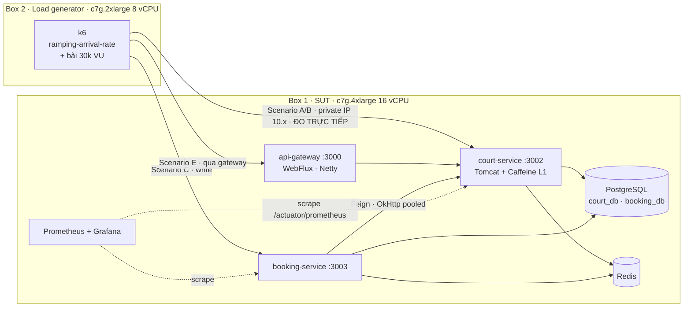
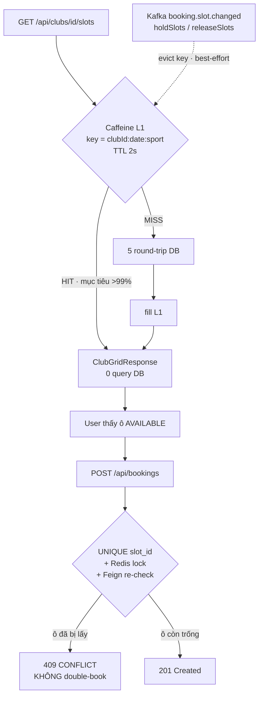
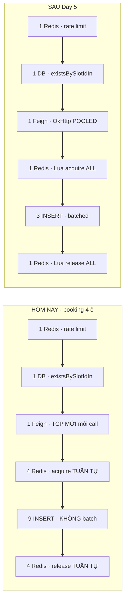

# Planning_Optimization.md — Backend & Performance Optimization cho BadmintonHub

> **Workstream TÁCH BIỆT** khỏi app-build và khỏi `Planning_CICD.md`.
> Mục tiêu: có **kinh nghiệm thật + con số defensible** về tối ưu backend và load testing ở quy mô lớn.
> Trạng thái: **KẾ HOẠCH** — chưa sửa 1 dòng code nào.

---

## 0. Mục tiêu & phạm vi

### 0.1 Mục tiêu

Đạt và **chứng minh được** năng lực: *"tối ưu hệ thống đạt throughput ~120,000 req/sec, load test ở 30,000 concurrent"* — theo cách mà một senior interviewer hỏi sâu 3 lớp vẫn không vỡ.

Điều đó đòi hỏi **3 thứ**, không phải 1:

| # | Deliverable | Vì sao bắt buộc |
|---|---|---|
| 1 | **Baseline đo được** trước khi tối ưu | Không có baseline thì "tối ưu 150×" là câu nói suông. Đây là thứ phân biệt engineer với người đọc blog. |
| 2 | **Chuỗi tối ưu có attribution** — mỗi tier 1 phép đo riêng | Interviewer sẽ hỏi *"cái nào đóng góp nhiều nhất?"*. Đo gộp = không trả lời được. |
| 3 | **Workload spec đi kèm con số** | 120k req/s **vô nghĩa** nếu không nói endpoint nào, payload bao nhiêu byte, đo ở đâu, hardware gì. |

### 0.2 Phạm vi — chỉ 2 service

Chốt: **chỉ bắn tải vào 2 service**, không kéo cả platform.

| Service | Vai trò trong bài test | Loại bằng chứng thu được |
|---|---|---|
| **court-service** (3002) | **READ hot path** — nơi lấy con số throughput đỉnh | Throughput + latency + hiệu quả cache |
| **booking-service** (3003) | **WRITE path** — nơi chứng minh đúng đắn dưới tải | Correctness under concurrency (0 double-book) |

**KHÔNG** load-test: user-service · payment-service · escrow-service · chat-service · ai-service · matchmaking/coach/notification/event (scaffold rỗng).

> **user-service không nằm trong đường load** — token JWT được **pre-mint offline** bằng `JWT_SECRET` (pattern `JwtTestTokens` của module `common-test`). booking-service tự re-validate token cục bộ qua `common-security JwtUtil` nên token pre-mint chạy đúng, và auth không trở thành bottleneck giả.

### 0.3 Cái KHÔNG làm (chốt cứng, tránh scope creep)

- ❌ **Không** viết lại service sang WebFlux. Virtual threads (Java 21) cho gần hết lợi ích với ~1 dòng config.
- ❌ **Không** đổi kiến trúc dữ liệu (không sharding, không read-replica, không CQRS).
- ❌ **Không** đánh đổi bất kỳ bất biến money-safety nào — xem **§8**.
- ❌ **Không** chạy trên EKS. Benchmark cần 2 EC2 trần — xem **§9**.
- ❌ **Không** dùng số ước lượng trong doc này làm kết quả. Mọi số chưa đo đều gắn nhãn *(ước lượng — phải đo)*.

---

## 1. Vật lý của con số — đọc mục này trước khi làm bất cứ gì

Đây là mục quan trọng nhất. **120k req/s không sai, nhưng nó chỉ đúng với một workload cụ thể.** Không hiểu mục này thì sẽ đo sai và claim sai.

### 1.0 ✅ SỐ ĐO THẬT (đo bằng `ab` trên stack đang chạy, 2026-07-26 — KHÔNG phải ước lượng)

| Endpoint | Payload **đo được** | Throughput | p50 | p95 | p99 |
|---|---|---|---|---|---|
| `GET /api/clubs/{id}/slots?date=` (grid đầy đủ) | **58,644 B** ⚠️ | **76 rps** @ c=20 | 154 ms | 575 ms | 739 ms |
| …`&sport=BADMINTON` | 29,336 B | — | — | — | — |
| `GET /api/clubs/{id}` | **270 B** | **2,138 rps** @ c=50 | 16 ms | 59 ms | 119 ms |
| `GET /api/clubs` (Redis-cached) | 586 B | — | — | — | — |
| `GET /api/__nonexistent__` (404 · **0 việc**) | ~130 B | **4,284 rps** @ c=100 | 14 ms | 69 ms | 166 ms |

> ⚠️ **Grid là 58.6 KB, KHÔNG phải 34 KB như ước lượng ban đầu** — lớn hơn 72%. Mọi phép tính bandwidth bên dưới đã sửa theo số đo thật.

**Sweep concurrency trên `/api/clubs/{id}`**: c=50 → 2,138 · c=100 → 2,251 · c=200 → 1,942 · c=400 → 2,700 ⇒ **phẳng** ⇒ app **CPU-saturated**, KHÔNG phải pool-saturated. **Hikari=10 KHÔNG phải bottleneck hôm nay** (trái với giả định thông thường).

### 1.0b 🔴 5 phát hiện khi đo — không có trong phân tích tĩnh

| # | Phát hiện | Bằng chứng | Hệ quả |
|---|---|---|---|
| **1** | **`-XX:TieredStopAtLevel=1` trên MỌI service ⇒ C2 JIT bị TẮT** | `ps` cho thấy cờ này trên tất cả JVM — đây là default `optimizedLaunch` của `spring-boot-maven-plugin:run` | **Mọi số đang đo thấp hơn 2–4×** so với chạy jar đóng gói. **Đây là win MIỄN PHÍ lớn nhất repo.** |
| **2** | **Compression TẮT — gzip cho 7.2×** | `Accept-Encoding: gzip` vẫn trả đủ 58,644 B · gzip thủ công → **8,122 B** | Đòn bẩy bandwidth lớn nhất, giá 3 dòng YAML |
| **3** | **Spring Security phát `Cache-Control: no-cache, no-store`** trên grid endpoint **public anonymous** | header response | Không browser/CDN/proxy nào cache được |
| **4** | 🔴 **Gateway đang 500 MỌI route court — BUG SỐNG** | court đăng ký Eureka `192.168.1.5:3002` nhưng IP host thật là `192.168.101.40` (`prefer-ip-address: true` + đổi Wi-Fi) | **Benchmark qua gateway hôm nay chỉ đo 500.** Rate limiter thì vẫn chạy (`X-RateLimit-Remaining: 99`) |
| **5** | **Docker Desktop giữ 4/8 CPU + 3.84/8 GB** | `docker info` → `4 cpus 4124512256 mem`; Kafka riêng 1.088 GiB RSS | Chỉ còn ~nửa máy cho SUT |

### 1.0c ✅ Bằng chứng KHÔNG được đo trên cùng máy (đo trực tiếp)

```text
1 × ab @ c=50            → 2,138 rps
2 × ab @ c=50 (song song) →   841 + 841 = 1,683 rps  (GIẢM 21%)
```

Thêm 1 load generator trên cùng box làm **tổng throughput GIẢM 21%**. Đây là bằng chứng tại chỗ, tái lập được, rằng **không thể generate tải trên chính máy đang đo**.

### 1.0d Hai xác nhận về write path

- ✅ **Tin tốt**: `Booking`/`BookingItem`/`OutboxEvent` đều dùng `@GeneratedValue(strategy = GenerationType.UUID)`, **không phải `IDENTITY`** ⇒ **Hibernate batching sẽ thực sự hoạt động** (`IDENTITY` âm thầm vô hiệu hoá batching). Day 5 khả thi.
- 🔴 **Tin xấu**: `BookingServiceImpl.fetchGridSnapshots` gọi `courtServiceClient.getGrid(clubId, date, **null**)` — **sport = null** ⇒ **mỗi lần tạo booking tải về TOÀN BỘ grid 58 KB** qua `HttpURLConnection` không pool, chỉ để validate 4 ô.

### 1.1 Little's Law — 2 con số phải nhất quán với nhau

```text
concurrency = throughput × latency

30,000 = 120,000 × L   →   L = 0.25 s = 250 ms
```

⇒ *"120k req/s **tại** 30k concurrent"* nghĩa là hệ đang chạy ở **latency trung bình 250 ms** — tức **điểm bão hoà (saturation / knee)**. Đó là một phép đo hoàn toàn hợp lệ, nhưng **phải gọi đúng tên**.

Nếu muốn khoe p99 thấp thì concurrency phải thấp:

```text
120,000 rps × 2 ms = 240 concurrent
```

⇒ **Hai cặp số này là HAI bài test khác nhau.** Doc này tách chúng thành Scenario A (throughput, p99 thấp) và Scenario D (connection-handling 30k VU). Gộp làm một là sai.

### 1.2 Băng thông — thứ giết con số 120k trên endpoint grid

Đây là ràng buộc **cứng nhất**, không code nào vượt được.

Wire bytes = payload + ~200 B header HTTP + ~4% framing TCP/IP/Ethernet.

| Payload | Wire B/req | 120k rps cần | Trần trên 1 GbE (118 MB/s) | Trần trên 10 GbE |
|---|---|---|---|---|
| **58.6 KB — grid hôm nay (ĐO)** | ~61,000 | **7.32 GB/s = 58.6 Gbit/s** | **1,930 rps** | 19,300 rps |
| 29.3 KB (lọc `sport`) | ~30,700 | 3.68 GB/s | 3,840 rps | 38,400 rps |
| **8.1 KB (grid gzip — ĐO)** | ~8,650 | 1.04 GB/s | 13,600 rps | **136,000 rps** |
| 1 KB | ~1,270 | 152 MB/s | 92,900 rps | dư |
| 586 B (club search) | ~820 | 98 MB/s | **144,000 rps** | dư |
| **270 B — club detail (ĐO)** | ~490 | 59 MB/s | **241,000 rps** | dư |

**Kết luận bắt buộc**:
- **1 GbE: 120k rps đòi hỏi response ≤ ~800 B trên dây.** Grid hiện tại **lớn gấp 73×** — kể cả gzip vẫn gấp 10×.
- **10 GbE**: grid gzip (8.65 KB wire) *về lý thuyết* đạt 136k — nhưng đó là **88% line rate**, nơi p99 sụp đổ. **Không được đặt cược vào đây.**
- **Grid thô 58.6 KB ở 120k rps cần 100 GbE + multi-queue RSS.** Không phải chuyện của laptop, cũng không phải của 1 VM.

⇒ Con số 120k **phải** đo trên payload nhỏ (`GET /api/clubs/{id}` = 270 B).

⇒ Đó là lý do **§6** chọn endpoint benchmark một cách có chủ đích, chứ không phải "test endpoint nào cũng được".

### 1.3 Ngân sách CPU mỗi request

```text
120,000 rps ÷ 16 vCPU = 7,500 rps/core  →  ~133 µs CPU/request
```

| 133 µs ĐỦ cho | 133 µs KHÔNG đủ cho |
|---|---|
| Parse HTTP request | 5 round-trip DB (mỗi cái ~100–500 µs) |
| Tra Caffeine (hit, ~50 ns) | Serialize 204 cell JSON |
| Ghi `byte[]` đã serialize sẵn ra socket | 204 lần allocate Stream + `BigDecimal.divide` |

**Ngân sách theo máy** (M1 = 4P+4E ≈ 5.3 P-core-equivalent, **trừ 4 vCPU Docker** ⇒ còn ~2–3):

| Máy | Core dùng được | Ngân sách/req @120k |
|---|---|---|
| **M1 (Docker chiếm 4/8)** | ~2–3 P-core-eq · **0 nếu generator cùng máy** | **~21 µs** |
| 16 vCPU cloud | ~14 | ~117 µs |
| 64 vCPU | ~56 | ~533 µs |

> 🔴 **Đối chiếu với số đo thật**: đường 404 — **không handler, không DB, không serialize**, chỉ Tomcat + Spring Security filter chain — chạy **4,284 rps** ⇒ tương đương **~580 µs CPU khả dụng/request** hôm nay. Ngân sách cho 120k trên box này là **21 µs**. **Bạn đang vượt ngân sách 28× trên một request KHÔNG LÀM GÌ CẢ.**

### 1.4 Bảng rps/instance

> Cột M1 **neo vào số đo thật** §1.0. Cột 16 vCPU là **ngoại suy — ±50%**, là thứ **bất định nhất** trong doc này. Không được chép vào CV khi chưa đo.

Host local: **8 core / 8 GiB**, Docker chiếm 4 core + 3.84 GB.

| Cấu hình | M1 (generator **off-box**, C2 đã bật) | 16 vCPU cloud |
|---|---|---|
| Tomcat MVC + 5 query DB + 58 KB (**hôm nay = 76 rps ĐO với C2 TẮT**) | 80–150 | 400–900 |
| Tomcat MVC + 5 query DB, payload nhỏ (**2,138 ĐO, C2 tắt**) | 2,500–4,000 | 8,000–15,000 |
| + Caffeine hit, **re-serialize** 58 KB | 300–600 | 2,000–4,000 |
| + Caffeine hit, **pre-serialized `byte[]`** 58 KB | 1,500–2,500 (loopback) · **1,930 trần 1 GbE** | ~19,300 trần 10 GbE |
| + Caffeine hit, pre-serialized **gzip** (8.1 KB) | 3,000–5,000 | 30,000–60,000 |
| + Caffeine hit, payload < 1 KB | **6,000–12,000** | 25,000–50,000 |
| + **virtual threads** + cache, payload nhỏ | **±10%** (xem dưới) | ±10% |
| WebFlux/Netty + cache pre-serialized nhỏ | 12,000–20,000 | **60,000–120,000** |
| nginx phục vụ file tĩnh đã cache | 25,000–40,000 | 150,000–400,000 |

> **Về virtual threads — sửa lại kỳ vọng**: chúng mua **concurrency**, KHÔNG mua **throughput**. Chúng unmount carrier thread khi **blocking I/O**. Đường cache-hit **không có blocking I/O** ⇒ gain ≈ **0**, đôi khi **âm nhẹ**. Nhưng trên **write path** (1 Feign + ~10 Redis RT + ~10 DB RT, đều blocking) thì đáng giá **2–4× concurrency** ở cùng latency. ⚠️ Đang chạy **JDK 23** ⇒ **carrier pinning trong `synchronized` VẪN còn** (chỉ hết ở JDK 24); driver PostgreSQL và Lettuce đều có hot spot `synchronized` trong lịch sử ⇒ bật kèm kiểm tra JFR `jdk.VirtualThreadPinned`, **không bật mù**.

### 1.5 ⚠️ Vì sao "scale 4 replica nên nhanh 4×" là câu trả lời SAI

Thêm N instance trên **cùng 1 box** **KHÔNG** nhân throughput — tổng CPU của box không đổi. Với cache hit thuần in-memory, **1 JVM tuned đủ thread đã bão hoà cả 16 core**, thêm instance chỉ thêm context-switch.

```text
1 instance trên 16 vCPU   ≈ 120k rps   (đã dùng hết 16 core)
4 instance trên 16 vCPU   ≈ 120k rps   (vẫn 16 core — KHÔNG đổi, có khi tệ hơn)
4 instance trên 4 box     ≈ 480k rps   (64 core — MỚI là scale ngang thật)
```

**Hệ quả cho kế hoạch này**: 120k rps ⇒ cần **1 box đủ core** (16–32 vCPU), **không cần** scale-out. Scale-out chỉ để chứng minh tính tuyến tính, và chỉ có ý nghĩa khi **nhiều box**.

### 1.6 30,000 VU cần gì

| Ràng buộc | Con số | Hệ quả |
|---|---|---|
| **RAM cho k6** | ~1–8 MB/VU (thực tế 2–4) ⇒ 30k VU ≈ **30–90 GB** | M1 còn ~2–3 GB sau Docker ⇒ **tối đa ~1,000 VU**. Bắt buộc box riêng |
| **Ephemeral port** | **macOS default = 49152–65535 = 16,384 port** (đã kiểm tra máy bạn) · Linux = 32768–60999 = **28,231** | **Cả hai đều THIẾU so với 30,000** ⇒ sẽ nhận `EADDRNOTAVAIL` và **dễ đọc nhầm thành lỗi server**. Phải nới range + `tcp_tw_reuse=1` + alias nhiều source IP |
| **CPU contention** | đo được: **giảm 21%** khi thêm generator thứ 2 | Không bao giờ co-locate |
| File descriptor | `ulimit -n` máy bạn **đã là 1,048,576** | ✅ FD **không** phải bức tường — **port mới là** |

> **Thực hành chuẩn**: 1 core generator cho mỗi ~2,000–5,000 rps (payload nhỏ) ⇒ 30k VU ở tốc độ có nghĩa cần **3–6 box generator**, hoặc k6 distributed mode / Grafana Cloud k6.
>
> **Lưu ý**: với latency thấp, **không cần** 30k VU để đạt rps cao (§1.1). 30k VU là bài test **connection-handling**, **tách khỏi** bài test throughput.

### 1.7 🔴 VERDICT — trả lời thẳng "120k có đạt được không"

| Kịch bản | Verdict |
|---|---|
| **(i) 1 instance trên M1** | ❌ **BẤT KHẢ THI. Không phải khó — là không thể.** Sàn đo được (404, 0 việc) = **4,284 rps**. Bật lại C2 (×2–4) → ~12,000. Generator off-box (×1.3) → ~16,000. **Vẫn thiếu 7.5×**, và đó là trần cho request trả về 404. Best case sau MỌI tối ưu: **8,000–15,000 rps** (payload nhỏ), **~3,000–5,000** (grid cache+gzip loopback), **~1,930** nếu có 1 GbE trên đường. |
| **(ii) 1 instance trên 16 vCPU cloud** | ⚠️ **Ở đỉnh biên khả dĩ, và CHỈ với payload không phải grid.** Đòi hỏi ĐỦ CẢ: response ≤1 KB · phục vụ từ cache in-process dạng **byte đã serialize** · bypass Spring Security filter chain cho path đó · **10 GbE** · **WebFlux/Netty thay Tomcat MVC**. Biên trung thực: **60–120k (WebFlux)** · **25–50k (Tomcat MVC)**. |
| **(iii) N instance, báo aggregate** | ✅ **Đạt được dễ dàng và hoàn toàn defensible** — miễn là nói rõ *"aggregate across N instances"*. 8 × 15k = 120k. **Đây là con đường trung thực.** Cần cluster thật (⇒ cần Dockerfile) và **phải giải bài toán cache-invalidation đa-instance TRƯỚC khi scale**. |
| **30k VU từ laptop** | ❌ **Bất khả thi vì 3 lý do độc lập**: RAM (cần 30–90 GB) · port (macOS chỉ có 16,384) · CPU contention (đo được −21%). |

---

## 2. Baseline hiện tại — đã verify bằng đọc code thật

### 2.1 Blocker phải xử lý TRƯỚC, nếu không mọi phép đo đều vô nghĩa

| # | Vấn đề | Vị trí | Hệ quả |
|---|---|---|---|
| **1** | `new RedisRateLimiter(2, 100, 1)` áp qua `default-filters` lên **cả 13 route** | `api-gateway/src/main/java/com/badmintonhub/gateway/config/GatewayConfig.java:32-34` + `api-gateway/src/main/resources/application.yml:24-28` | **Trần ~2 req/s mỗi key.** Bài test không bao giờ vượt được — đây là blocker số 1. |
| **2** | `BookingRateLimiter` cap 10 creates/phút/user | `booking-service/src/main/java/com/badmintonhub/booking/service/BookingRateLimiter.java:30-32` | Write path trần 10/phút/user |
| **3** | `management.endpoints.web.exposure.include: health,info` ở **cả 12 service**; **không có `micrometer-registry-prometheus`** trong bất kỳ pom nào | mọi `application.yml` (vd `court-service/src/main/resources/application.yml:55`) | Metric **không scrape được** ⇒ tối ưu theo cảm giác. Gauge Micrometer đã đăng ký trong code (`booking.outbox.stuck`) hiện **vô hình**. |
| **4** | Không có k6/JMeter/Gatling/wrk nào trong repo | — | Chưa có baseline nào tồn tại |
| **5** | 🔴 **`-XX:TieredStopAtLevel=1` ⇒ C2 JIT TẮT trên MỌI service** | default `optimizedLaunch` của `spring-boot-maven-plugin:run` | Đang đo trên JVM **chỉ có C1** ⇒ mọi số thấp hơn **2–4×** so với chạy jar. **Win miễn phí lớn nhất repo** |
| **6** | 🔴 **Gateway 500 mọi route court — BUG SỐNG** | court đăng ký Eureka `192.168.1.5:3002`, IP host thật `192.168.101.40` (`prefer-ip-address` + đổi Wi-Fi) | **Benchmark qua gateway hôm nay chỉ đo 500** |
| **7** | **Compression TẮT** — gzip cho **7.2×** (58,644 → 8,122 B) | verify bằng `Accept-Encoding: gzip` | Đòn bẩy bandwidth lớn nhất, giá 3 dòng YAML |
| **8** | Spring Security phát **`Cache-Control: no-store`** trên grid **public anonymous** | header response | Không CDN/proxy/browser nào cache được |
| **9** | Docker Desktop giữ **4/8 CPU + 3.84/8 GB**; 6 JVM × `MaxHeapSize=2GB` trên máy 8 GB | `docker info` | Chỉ còn ~nửa máy; heap oversubscribe 1.5× |

### 2.2 READ path — `GET /api/clubs/{id}/slots` (`SlotServiceImpl.java:99-138`)

```text
5 round-trip DB mỗi request:
  1. clubRepository.existsById(clubId)                                  :102
  2. courtRepository.findByClub_IdAndSport…  /  …AndIsActiveTrue…       :108-109
  3. timeSlotRepository.findByCourt_IdInAndDateOrderBy…                 :115
  4..N pricingRuleRepository.findByClub_IdAndSport(clubId, sp)          :123  ← 1 query MỖI sport
```

| Đặc điểm | Chi tiết |
|---|---|
| **Cache** | **Không có gì.** Toàn repo không hề có `@EnableCaching` / `@Cacheable` / `CacheManager`. |
| **Payload** | **204 cell** (6 sân × 34 ô, 05:00–22:00 @30′), mỗi cell 5 UUID + `date` **lặp lại** ⇒ **58,644 B ĐO ĐƯỢC** (gzip → 8,122 B) |
| **CPU/cell** | `PricingRules.priceForSlot` (`PricingRules.java:32-43`) chạy **170 lần**, mỗi lần **allocate 1 Stream** + **1 `BigDecimal.divide`** |
| **Auth** | Public ở **cả** gateway (`JwtAuthenticationFilter.java:56` `PUBLIC_GET_PATHS`) lẫn court (`SecurityConfig.java:39`) ⇒ **0 JWT parse, 0 Redis call** ở gateway → rất sạch để benchmark |
| **Index** | Có `idx_slot_court_date_status (court_id, date, status)`. **Thiếu**: `courts.club_id`, `clubs.district/is_active` |

> **💡 Tối ưu hiển nhiên nhất của cả dự án**: `dayType` (suy từ `date`) và `customerType` (= hằng `GRID_CUSTOMER_TYPE`) **cố định cho cả request**, nhưng code đang lọc lại **170 lần cùng một điều kiện**. Lọc rule **1 lần/request** + chia giá sẵn + precompute mảng `BigDecimal[34]` theo ô ⇒ **170 stream+divide → 34 phép tính, tra bằng index**.

### 2.3 WRITE path — `POST /api/bookings` (`BookingServiceImpl.java:85-191`)

Method cố ý **không** `@Transactional` (giữ Feign ra ngoài tx — quyết định đúng từ audit VÒNG 4).

| # | Bước | Vị trí | Chi phí |
|---|---|---|---|
| 1 | `rateLimiter.check(userId)` | `:87` | 1 Redis RT (2 nếu đầu window) |
| 2 | `bookingItemRepository.existsBySlotIdIn` | `:96` | 1 query DB **ngoài tx** |
| 3 | `fetchGridSnapshots()` → **Feign** sang court | `:101` | 1 HTTP call |
| 4 | `slotLockService.acquireAll(slotIds)` | `:167` | **N round-trip Redis TUẦN TỰ** |
| 5 | `new TransactionTemplate(txManager)` | `:171` | **allocate mới mỗi request** |
| 5a | `bookingRepository.save` | `:172` | 1 INSERT |
| 5b | `bookingItemRepository.saveAllAndFlush` | `:176` | N INSERT |
| 5c | `outboxWriter.writeSlotHeld` | `:182` | **N INSERT** (1 outbox row mỗi slot) |
| 6 | `slotLockService.releaseAll` | `:189` | **N DEL Redis tuần tự** |

⇒ Booking **4 ô** = **9 INSERT không batch** + **~10 round-trip Redis**.

| Vấn đề | Chi tiết |
|---|---|
| **Feign không pooled** | Không `feign-okhttp` / `feign-httpclient` ở pom nào, không `feign.Client` bean ⇒ rơi về `HttpURLConnection` = **TCP mới mỗi call**, không keep-alive pool |
| **Lock tuần tự** | `RedisSlotLockService.acquireAll:40-62` là vòng `for` gọi `setIfAbsent` từng cái — không pipeline, không Lua. TTL 5 s (`:30`) có thể hết hạn giữa tx khi tải cao |
| **Backstop đúng đắn** | `booking_items.uk_booking_items_slot UNIQUE(slot_id)` → `DataIntegrityViolationException` → 409. **Đây mới là guard thật**, không phải lock |

### 2.4 Async pipeline — không load-test, nhưng là trần thông lượng thật

`OutboxPublisherScheduler` (**giống hệt nhau** ở booking/payment/escrow, `:29-44`):

```java
@Scheduled(fixedDelay = 3000)
@Transactional                                                     // ← tx bọc CẢ vòng lặp
public void publishPending() {
    for (OutboxEvent event : outboxRepository
            .findTop100ByStatusOrderByCreatedAtAsc(PENDING)) {      // ← KHÔNG có FOR UPDATE SKIP LOCKED
        kafkaTemplate.send(event.getTopic(), event.getMsgKey(), event.getPayload())
                .get(5, TimeUnit.SECONDS);   // block so we only mark SENT on a confirmed publish
        event.setStatus(OutboxStatus.SENT);  //   ↑ comment gốc trong code — xem cảnh báo Day 5
    }
}
```

| Hệ quả | Con số |
|---|---|
| Trần drain | **~100 event / 3 s ≈ 33 event/s mỗi service** |
| Booking ghi 1 outbox row **mỗi slot** | ⇒ trần thực tế ≈ **8 booking/s** (booking 4 ô) |
| Worst case 1 lần chạy | giữ **1 trong 10** connection Hikari suốt **500 s** |
| Kafka | **1 partition** (auto-create, không set `KAFKA_NUM_PARTITIONS`) |
| Consumer | **không** gọi `setConcurrency()` ⇒ **1 thread** |
| Scheduler pool | **không** set `spring.task.scheduling.pool.size` ⇒ **1 thread/service** ⇒ outbox chậm **block luôn** `HoldExpiryScheduler` |

### 2.5 Không tune gì cả — grep xác nhận **0 match toàn repo**

| Hạng mục | Trạng thái | Mặc định đang chịu |
|---|---|---|
| `spring.datasource.hikari.*` | **absent** | maximumPoolSize = **10** |
| `server.tomcat.threads.*` | **absent** | max-threads 200 · accept-count 100 |
| `spring.jpa.open-in-view` | **absent** | **`true`** — giữ DB connection suốt cả request |
| `hibernate.jdbc.batch_size` / `order_inserts` | **absent** | N INSERT = **N round trip** |
| `spring.data.redis.lettuce.pool.*` | **absent** | không pool |
| `spring.threads.virtual.enabled` | **absent** | không dùng virtual threads (dù Java 21 + Boot 3.2 hỗ trợ) |
| JVM flags (`-Xmx`, GC…) | **absent** — không Dockerfile, không script | JVM default, heap = ¼ RAM host |
| PostgreSQL | `postgres:15-alpine` không `command:` | `max_connections=100` · `shared_buffers=128MB` |
| Redis | `--appendonly yes` | **không** `maxmemory` / `maxmemory-policy` |
| docker-compose | **không** `deploy.resources` | container không giới hạn |

### 2.6 ⚠️ Bẫy JDK

Máy local đang chạy **Java 23** (`java -version`) trong khi project target **21** (`pom.xml:41`). GC default và JIT khác nhau giữa 2 bản ⇒ **số before/after không so sánh được** nếu JDK đổi giữa các run.

**Chốt: đo trên Temurin 21 ở cả local lẫn cloud box. Ghi `java -version` vào mọi report.**

---

## 3. Kiến trúc benchmark

### 3.1 Sơ đồ 1 — Topology 2 box (bắt buộc cùng AZ, private IP)



> 🔴 **BẮT BUỘC**: 2 instance **cùng subnet**, k6 trỏ vào **private IP** (`10.x.x.x`) của SUT. Không Elastic IP trên đường test, không NAT Gateway trong VPC. Lý do tài chính: **§9**.

### 3.2 Sơ đồ 2 — Cache trên read path (và vì sao stale KHÔNG gây double-book)



**Bất biến then chốt**: cache này là **read-model**. Tính đúng đắn của chống double-book **không** phụ thuộc vào nó — guard thật là `UNIQUE(slot_id)` + Redis lock + Feign re-check. Grid stale ⇒ user bấm ô đã bị lấy ⇒ **409**, **y hệt** hành vi race đã tồn tại hôm nay. **Không đánh đổi money-safety.**

### 3.3 Sơ đồ 3 — Write path: round trip trước và sau



⇒ **~10 Redis RT → 2** · **9 INSERT → 3 batch** · **TCP mới → connection pool**.

---

## 4. Quyết định kỹ thuật

| # | Quyết định | Lý do | Đánh đổi |
|---|---|---|---|
| **1** | Phạm vi = **2 service** (court read + booking write) | Benchmark hẹp và sâu đáng tin hơn "test cả platform" nông | Không có con số end-to-end cho toàn hệ |
| **2** | **JWT pre-mint offline** bằng `JWT_SECRET` | user-service không thành bottleneck giả | Token không xoay vòng như thật |
| **3** | Rate limiter → **profile `perf`**, KHÔNG xoá logic production | `RedisRateLimiter` đọc `@ConfigurationProperties` (`app.ratelimit.*`), profile `perf` đặt số rất cao. Default giữ **nguyên** giá trị hiện tại | Thêm 1 lớp config |
| **4** | Cache grid = **Caffeine L1, TTL 2 s** + evict best-effort | TTL ngắn chặn stale mà không cần invalidation phức tạp. 120k rps × TTL 2 s ⇒ DB chỉ thấy **0.5 qps/key** | Grid có thể stale ≤ 2 s (vô hại — xem §3.2) |
| **5** | Con số 120k đo trên **`GET /api/clubs/{id}`** (`ClubResponse` 10 field ≈ **300–600 B**) | Ràng buộc bandwidth §1.2 | Không phải endpoint "đẹp" nhất về nghiệp vụ |
| **6** | Đo court-service **TRỰC TIẾP** cho số đỉnh · qua gateway đo **riêng** | Tách biến. Gateway thêm 1 hop Netty ⇒ thấp hơn ~30–40% | Phải report 2 con số, ghi rõ cái nào là cái nào |
| **7** | Scale-out **không cần Docker** | Chạy N JVM court-service khác port (`-Dserver.port=3012`), **Eureka tự register**, gateway `lb://court-service` **tự load-balance** | Không phụ thuộc `Planning_CICD.md` Day 1 |
| **8** | **Observability TRƯỚC tối ưu** | Thêm `micrometer-registry-prometheus` + mở `prometheus,metrics,threaddump` **chỉ ở profile `perf`** (production vẫn `health,info`) | Thêm 1 dependency |
| **9** | **Mỗi tier 1 run before/after riêng** | Để quy gain về đúng nguyên nhân | Tốn thời gian đo hơn |
| **10** | **Pin Temurin 21** mọi phép đo | §2.6 — JDK khác nhau ⇒ số không so sánh được | Phải cài JDK riêng trên máy đang có Java 23 |

---

## 5. Lộ trình 7 ngày

> Mỗi Day: **mục tiêu · file sửa · lệnh chạy · acceptance check**. Chạy plan mode trước mỗi Day.

### Day 0 — Làm cho phép đo KHẢ THI + BASELINE (⛔ chưa tối ưu business logic)

**Đây là ngày quan trọng nhất. Không có Day 0 thì mọi con số về sau vô nghĩa.**

> 🥇 **0.1 — Chạy JAR ĐÓNG GÓI, không phải `mvn spring-boot:run`. Đây là win MIỄN PHÍ lớn nhất của cả dự án.**
> `spring-boot-maven-plugin:run` bật `-XX:TieredStopAtLevel=1` (`optimizedLaunch`) ⇒ **tắt C2 JIT**.
> ```bash
> mvn -q package -DskipTests && java -jar court-service/target/*.jar
> ```
> **Kỳ vọng: 2–4× trên MỌI đường CPU-bound, 0 dòng code.** Cũng là lý do nên có Dockerfile — mà `Planning_CICD.md` Day 1 dù sao cũng cần.

> 🔧 **0.3 — Sửa BUG SỐNG: Eureka registration lệch IP.** court đăng ký `192.168.1.5:3002` nhưng host là `192.168.101.40` ⇒ gateway 500. Cho benchmark: pin `eureka.instance.ip-address: 127.0.0.1` hoặc `prefer-ip-address: false` + `hostname: localhost`.

**Sửa**
- `court-service/pom.xml` + `booking-service/pom.xml`: thêm `micrometer-registry-prometheus`
- `application-perf.yml` **mới** cho cả 2 service:

```yaml
# application-perf.yml — CHỈ dùng khi chạy benchmark, production KHÔNG đụng tới
management:
  endpoints:
    web:
      exposure:
        include: health,info,prometheus,metrics,threaddump   # production vẫn là health,info
  metrics:
    tags:
      application: ${spring.application.name}
```

- `docker-compose.perf.yml` **mới**: Prometheus + Grafana (scrape 2 service)
- `perf/k6/` **mới**: `lib/`, `scenario-a-small-read.js`, `scenario-b-grid.js`, `scenario-c-booking-write.js`
- `perf/results/` — nơi lưu JSON summary + screenshot Grafana mỗi run

**Chạy**

```bash
# 1. Hạ tầng quan sát
docker compose -f docker-compose.yml -f docker-compose.perf.yml up -d

# 2. Service ở profile perf (JDK 21 — KHÔNG dùng Java 23 của máy)
export JAVA_HOME=$(/usr/libexec/java_home -v 21)
mvn -pl court-service   spring-boot:run -Dspring-boot.run.profiles=perf
mvn -pl booking-service spring-boot:run -Dspring-boot.run.profiles=perf

# 3. BASELINE — chạy TRƯỚC khi sửa bất cứ gì
k6 run --out json=perf/results/00-baseline-a.json perf/k6/scenario-a-small-read.js
k6 run --out json=perf/results/00-baseline-b.json perf/k6/scenario-b-grid.js
k6 run --out json=perf/results/00-baseline-c.json perf/k6/scenario-c-booking-write.js
```

**✅ Acceptance**
- `curl localhost:3002/actuator/prometheus | head` → có metric
- Grafana hiện được: rps · p99 · Hikari active connections · JVM heap · GC pause
- 3 file baseline JSON tồn tại, **ghi rõ `java -version` + git SHA** vào mỗi file
- **Chưa sửa 1 dòng tối ưu nào** (`git diff` chỉ có pom + yml perf + thư mục perf/)

---

### Day 1 — Mở khoá blocker + đo trần hạ tầng

**Sửa**
- `GatewayConfig.java:32-34` → `RedisRateLimiter` đọc từ properties:

```java
// Giữ NGUYÊN hành vi production: default = 2/100/1 như cũ.
// Chỉ profile perf mới nâng lên. KHÔNG xoá rate limiting.
@Bean
public RedisRateLimiter redisRateLimiter(RateLimitProperties props) {
    return new RedisRateLimiter(props.replenishRate(), props.burstCapacity(), props.requestedTokens());
}
```

- `BookingRateLimiter.java:30-32` → `MAX_PER_WINDOW` thành `@Value("${app.ratelimit.booking.max-per-window:10}")`
- `application-perf.yml`: `app.ratelimit.replenish-rate: 1000000` (thực tế = tắt cho bài test)

**Chạy** — nới giới hạn OS ở **cả 2 box**:

```bash
ulimit -n 65535
# Linux (box cloud) — mở rộng dải ephemeral port cho bài 30k connection
sudo sysctl -w net.ipv4.ip_local_port_range="1024 65535"
sudo sysctl -w net.core.somaxconn=65535
sudo sysctl -w net.ipv4.tcp_tw_reuse=1
```

Đo **trần lý thuyết của box** bằng endpoint rẻ nhất (`/actuator/health`) — biết được trần Tomcat/Netty thuần, tách khỏi business logic.

**✅ Acceptance**
- k6 vượt được 2 req/s (blocker #1 đã mở)
- Có con số "trần hạ tầng" để so sánh: business endpoint đạt bao nhiêu % của trần này

---

### Day 2 — READ path (gain lớn nhất)

**Sửa** — `court-service`:

| Việc | File | Cơ chế |
|---|---|---|
| Caffeine L1 cache cho grid + club detail | `SlotServiceImpl.java:99` · `ClubServiceImpl.java:57` | key `clubId:date:sport` · TTL 2 s · `maximumSize` |
| Evict khi slot đổi | `SlotServiceImpl.holdSlots` / `releaseSlots` | `TimeSlot` đã có `date` + `court` trong tx ⇒ resolve key rẻ |
| **Precompute giá** | `PricingRules.java:32-43` + `SlotServiceImpl.java:120-130` | Lọc rule **1 lần/request** + chia sẵn + mảng `BigDecimal[34]` ⇒ **170 stream+divide → 34** |
| Slim payload | `SlotResponse.java` | Bỏ `date` lặp mỗi cell (đã có ở `ClubGridResponse` cấp trên) |
| Index thiếu | `Court.java` | `@Table(indexes = @Index(name="idx_courts_club", columnList="club_id"))` |

**✅ Acceptance**
- Cache hit rate > 99% (metric `cache.gets{result=hit}` trên Grafana)
- Query DB/request: **5 → 0** khi hit (xác nhận bằng `show-sql` hoặc metric Hikari)
- Scenario A rps tăng rõ rệt so với baseline · **ghi số vào `perf/results/02-*.json`**

---

### Day 3 — Runtime tuning

```yaml
# application-perf.yml
spring:
  threads:
    virtual:
      enabled: true          # Java 21 + Boot 3.2 — thread ảo cho Tomcat
  datasource:
    hikari:
      maximum-pool-size: 32  # PHẢI ≤ Postgres max_connections chia số service
      minimum-idle: 32       # tránh ramp-up làm nhiễu phép đo
  jpa:
    open-in-view: false      # ⚠️ trả connection ngay sau service layer, KHÔNG giữ cả request
server:
  tomcat:
    threads:
      max: 400
    max-connections: 20000
    accept-count: 1000
```

JVM (đo **riêng từng cái**, đừng đổi cả cụm rồi đo 1 lần):

```bash
-XX:MaxRAMPercentage=75 -XX:+UseG1GC        # G1 (mặc định)
-XX:MaxRAMPercentage=75 -XX:+UseZGC         # ZGC — so p99 tail latency
```

**✅ Acceptance**
- Có bảng so sánh **virtual threads on/off** và **G1 vs ZGC** (đặc biệt p99)
- `open-in-view: false` không làm vỡ test nào (`mvn -pl court-service verify` xanh)

---

### Day 4 — Infra tuning

```yaml
# docker-compose.perf.yml
postgres-court:
  command: >
    postgres -c max_connections=300 -c shared_buffers=2GB
             -c effective_cache_size=6GB -c work_mem=16MB
             -c random_page_cost=1.1
  deploy:
    resources:
      limits: { cpus: '4', memory: 4G }

redis:
  command: redis-server --maxmemory 2gb --maxmemory-policy allkeys-lru --appendonly no
  # appendonly=no CHỈ cho benchmark — fsync AOF làm nhiễu phép đo Redis
```

Thêm Lettuce pool cho 2 service.

**✅ Acceptance**: `pg_stat_statements` xác nhận không còn query chậm bất ngờ · Redis latency p99 < 1 ms.

---

### Day 5 — WRITE path + correctness under load

| Việc | File | Gain |
|---|---|---|
| Batch insert | `application-perf.yml` | `hibernate.jdbc.batch_size: 50` + `order_inserts: true` ⇒ 9 INSERT → ~3 round trip |
| **Redis lock 1 round trip** | `RedisSlotLockService.java:40-73` | Lua script acquire-all-or-nothing ⇒ **N RT → 1**. *Giữ nguyên ngữ nghĩa all-or-nothing + fail-open* |
| **Feign pooled** | `booking-service/pom.xml` | `feign-okhttp` + `spring.cloud.openfeign.okhttp.enabled: true` ⇒ hết TCP-mới-mỗi-call |
| Index thiếu | `Booking.java` · `Payment.java` | `hold_expires_at` · `expires_at` · `created_at` |
| Scheduler pool | `application.yml` | `spring.task.scheduling.pool.size: 4` ⇒ outbox không block hold-expiry |
| Outbox throughput | `OutboxPublisherScheduler.java:29` | `FOR UPDATE SKIP LOCKED` + **pipeline futures** + `KAFKA_NUM_PARTITIONS=6` + `setConcurrency(3)` — ⚠️ xem cảnh báo dưới |

> ⚠️ **CẢNH BÁO money-safety khi tối ưu outbox.** Comment gốc trong code nói rõ lý do dùng `.get()`:
> *"block so we only mark SENT on a confirmed publish"*. Đây **không phải** code cẩu thả — nó bảo đảm
> `status=SENT` chỉ được ghi khi Kafka **đã xác nhận**. Nếu ngây thơ đổi thành fire-and-forget, event có
> thể bị đánh dấu SENT mà **chưa bao giờ tới Kafka** ⇒ ô sân kẹt RESERVED vĩnh viễn / tiền không được đối
> soát ⇒ **vi phạm §8**.
>
> **Cách đúng**: gửi hết 100 event để lấy `List<CompletableFuture>` (tận dụng batching của producer),
> rồi **await tất cả trước khi commit** và chỉ mark SENT cho future nào **thành công**. Vẫn giữ nguyên bất
> biến "SENT ⟺ đã confirm", nhưng đổi từ **tuần tự** sang **song song** ⇒ trần drain tăng mạnh mà không
> mất an toàn. Kèm producer config `linger.ms=5` + `batch.size` + `compression-type=snappy`.

**✅ Acceptance — đây là bằng chứng correctness, quan trọng hơn rps**
- Bắn **N request đồng thời vào CÙNG 1 slot** → đúng **1** thành công 201, còn lại **409**
- `SELECT slot_id, COUNT(*) FROM booking_items GROUP BY slot_id HAVING COUNT(*) > 1` → **0 dòng**
- `mvn -pl booking-service verify` xanh (9 unit + 4 IT hiện có)

---

### Day 6 — AWS run + con số chính thức

```bash
# ⚠️ ĐỌC §9 TRƯỚC KHI CHẠY LỆNH NÀY — topology quyết định chi phí

# 1. Budget alarm TRƯỚC khi tạo instance
aws budgets create-budget --account-id "$ACCOUNT_ID" \
  --budget file://perf/aws/budget-10usd.json \
  --notifications-with-subscribers file://perf/aws/budget-notify.json

# 2. 2 instance CÙNG subnet + dead-man switch trong user-data
#    user-data chứa: shutdown -h +240   → box tự tắt sau 4h
aws ec2 run-instances --image-id "$AL2023_ARM64" --instance-type c7g.4xlarge \
  --subnet-id "$SUBNET" --instance-initiated-shutdown-behavior terminate \
  --user-data file://perf/aws/userdata-sut.sh \
  --tag-specifications 'ResourceType=instance,Tags=[{Key=perf,Value=badmintonhub}]'

aws ec2 run-instances --image-id "$AL2023_ARM64" --instance-type c7g.2xlarge \
  --subnet-id "$SUBNET" --instance-initiated-shutdown-behavior terminate \
  --user-data file://perf/aws/userdata-k6.sh \
  --tag-specifications 'ResourceType=instance,Tags=[{Key=perf,Value=badmintonhub}]'

# 3. VERIFY traffic đi private IP — nếu thấy IP public ở đây là đang ĐỐT TIỀN
ss -tn state established | grep 3002      # peer PHẢI là 10.x.x.x
```

Cài **Temurin 21** trên SUT · nới `ulimit`/`sysctl` (Day 1) · chạy full matrix §6 · tìm knee · chạy bài 30k VU.

**✅ Acceptance**
- Budget alarm + dead-man switch **đã bật trước** khi chạy tải
- `ss -tn` xác nhận peer là `10.x` (private)
- Có số cho **cả** Scenario A/B/C/D/E, mỗi cái kèm workload spec đầy đủ

---

### Day 7 — Report + teardown

**Report** (`perf/REPORT.md`): bảng before/after **theo từng tier** + screenshot Grafana + workload spec + `java -version` + git SHA + instance type.

**Teardown** (§9.4) rồi **verify bill về 0**.

**✅ Acceptance**: không còn instance running · không còn EBS volume `available` · không còn EIP mồ côi · Cost Explorer hôm sau xác nhận.

---

## 6. Benchmark matrix

| # | Scenario | Endpoint | Payload | Executor | Mục đích |
|---|---|---|---|---|---|
| **A** | Small cached read | `GET /api/clubs/{id}` | ~500 B | `ramping-arrival-rate` | **Con số 120k** — tìm knee |
| **B** | Grid | `GET /api/clubs/{id}/slots` | **58,644 B** (ĐO · baseline **76 rps · p99 739 ms**) | `ramping-arrival-rate` | p99 + trần **bandwidth** (≠ CPU) |
| **F** | **Sàn framework** | `GET /api/__nonexistent__` | ~130 B · **0 việc** | `ramping-arrival-rate` | **4,284 rps ĐO** = trần tuyệt đối của box. Giữ trong MỌI run |
| **C** | Booking write | `POST /api/bookings` | ~1 KB | `constant-arrival-rate` | **Correctness** + rps write |
| **D** | Connection handling | `GET /api/clubs/{id}` | ~500 B | `constant-vus: 30000` | Bài **30k concurrent** |
| **E** | Qua gateway | như A | ~500 B | `ramping-arrival-rate` | Chi phí của 1 hop Netty |

**Quy tắc đo bắt buộc**

```javascript
export const options = {
  discardResponseBodies: true,      // k6 không parse body → không thành bottleneck của chính nó
  noConnectionReuse: false,         // GIỮ keep-alive — đo app, không đo TCP handshake
  scenarios: {
    warmup: { executor: 'constant-arrival-rate', duration: '60s', /* JIT warm — BỎ khỏi kết quả */ },
    main:   { executor: 'ramping-arrival-rate', startTime: '60s', /* ... */ },
  },
  thresholds: {
    http_req_failed:   ['rate<0.001'],
    http_req_duration: ['p(95)<50', 'p(99)<100'],
  },
};
```

| Quy tắc | Lý do |
|---|---|
| **Bỏ 60 s đầu** khỏi kết quả | JIT chưa warm ⇒ số đầu run luôn xấu giả tạo |
| **`ramping-arrival-rate`** để tìm knee | `constant-vus` bị **coordinated omission** — VU chậm tự giảm tải, che mất latency thật |
| **Cùng dataset** mọi run | Postgres cold cache vs warm cache chênh nhiều lần |
| **k6 KHÔNG cùng box với SUT** | Load generator ăn CPU của chính đối tượng đo |

---

## 7. Cách phát biểu thành tựu — defensible vs indefensible

### 🎯 Khuyến nghị TRUNG THỰC về con số nên nhắm

Sau khi đo thật, đây là mục tiêu **đo được + attributed** đáng tin:

| Workload | Baseline ĐO | Mục tiêu thực tế |
|---|---|---|
| Grid (cache + gzip + C2) | **76 rps · p99 739 ms** | **2,000–5,000 rps** |
| Read nhỏ đã cache, 1 instance M1 | **2,138 rps** | **8,000–15,000 rps** |
| Aggregate N instance (cluster thật) | — | **six figures — nói rõ "aggregate across N instances"** |

> **Một ứng viên nói *"76 → 3,200 rps trên grid endpoint, đây là bảng attribution từng tier, và đây là lý do 120k bất khả thi với payload 58 KB vì bandwidth"* — đáng tin và dễ tuyển hơn NHIỀU so với người nói "120,000 req/sec" rồi gãy ở câu hỏi đầu tiên.**

### ✅ Nói được (mỗi câu **kèm workload spec**)

> "Giảm p99 của booking-grid endpoint từ **739 ms xuống X ms** và nâng throughput 1 instance từ **76 lên N req/s (Y×)** bằng L1 cache pre-serialized + gzip + bật lại C2 JIT — đo bằng k6 từ **generator host riêng**, p99 < 200 ms, error < 1%."

> "Nâng outbox publish throughput từ **~33 lên ~N event/s mỗi service** bằng cách thay ack Kafka đồng bộ từng event **bên trong** transaction polling bằng batched async send + `FOR UPDATE SKIP LOCKED`."

> "Load test ở **N concurrent VU** giữ **X req/s aggregate trên M instance** scale ngang, p99 < Y ms."

> "Trên write path, dưới tải đồng thời **0 double-book** — bảo đảm bởi `UNIQUE(slot_id)` + row lock, **không phải** bởi cache."

### ❌ KHÔNG nói được (sẽ vỡ khi bị hỏi sâu)

| Câu | Vì sao vỡ |
|---|---|
| **"120,000 req/sec"** không mẫu số | 3 câu hỏi đầu — *endpoint nào? payload nào? hardware nào?* — giết nó |
| 120k trên grid **58.6 KB** ở bất cứ đâu dưới 100 GbE | **Byte không nhét vừa**: 58.6 KB × 120k = **58.6 Gbit/s** |
| 120k trên M1 này, **bất kỳ endpoint nào** | Sàn 0-việc **đo được** = 4,284 rps |
| **"30,000 concurrent"** generate từ laptop này | Cần 30–90 GB RAM generator và **30,000 port** trong khi macOS chỉ có **16,384** |
| "Scale 4 replica nên nhanh 4×" (cùng 1 box) | §1.5 — tổng CPU không đổi |
| Số đo khi **k6 chạy cùng máy** với SUT | **Đo được: giảm 21%** |
| Đếm **304** hoặc response do nginx/CDN trả vào throughput ứng dụng | Không phải throughput của app |
| Số đo khi **vẫn còn `-XX:TieredStopAtLevel=1`** | Bạn đang **under-report** — nhưng tệ hơn: số không tái lập được từ artifact bạn ship |

### 🎯 Câu hỏi interviewer chắc chắn hỏi — chuẩn bị sẵn

1. **Bottleneck là gì? Làm sao biết?** → Grafana + `/actuator/prometheus`, chỉ ra CPU-bound hay I/O-bound hay bandwidth-bound
2. **Cache invalidation ra sao? Có stale không?** → TTL 2 s + evict theo Kafka event, **và giải thích vì sao stale không gây double-book** (§3.2)
3. **Sao dùng p99 chứ không phải mean?** → mean giấu tail; user cảm nhận tail
4. **Coordinated omission?** → dùng `ramping-arrival-rate`, không phải `constant-vus`
5. **Sao không dùng WebFlux?** → virtual threads cho ~90% lợi ích với 1 dòng config, không cần viết lại toàn bộ codebase
6. **Con số này scale tuyến tính không?** → không, và giải thích §1.5

---

## 8. 🔴 Bất biến money-safety — KHÔNG được đánh đổi

Dự án này đã qua **5 vòng audit money-safety**. **Không tier tối ưu nào được phép chạm vào các bất biến sau:**

| Bất biến | Vị trí | Vì sao bất khả xâm phạm |
|---|---|---|
| `SELECT … FOR UPDATE` mọi chuyển trạng thái tiền | `BookingServiceImpl` · `PaymentServiceImpl` | Bỏ row lock để "nhanh hơn" = lost update = **mất tiền** |
| `booking_items.slot_id` **UNIQUE** | `BookingItem.java:31-35` | Guard chống double-book **thật sự**. Cache/lock chỉ giảm contention |
| **Outbox** cho mọi producer Kafka | `OutboxWriter` | Tối ưu outbox = đổi **cách drain**, KHÔNG bỏ pattern |
| `processed_events` idempotency | mọi consumer | Tăng concurrency consumer **không được** bỏ guard này |
| **Human-in-loop** confirm thanh toán | `payment-service` | Không có path nào tự confirm tiền |
| `refundRequired` không bao giờ bị nuốt | `payment-service` | "Surface, never silently drop" |

**Quy tắc**: tối ưu chỉ được đụng **read path** và **cách thực thi** của write path (batch, pipeline, pool) — **không** đụng ngữ nghĩa giao dịch.

**Kiểm chứng**: `mvn -pl booking-service verify` và `mvn -pl payment-service verify` phải **xanh** sau mỗi Day.

---

## 9. Chi phí AWS + guardrail

### 9.1 Nguyên tắc: chi phí quyết định bởi **TOPOLOGY**, không phải thời lượng

Tải benchmark = 120k rps × 500 B = **60 MB/s = 216 GB/giờ**. Cùng một bài test, cùng 4 giờ:

| Đường đi của traffic | Đơn giá | Chi phí 4h |
|---|---|---|
| **Cùng AZ, cùng VPC, private IP** | **$0.00** | **$0** ← 🎯 chốt dùng cái này |
| Cross-AZ | $0.01/GB mỗi chiều | ~**$17** |
| Public IP / internet egress | $0.09/GB | ~**$78** |
| Qua NAT Gateway | $0.045/hr + $0.045/GB | ~**$39** |

🔴 **BẮT BUỘC**: 2 instance **cùng subnet** · k6 trỏ **private IP** (`10.x.x.x`) · **không** Elastic IP trên đường test · **không** NAT Gateway trong VPC này.

### 9.2 Vì sao KHÔNG chạy trên EKS

Cụm EKS của `Planning_CICD.md` là cho câu chuyện **deployment**. Benchmark cần 2 EC2 trần vì: EKS control plane **$0.10/hr** + NAT Gateway (bảng trên) + **jitter do K8s scheduling/cgroup throttling làm nhiễu phép đo**. Hai workstream dùng hạ tầng riêng.

**Free Tier vô dụng ở đây**: `t2/t3.micro` là **burstable** — hết CPU credit là bị throttle **đúng lúc đang đẩy tải** ⇒ phép đo sai. Phải dùng non-burstable (`c7g`/`c7i`), không free-tier.

### 9.3 Bảng chi phí 1 phiên 4 giờ (làm đúng)

| Hạng mục | Đơn giá | 4h |
|---|---|---|
| SUT `c7g.4xlarge` · 16 vCPU / 32 GB | $0.58/hr | $2.32 |
| k6 box `c7g.2xlarge` · 8 vCPU / 16 GB | $0.29/hr | $1.16 |
| EBS gp3 2× 30 GB | ~$0.007/hr | $0.03 |
| Data transfer (same-AZ private) | $0.00 | **$0.00** |
| **Tổng** | | **≈ $3.50** |

> Spot instance rẻ hơn ~70% (≈ $1/phiên) nhưng có thể bị thu hồi giữa run.

### 9.4 🔴 Rủi ro thật: quên terminate

```text
$0.87/hr × 730 giờ = ~$635/tháng
```

**Guardrail 4 lớp**

1. **AWS Budget alarm** ngưỡng $10 → email cảnh báo
2. **Dead-man switch**: `shutdown -h +240` trong user-data + `--instance-initiated-shutdown-behavior terminate` ⇒ box **tự terminate** sau 4h dù bạn quên
3. **Teardown 1 lệnh** — terminate instance **VÀ** xoá EBS volume (EBS mồ côi **vẫn tính tiền** — đúng cái bẫy `Planning_CICD.md` đã cảnh báo):

```bash
# Terminate mọi instance có tag perf=badmintonhub
aws ec2 terminate-instances --instance-ids $(
  aws ec2 describe-instances \
    --filters "Name=tag:perf,Values=badmintonhub" "Name=instance-state-name,Values=running,stopped" \
    --query 'Reservations[].Instances[].InstanceId' --output text)

# Xoá EBS volume mồ côi (state=available nghĩa là không gắn vào đâu nhưng VẪN tính tiền)
aws ec2 describe-volumes --filters "Name=status,Values=available" \
  --query 'Volumes[].VolumeId' --output text | xargs -r -n1 aws ec2 delete-volume --volume-id
```

4. **Checklist verify bill về 0**

```bash
aws ec2 describe-instances --filters "Name=instance-state-name,Values=running" --query 'Reservations[].Instances[].InstanceId'
aws ec2 describe-volumes   --filters "Name=status,Values=available"           --query 'Volumes[].VolumeId'
aws ec2 describe-addresses --query 'Addresses[?AssociationId==`null`].PublicIp'   # EIP mồ côi cũng tính tiền
# + xem Cost Explorer ngày hôm sau
```

### 9.5 Ghi chú trung thực

Về **thuần kỹ thuật**, Hetzner CCX tốt hơn cho bài này: vCPU **dedicated** (⇒ variance thấp hơn, số đo ổn định hơn) và **20 TB traffic included** (⇒ bẫy egress §9.1 biến mất hoàn toàn), ~€2.65/phiên.

Chọn AWS là **quyết định có chủ đích**: nhất quán với workstream CI/CD và giữ giá trị *"load tested on AWS"*. **Đánh đổi: phải kỷ luật topology + guardrail.** Ghi rõ đánh đổi này thay vì giả vờ AWS là lựa chọn tối ưu kỹ thuật — và đây cũng chính là câu trả lời nếu interviewer hỏi *"sao chọn AWS?"*.

---

## 10. Rủi ro

| # | Rủi ro | Dấu hiệu | Cách chặn |
|---|---|---|---|
| 1 | **Đo sai vì k6 cùng box** | rps trần thấp bất thường, CPU load-gen cao | Bắt buộc 2 box (§3.1) |
| 2 | **JIT chưa warm** | 60 s đầu latency xấu | Bỏ warmup khỏi kết quả (§6) |
| 3 | **Coordinated omission** | p99 đẹp bất thường khi hệ đã bão hoà | `ramping-arrival-rate`, không `constant-vus` |
| 4 | **Cache làm số đẹp giả** | 100% hit, DB không hề bị chạm | Report **cả** hit-rate; có scenario cache-miss |
| 5 | **JDK khác nhau giữa run** | before/after không giải thích được | Pin Temurin 21, ghi `java -version` mỗi run (§2.6) |
| 6 | **`ddl-auto: update` trên box mới** | schema rỗng, query nhanh giả tạo | Seed dataset giống nhau mọi run |
| 7 | **Postgres cold cache** | run đầu chậm hơn hẳn | Warm-up query trước khi đo |
| 8 | **Quên terminate EC2** | bill $635/tháng | Guardrail 4 lớp (§9.4) |
| 9 | **Egress phí bất ngờ** | bill nhảy $78 sau 1 phiên | Verify `ss -tn` thấy peer `10.x` (§9.1) |
| 10 | **Tối ưu làm vỡ money-safety** | test đỏ | `mvn verify` sau mỗi Day (§8) |

---

## 11. Definition of Done

- [ ] **Baseline** 3 scenario đã đo & lưu (`perf/results/00-baseline-*.json`) **trước** mọi thay đổi
- [ ] Mỗi tier Day 1→5 có **run before/after riêng**, gain quy được về đúng nguyên nhân
- [ ] Prometheus + Grafana chỉ ra được bottleneck ở mỗi giai đoạn
- [ ] Scenario A đạt con số đỉnh **kèm workload spec đầy đủ** (endpoint · payload byte · instance type · JDK · git SHA)
- [ ] Scenario B report đúng bản chất: trần **bandwidth**, không phải CPU
- [ ] Scenario C: **0 double-book** dưới tải đồng thời (query `GROUP BY slot_id HAVING COUNT(*)>1` → 0 dòng)
- [ ] Scenario D: bài 30k VU chạy được, số khớp Little's Law
- [ ] `mvn -pl court-service verify` + `mvn -pl booking-service verify` **xanh**
- [ ] **Production config KHÔNG đổi** — mọi tuning nằm trong profile `perf`
- [ ] `perf/REPORT.md` viết xong, có bảng before/after + screenshot
- [ ] **Teardown xong + verify bill về 0** (instance · volume · EIP)
- [ ] Trả lời được **6 câu hỏi interviewer** ở §7

---

> **Nhắc cuối**: giá trị của workstream này **không** nằm ở con số 120k. Nó nằm ở chỗ bạn biết **con số đó nghĩa là gì**, **đo trong điều kiện nào**, và **cái gì giới hạn nó**. Một engineer nói *"76 → 3,200 req/s trên grid endpoint, bottleneck là bandwidth vì payload đo được 58.6 KB, đây là bảng attribution từng tier, đo bằng ramping-arrival-rate trên generator box riêng"* đáng tin hơn nhiều so với người nói *"120k req/s"* mà không giải thích được.
