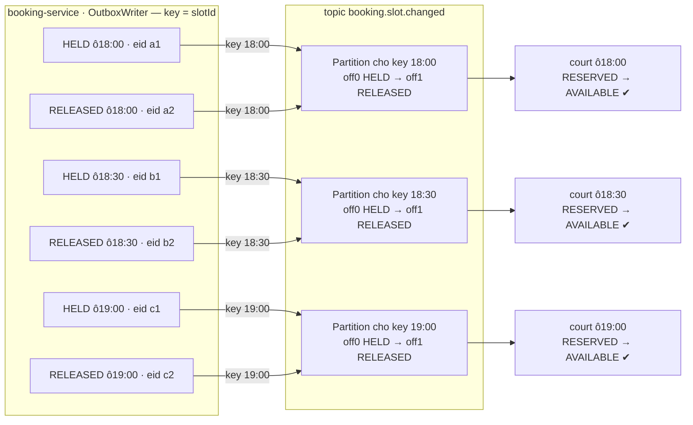
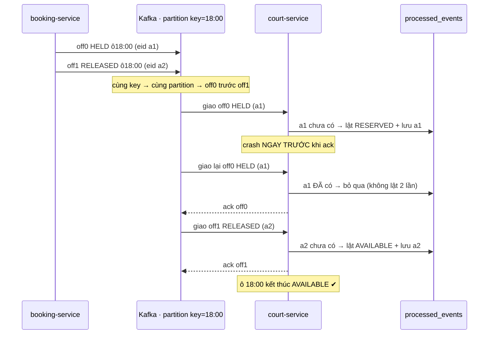
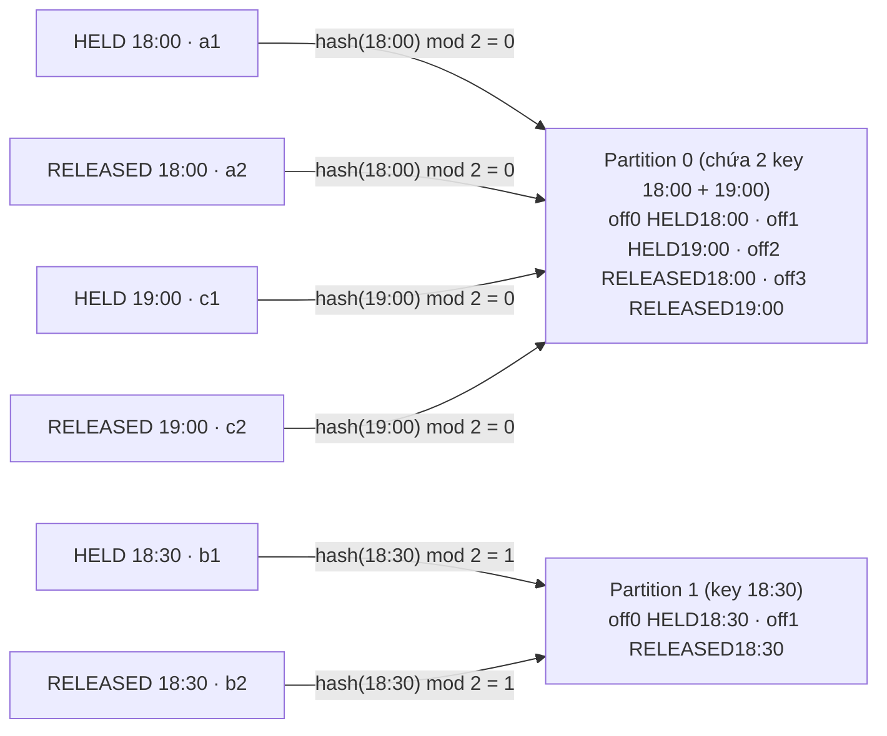
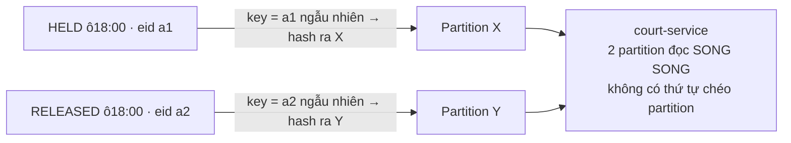

Sơ đồ A — 3 ô → key=slotId → mỗi luồng vào 1 partition, giữ thứ tự

Sơ đồ B — Một ô (18:00): giữ thứ tự + chống gửi lặp khi replay

Sơ đồ thật — giả sử topic chỉ có 2 partition, 18:00 và 19:00 lỡ đụng chung

Sơ đồ 1 — SAI: không key theo slotId → cùng ô bị tách partition
