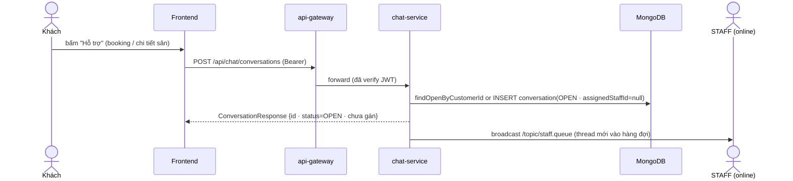
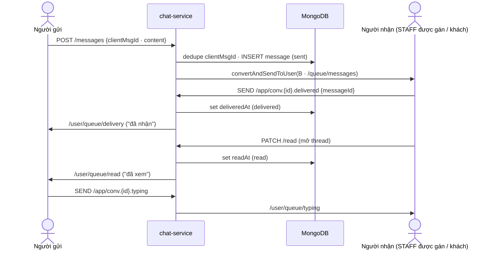
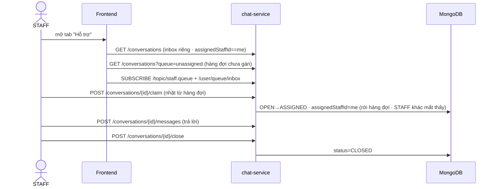
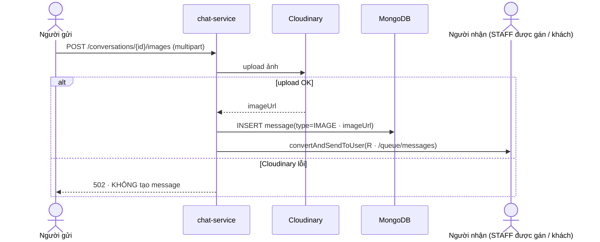
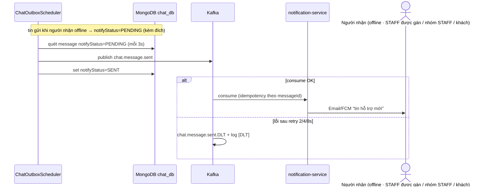
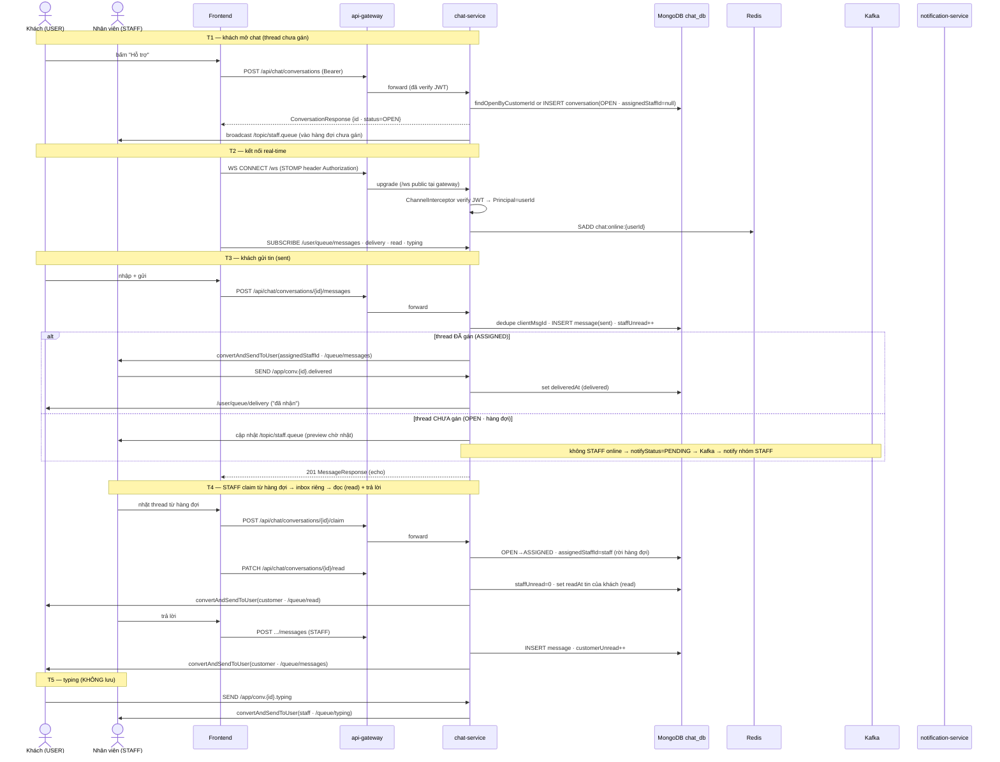

# 📋 Use Case Catalog: Chat hỗ trợ Khách hàng ↔ Nhân viên (real-time)

> **Tóm tắt**: Khách hàng mở **một luồng hỗ trợ**. Thread mới nằm trong **hàng đợi "chưa gán" chung**; một STAFF
> **claim** để kéo về **inbox riêng** của mình — sau đó **chỉ STAFF được gán** (và ADMIN giám sát) thấy & xử lý
> thread đó. Tin nhắn lưu MongoDB; đẩy tức thì qua **STOMP over WebSocket** (`/user/queue/messages`). Trạng thái
> tin **3 mốc `sent → delivered → read`**, có **typing indicator**, **gửi ảnh** (Cloudinary), và **thông báo
> offline** (người nhận không online → Kafka `chat.message.sent` → notification-service email/FCM). KHÔNG có
> payment/escrow — đây là kênh liên lạc thuần.
> Mô hình dữ liệu: **conversations (1 thread/khách) ──< messages**; lưu MongoDB `chat_db`.

---

## 0. Tổng quan

### 0.1 Danh mục Use Case

| UC ID | Tên | Actor | Trigger | Mô tả 1 dòng |
|---|---|---|---|---|
| **UC-CHAT-01** | Khách khởi tạo chat | Khách (USER/COACH) | Bấm "Hỗ trợ" ở trang booking / chi tiết sân | Mở (find-or-create) 1 thread hỗ trợ, vào **hàng đợi chưa gán** cho STAFF nhặt |
| **UC-CHAT-02** | Nhắn tin real-time | Khách + STAFF | Gửi tin trong thread | Trao đổi text tức thì qua WebSocket, trạng thái `sent→delivered→read`, typing |
| **UC-CHAT-03** | STAFF quản lý hội thoại | STAFF/ADMIN | Mở tab "Hỗ trợ" trong Admin | Quản lý **inbox riêng** (thread được gán) + nhặt từ **hàng đợi chưa gán** |
| **UC-CHAT-04** | Gửi ảnh đính kèm | Khách + STAFF | Đính ảnh vào tin | Upload Cloudinary → tin loại IMAGE, đẩy + đổi trạng thái như text |
| **UC-CHAT-05** | Thông báo tin offline | Hệ thống | Người nhận không online khi có tin | Kafka `chat.message.sent` → notification-service email/FCM đánh thức |

### 0.2 Quyết định kiến trúc (dùng chung mọi UC)

| Hạng mục | Lựa chọn | Vì sao |
|---|---|---|
| **Transport** | STOMP over WebSocket (`spring-boot-starter-websocket`) | Spring-native, pub/sub `/topic` + hàng đợi riêng `/user/queue` (`convertAndSendToUser`), đi qua gateway. FE dùng `@stomp/stompjs`. |
| **Mô hình hội thoại** | **Per-staff private inbox** + hàng đợi chưa-gán chung | Thread mới ở hàng đợi chung; claim → vào **inbox riêng** 1 STAFF; sau gán **chỉ STAFF đó** (+ ADMIN giám sát) thấy. Phân-luồng-công-việc rõ ràng. |
| **Lưu trữ** | MongoDB `chat_db` (chung instance `mongodb:27017`) | Chat = ghi nhiều, schema mềm, time-ordered. Patterns: index theo hot-path · keyset pagination · computed/extended-reference/subset — xem **§F**. |
| **Outbox** | single-document outbox (cờ `notifyStatus` trong message doc) | Mongo standalone không có multi-doc txn → ghi 1 doc là atomic; scheduler quét cờ. |
| **Presence** | Redis `chat:online:{userId}` = **SET sessionId** (ref-count theo Session event) + TTL safety-net — nội bộ | Gate offline-notification (offline khi tập rỗng), KHÔNG phải "online indicator". Chi tiết **§G.6**. |
| **Trạng thái tin** | 3 mốc `sent → delivered → read` | `sent`=lưu DB · `delivered`=tới thiết bị người nhận (ACK qua STOMP) · `read`=mở thread. |
| **Service** | `chat-service`, port **3011** | Domain riêng, có security (khác notification-service public). |
| **Bảo mật & vận hành** | hardening per-frame authz · token-lifecycle · validation · rate-limit · ops | Đưa lên production cho **người dùng thật** — chi tiết **§G**. |

### 0.3 Tiền đề dùng chung (Preconditions)
- Cả hai actor **đã đăng nhập** (JWT hợp lệ). REST verify ở gateway + service. **WebSocket: `/ws/**` public tại
  gateway** (browser KHÔNG gắn được header `Authorization` lên WS handshake) → auth **chỉ** ở **STOMP CONNECT
  frame** (`StompAuthChannelInterceptor`); ngoài ra **mọi SEND/SUBSCRIBE đều authz per-frame** (participant của
  thread + role) — xem **§G.1**.
- Khách có **đúng một** conversation đang mở (`status != CLOSED`); mở lần đầu service tạo (idempotent).
- **Authz (per-staff private inbox)**:
  - **Khách**: chỉ thread của chính mình (`customerId == authentication.name`).
  - **STAFF**: **mặc định chỉ thấy thread `assignedStaffId == me`** (inbox riêng); **xem được hàng đợi chưa gán**
    (`status=OPEN && assignedStaffId=null`) để claim. **KHÔNG** thấy thread đã gán cho STAFF khác.
  - **ADMIN**: thấy **tất cả** (vai trò giám sát) — ngoại lệ duy nhất được xem toàn bộ.
- Real-time chạy **1 instance chat-service** (simple broker in-memory) — pilot; multi-instance cần relay (xem Phụ lục D.11).

---

## UC-CHAT-01 — Khách khởi tạo chat

| Field | Detail |
|---|---|
| **Use Case ID** | UC-CHAT-01 |
| **Actor chính** | Khách hàng (ROLE_USER/COACH) |
| **Trigger** | Bấm nút "Hỗ trợ" ở trang booking / trang chi tiết sân |
| **Tiền đề riêng** | Đã đăng nhập |
| **Kết quả** | Có 1 conversation `OPEN` **chưa gán**, nằm trong hàng đợi cho STAFF nhặt |

### Luồng chính
1. Khách bấm "Hỗ trợ" → FE `POST /api/chat/conversations`.
2. Service `findOpenByCustomerId` → có thì trả về; chưa có thì `INSERT conversation(status=OPEN,
   assignedStaffId=null, customerId, customerName snapshot)`. **Idempotent** — không tạo trùng.
3. Service **broadcast `/topic/staff.queue`** (tóm tắt thread chưa gán) → mọi STAFF đang online thấy thread mới
   trong **Hàng đợi chưa gán** để nhặt (claim ở UC-CHAT-03).
4. FE nhận `ConversationResponse {id, status=OPEN, assignedStaffId=null}` → mở khung chat, kết nối STOMP
   (xem UC-CHAT-02 bước kết nối).

### Nhánh ngoại lệ
| # | Nhánh | Diễn biến | Kết cục |
|---|---|---|---|
| 1 | Khách mở lại lần 2 | đã có thread chưa CLOSED | trả về thread cũ (idempotent); nếu thread cũ đã `ASSIGNED` thì giữ nguyên STAFF cũ |
| 2 | Chưa verify email | (tuỳ chính sách) chặn hoặc cho mở | nếu chặn → 403; mặc định cho mở vì chỉ là hỏi đáp |
| 3 | Không STAFF nào online | broadcast hàng đợi không ai nghe | thread vẫn nằm DB (`OPEN` chưa gán); khi khách gửi tin đầu → offline-notify **nhóm STAFF** (UC-CHAT-05) |

### Quy tắc
- **1 thread mở / khách** (`ensureOpenConversation` idempotent) — chốt DB-level bằng **unique sparse `activeCustomerId`** (§F.2) chống race 2 lần bấm "Hỗ trợ".
- Thread mới **luôn chưa gán** (`assignedStaffId=null`) → phải qua claim mới có chủ.
- Mở thread **chưa** sinh tin → chỉ hiện ở **Hàng đợi chưa gán** của STAFF online, chưa vào inbox riêng ai.

### Mini sequence


---

## UC-CHAT-02 — Nhắn tin real-time (sent → delivered → read + typing)

| Field | Detail |
|---|---|
| **Use Case ID** | UC-CHAT-02 |
| **Actor chính** | Khách + Nhân viên được gán (người gửi ↔ người nhận) |
| **Trigger** | Gửi tin / gõ phím trong thread |
| **Tiền đề riêng** | Đã có conversation (UC-CHAT-01); đã kết nối STOMP |
| **Kết quả** | Tin tới người nhận tức thì, người gửi thấy `đã gửi → đã nhận → đã xem` |

### Luồng chính
1. **Kết nối real-time** — FE mở STOMP qua gateway `/ws` (prod: `wss://`), gửi `CONNECT` kèm header
   `Authorization: Bearer` (trong **STOMP frame**, không phải HTTP handshake).
   `StompAuthChannelInterceptor` verify JWT → `Principal=userId`. Service `SADD chat:online:{userId} {sessionId}` (presence ref-count, §G.6).
   FE `SUBSCRIBE /user/queue/messages` · `/user/queue/delivery` · `/user/queue/read` · `/user/queue/typing`.
2. **Gửi tin (sent)** — FE `POST /api/chat/conversations/{id}/messages {clientMsgId, type:TEXT, content}`.
   Service dedupe `(conversationId, senderId, clientMsgId)` → `INSERT message` (mốc **sent** = `createdAt`,
   `deliveredAt=null`, `readAt=null`) → cập nhật `conversation.lastMessage* · {recipient}Unread++`.
3. **Phân phối** — **người nhận = STAFF được gán** (`assignedStaffId`) nếu tin từ khách, hoặc **khách**
   (`customerId`) nếu tin từ STAFF:
   - người nhận online → `convertAndSendToUser(recipient, /queue/messages, dto)`;
   - người nhận offline → `notifyStatus=PENDING` (đi UC-CHAT-05);
   - **thread CHƯA gán** (khách gửi mà chưa STAFF nào claim) → tin nằm hàng đợi, cập nhật `/topic/staff.queue`
     (chưa có người nhận đích danh), offline → notify nhóm STAFF.
4. **Delivered** — client người nhận, ngay khi nhận tin (dù chưa mở), gửi `SEND /app/conv.{id}.delivered
   {messageId}` → service set `deliveredAt=now` → báo người gửi qua `/user/queue/delivery` (UI hiện "Đã nhận").
5. **Read** — người nhận mở thread → `PATCH /api/chat/conversations/{id}/read` → set `readAt` cho các tin của
   đối phương + reset unread của mình → push `/user/queue/read` cho người gửi (UI hiện "Đã xem").
6. **Typing** — gõ phím → FE `SEND /app/conv.{id}.typing` → `convertAndSendToUser(other, /queue/typing)`
   (KHÔNG lưu DB, FE tự ẩn sau ~3s).

### Nhánh ngoại lệ
| # | Nhánh | Diễn biến | Kết cục |
|---|---|---|---|
| 1 | WS rớt kết nối | mạng chập chờn → STOMP disconnect | `@stomp/stompjs` auto-reconnect; `SessionDisconnect` `SREM` session → tập rỗng (hoặc TTL safety-net hết) → coi offline; tin tới lúc offline đi Kafka. Khi reconnect: **ACK delivered bù** tin chưa ACK + history-sync (§G.6) |
| 2 | Token hết hạn lúc CONNECT | JWT expired ở interceptor | CONNECT bị từ chối (ERROR frame) → FE silent-refresh token rồi reconnect |
| 3 | Tin trùng do retry | client gửi lại cùng `clientMsgId` | dedupe → trả tin cũ, không tạo 2 bản (idempotent send) |
| 4 | Khách gửi khi thread chưa gán | chưa STAFF nào claim | tin vẫn lưu (sent), nằm hàng đợi; chỉ delivered/read khi đã có STAFF gán mở thread |
| 5 | Token hết hạn **giữa phiên** (socket sống >15') | access TTL 15' < đời socket | server lên lịch **đóng session ở `exp`**; client bắt CLOSE → silent-refresh `/api/auth/refresh` → reconnect token mới (**§G.2**) |
| 6 | SEND-frame **giả mạo** | client ACK `delivered`/`typing` cho thread KHÔNG thuộc về mình | interceptor authz per-frame: principal phải là participant → **reject** (**§G.1**) |

### Quy tắc
- **Trạng thái suy ra từ timestamp**: `sent`=có `createdAt` · `delivered`=có `deliveredAt` · `read`=có `readAt`.
- **Người nhận đích danh = STAFF được gán** (không broadcast tin cho mọi STAFF) — thread chưa gán thì tin chờ ở hàng đợi.
- **Đẩy = REST persist + WS push**: gửi tin qua REST; WebSocket chỉ fan-out tin + delivery ACK + read + typing.
- **Typing không lưu** — ephemeral.
- **Validation nội dung**: `content` trim, **≤ 2000 ký tự**, **từ chối rỗng/space-only**; lưu raw + **escape khi render** (chống stored-XSS) — **§G.3**.
- **Rate-limit gửi**: `rate_limit:chat` ~30 tin/phút theo pattern `BookingRateLimiter` (INCR+EXPIRE · fail-open · 429) — **§G.3**.

### Mini sequence


---

## UC-CHAT-03 — STAFF quản lý hội thoại (inbox riêng + hàng đợi chưa gán)

| Field | Detail |
|---|---|
| **Use Case ID** | UC-CHAT-03 |
| **Actor chính** | Nhân viên (ROLE_STAFF) — ADMIN có thêm view giám sát toàn bộ |
| **Trigger** | Mở tab "Hỗ trợ" trong trang Admin |
| **Tiền đề riêng** | Có role STAFF/ADMIN |
| **Kết quả** | STAFF xử lý các thread **của riêng mình**; nhặt thread mới từ hàng đợi chung |

### Luồng chính
1. STAFF mở tab "Hỗ trợ" → FE tải 2 danh sách:
   - **"Của tôi"**: `GET /api/chat/conversations` → thread `assignedStaffId == me` (mọi status, kèm `staffUnread`).
   - **"Hàng đợi chưa gán"**: `GET /api/chat/conversations?queue=unassigned` → thread `OPEN && assignedStaffId=null`.
2. FE `SUBSCRIBE /topic/staff.queue` (thread mới/đổi trong **hàng đợi chung** — mọi STAFF) + `/user/queue/inbox`
   (cập nhật thread **riêng của tôi**: tin mới, unread bump) → cả 2 cập nhật live, không cần poll.
3. STAFF nhặt 1 thread từ hàng đợi → `POST /api/chat/conversations/{id}/claim` → `status=ASSIGNED ·
   assignedStaffId=me`. Thread **rời hàng đợi chung** (`/topic/staff.queue` báo đã được nhận) → **STAFF khác
   không còn thấy**; thread vào **inbox riêng** của STAFF này.
4. STAFF đọc & trả lời (theo UC-CHAT-02): `PATCH .../read` (reset `staffUnread`) + `POST .../messages`.
5. STAFF **chuyển qua lại** các thread **của mình** — mỗi thread giữ unread riêng; badge tổng = tổng `staffUnread`
   của các thread được gán cho mình.
6. Xong → `POST /api/chat/conversations/{id}/close` → `status=CLOSED`.
7. Khách gửi tin mới vào thread đã CLOSED → service **reopen** (`CLOSED→ASSIGNED`, **giữ `assignedStaffId` cũ**)
   → bơm vào inbox riêng của đúng STAFF cũ (tiếp nối liền mạch).

### Nhánh ngoại lệ
| # | Nhánh | Diễn biến | Kết cục |
|---|---|---|---|
| 1 | 2 STAFF cùng claim | đua claim 1 thread chưa gán | guard `assignedStaffId=null` → chỉ 1 thắng (`OPEN→ASSIGNED`); người sau thấy đã gán → **409** |
| 2 | STAFF khác mở thread đã gán | không phải `assignedStaffId` của thread | authz → **403** (chỉ STAFF được gán + ADMIN xem được) |
| 3 | Người lạ (khách khác) mở thread | không phải `customerId` | **403 FORBIDDEN** |
| 4 | STAFF được gán offline khi có tin | không nghe `/user/queue/inbox` | tin đi offline-notify đích danh `assignedStaffId` (UC-CHAT-05); mở lại thấy đủ |

### Quy tắc
- **Per-staff private inbox**: sau claim, thread thuộc về **đúng 1 STAFF**; STAFF khác mất quyền thấy/xử lý.
  ADMIN có view giám sát (`?scope=all`) — không phải bảo mật cứng mà là **phân-luồng-công-việc**.
- **Claim chỉ từ `OPEN` + chưa gán**; `close` chỉ từ `OPEN/ASSIGNED`; **reopen giữ nguyên STAFF cũ**.
- **Unread denormalized** (`staffUnread`/`customerUnread`) trên conversation → badge O(1).

### Mini sequence


---

## UC-CHAT-04 — Gửi ảnh đính kèm

| Field | Detail |
|---|---|
| **Use Case ID** | UC-CHAT-04 |
| **Actor chính** | Khách + Nhân viên được gán |
| **Trigger** | Đính ảnh vào tin (vd khách gửi ảnh chụp màn hình chuyển khoản) |
| **Tiền đề riêng** | Đã có conversation; là khách chủ thread hoặc STAFF được gán |
| **Kết quả** | Tin loại IMAGE hiển thị ảnh inline, đổi trạng thái như tin text |

### Luồng chính
1. Người gửi chọn ảnh → FE `POST /api/chat/conversations/{id}/images` (multipart).
2. Service upload **Cloudinary** (degrade `local-fallback://` khi thiếu key dev; `CloudinaryProdGuard` chặn boot
   ở prod nếu thiếu key) → nhận `imageUrl`.
3. `INSERT message(type=IMAGE, imageUrl, content=caption?)` → đẩy tới **người nhận đích danh** (STAFF được gán /
   khách) + đổi trạng thái `sent→delivered→read` y hệt tin text (UC-CHAT-02).

### Nhánh ngoại lệ
| # | Nhánh | Diễn biến | Kết cục |
|---|---|---|---|
| 1 | Cloudinary down | upload lỗi | **502**, KHÔNG tạo message (ảnh là nội dung chính) |
| 2 | File quá lớn | vượt **5MB** (trần multipart khớp payment-service) | 413/400, không tạo message |
| 3 | Prod thiếu key Cloudinary | sai cấu hình | service KHÔNG boot (`CloudinaryProdGuard`) — bắt lỗi sớm |
| 4 | Không phải ảnh | content-type ngoài allowlist `image/png\|jpeg\|webp` | **415/400**, KHÔNG upload/KHÔNG tạo message (**§G.4**) |

### Quy tắc
- Upload **trước** khi tạo message (ảnh hỏng → không sinh tin rác).
- **Validate trước upload**: **MIME allowlist** `image/png|jpeg|webp` + **≤5MB** (siết hơn proof hiện tại — proof chưa validate content-type) — **§G.4**.
- Reuse pattern `CloudinaryService` của payment-service (đồng nhất với upload proof).

### Mini sequence


---

## UC-CHAT-05 — Thông báo tin offline (Kafka → email/FCM)

| Field | Detail |
|---|---|
| **Use Case ID** | UC-CHAT-05 |
| **Actor chính** | Hệ thống (chat-service + notification-service) |
| **Trigger** | Tin được gửi khi người nhận KHÔNG online |
| **Tiền đề riêng** | Có tin với `notifyStatus=PENDING` |
| **Kết quả** | Người nhận được email/FCM đánh thức; tin vẫn lưu, hiện khi mở lại |

### Luồng chính
1. Khi gửi tin (UC-CHAT-02/04): người nhận **không** ở `chat:online:*` → message `notifyStatus=PENDING`
   (single-doc Outbox — atomic cùng lúc INSERT message). **Đích notify**:
   - thread **đã gán** → notify đích danh `assignedStaffId` (nếu người nhận là STAFF) hoặc `customerId`;
   - thread **chưa gán** (khách gửi, chưa ai claim) → notify **nhóm STAFF** (fan-out theo role STAFF).
2. `ChatOutboxScheduler @Scheduled(3s)` quét `message{notifyStatus=PENDING}` → `kafkaTemplate.send(
   "chat.message.sent", payload)` → set `notifyStatus=SENT`.
3. notification-service consume `chat.message.sent` (idempotency theo `messageId`) → gửi **email/FCM** tới đúng
   đích "Bạn có tin nhắn hỗ trợ mới".

### Nhánh ngoại lệ
| # | Nhánh | Diễn biến | Kết cục |
|---|---|---|---|
| 1 | Consumer lỗi | notification-service throw | retry 2/4/8s → `chat.message.sent.DLT` + log `[DLT]` (không auto-reprocess). Tin KHÔNG mất, chỉ chậm thông báo |
| 2 | Người nhận online lại trước scheduler | đã đọc tin trực tiếp | vẫn có thể gửi notify (đã PENDING) — chấp nhận; hoặc gate lại presence ngay trước publish (tối ưu) |

### Quy tắc
- **Presence gate**: chỉ set PENDING khi người nhận offline → tránh spam khi đang chat trực tiếp.
- **Đích đúng vai**: đã gán → đích danh; chưa gán → nhóm STAFF (để có người vào nhặt).
- **Không bao giờ drop Kafka**: 3 retry → DLT + log (rule #7).

### Mini sequence


---

# Phụ lục kỹ thuật (dùng chung)

## A. Sequence tổng hợp (5 UC trong 1 diagram)



## B. State machines

```
conversation.status (per-staff):
   OPEN (chưa gán · hàng đợi) ──claim──► ASSIGNED (inbox riêng 1 STAFF) ──close──► CLOSED
        ▲                                   │   │
        │                                   │   └─ transfer: đổi assignedStaffId (VẪN ASSIGNED)
        └────────── release ────────────────┘
                 (nhả về hàng đợi)
   reopen: CLOSED ──khách gửi lại (GIỮ assignedStaffId cũ)──► ASSIGNED

message — delivery 3 trạng thái (suy ra từ timestamp):
   sent       createdAt   — server nhận, lưu DB
     │  client người nhận ACK (/app/conv.{id}.delivered)
     ▼
   delivered  deliveredAt — tới thiết bị người nhận
     │  người nhận mở thread (PATCH /read)
     ▼
   read       readAt      — đã xem

message.notifyStatus (single-doc Outbox cho offline):
   NONE     (recipient online → đẩy STOMP, không cần Kafka)
   PENDING  (recipient offline → chờ scheduler · kèm đích notify)
       │ scheduler đẩy chat.message.sent
       ▼
   SENT
```

## C. Ghi chú kỹ thuật (khớp kiến trúc)

- **Auth WebSocket ≠ auth HTTP**: `JwtAuthFilter` (OncePerRequestFilter) chỉ áp HTTP request, KHÔNG áp STOMP
  frame sau khi upgrade. **Gateway cũng KHÔNG verify được WS handshake** (browser không gắn được header
  `Authorization` lên WS upgrade) → `/ws/**` để **public tại gateway**, auth dồn về CONNECT frame:
  `StompAuthChannelInterceptor.preSend` bắt `StompCommand.CONNECT`, đọc `nativeHeader Authorization`,
  `JwtUtil.parseAndValidate`, `accessor.setUser(...)`.
- **Authz per-frame (SEND/SUBSCRIBE)**: auth ở CONNECT chỉ xác định *danh tính*, chưa đủ. Interceptor còn chặn
  **SUBSCRIBE `/topic/staff.queue`** cho non-STAFF và **SEND `/app/conv.{id}.*`** khi principal không phải
  participant của `conversationId` (chống spoof `delivered`/`typing`). `/user/**` an toàn theo prefix per-principal. (**§G.1**)
- **Token mid-session**: access TTL 15' < đời socket → server lên lịch **đóng session tại `exp`**; client bắt CLOSE
  → silent-refresh → reconnect token mới. KHÔNG để socket sống với token đã chết. (**§G.2**)
- **Per-staff routing**: tin định tuyến tới **người nhận đích danh** (`assignedStaffId` cho tin của khách,
  `customerId` cho tin của STAFF) qua `convertAndSendToUser` — KHÔNG broadcast tin cho mọi STAFF. Thread chưa
  gán thì chỉ broadcast **tóm tắt** lên `/topic/staff.queue` (để nhặt), không gửi nội dung.
- **Hybrid REST-persist + WS-push**: gửi tin = REST (1 đường validation/authz/persist) → service
  `simpMessagingTemplate.convertAndSendToUser(recipientId, "/queue/messages", dto)`. STOMP `@MessageMapping`
  CHỈ cho `typing` + `delivered` ACK (ephemeral/idempotent). Tránh nhân đôi authz trong STOMP handler.
- **Delivery 3-state**: `sent`/`delivered`/`read` không lưu cột status — suy ra từ `createdAt`/`deliveredAt`/
  `readAt`. ACK `delivered` do client người nhận gửi khi nhận frame; khi reconnect ACK bù cho tin
  `deliveredAt=null`. `read` đi qua `PATCH /read`.
- **MongoDB single-document Outbox**: cờ `notifyStatus` (+ đích notify) nằm **trong** chính message doc (ghi 1
  doc atomic). `ChatOutboxScheduler @Scheduled(3s)` quét `PENDING` → Kafka → `SENT`.
- **Presence gate**: `SessionConnectedEvent`/`SessionDisconnectEvent` maintain `chat:online:{userId}`. Gate Kafka
  offline — KHÔNG phải "online indicator".
- **Hàng đợi vs inbox riêng**: `/topic/staff.queue` (broadcast thread CHƯA gán, mọi STAFF nhặt) ≠
  `/user/queue/inbox` (cập nhật thread RIÊNG của tôi). Claim chuyển thread từ hàng đợi sang inbox riêng.
- **Idempotency 2 phía**: send dedupe `clientMsgId` (unique theo thread+sender); consumer notify dedupe `messageId`.
- **DLT**: `DefaultErrorHandler` + `DeadLetterPublishingRecoverer` → `chat.message.sent.DLT`, backoff 2/4/8s ×3,
  monitor log `[DLT]` (không auto-reprocess) — mirror `SlotDeadLetterMonitor`.
- **Ảnh**: reuse `CloudinaryService` payment-service (degrade `local-fallback://`, `CloudinaryProdGuard`).

## D. Patterns của Senior Engineer

### D.1 STOMP pub/sub + per-user queue
`convertAndSendToUser(userId, "/queue/messages", dto)` + `setUserDestinationPrefix("/user")` — fan-out riêng-tư
tới đúng người nhận mà không tự quản map socket↔user. Dùng chung cho message · delivery · read · typing · inbox.

### D.2 Xác thực ở STOMP CONNECT frame
Browser WebSocket không set được header → xác thực ở CONNECT frame (`@stomp/stompjs connectHeaders`) qua
`ChannelInterceptor`. Trade-off: gateway để `/ws/**` public; bù lại biên auth nằm đúng nơi (chat-service).

### D.3 Hybrid REST-persist + WS-push
Persist + authz + validation 1 đường (REST); WebSocket chỉ vận chuyển. Giảm blast-radius lỗi authz.

### D.4 MongoDB single-document Outbox
Cờ `notifyStatus` (+ đích) trong message doc (single-doc write atomic) + scheduler — outbox không cần replica-set txn.

### D.5 Redis presence gate cho offline-notification
Chỉ email/FCM khi người nhận thật sự offline → tránh spam khi đang chat trực tiếp.

### D.6 Idempotent send (`clientMsgId`)
Chống nhân đôi do retry mạng + cho phép optimistic UI (FE render ngay, reconcile theo `clientMsgId`).

### D.7 Read-receipt + delivery + unread denormalized
`deliveredAt`/`readAt` per-message + `customerUnread`/`staffUnread` trên conversation → trạng thái + badge O(1).

### D.8 Delivery ACK 3 trạng thái
Client ACK `delivered` ngay khi nhận frame (chưa cần mở) → tách "tới thiết bị" khỏi "đã xem" như Messenger/Zalo.
Khi reconnect, ACK bù cho tin `deliveredAt=null` → không sót mốc delivered.

### D.9 Hàng đợi chưa-gán + inbox riêng (per-staff)
Thread CHƯA gán broadcast tóm tắt lên `/topic/staff.queue` (mọi STAFF online nhặt). Claim → gán `assignedStaffId`
→ thread rời hàng đợi, vào inbox riêng (`/user/queue/inbox` + tin qua `/queue/messages`). Sau gán, STAFF khác
mất quyền thấy. **ADMIN** có view giám sát toàn bộ (`?scope=all`) — per-staff là phân-luồng-công-việc, không phải
bảo mật cứng.

### D.10 DLT + idempotency consumer
Không drop Kafka im lặng (rule #7) + consumer dedupe theo `messageId` (rule #5).

### D.11 Pilot 1 instance → scaling relay
Simple broker in-memory chỉ đúng với **1 instance** (như pilot booking/payment). Multi-instance: đổi sang
**Redis pub/sub** hoặc **RabbitMQ STOMP relay** (`enableStompBrokerRelay`) để fan-out cross-instance + presence dùng chung.

### D.12 Bảng map UC → pattern
| UC | Pattern chính |
|---|---|
| UC-CHAT-01 | D.9 hàng đợi chưa-gán · D.4 (nếu offline) |
| UC-CHAT-02 | D.2 auth CONNECT · D.3 hybrid · D.6 idempotent · D.8 delivery ACK · D.7 |
| UC-CHAT-03 | D.9 inbox riêng + hàng đợi · D.7 unread denormalized |
| UC-CHAT-04 | D.3 hybrid (ảnh) |
| UC-CHAT-05 | D.5 presence gate · D.4 single-doc outbox · D.10 DLT+idempotency |

## E. Phụ lục API · STOMP · Kafka · DB · Redis

### E.1 REST (`/api/chat`, base qua gateway)
| Method · Path | Authz | Mô tả | UC |
|---|---|---|---|
| `POST /conversations` | USER/COACH (khách) | ensure/open thread (idempotent, chưa gán) | 01 |
| `GET /conversations` | STAFF: `assignedStaffId==me` · USER: thread của mình · ADMIN+`?scope=all`: tất cả | inbox riêng (paginate) | 03 |
| `GET /conversations?queue=unassigned` | STAFF/ADMIN | hàng đợi `OPEN && assignedStaffId=null` để nhặt | 03 |
| `GET /conversations/{id}/messages?before=&limit=` | chủ thread · STAFF được gán · ADMIN | lịch sử tin (mới→cũ) — **keyset** cursor `before=_id` (§F.4), KHÔNG offset | 02/03 |
| `POST /conversations/{id}/messages` | chủ thread · STAFF được gán | gửi TEXT `{clientMsgId,type,content}` | 02 |
| `POST /conversations/{id}/images` | chủ thread · STAFF được gán | multipart ảnh → Cloudinary → IMAGE | 04 |
| `PATCH /conversations/{id}/read` | chủ thread · STAFF được gán | đánh dấu đã đọc (reset unread + readAt) | 02 |
| `POST /conversations/{id}/claim` | STAFF/ADMIN | OPEN(chưa gán)→ASSIGNED + gán mình (guard `assignedStaffId=null`) | 03 |
| `POST /conversations/{id}/transfer` | STAFF được gán · ADMIN | chuyển thread sang STAFF khác (đổi `assignedStaffId`) — handoff (**§G.7**) | 03 |
| `POST /conversations/{id}/release` | STAFF được gán · ADMIN | nhả về hàng đợi (`ASSIGNED→OPEN` · clear assignee) (**§G.7**) | 03 |
| `POST /conversations/{id}/close` | STAFF/ADMIN (nếu ASSIGNED: người được gán hoặc ADMIN) | →CLOSED (từ OPEN/ASSIGNED) | 03 |

### E.2 STOMP destinations
| Hướng | Destination | Mô tả | UC |
|---|---|---|---|
| SUBSCRIBE | `/user/queue/messages` | tin mới gửi riêng cho tôi (đích danh) | 02 |
| SUBSCRIBE | `/user/queue/delivery` | tin của tôi đã tới thiết bị người nhận ("đã nhận") | 02 |
| SUBSCRIBE | `/user/queue/read` | tin của tôi đã được xem ("đã xem") | 02 |
| SUBSCRIBE | `/user/queue/typing` | đối phương đang gõ | 02 |
| SUBSCRIBE | `/user/queue/inbox` | cập nhật thread **riêng của tôi** (tin mới, unread bump) | 03 |
| SUBSCRIBE | `/topic/staff.queue` | thread **chưa gán** mới/đổi (**chỉ STAFF/ADMIN** — interceptor chặn role · **§G.1**) → hàng đợi nhặt | 01/03 |
| SEND | `/app/conv.{id}.delivered` | client ACK đã nhận tin | 02 |
| SEND | `/app/conv.{id}.typing` | báo tôi đang gõ (ephemeral) | 02 |

### E.3 Kafka
| Topic | Producer | Consumer |
|---|---|---|
| `chat.message.sent` | chat-service (single-doc outbox) | notification-service |
| `chat.message.sent.DLT` | error handler | monitor log |

### E.4 MongoDB `chat_db`
> Index + schema-design patterns (modeling, keyset pagination, scale path): xem **§F**.
```
conversations
  _id                 ObjectId/UUID
  customerId          UUID   (index · ref users.id cross-service)
  customerName        String (snapshot)
  assignedStaffId     UUID?  (index · chủ sở hữu inbox · null = chưa gán/hàng đợi · ref users.id)
  status              OPEN | ASSIGNED | CLOSED   (index)
  lastMessagePreview  String
  lastMessageAt       Instant (index desc — sắp inbox/hàng đợi)
  customerUnread      int
  staffUnread         int
  activeCustomerId    UUID?  (= customerId khi OPEN/ASSIGNED · UNSET khi CLOSED · unique sparse — 1 thread mở/khách)
  archivedAt          Instant?  (null = active · set khi archive thread CLOSED — §F.5/§G.9)
  createdAt/updatedAt Instant
  // hàng đợi chưa gán = (status=OPEN && assignedStaffId=null) · inbox riêng = (assignedStaffId == me)
  // 1 conversation mở / khách: chốt DB bằng unique sparse activeCustomerId (§F.2), không chỉ enforce ở service

messages
  _id                 ObjectId/UUID
  conversationId      UUID   (index)
  senderId            UUID
  senderRole          CUSTOMER | STAFF
  senderName          String (snapshot)
  type                TEXT | IMAGE
  content             String  (text hoặc caption)
  imageUrl            String? (Cloudinary / local-fallback://)
  clientMsgId         String  (unique theo conversationId+senderId — idempotent)
  deliveredAt         Instant?  (mốc delivered — tới thiết bị người nhận)
  readAt              Instant?  (mốc read — đã xem)
  notifyStatus        NONE | PENDING | SENT   (single-doc outbox; index PENDING)
  notifyTarget        STAFF_ASSIGNED | STAFF_GROUP | CUSTOMER   (đích offline-notify)
  createdAt           Instant (mốc sent; index — phân trang theo thời gian)
```

### E.5 Redis keys (bổ sung registry)
| Key | TTL | Mục đích |
|---|---|---|
| `chat:online:{userId}` | TTL ~90s safety-net | **SET sessionId** (ref-count Session event · offline khi tập rỗng) — presence gate offline-notify (§G.6) |
| `rate_limit:chat:{userId}` | 60s | chống spam gửi tin (~30/phút, fail-open) |
| `rate_limit:chat:img:{userId}` | 300s | chống spam upload ảnh (~10/5 phút, fail-open) |

---

## F. MongoDB — Schema design patterns & tối ưu

> Áp dụng **right-sized** cho workload helpdesk (1 CLB, pilot, volume thấp): bật ngay các pattern *rẻ-mà-đúng*
> (index theo hot-path · keyset pagination · computed/extended-reference/subset); **hoãn** pattern nặng
> (bucket/shard/change-stream) kèm ngưỡng adopt rõ ràng — không over-engineer.

### F.1 Quyết định mô hình hoá
- **2 collection riêng** `conversations` + `messages`, **one-document-per-message**.
- **Bác embedding** mảng message vào conversation: BSON doc ≤ **16MB** → mảng tin vô hạn = **Unbounded Array
  antipattern** (vỡ giới hạn + ghi lại cả doc mỗi tin).
- **Chưa dùng Bucket pattern** (gộp N tin/bucket doc): pilot volume thấp → one-doc-per-message đơn giản, phân
  trang & cập nhật `readAt/deliveredAt` dễ. *Adopt khi* 1 thread > vài nghìn tin hoặc QPS đọc cao.
- `_id` (ObjectId) chứa timestamp → **free time-order** + dùng làm **cursor phân trang** (F.4).

### F.2 Index strategy (theo hot query)
| Query | Collection | Index |
|---|---|---|
| Phân trang tin 1 thread | `messages` | `{conversationId:1, _id:-1}` |
| Inbox riêng STAFF (`assignedStaffId==me`) | `conversations` | `{assignedStaffId:1, status:1, lastMessageAt:-1}` |
| Hàng đợi chưa gán | `conversations` | **partial** `{status:1, lastMessageAt:-1}` · `partialFilterExpression:{assignedStaffId:null, status:'OPEN'}` |
| Thread của khách | `conversations` | `{customerId:1, status:1}` |
| Idempotent send (dedupe) | `messages` | **unique** `{conversationId:1, senderId:1, clientMsgId:1}` |
| Outbox quét offline | `messages` | **partial** `{notifyStatus:1}` · `partialFilterExpression:{notifyStatus:'PENDING'}` |
| 1 thread mở / khách (chống race) | `conversations` | **unique sparse** `{activeCustomerId:1}` (= customerId khi mở · unset khi CLOSED) |

> Partial index (hàng đợi + outbox) chỉ index đúng tập docs cần quét → index **nhỏ**, ghi rẻ. Unique index
> `clientMsgId` là chốt **DB-level** cho idempotent send (race lọt qua check ở service vẫn bị chặn).

### F.3 Patterns đã áp dụng (MongoDB "Building with Patterns")
- **Computed Pattern** — `customerUnread`/`staffUnread` + `lastMessageAt`/`lastMessagePreview` tính sẵn trên
  conversation → render inbox + badge **O(1)**, không `COUNT`/aggregate mỗi lần.
- **Extended Reference** — snapshot `customerName`/`senderName` trên doc → render KHÔNG join sang user-service
  (cross-service, no FK). Đánh đổi: tên có thể stale (hiếm đổi → chấp nhận).
- **Subset Pattern** — `lastMessagePreview` (+ tùy chọn `recentMessages[≤5]`) nhúng trong conversation → danh
  sách inbox render mà không truy `messages`. Full history vẫn ở `messages`.
- **Single-document Outbox** — `notifyStatus`/`notifyTarget` ngay trong message doc (single-doc write atomic,
  không cần multi-doc txn) — đã mô tả ở **D.4**.

### F.4 Phân trang keyset (KHÔNG dùng `skip`)
```
find({ conversationId, _id: { $lt: cursor } }).sort({ _id: -1 }).limit(N)
```
- `cursor` = `_id` của tin cũ nhất đang hiển thị; lần đầu bỏ filter `_id`. Tránh `skip(n)` (O(n), chậm dần khi
  cuộn lịch sử dài). `_id` đơn điệu theo thời gian nên vừa sort vừa làm con trỏ.

### F.5 TTL / archival
- Conversation `CLOSED` lâu + tin cũ: ưu tiên **archival** (chuyển sang cold collection / set `conversations.archivedAt`) để
  **giữ lịch sử hỗ trợ/khiếu nại**, KHÔNG TTL-delete vô tội vạ. Nếu chính sách cho xoá → TTL index trên
  `archivedAt`. Pilot **chưa cần** → backlog.

### F.6 Lộ trình scale (adopt-when triggers)
- **Bucket Pattern** cho `messages` — khi 1 thread quá dài / cần giảm doc count + kích thước index.
- **Sharding** shard key `{conversationId: "hashed"}` — colocate tin của 1 thread + phân tán đều, khi 1 node quá tải.
- **Change Streams** thay polling outbox để fan-out (yêu cầu **replica set**) — hiện Mongo standalone nên dùng
  STOMP + scheduler (D.4). Bật replica set là tiền đề cho cả change-stream lẫn multi-doc txn.
- **Write concern**: `messages` `w:1` đủ cho chat (ưu tiên latency); nâng `w:majority` nếu cần bền vững tuyệt đối.
- Nhắc lại **D.11**: real-time multi-instance cần Redis pub/sub hoặc RabbitMQ STOMP relay.

---

## G. Production readiness (cho người dùng thật)

> Rà từ **code thật** (payment-service · api-gateway · common-security) — đóng các khe hở mà §A–§F chưa che. Triết
> lý **right-sized như audit money-safety**: **[NOW]** = vá ngay vì cắn người dùng thật (bảo mật WS · validation ·
> token · nhất quán · multi-device); **[BACKLOG · adopt-when]** = hoãn có chủ đích kèm ngưỡng. KHÔNG over-engineer
> cho pilot 1 CLB.

### G.1 Bảo mật WebSocket/STOMP — **[NOW]**
- **Auth tại CONNECT frame**: `/ws/**` public ở gateway (handshake không mang token) → `StompAuthChannelInterceptor`
  bắt `CONNECT`, `JwtUtil.parseAndValidate(nativeHeader Authorization)`, `accessor.setUser(principal=userId)`. Token
  hỏng/hết hạn → **ERROR frame**, từ chối kết nối.
- **SUBSCRIBE authz**: interceptor chặn **`/topic/staff.queue` cho non-STAFF** (chỉ STAFF/ADMIN nhặt hàng đợi).
  `/user/**` an toàn sẵn theo prefix per-principal (Spring chỉ giao cho đúng `Principal`).
- **SEND-frame authz**: `delivered`/`typing` ghi/đẩy theo `conversationId` → interceptor xác minh **principal là
  participant** (`customerId` hoặc `assignedStaffId`) trước khi xử lý → chống spoof ACK/typing thread lạ.
- **Giới hạn khung & origin**: cấu hình `setMessageSizeLimit` / `setSendBufferSizeLimit` (chống frame khổng lồ) +
  `setAllowedOrigins(FRONTEND_URL)` ở `registerStompEndpoints` (CORS cho handshake, khớp gateway).

### G.2 Token lifecycle trên kết nối dài — **[NOW]**
- Access TTL **15'** < đời socket. Verify ở CONNECT là **một thời điểm** — không tự gia hạn.
- **Server lên lịch đóng session tại `exp`** (đọc claim `exp` lúc CONNECT, schedule disconnect) → không cho socket
  sống với token đã chết.
- **Client** `@stomp/stompjs`: bắt sự kiện CLOSE/ERROR → **silent-refresh** `POST /api/auth/refresh` (cookie) lấy
  access mới → **reconnect** kèm token mới (tái dùng cơ chế refresh của `axiosClient`). Khi reconnect chạy luôn
  history-sync (§G.6).

### G.3 Validation & chống lạm dụng — **[NOW]**
- **Nội dung**: `content` trim · **≤ 2000 ký tự** · **từ chối rỗng/space-only** (`@NotBlank @Size`). Lưu **raw**,
  **escape khi render** ở FE (chống stored-XSS — KHÔNG cho HTML/script chạy trong khung chat).
- **Rate-limit enforce** (pattern `BookingRateLimiter`: `StringRedisTemplate` INCR + EXPIRE · **fail-open** ·
  `TooManyRequestsException`→**429**):
  - `rate_limit:chat:{userId}` ~**30 tin/phút** (gửi text);
  - `rate_limit:chat:img:{userId}` ~**10 ảnh / 5 phút** (upload nặng hơn).
- Gateway `RequestRateLimiter` là **lớp 2** (đã có). `claim`/`transfer` có guard trạng thái nên không cần limiter riêng.

### G.4 Hardening ảnh đính kèm — **[NOW]**
- **MIME allowlist** `image/png | image/jpeg | image/webp` + **≤ 5MB** (đã là trần multipart payment-service); khác
  → **415/400**, KHÔNG upload.
- ⚠️ Siết content-type này **chặt hơn** `submitProof` hiện tại (proof **chưa** validate content-type — backlog
  hardening của project) → chat làm đúng từ đầu.
- Reuse `CloudinaryService`: degrade `local-fallback://` ở dev · `CloudinaryProdGuard` **chặn boot prod** khi thiếu
  `CLOUDINARY_*`.

### G.5 Nhất quán dữ liệu (MongoDB standalone) — **[NOW]**
- Mongo standalone **không multi-doc txn** → INSERT `message` và update `conversation.{unread,lastMessage*}` là **2
  ghi tách rời** (drift counter hiếm khi crash giữa 2 bước).
- **Thứ tự an toàn**: ghi `message` **TRƯỚC** (nguồn sự thật), rồi cập nhật conversation (denormalized cache).
- `clientMsgId` **unique** (§F.2) chặn nhân đôi. **Reconcile job** định kỳ (recompute `*Unread` từ `messages` chưa
  read) sửa drift. `read`/`delivered` idempotent (set timestamp một lần).
- **[BACKLOG]** multi-doc transaction khi bật **replica set** (cùng tiền đề Change Streams — §F.6).

### G.6 Multi-device & reconnect — **[NOW]**
- **Presence = tập session ref-count** qua `SessionConnectedEvent`/`SessionDisconnectEvent` (1 user N thiết bị) →
  `chat:online:{userId}` chỉ **xoá khi tập rỗng** (tránh báo offline nhầm khi còn tab khác).
- `convertAndSendToUser` tự fan-out tới **mọi session** của principal → mọi thiết bị nhận tin.
- **Reconnect = history-sync**: client `GET /conversations/{id}/messages` (keyset §F.4) lấy tin lỡ + **ACK
  delivered bù** các tin `deliveredAt=null` → không sót mốc delivered.

### G.7 Vòng đời hội thoại cho helpdesk thật
- **[NOW]** `transfer` (đổi `assignedStaffId` sang STAFF khác — handoff khi đổi ca) + `release` (`ASSIGNED→OPEN`,
  clear assignee, đẩy lại `/topic/staff.queue`) → STAFF nghỉ/bận **không kẹt thread**. ADMIN reassign bất kỳ.
- **[BACKLOG · adopt-when mở public]** **auto-reply ngoài giờ / không có STAFF online**: chèn tin hệ thống ("ngoài
  giờ hỗ trợ, sẽ phản hồi sớm") khi `chat:online` không có STAFF.
- **[BACKLOG · adopt-when cần SLA]** **first-response monitor**: thread `OPEN` quá X phút chưa ai claim → cảnh báo
  (mirror `LimboMonitorScheduler` của booking/payment).

### G.8 Observability & vận hành pilot
- Thực tế actuator **chỉ `health,info`**, **không** `micrometer-registry-prometheus`/tracing → tín hiệu thật =
  **log ERROR `[DLT]`** (alert trên log aggregation) + **`ChatDeadLetterMonitor`** consume `chat.message.sent.DLT`
  (mirror `SlotDeadLetterMonitor`: counter tag theo topic · **KHÔNG auto-reprocess**).
- **1 instance** chat-service (simple broker in-memory · Outbox chưa `SKIP LOCKED`) — như pilot booking/payment.
- **[BACKLOG]** thêm prometheus + tracing (Zipkin) + gauge `chat.queue.depth` / `chat.online` — khi scale.

### G.9 Privacy / PII / retention
- Chat chứa **PII** (tên, có thể số ĐT/ảnh chuyển khoản). **[NOW]** ưu tiên **archival** (§F.5) giữ lịch sử
  hỗ trợ/khiếu nại thay vì xoá.
- **[NOW]** **ADMIN xem thread của người khác → ghi `audit_logs`** (bảng + entity đã có ở user-service; chat ghi
  qua sự kiện/aspect) — quyền giám sát phải để lại dấu vết.
- User **soft-delete** (`deleted_at`): thread **giữ lại** (lịch sử) nhưng **chặn truy cập danh tính** của user đã xoá.
- **[BACKLOG · adopt-when cần tuân thủ]** export/erase-on-request (DSAR) cho dữ liệu chat của một user.

### G.10 Checklist go-live (pilot — mirror booking/payment)
1. **CONNECT-frame auth + per-frame authz** (G.1) bật & test (USER không subscribe được `/topic/staff.queue`; không spoof được `delivered`).
2. **Rate-limit chat enforce** (G.3) — `rate_limit:chat` + `:img`.
3. **MIME allowlist + ≤5MB** cho ảnh (G.4).
4. **1 instance** + alert **log `[DLT]`** + `ChatDeadLetterMonitor` (G.8).
5. **`CLOUDINARY_*`** đủ (prod guard chặn boot nếu thiếu) (G.4).
6. **Origin handshake = `FRONTEND_URL`** (G.1) + token mid-session reconnect (G.2).
7. **Reconcile job** unread (G.5) + presence ref-count (G.6) đã chạy.
