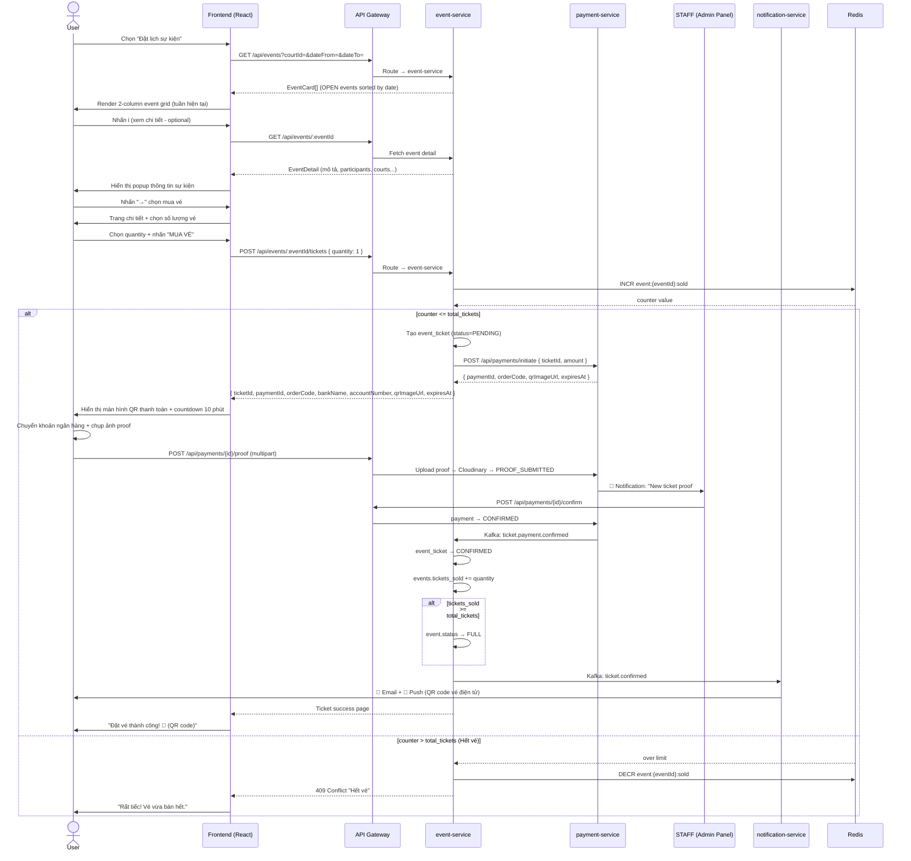
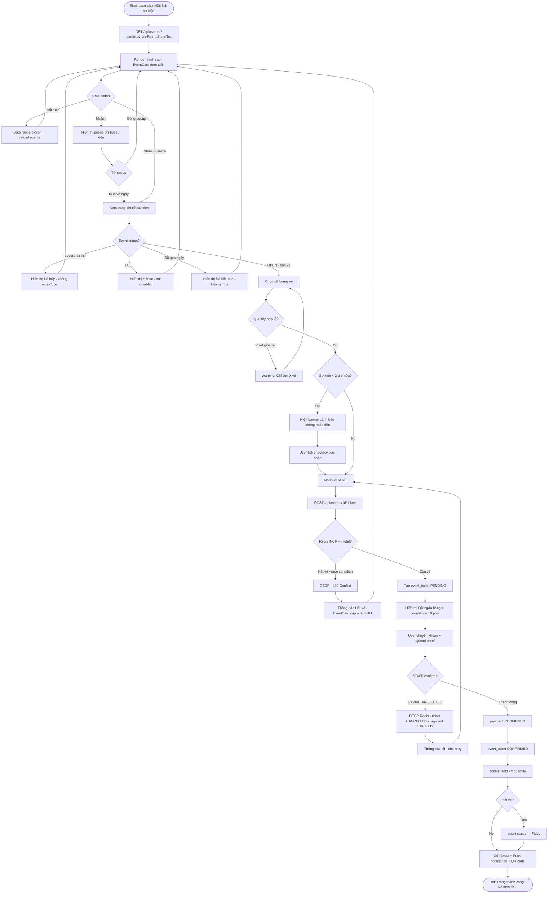

# 📋 Use Case: Đặt Lịch Sự Kiện (Event Booking)

---

## 1. Use Case Overview

| Field | Detail |
|---|---|
| **Use Case ID** | UC-BOOKING-02 |
| **Use Case Name** | Đặt Lịch Sự Kiện |
| **English Name** | Event Booking — Buy Ticket |
| **Module** | Event / Booking |
| **Priority** | High |
| **Actor(s)** | User (primary), Staff/Admin (secondary — tạo event), payment-service (secondary — Bank QR + STAFF confirm), Notification Service (secondary) |
| **Trigger** | User chọn **"Đặt lịch sự kiện"** từ modal **"Chọn hình thức đặt"** |

---

## 2. Actors

| Actor | Role |
|---|---|
| **User** | Khách hàng đã đăng nhập, muốn tham gia sự kiện pickleball/cầu lông |
| **Staff / Admin** | Người tạo và quản lý sự kiện trên hệ thống |
| **payment-service** | Hiển thị QR ngân hàng, nhận proof upload, STAFF xác nhận thủ công |
| **Notification Service** | Gửi email/push notification xác nhận vé |

---

## 3. Preconditions

- ✅ User đã **đăng nhập** (JWT hợp lệ, role = USER hoặc COACH)
- ✅ User đã **chọn court** cụ thể (`courtId` xác định)
- ✅ Có ít nhất **1 sự kiện OPEN** trong khoảng tuần hiện tại
- ✅ Sự kiện còn **vé chưa bán hết** (`tickets_sold < total_tickets`)

---

## 4. Postconditions

### Success
- 🎫 `event_tickets` được tạo với `status = CONFIRMED` trong `event_db`
- 📌 `events.tickets_sold` tăng lên theo số vé đã mua
- 💳 `payments` được ghi nhận `status = CONFIRMED` trong `payment_db`
- 📧 User nhận **email + push notification** xác nhận vé
- 📱 Vé hiển thị trong **Dashboard** của user (mục "Sự kiện của tôi")
- 🗓️ Slot trên timeline grid hiển thị màu **EVENT (tím)** cho sân liên quan

### Failure / Rollback
- 🔁 `event_tickets` bị hủy hoặc không được tạo
- 🔁 `events.tickets_sold` không tăng (hoặc giảm nếu đã tăng)
- 🔁 Redis atomic counter `DECR` nếu đã `INCR`
- 🔁 Payment bị `status = EXPIRED` (hết giờ upload) hoặc `REJECTED` (STAFF từ chối)

---

## 5. Main Success Flow

```
Bước  Actor           Hành động
───────────────────────────────────────────────────────────────────────────
 1.   User            Mở trang chi tiết sân → nhấn nút "ĐẶT LỊCH"
 2.   System          Hiển thị modal "Chọn hình thức đặt" (2 options)
 3.   User            Chọn "Đặt lịch sự kiện" (badge 🆕 New)
                      → Navigate đến /courts/:courtId/booking/events
 4.   System          Load danh sách sự kiện:
                        • Gọi GET /api/events?courtId=&dateFrom=&dateTo=
                        • Default: tuần hiện tại (04/06 – 10/06)
                        • Render 2-column grid các EventCard
 5.   User            Xem danh sách sự kiện theo tuần
                        • Mỗi card hiển thị: #ID, tên sự kiện, ngày,
                          khung giờ, sân, môn thể thao, skill range,
                          số vé (đã bán/tổng), giá/vé
 6.   User            (Tùy chọn) Nhấn ℹ️ để xem chi tiết sự kiện
 7.   User            Nhấn "→" (arrow button) trên EventCard muốn đặt
 8.   System          Navigate đến trang chi tiết sự kiện
                        • Gọi GET /api/events/:eventId
                        • Hiển thị đầy đủ: mô tả, luật chơi,
                          ban tổ chức, bản đồ sân, danh sách người tham gia
 9.   User            Chọn số lượng vé (mặc định = 1)
10.   User            Nhấn "MUA VÉ / ĐĂNG KÝ THAM GIA"
11.   System          Validate:
                        • User chưa mua vé sự kiện này
                        • Còn đủ số vé theo yêu cầu
                        • Sự kiện vẫn status = OPEN
12.   System          Gọi POST /api/events/:eventId/tickets { quantity }
                        • Redis INCR atomic counter: event:{eventId}:sold
                        • Kiểm tra counter <= total_tickets
                        • Tạo event_ticket: status = PENDING
                        • Gọi POST /api/payments/initiate
                        → Trả về { ticketId, paymentId, orderCode, bankName,
                                     accountNumber, qrImageUrl, expiresAt }
13.   System          Hiển thị màn hình thanh toán QR:
                        • Bank info (tên, số TK, ngân hàng) + QR Code
                        • Số tiền + nội dung chuyển khoản = orderCode
                        • ⏱ Countdown 10 phút
                        • Upload zone: "Ảnh xác nhận chuyển khoản (*)"
14.   User            Chuyển khoản + upload ảnh proof
                        → POST /api/payments/{id}/proof
                        → payment.status = PROOF_SUBMITTED
15.   STAFF           Vào Admin Panel → kiểm tra sao kê → click CONFIRM
                        → payment.status = CONFIRMED
16.   System          Xác nhận payment:
                        • payment → CONFIRMED
                        • event_ticket → CONFIRMED
                        • events.tickets_sold += quantity (DB persist)
                        • Publish Kafka event: ticket.confirmed
17.   Notification    Gửi email + push notification:
      Service           "Bạn đã đăng ký thành công sự kiện #2748!"
                        (kèm QR code vé điện tử)
18.   System          Redirect user về trang "Đặt vé thành công"
                        • Hiển thị: mã vé, tên sự kiện, ngày giờ,
                          sân thi đấu, giá đã thanh toán, QR code
```

---

## 6. Alternative Flows

### Alt-A: User thay đổi tuần xem (Bước 5)
```
5a.1  User nhấn date range picker (top-right) → chọn tuần khác
5a.2  System gọi GET /api/events?courtId=&dateFrom=&dateTo= với tuần mới
5a.3  Re-render danh sách EventCard theo tuần được chọn
      → Quay lại bước 5
```

### Alt-B: Sự kiện đã đầy — "Sold Out" (Bước 5)
```
5b.1  EventCard hiển thị overlay "HẾT VÉ" khi tickets_sold >= total_tickets
5b.2  Nút "→" bị disable, không thể nhấn
5b.3  User có thể nhấn ℹ️ để xem thông tin sự kiện (read-only)
      → Không thể tiến hành mua vé
```

### Alt-C: User xem chi tiết trước khi mua (Bước 6)
```
6c.1  User nhấn ℹ️ icon trên EventCard
6c.2  System hiển thị popup/bottom-sheet thông tin:
        • Mô tả sự kiện
        • Danh sách sân tham gia
        • Thể lệ thi đấu / luật chơi
        • Số người đã đăng ký
        • Ban tổ chức
6c.3  User nhấn "×" đóng popup
      → Quay lại bước 5
      hoặc
6c.4  User nhấn "Mua vé ngay" trong popup
      → Chuyển đến bước 8
```

### Alt-D: User mua nhiều hơn 1 vé (Bước 9)
```
9d.1  User tăng số lượng vé (stepper: 1 → 2 → ...)
9d.2  System kiểm tra: quantity <= (total_tickets - tickets_sold)
9d.3  Cập nhật tổng tiền = quantity × price_per_ticket
9d.4  Nếu quantity > available → show warning "Chỉ còn X vé"
      → Tiếp tục từ bước 10 với quantity hợp lệ
```

### Alt-E: Sự kiện sắp diễn ra trong vài giờ tới (Bước 8)
```
8e.1  System phát hiện event_date - now() < 2 giờ
8e.2  Hiển thị banner cảnh báo màu đỏ:
       "⚠️ Sự kiện bắt đầu sau ít hơn 2 giờ.
        Vé đã mua không được hoàn tiền."
8e.3  User phải tick checkbox "Tôi đã hiểu" trước khi mua
      → Tiếp tục từ bước 9
```

---

## 7. Exception Flows

### Exc-1: Hết vé trong lúc đang thanh toán (Race Condition)
```
12e.1 Redis INCR trả về counter > total_tickets
12e.2 System DECR counter ngay lập tức (rollback)
12e.3 Trả về 409 CONFLICT
12e.4 Frontend hiển thị: "Rất tiếc! Vé sự kiện này vừa được
       bán hết. Bạn có muốn xem sự kiện khác không?"
12e.5 EventCard cập nhật hiển thị "HẾT VÉ"
      → Kết thúc flow
```

### Exc-2: User đã mua vé sự kiện này rồi
```
12e.1 System kiểm tra event_tickets WHERE event_id=X AND user_id=Y
12e.2 Phát hiện vé đã tồn tại (status = CONFIRMED)
12e.3 Trả về 400 BAD REQUEST
12e.4 Hiển thị: "Bạn đã đăng ký sự kiện này. Xem vé của bạn
       trong Dashboard."
      → Kết thúc flow, redirect về Dashboard
```

### Exc-3: Sự kiện bị hủy bởi Staff/Admin sau khi user đang xem
```
7e.1  Trong khi user đang ở trang chi tiết sự kiện,
       Staff/Admin cancel sự kiện (PATCH /api/events/:id → CANCELLED)
7e.2  User nhấn "MUA VÉ" → System gọi POST /api/events/:id/tickets
7e.3  System kiểm tra event.status != OPEN → trả về 422
7e.4  Hiển thị: "Sự kiện này đã bị hủy bởi ban tổ chức."
7e.5  Nếu user đã mua vé trước đó → tự động hoàn tiền (REFUNDED)
      → Kết thúc flow
```

### Exc-4: Thanh toán thất bại (EXPIRED hoặc REJECTED bởi STAFF)
```
15e.1 Proof không upload kịp 10 phút → payment EXPIRED
      hoặc STAFF kiểm tra không khớp sao kê → REJECT
15e.2 payment-service: payment → EXPIRED
15e.3 event-service compensate:
        • event_ticket → CANCELLED
        • Redis DECR counter
        • events.tickets_sold không tăng
15e.4 Hiển thị thông báo:
       "Thanh toán không được xác nhận.
        Vé chưa được xác nhận. Vui lòng thử lại."
      → Quay lại bước 10
```

### Exc-5: Sự kiện không còn trong thời gian đăng ký
```
10e.1 event_date đã qua (sự kiện diễn ra hôm qua/hôm nay quá giờ)
10e.2 System trả về 403 FORBIDDEN: "Thời gian đăng ký đã kết thúc"
10e.3 Nút "MUA VÉ" bị disabled, hiển thị "Đã kết thúc đăng ký"
      → Kết thúc flow
```

### Exc-6: Lỗi mạng / server timeout
```
*e.1  API call thất bại (network error hoặc 5xx)
*e.2  Frontend hiển thị toast: "Có lỗi xảy ra. Vui lòng thử lại."
*e.3  Cho phép retry tại bước vừa thất bại (retry button)
```

---

## 8. Business Rules

| ID | Rule |
|---|---|
| BR-01 | Chỉ role **USER** và **COACH** mới được mua vé |
| BR-02 | **STAFF / ADMIN** không được mua vé (họ là ban tổ chức) |
| BR-03 | Mỗi user chỉ được mua **tối đa 4 vé** cho 1 sự kiện |
| BR-04 | Không được mua vé nếu `event.status != OPEN` |
| BR-05 | Không được mua vé sau khi sự kiện đã **bắt đầu** |
| BR-06 | Vé không được hoàn tiền nếu sự kiện bắt đầu trong **< 2 giờ** |
| BR-07 | Vé được hoàn tiền **100%** nếu sự kiện bị **BTC hủy** |
| BR-08 | Khi `tickets_sold >= total_tickets` → event.status tự động → `FULL` |
| BR-09 | Skill range phải nằm trong giới hạn sự kiện (e.g. DUPR 1.0–2.5) |
| BR-10 | Counter vé sử dụng **Redis atomic INCR** để tránh race condition |

---

## 9. Sequence Diagram



---

## 10. Activity Diagram



---

## 11. UI Screens Summary

| # | Screen | Route | Trigger |
|---|---|---|---|
| 1 | Modal chọn hình thức đặt | `/courts/:id` | Nhấn "ĐẶT LỊCH" |
| 2 | Danh sách sự kiện | `/courts/:id/booking/events` | Chọn "Đặt lịch sự kiện" |
| 3 | Popup chi tiết sự kiện | *(overlay trên màn hình 2)* | Nhấn ℹ️ |
| 4 | Chi tiết sự kiện + mua vé | `/events/:eventId` | Nhấn "→" trên EventCard |
| 5 | Thanh toán Bank QR | `/payments/:paymentId` | Nhấn "MUA VÉ" → hiển thị QR + countdown |
| 6 | Vé thành công + QR | `/tickets/:ticketId/success` | STAFF confirm → payment CONFIRMED |
| 7 | Thanh toán hết hạn | `/tickets/expired` | Proof EXPIRED hoặc REJECTED |

---

## 12. Event Card UI Breakdown

```
┌─────────────────────────────────────────────────────┐
│  #2748: [Xé vé] - SOCIAL              04/06/2026   │
│  19h – 22h │ Sân 1 - Sân 2                         │
│                                                      │
│  🏓 Pickleball    ╔════════╗                        │
│                   ║ 1.0→2.5║  ← Skill range badge  │
│                   ╚════════╝                        │
│                                                      │
│  [  0/16  ]                    ℹ️                  │
│  └── tickets_sold/total_tickets                     │
│                                                      │
│                              ╔══════════╗           │
│                              ║  60k/Vé →║           │
│                              ╚══════════╝           │
└─────────────────────────────────────────────────────┘

Màu nền: Dark green (#1b5e20) khi OPEN
         Grey overlay khi FULL / CANCELLED
```

---

## 13. Backend Services Involved

| Service | Trách nhiệm |
|---|---|
| `event-service` | Quản lý events, bán vé, atomic counter Redis |
| `payment-service` | Tạo PENDING payment, trả về bank QR info, nhận proof upload, STAFF confirm |
| `notification-service` | Gửi email + push notification + QR code vé |
| `court-service` | Cập nhật time_slots status → EVENT khi event được tạo |
| **Redis** | Atomic counter: `event:{eventId}:sold` (INCR/DECR) |
| **Kafka** | `ticket.payment.confirmed` → `ticket.confirmed` → notification · `payment.proof.submitted` → STAFF notify |

---

## 14. Kafka Events

| Topic | Producer | Consumer | Mục đích |
|---|---|---|---|
| `ticket.payment.confirmed` | payment-service | event-service | STAFF xác nhận proof → vé CONFIRMED |
| `ticket.confirmed` | event-service | notification-service | Kích hoạt gửi email + push |
| `event.cancelled` | event-service | payment-service, notification-service | Queue hoàn tiền thủ công + thông báo hủy |
| `event.sold.out` | event-service | court-service | Cập nhật hiển thị trên timeline grid |
| `payment.proof.submitted` | payment-service | notification-service | Thông báo STAFF có proof vé mới chờ review |

---

## 15. So Sánh Với UC-BOOKING-01 (Đặt lịch ngày trực quan)

| Tiêu chí | UC-01: Trực quan | UC-02: Sự kiện |
|---|---|---|
| **Đối tượng** | Khách tự đặt sân riêng | Khách tham gia sự kiện cộng đồng |
| **Chọn sân** | User tự chọn sân + giờ trên grid | BTC cố định sân sẵn |
| **Chọn giờ** | User tự chọn khung giờ | BTC cố định khung giờ |
| **Đơn vị thanh toán** | Theo giờ thuê sân | Theo vé (ticket) |
| **Tối đa người** | Tùy sân | Giới hạn bởi `total_tickets` |
| **Skill filter** | Không | Có (DUPR range) |
| **Hoàn tiền** | Theo policy sân | Không hoàn nếu < 2h trước giờ |
| **Redis** | `lock:slot:{slotId}` SETNX TTL 5s | `event:{eventId}:sold` INCR/DECR |
| **Kafka key** | `booking.slot.confirmed` | `ticket.payment.confirmed` |
| **STAFF role** | Không tham gia » flow thanh toán | Xác nhận proof vé trong admin panel |
