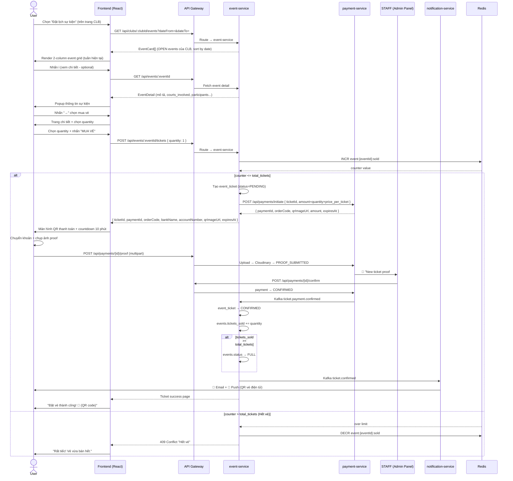

# 📋 Use Case: Đặt Lịch Sự Kiện (Event Booking)

> Đồng bộ với **ERD mới**: `events` thuộc **`club_id`** (CLB/venue), liệt kê **`courts_involved`** (tên Sân tham gia);
> giá vé `price_per_ticket` (decimal), `event_tickets.total_paid` (decimal). Thanh toán = **Bank QR + proof + STAFF confirm** (KHÔNG VNPay).

---

## 1. Use Case Overview

| Field | Detail |
|---|---|
| **Use Case ID** | UC-BOOKING-02 |
| **Use Case Name** | Đặt Lịch Sự Kiện |
| **English Name** | Event Booking — Buy Ticket |
| **Module** | Event / Booking |
| **Priority** | High |
| **Actor(s)** | User (primary), Staff/Admin (tạo event), payment-service (Bank QR + STAFF confirm), notification-service |
| **Trigger** | User chọn **"Đặt lịch sự kiện"** từ modal **"Chọn hình thức đặt"** trên trang CLB |

---

## 2. Actors

| Actor | Role |
|---|---|
| **User** | Khách đã đăng nhập, muốn tham gia sự kiện pickleball/cầu lông của CLB |
| **Staff / Admin** | Người tạo & quản lý `events` (gắn `club_id`, chọn `courts_involved`) |
| **payment-service** | Hiển thị QR ngân hàng, nhận proof upload, STAFF xác nhận thủ công |
| **notification-service** | Gửi email/push xác nhận vé (kèm QR vé điện tử) |
| **court-service** | Set `time_slots.status=EVENT` + `event_id` cho các sân tham gia khi event được tạo |

---

## 3. Preconditions

- ✅ User đã **đăng nhập** (JWT hợp lệ, role = USER hoặc COACH, `is_email_verified=true`)
- ✅ User đang ở trang một **CLB** (`clubId` xác định)
- ✅ Có ít nhất **1 sự kiện OPEN** của CLB trong khoảng tuần hiện tại
- ✅ Sự kiện còn **vé** (`tickets_sold < total_tickets`)

---

## 4. Postconditions

### Success
- 🎫 `event_tickets` được tạo `status = CONFIRMED` trong `event_db` (`quantity`, `total_paid` decimal)
- 📌 `events.tickets_sold += quantity`
- 💳 `payments` (`payment_type=EVENT_TICKET`) `status = CONFIRMED`; link ngược qua `event_tickets.payment_id`
- 📧 User nhận **email + push** xác nhận vé; vé hiện trong **Dashboard** ("Sự kiện của tôi")
- 🗓️ Slot trên timeline grid của các sân tham gia hiển thị màu **EVENT (tím)** (`time_slots.status=EVENT`)

### Failure / Rollback
- 🔁 `event_tickets` không được tạo (hoặc → CANCELLED)
- 🔁 Redis atomic counter `DECR event:{eventId}:sold` nếu đã `INCR`
- 🔁 `events.tickets_sold` không tăng
- 🔁 `payments.status = EXPIRED` (timeout) hoặc bị STAFF `REJECT`

---

## 5. Main Success Flow

```
Bước  Actor           Hành động
───────────────────────────────────────────────────────────────────────────
 1.   User            Trên trang CLB → nhấn "ĐẶT LỊCH"
 2.   System          Hiển thị modal "Chọn hình thức đặt" (2 options)
 3.   User            Chọn "Đặt lịch sự kiện" (badge 🆕)
                      → Navigate đến /clubs/:clubId/booking/events
 4.   System          Load danh sách sự kiện của CLB:
                        • GET /api/clubs/:clubId/events?dateFrom=&dateTo=
                        • Default: tuần hiện tại
                        • Render 2-column grid các EventCard
 5.   User            Xem danh sách sự kiện theo tuần
                        • Mỗi card: #event_number, title, event_date,
                          khung giờ, courts_involved (Sân 1 - Sân 2), sport,
                          skill range (skill_min→skill_max DUPR),
                          vé (tickets_sold/total_tickets), price_per_ticket
 6.   User            (Tùy chọn) Nhấn ℹ️ xem chi tiết sự kiện
 7.   User            Nhấn "→" trên EventCard muốn đặt
 8.   System          Navigate trang chi tiết sự kiện
                        • GET /api/events/:eventId
                        • Hiển thị: mô tả, thể lệ, BTC, các sân tham gia,
                          bản đồ CLB, danh sách người tham gia
 9.   User            Chọn số lượng vé (mặc định = 1)
10.   User            Nhấn "MUA VÉ / ĐĂNG KÝ THAM GIA"
11.   System          Validate:
                        • User chưa mua vé sự kiện này
                        • Còn đủ vé theo quantity
                        • event.status = OPEN
12.   System          POST /api/events/:eventId/tickets { quantity }
                        • Redis INCR event:{eventId}:sold (by quantity)
                        • Kiểm tra counter <= total_tickets
                        • Tạo event_ticket: status = PENDING
                        • POST /api/payments/initiate { ticketId, amount=quantity×price_per_ticket }
                        → { ticketId, paymentId, orderCode, bankName,
                            accountNumber, accountName, qrImageUrl, amount, expiresAt }
13.   System          Hiển thị màn hình thanh toán Bank QR:
                        • Bank info + QR Code
                        • Số tiền + nội dung chuyển khoản = orderCode
                        • ⏱ Countdown 10 phút
                        • Upload zone "Ảnh xác nhận chuyển khoản (*)"
14.   User            Chuyển khoản + upload proof
                        → POST /api/payments/{id}/proof → payment.status = PROOF_SUBMITTED
                        → Kafka payment.proof.submitted → STAFF
15.   STAFF           Admin Panel → đối chiếu sao kê → CONFIRM
                        → payment.status = CONFIRMED
16.   System          Xác nhận:
                        • payment → CONFIRMED
                        • Kafka ticket.payment.confirmed → event-service
                        • event_ticket → CONFIRMED
                        • events.tickets_sold += quantity (DB persist)
                        • Nếu tickets_sold >= total_tickets → events.status → FULL
                        • Kafka ticket.confirmed → notification-service
17.   Notification    Email + push: "Bạn đã đăng ký thành công sự kiện #2748!"
      Service          (kèm QR code vé điện tử)
18.   System          Redirect "Đặt vé thành công"
                        • mã vé, tên sự kiện, ngày giờ, các sân, giá đã thanh toán, QR vé
```

---

## 6. Alternative Flows

### Alt-A: User đổi tuần xem (Bước 5)
```
5a.1  User chọn tuần khác từ date range picker
5a.2  GET /api/clubs/:clubId/events?dateFrom=&dateTo= với tuần mới
5a.3  Re-render EventCard → quay lại bước 5
```

### Alt-B: Sự kiện đã đầy — "Sold Out" (Bước 5)
```
5b.1  EventCard hiển thị overlay "HẾT VÉ" khi tickets_sold >= total_tickets (status=FULL)
5b.2  Nút "→" disabled; user chỉ nhấn ℹ️ để xem read-only
```

### Alt-C: User xem chi tiết trước khi mua (Bước 6)
```
6c.1  Nhấn ℹ️ → popup: mô tả, courts_involved, thể lệ, số người đăng ký, BTC
6c.2  "×" đóng → bước 5, hoặc "Mua vé ngay" → bước 8
```

### Alt-D: User mua nhiều hơn 1 vé (Bước 9)
```
9d.1  Stepper tăng quantity (1 → 2 → ...)
9d.2  Kiểm tra quantity <= (total_tickets - tickets_sold) và <= 4 (BR-03)
9d.3  Tổng tiền = quantity × price_per_ticket
9d.4  Nếu vượt → warning "Chỉ còn X vé" → bước 10 với quantity hợp lệ
```

### Alt-E: Sự kiện sắp diễn ra < 2 giờ (Bước 8)
```
8e.1  event_date/start_time - now() < 2 giờ
8e.2  Banner đỏ: "⚠️ Sự kiện bắt đầu sau < 2 giờ. Vé không được hoàn tiền."
8e.3  User tick "Tôi đã hiểu" trước khi mua → bước 9
```

---

## 7. Exception Flows

### Exc-1: Hết vé trong lúc thanh toán (Race Condition)
```
12e.1 Redis INCR trả về counter > total_tickets
12e.2 System DECR ngay (rollback) → 409 CONFLICT
12e.3 FE: "Rất tiếc! Vé vừa bán hết." → EventCard cập nhật "HẾT VÉ"
```

### Exc-2: User đã mua vé sự kiện này rồi
```
12e.1 Kiểm tra event_tickets WHERE event_id=X AND user_id=Y AND status=CONFIRMED
12e.2 Tồn tại → 400 BAD REQUEST → "Bạn đã đăng ký sự kiện này. Xem vé trong Dashboard."
```

### Exc-3: Sự kiện bị Staff/Admin hủy khi user đang xem
```
7e.1  Staff cancel: PATCH /api/events/:id → CANCELLED (Kafka event.cancelled)
7e.2  User nhấn "MUA VÉ" → POST .../tickets → kiểm tra status != OPEN → 422
7e.3  "Sự kiện này đã bị hủy bởi ban tổ chức."
7e.4  Nếu user đã mua trước đó → escrow/payment queue refund (manual_refunds) → STAFF hoàn tiền tay
```

### Exc-4: Thanh toán thất bại (EXPIRED hoặc REJECTED)
```
15e.1 Proof không upload kịp 10 phút → EXPIRED; hoặc STAFF REJECT (sao kê không khớp)
15e.2 payment → EXPIRED
15e.3 event-service compensate: event_ticket → CANCELLED · Redis DECR · tickets_sold không tăng
15e.4 "Thanh toán không được xác nhận. Vui lòng thử lại." → bước 10
```

### Exc-5: Hết thời gian đăng ký
```
10e.1 event_date/start_time đã qua → 403 "Thời gian đăng ký đã kết thúc"
10e.2 Nút "MUA VÉ" disabled, hiển thị "Đã kết thúc đăng ký"
```

### Exc-6: Lỗi mạng / server timeout
```
*e.1  API fail (network/5xx) → toast "Có lỗi xảy ra. Vui lòng thử lại." + retry
```

---

## 8. Business Rules

| ID | Rule |
|---|---|
| BR-01 | Chỉ role **USER** và **COACH** mới được mua vé |
| BR-02 | **STAFF / ADMIN** không được mua vé (họ là BTC) |
| BR-03 | Mỗi user mua **tối đa 4 vé** cho 1 sự kiện |
| BR-04 | Không mua vé nếu `events.status != OPEN` |
| BR-05 | Không mua vé sau khi sự kiện đã **bắt đầu** |
| BR-06 | Vé không hoàn tiền nếu sự kiện bắt đầu trong **< 2 giờ** |
| BR-07 | Vé hoàn **100%** nếu sự kiện bị **BTC hủy** (qua `manual_refunds` — STAFF chuyển khoản tay) |
| BR-08 | Khi `tickets_sold >= total_tickets` → `events.status` tự động → `FULL` |
| BR-09 | Skill người mua nên nằm trong `[skill_min, skill_max]` (DUPR) — cảnh báo, không chặn cứng |
| BR-10 | Counter vé dùng **Redis atomic INCR** (`event:{eventId}:sold`) chống race condition |
| BR-11 | `events` gắn **`club_id`** (CLB tổ chức) + `courts_involved` (JSON tên sân); slot các sân đó set `status=EVENT` |
| BR-12 | Giá vé `price_per_ticket` và `event_tickets.total_paid` là **decimal** (VND) |

---

## 9. Sequence Diagram



---

## 10. Activity Diagram

```mermaid
flowchart TD
    A([Start: User chọn Đặt lịch sự kiện]) --> B[GET /api/clubs/:clubId/events]
    B --> C[Render EventCard theo tuần]

    C --> D{User action}
    D -->|Đổi tuần| E[Date range picker → reload events]
    E --> C
    D -->|Nhấn ℹ️| F[Popup chi tiết sự kiện]
    F --> G{Từ popup}
    G -->|Đóng| C
    G -->|Mua vé ngay| H
    D -->|Nhấn → arrow| H[Trang chi tiết sự kiện]

    H --> I{event.status?}
    I -->|CANCELLED| J[Đã hủy — không mua]
    J --> C
    I -->|FULL| K[Hết vé — disabled]
    K --> C
    I -->|Đã qua giờ| L[Đã kết thúc — không mua]
    L --> C
    I -->|OPEN - còn vé| M[Chọn quantity]

    M --> N{quantity hợp lệ? (<= còn vé & <=4)}
    N -->|Vượt| O[Warning: Chỉ còn X vé]
    O --> M
    N -->|OK| P{Sự kiện < 2 giờ?}
    P -->|Yes| Q[Banner không hoàn tiền + tick xác nhận]
    Q --> S
    P -->|No| S[Nhấn MUA VÉ]

    S --> T[POST /api/events/:id/tickets]
    T --> U{Redis INCR <= total?}
    U -->|Hết vé - race| V[DECR - 409 Conflict]
    V --> W[Thông báo Hết vé — EventCard FULL]
    W --> C
    U -->|Còn vé| X[event_ticket PENDING]
    X --> Y[QR ngân hàng + countdown 10 phút]
    Y --> Z[User chuyển khoản + upload proof]

    Z --> AA{STAFF confirm?}
    AA -->|EXPIRED/REJECTED| AB[DECR Redis · ticket CANCELLED · payment EXPIRED]
    AB --> AC[Thông báo lỗi — cho retry]
    AC --> S
    AA -->|Confirm| AD[payment CONFIRMED]
    AD --> AE[event_ticket CONFIRMED]
    AE --> AF[tickets_sold += quantity]
    AF --> AG{Hết vé?}
    AG -->|Yes| AH[events.status → FULL]
    AG -->|No| AI
    AH --> AI[Email + Push + QR vé]
    AI --> AJ([End: Trang thành công — Vé điện tử 🎫])
```

---

## 11. UI Screens Summary

| # | Screen | Route | Trigger |
|---|---|---|---|
| 1 | Modal chọn hình thức đặt | `/clubs/:id` | Nhấn "ĐẶT LỊCH" |
| 2 | Danh sách sự kiện | `/clubs/:id/booking/events` | Chọn "Đặt lịch sự kiện" |
| 3 | Popup chi tiết sự kiện | *(overlay trên màn 2)* | Nhấn ℹ️ |
| 4 | Chi tiết sự kiện + mua vé | `/events/:eventId` | Nhấn "→" trên EventCard |
| 5 | Thanh toán Bank QR | `/payments/:paymentId` | Nhấn "MUA VÉ" |
| 6 | Vé thành công + QR | `/tickets/:ticketId/success` | STAFF confirm → CONFIRMED |
| 7 | Thanh toán hết hạn | `/tickets/expired` | Proof EXPIRED hoặc REJECTED |

---

## 12. Event Card UI Breakdown

```
┌─────────────────────────────────────────────────────┐
│  #2748: [Xé vé] - SOCIAL              04/06/2026   │
│  19h – 22h │ Sân 1 - Sân 2   ← events.courts_involved│
│                                                      │
│  🏓 Pickleball    ╔════════╗                        │
│                   ║ 1.0→2.5║  ← skill_min→skill_max  │
│                   ╚════════╝                        │
│                                                      │
│  [  0/16  ]                    ℹ️                  │
│  └── tickets_sold/total_tickets                     │
│                              ╔══════════╗           │
│                              ║  60k/Vé →║  ← price_per_ticket
│                              ╚══════════╝           │
└─────────────────────────────────────────────────────┘
Nền: Dark green (#1b5e20) khi OPEN · Grey overlay khi FULL/CANCELLED
```

---

## 13. Backend Services Involved

| Service | Trách nhiệm |
|---|---|
| `event-service` | Sở hữu `events` (gắn `club_id`, `courts_involved`) + `event_tickets`; atomic counter Redis |
| `payment-service` | PENDING payment (`payment_type=EVENT_TICKET`), bank QR, proof upload, STAFF confirm |
| `court-service` | Set `time_slots.status=EVENT` + `event_id` cho các sân tham gia khi event tạo/hủy |
| `notification-service` | Email + push + QR vé điện tử |
| **Redis** | `event:{eventId}:sold` (INCR/DECR) |
| **Kafka** | `ticket.payment.confirmed` → `ticket.confirmed` · `event.sold.out`/`event.created` → court-service · `payment.proof.submitted` → STAFF |

---

## 14. Kafka Events

| Topic | Producer | Consumer | Mục đích |
|---|---|---|---|
| `ticket.payment.confirmed` | payment-service | event-service | STAFF confirm proof → vé CONFIRMED |
| `ticket.confirmed` | event-service | notification-service | Gửi email + push + QR vé |
| `event.created` | event-service | court-service | Set slots các sân (`courts_involved`) → `status=EVENT` + `event_id` |
| `event.cancelled` | event-service | payment-service, notification-service, court-service | Queue refund thủ công + thông báo + trả slot về AVAILABLE |
| `event.sold.out` | event-service | court-service | Cập nhật hiển thị timeline grid |
| `payment.proof.submitted` | payment-service | notification-service | Thông báo STAFF có proof vé mới |

---

## 15. So Sánh Với UC-BOOKING-01 (Đặt lịch ngày trực quan)

| Tiêu chí | UC-01: Trực quan | UC-02: Sự kiện |
|---|---|---|
| **Đối tượng** | Khách tự đặt sân riêng | Khách tham gia sự kiện cộng đồng |
| **Chọn sân/giờ** | User tự chọn ô 30' trên grid (nhiều sân) | BTC cố định sân (`courts_involved`) + khung giờ |
| **Đơn vị thanh toán** | Theo ô 30' (`booking_items`, tra `court_pricing_rules`) | Theo vé (`price_per_ticket`) |
| **Bản ghi** | `bookings` (header) + `booking_items` | `event_tickets` |
| **Tối đa người** | Theo số ô chọn | Giới hạn `total_tickets` |
| **Skill filter** | Không | Có (DUPR `skill_min`→`skill_max`) |
| **Hoàn tiền** | Theo `earliest_start_time` (>24h/2-24h/<2h) | Không hoàn nếu < 2h; 100% nếu BTC hủy |
| **Redis** | `lock:slot:{slotId}` SETNX TTL 5s (mỗi ô) | `event:{eventId}:sold` INCR/DECR |
| **Kafka key** | `booking.slot.confirmed` | `ticket.payment.confirmed` |
| **Thanh toán** | Bank QR + STAFF confirm | Bank QR + STAFF confirm |
| **Gắn với** | `club_id` + nhiều `court_id` (sân) | `club_id` + `courts_involved` |
