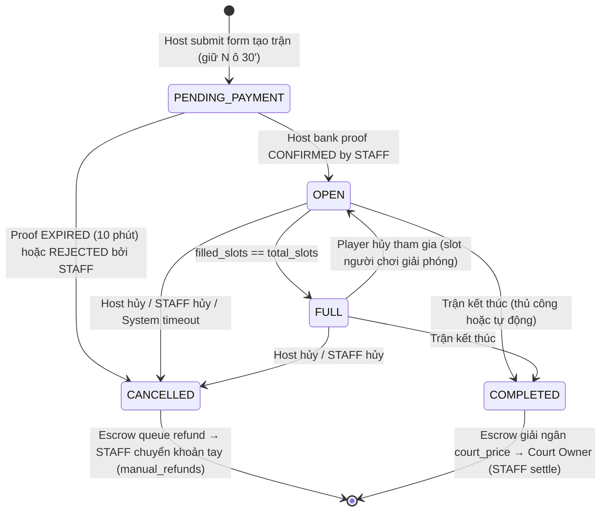
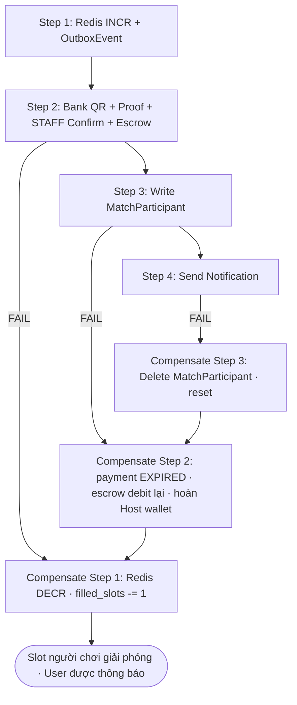
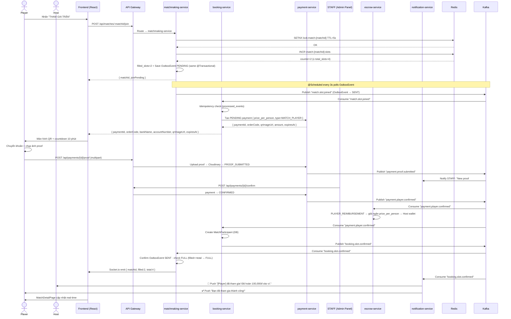
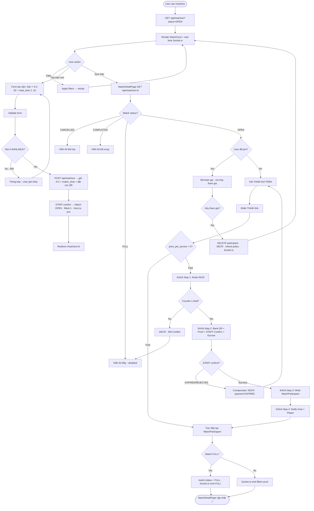

# 📋 Use Case: Matchmaking — Ghép Trận Đấu

> Đồng bộ với **ERD mới**: `matches` gắn **`club_id` + `court_id`** (1 Sân) và giữ **N ô 30'** qua bảng **`match_slots`**
> (1 trận 2 tiếng = 4 ô). `court_price` = **snapshot** từ `court_pricing_rules` lúc tạo. Thanh toán + hoàn tiền =
> **Bank QR + proof + STAFF confirm / `manual_refunds`** — **KHÔNG VNPay**.
>
> ⚠️ Phân biệt 2 khái niệm "slot":
> - **`total_slots` / `filled_slots`** = số **người chơi** (chẵn 2..16) — đếm bằng Redis `match:{matchId}:slots`.
> - **`match_slots`** (bảng) = các **ô thời gian 30'** trên Sân mà trận giữ — khoá bằng Redis `lock:slot:{slotId}`.

---

## 1. Use Case Overview

| Field | Detail |
|---|---|
| **Use Case Group** | MATCHMAKING |
| **Module** | Matchmaking Service |
| **Priority** | High — Core Feature |
| **Related Services** | `matchmaking-service`, `booking-service`, `payment-service`, `escrow-service`, `notification-service`, `court-service` |
| **Pattern** | Saga Pattern + Outbox Pattern + Distributed Lock |

### Sub Use Cases

| ID | Tên | Mô tả |
|---|---|---|
| UC-MATCH-01 | Tạo Trận Đấu (Create Match) | Host tạo trận mở, **đặt cọc toàn bộ `court_price`** trước |
| UC-MATCH-02 | Duyệt Danh Sách Trận (Browse Matches) | User tìm kiếm và lọc trận phù hợp |
| UC-MATCH-03 | Tham Gia Trận Đấu (Join Match) | Player đăng ký + trả `price_per_person` (Saga) |
| UC-MATCH-04 | Hủy Trận Đấu (Cancel Match) | Host / STAFF / ADMIN / Scheduler hủy trận |

---

## 2. Actors

| Actor | Role |
|---|---|
| **Host (User)** | Người tạo trận — chọn Sân + khung giờ, **thanh toán toàn bộ `court_price` trước** khi match OPEN |
| **Player (User)** | Người tham gia — trả `price_per_person` (vào Escrow → hoàn dần cho Host) |
| **Staff / Admin** | Quản lý + có quyền hủy bất kỳ trận; **xác nhận proof** + **chuyển khoản hoàn tiền thủ công** |
| **System Scheduler** | Tự hủy trận PENDING_PAYMENT quá **10 phút** (countdown hết hạn) |
| **payment-service** | Hiển thị QR ngân hàng · nhận proof upload · STAFF xác nhận thủ công |
| **escrow-service** | Giữ tiền trung gian: Host deposit → Player reimbursement → Settlement Court Owner / Refund |
| **notification-service** | Gửi thông báo cho Host và Player |

---

## 3. State Machine — `matches.status`



> **💡 Prepay + Escrow Model:**
> Host **đặt cọc toàn bộ `court_price`** (snapshot từ `court_pricing_rules` × N ô 30') trước khi OPEN.
> Tiền giữ trong **Escrow** — Court Owner chỉ nhận khi match COMPLETED. Mỗi Player join, tiền vào Escrow và **hoàn dần cho Host**.

---

## UC-MATCH-01: Tạo Trận Đấu (Create Match)

### 1.1 Thông tin Use Case

| Field | Detail |
|---|---|
| **Use Case ID** | UC-MATCH-01 |
| **Actor chính** | Host (User đã đăng nhập, `is_email_verified=true`) |
| **Trigger** | User nhấn "Tạo trận mới" trên MatchesPage |
| **Preconditions** | Đã đăng nhập · Đã chọn được **Sân** + **khung giờ** (N ô 30') AVAILABLE |
| **Postconditions (Success)** | Match `status=OPEN` · `match_slots` giữ N ô · slot Sân RESERVED · Host là participant đầu |

### 1.2 Main Success Flow

```
Bước  Actor     Hành động
────────────────────────────────────────────────────────────────────
 1.   Host      Vào /matches → nhấn "Tạo trận mới"
 2.   System    Hiển thị form tạo trận:
                  • Chọn Sân (court) trong CLB (search/filter)
                  • Chọn ngày & khung giờ từ timeline grid (chọn N ô 30')
                    → Hiển thị NGAY: "Giá sân: 400,000 VND"
                      (= Σ giá các ô 30' tra court_pricing_rules, customer_type=WALK_IN)
                  • Môn (Badminton / Pickleball)
                  • Hình thức (Đơn / Đôi / Mix)
                  • Skill required (BEGINNER | INTERMEDIATE | ADVANCED | PRO)
                  • Số người (total_slots): 2 / 4 / 6 / ... / 16 (số chẵn)
                  • Giá/người (price_per_person): tự nhập (VND)
                    → auto-suggest: court_price ÷ total_slots
                    → WARN nếu price_per_person × total_slots < court_price:
                       "⚠️ Tổng thu thấp hơn giá sân. Bạn sẽ bù phần còn lại."
                  • Mô tả thêm (optional)
                  ┌──────────────────────────────────────────────────┐
                  │  💰 TÓM TẮT CHI PHÍ:                            │
                  │  Bạn cần đặt cọc ngay: 400,000 VND (court_price) │
                  │  Sẽ được hoàn lại: 100,000 VND/người join       │
                  │  (tối đa 300,000 VND khi đủ 4 người)            │
                  └──────────────────────────────────────────────────┘
 3.   Host      Điền đầy đủ → nhấn "TẠO TRẬN"
 4.   System    Validate:
                  • Sân tồn tại + N ô 30' đều AVAILABLE
                  • date/giờ >= hiện tại
                  • total_slots chẵn, 2–16
                  • price_per_person >= 0
                  • Cảnh báo (không chặn) nếu price_per_person × total_slots < court_price

──── PHASE 1: TẠO MATCH + GIỮ Ô + ĐẶT CỌC ────────────────────────

 5.   System    Gọi POST /api/matches
                  Body: { clubId, courtId, date, slotIds:[...], sport, format,
                          skillRequired, totalSlots, pricePerPerson, description }
                  Trong 1 @Transactional:
                  • Acquire Redis lock:slot:{slotId} TTL 5s cho TỪNG ô → verify AVAILABLE
                  • Tạo match: status=PENDING_PAYMENT, filled_slots=0, club_id, court_id
                  • Snapshot court_price (Σ giá ô từ court_pricing_rules) vào match
                  • Tạo match_slots (N hàng: match_id + slot_id) — các ô 30' trận giữ
                  • Lưu OutboxEvent "match.created" (PENDING) — cùng @Transactional
                  • Tạo payments: type=MATCH_HOST, status=PENDING, expires_at=NOW()+10min
                  • Acquire Redis lock:slot:{slotId}:match_create TTL 10min cho mỗi ô
                  → Trả về { matchId, paymentInfo }

──── PHASE 1: MÀN HÌNH THANH TOÁN QR ──────────────────────────────

 6.   System    Hiển thị màn hình thanh toán Bank QR:
                  ┌──────────────────────────────────────────────────────┐
                  │ 1. Tài khoản ngân hàng: Tên TK / Số TK / Ngân hàng   │
                  │    [QR Code image]                                   │
                  │ 2. ⚠️ Chuyển khoản [court_price] VND · nội dung #184 │
                  │ 3. ⏱ Đơn còn giữ trong: 09:59 (countdown 10 phút)   │
                  │ 4. [Upload zone: tải hình chuyển khoản (*)]         │
                  │ 5. [XÁC NHẬN] button                                │
                  └──────────────────────────────────────────────────────┘
 7.   Host      Chuyển khoản (nội dung = orderCode) → chụp ảnh → upload proof
                  → POST /api/payments/{id}/proof → payment.status = PROOF_SUBMITTED
 8.   STAFF     Nhận "New proof #184" → Admin Panel → đối chiếu sao kê → CONFIRM
                  → payment.status = CONFIRMED → Kafka payment.host.confirmed
                  → matchmaking-service:
                      • match.status → OPEN
                      • Tạo match_participant (host tự join), filled_slots = 1
                      • Mỗi ô match_slots → time_slot RESERVED + set match_id (qua court-service)
                      • Giải phóng Redis lock:slot:{slotId}:match_create
                      • Confirm OutboxEvent → SENT
                  → escrow-service: ghi HOST_DEPOSIT (HOLDING court_price)

──── PHASE 1 HOÀN TẤT ─────────────────────────────────────────────

 9.   System    Redirect → /matches/:matchId
                  • Badge "OPEN" · "1/4 người"
                  • "💰 Đã đặt cọc 400,000 VND | Đã hoàn: 0 | Còn lại: 400,000 VND"
10.   Notification  Push cho user có skill phù hợp trong khu vực (optional recommendation)
```

### 1.3 Alternative Flows

**Alt-A: Một ô bị chiếm khi đang tạo trận**
```
5a.1  Redis lock:slot:{slotId} fail cho ÍT NHẤT 1 ô
5a.2  Rollback @Transactional + release mọi lock → 409 CONFLICT
5a.3  "Khung giờ này vừa bị giữ. Vui lòng chọn lại."
5a.4  Quay về form, ô đó chuyển RESERVED
```

**Alt-B: Host đặt giá miễn phí (price_per_person = 0)**
```
3b.1  Host nhập price_per_person = 0
3b.2  Host vẫn PHẢI thanh toán toàn bộ court_price (Host bao sân)
3b.3  Player join free (không có bước payment)
3b.4  Escrow giải ngân court_price → Court Owner khi COMPLETED
```

**Alt-C: Host chưa upload proof trong 10 phút**
```
8c.1  Scheduler phát hiện payment quá expires_at → EXPIRED
8c.2  match.status → CANCELLED
8c.3  Release lock:slot:{slotId}:match_create cho mọi ô; match_slots không persist RESERVED
8c.4  time_slots vẫn AVAILABLE
8c.5  "Đã hết thời gian giữ chỗ. Trận chưa được tạo. Vui lòng thử lại."
```

**Alt-D: STAFF reject proof**
```
8d.1  STAFF không thấy giao dịch khớp → REJECT + ghi reject_reason
8d.2  payment.status → EXPIRED → match.status → CANCELLED, mọi ô giải phóng
8d.3  Notify Host: "Ảnh xác nhận bị từ chối: [reject_reason]. Vui lòng tạo lại."
```

### 1.4 Exception Flows

| Exception | Mô tả | Xử lý |
|---|---|---|
| Exc-1 | Sân không tồn tại / inactive | 404 → thông báo lỗi |
| Exc-2 | 1 ô đã RESERVED / BLOCKED | 409 → chọn giờ khác |
| Exc-3 | date/giờ < hiện tại | 400 → "Không thể tạo trận trong quá khứ" |
| Exc-4 | Host đã có trận OPEN chưa bắt đầu | 400 → "Bạn đang có 1 trận chưa hoàn thành" |
| Exc-5 | Proof timeout 10 phút | payment → EXPIRED, match hủy tự động, ô không bị RESERVED |
| Exc-6 | Escrow service unavailable | Rollback match, thông báo lỗi hệ thống |

---

## UC-MATCH-02: Duyệt Danh Sách Trận (Browse Matches)

### 2.1 Thông tin Use Case

| Field | Detail |
|---|---|
| **Use Case ID** | UC-MATCH-02 |
| **Actor chính** | User (guest hoặc đã đăng nhập) |
| **Trigger** | User vào `/matches` |
| **Preconditions** | Không yêu cầu đăng nhập để xem |

### 2.2 Main Success Flow

```
Bước  Actor     Hành động
────────────────────────────────────────────────────────────────────
 1.   User      Vào /matches
 2.   System    GET /api/matches?status=OPEN&page=0&size=20
                  → Sort: date ASC, filled_slots DESC → MatchCard[]
 3.   System    Render MatchCard:
                  • Tên CLB + Sân (club_id → clubs.name, court_id → court_number)
                  • Ngày & giờ (từ match_slots: ô sớm nhất → muộn nhất)
                  • Skill required (badge)
                  • Hình thức (Đơn/Đôi/Mix)
                  • Giá/người
                  • Real-time: "2/4 người" (Socket.io)
                  • Avatar + tên host
 4.   User      (Optional) Filter: skill, ngày, quận/huyện, môn, giá tối đa
 5.   System    Reload GET /api/matches với query mới
 6.   User      Nhấn MatchCard → /matches/:matchId (→ UC-MATCH-03)
```

### 2.3 Real-time Slot Counter (Socket.io)

```
Khi Player join/leave:
  matchmaking-service → emit { matchId, filledSlots, totalSlots, status }
  Frontend: useMatchSocket(matchId) → cập nhật badge tức thì
    "2/4" → "3/4" → đổi màu: green <50% · yellow 50–80% · red >80% · grey FULL
```

---

## UC-MATCH-03: Tham Gia Trận Đấu (Join Match) ⭐ Core Saga

### 3.1 Thông tin Use Case

| Field | Detail |
|---|---|
| **Use Case ID** | UC-MATCH-03 |
| **Actor chính** | Player (User đã đăng nhập, `is_email_verified=true`) |
| **Trigger** | Player nhấn "THAM GIA TRẬN" trên MatchDetailPage |
| **Preconditions** | Match `status=OPEN` · `filled_slots < total_slots` · User chưa join |
| **Postconditions (Success)** | `match_participants` +1 record · `filled_slots` +1 · payment CONFIRMED · Escrow hoàn Host · notify |
| **Pattern** | **4-step Saga** với compensating transactions |

### 3.2 Saga Steps Overview

```
Step 1 — matchmaking-service : Redis INCR match:{matchId}:slots (atomic người chơi)
Step 2 — payment + escrow    : PENDING payment → Bank QR → Player upload proof → STAFF confirm → Escrow hoàn Host
Step 3 — booking-service     : Write MatchParticipant + idempotency guard
Step 4 — notification-service: Push alert đến Host và Player

Nếu bất kỳ step fail → Compensating transactions chạy ngược

💡 Escrow khi Player join:
   Player trả price_per_person → vào Escrow → giải ngân price_per_person → hoàn Host
   (Host lấy lại dần tiền đặt cọc sân theo từng người join)
```

### 3.3 Main Success Flow

```
Bước  Actor           Hành động
────────────────────────────────────────────────────────────────────────
 1.   Player          /matches → nhấn MatchCard
 2.   System          GET /api/matches/:matchId
                        • Info card, skill badge, price/person, host info,
                          avatar participants, real-time counter (Socket.io)
                        • Nút "THAM GIA TRẬN" nếu còn chỗ và chưa join
 3.   Player          Nhấn "THAM GIA TRẬN"
 4.   System          Modal xác nhận: chi tiết (Sân, ngày, giờ, giá/người),
                        Tổng phải trả = price_per_person, nút "XÁC NHẬN THAM GIA"

──── SAGA BẮT ĐẦU ────────────────────────────────────────────────────

[STEP 1 — matchmaking-service]
 5.   System          POST /api/matches/:matchId/join
                        → Acquire Redis lock:match:{matchId} TTL 5s
                        → Redis INCR match:{matchId}:slots → check <= total_slots
                        → Lưu OutboxEvent "match.slot.joined" (PENDING) cùng @Transactional
                        → match.filled_slots += 1 (optimistic)
                        → Socket.io emit: counter update → mọi client

[STEP 2 — payment-service + escrow-service]
 6.   System          booking-service nhận Kafka "match.slot.joined"
                        → payment-service: tạo PENDING payment (type=MATCH_PLAYER, price_per_person)
                        → { paymentId, orderCode, bankName, accountNumber, qrImageUrl, amount, expiresAt }
 7.   System          Màn hình QR cho Player: bank info + QR + countdown 10 phút + upload zone
 8.   Player          Chuyển khoản + upload proof
                        → POST /api/payments/{id}/proof → PROOF_SUBMITTED → STAFF nhận notify
 9.   STAFF           Đối chiếu sao kê → CONFIRM
                        → payment.status = CONFIRMED → Kafka payment.player.confirmed
                        → escrow-service:
                            • Ghi PLAYER_REIMBURSEMENT: +price_per_person vào Escrow
                            • Giải ngân ngay cho Host: +price_per_person → Host wallet
                            • Log escrow_transactions (player → host)
                        💰 Ví dụ (court_price=400k, 4 người):
                          Player 2 join → Host hoàn 100k · P3 → 200k · P4 → 300k
                          → Host chi 400k, thu 300k → net 100k (1 suất của mình)

[STEP 3 — booking-service]
10.   System          booking-service nhận Kafka "payment.player.confirmed"
                        → Idempotency check (processed_events)
                        → Tạo MatchParticipant
                        → Publish Kafka "booking.slot.confirmed"

[STEP 4 — notification-service]
11.   System          notification-service nhận "booking.slot.confirmed"
                        → Push HOST: "🏸 [Player] đã tham gia! Còn 1 chỗ. Đã hoàn 100,000đ vào ví."
                        → Push PLAYER: "✅ Tham gia thành công! [CLB/Sân] - [Ngày giờ]"

──── SAGA HOÀN TẤT ───────────────────────────────────────────────────

12.   System          matchmaking-service nhận "booking.slot.confirmed"
                        → Confirm OutboxEvent → SENT
                        → Nếu filled_slots == total_slots → match.status → FULL
                        → Socket.io emit: counter + status
13.   System          MatchDetailPage real-time: "3/4" → "4/4 (FULL)",
                        avatar Player xuất hiện, nút "THAM GIA" disabled nếu FULL
```

### 3.4 Alternative Flows

**Alt-A: Match miễn phí (price_per_person = 0)**
```
5a.1  Bỏ qua Step 2 (payment) → trực tiếp Step 3 tạo MatchParticipant — không màn hình QR
```

**Alt-B: Player đã join (trở lại xem)**
```
2b.1  GET /api/matches/:matchId trả về user đã là participant
2b.2  Nút "THAM GIA" → "✅ Đã tham gia" + nút "Hủy tham gia" (→ UC-MATCH-04b)
```

**Alt-C: Match FULL khi Player đang xem**
```
3c.1  Socket.io emit FULL → nút "THAM GIA" tự disable real-time, badge "ĐẦY" đỏ
```

### 3.5 Compensating Transactions (Saga Rollback)



| Bước thất bại | Forward | Compensate |
|---|---|---|
| Step 1 | Redis INCR, OutboxEvent | Redis DECR, xóa OutboxEvent |
| Step 2 | Bank QR → proof → STAFF confirm → Escrow hoàn Host | payment → EXPIRED; debit lại Escrow; hoàn Host wallet |
| Step 3 | Write MatchParticipant | Delete MatchParticipant, reset slot người chơi |
| Step 4 | Send notification | Gửi notification lỗi (never silently drop) |

### 3.6 Exception Flows

**Exc-1: Redis lock thất bại (Race Condition)**
```
5e.1  lock:match:{matchId} đã bị lock → 409 CONFLICT
5e.2  "Trận đấu vừa đầy người. Vui lòng thử lại." + Socket.io cập nhật counter
```

**Exc-2: Counter vượt total_slots (Race Condition)**
```
5e.1  Redis INCR > total_slots → DECR ngay → 409 "Trận đã đầy người" → match.status → FULL
```

**Exc-3: Thanh toán thất bại (EXPIRED hoặc REJECTED)**
```
8e.1  payment → EXPIRED (timeout) hoặc STAFF REJECT
8e.2  Compensate Step 1: Redis DECR · filled_slots -= 1
8e.3  "Thanh toán không được xác nhận. Slot đã được trả lại." + Socket.io emit
```

**Exc-4: Zombie Event — Match đã CANCELLED khi event đến**
```
"booking.slot.confirmed" đến nhưng match đã CANCELLED:
  matchmaking-service @KafkaListener kiểm tra match.status == CANCELLED → ZOMBIE
  → Publish "match.compensate.slot" (không process tiếp)
  → booking-service nhận → delete MatchParticipant; escrow queue refund (manual_refunds)
```

**Exc-5: Trận CANCELLED bởi Host khi Player đang upload proof**
```
5e.1  Player ở step 2 (đã upload proof, chờ STAFF confirm)
5e.2  Host cancel → match.status = CANCELLED
5e.3  STAFF confirm payment → CONFIRMED
5e.4  booking-service nhận "payment.player.confirmed" → match.status=CANCELLED → Zombie!
5e.5  Escrow queue PLAYER_REFUND → STAFF hoàn tiền thủ công (manual_refunds)
5e.6  Notify Player: "Trận đã bị hủy bởi host. Tiền hoàn trong 1-3 ngày."
```

**Exc-6: Notification thất bại (Kafka retry → DLQ)**
```
Fail sau 3 retry (2s, 4s, 8s) → DefaultErrorHandler Recoverer → route {topic}.DLT
  → Lưu notification_history status=FAILED → Admin replay thủ công · never silently drop
```

---

## UC-MATCH-04: Hủy Trận Đấu (Cancel Match)

### 4.1 Thông tin Use Case

| Field | Detail |
|---|---|
| **Use Case ID** | UC-MATCH-04 |
| **Actor chính** | Host (own) · STAFF (any) · ADMIN (any) · System Scheduler |
| **Trigger** | Nhấn "Hủy trận" / "Hủy tham gia" hoặc scheduler cron |
| **Preconditions** | Match status = OPEN hoặc FULL |

### 4.2 Sub-flows

#### 4.2a — Host tự hủy trận

```
Bước  Actor     Hành động
────────────────────────────────────────────────────────────────
 1.   Host      /matches/:matchId → nhấn "Hủy trận"
 2.   System    Modal: "Hủy trận sẽ hoàn tiền cho tất cả người tham gia. Chắc chắn?"
 3.   Host      "Xác nhận hủy" + lý do (optional)
 4.   System    PATCH /api/matches/:matchId/cancel
                  • Kiểm tra host_id == current user
                  • match.status → CANCELLED
                  • Mỗi ô match_slots → time_slot AVAILABLE (clear match_id)
                  • Kafka "match.cancelled" → escrow-service + booking-service + notification
                  • Escrow Settlement (queue refund — STAFF chuyển khoản tay):
                    ┌─────────────────────────────────────────────┐
                    │ Với mỗi Player đã join:                     │
                    │   → queue PLAYER_REFUND (price_per_person)  │
                    │   → debit lại Escrow (đảo phần đã hoàn Host)│
                    │ Với Host:                                   │
                    │   → queue HOST_REFUND                       │
                    │   → Net = court_price − Σ(reimbursement)    │
                    │ → escrow ghi payment.refund.queued          │
                    │ → STAFF thực hiện chuyển khoản → manual_refunds│
                    └─────────────────────────────────────────────┘
 5.   Notification  Push tất cả Player: "Trận đã bị hủy bởi host. Tiền hoàn trong 1-3 ngày."
```

#### 4.2b — Player tự rời trận (Hủy tham gia)

```
Bước  Actor     Hành động
────────────────────────────────────────────────────────────────
 1.   Player    /matches/:matchId (đã là participant) → nhấn "Hủy tham gia"
 2.   System    Modal xác nhận + hiển thị mức hoàn theo thời điểm (BR §4.3)
 3.   Player    "Xác nhận hủy"
 4.   System    DELETE /api/matches/:matchId/participants
                  • Kiểm tra user là participant + match OPEN/FULL
                  • match_participants.left_at = NOW() (giữ lịch sử)
                  • Redis DECR match:{matchId}:slots → filled_slots -= 1
                  • Nếu match đang FULL → status → OPEN (mở lại 1 chỗ)
                  • Refund theo policy (mốc = giờ ô sớm nhất trong match_slots):
                      > 24h → 100% price_per_person · 2–24h → 50% · < 2h → 0%
                    → escrow ghi PLAYER_REFUND + đảo reimbursement tương ứng → STAFF tay
                  • Socket.io emit: counter giảm
 5.   Notification  Push HOST: "ℹ️ [Player] đã rời trận. Còn [n] chỗ trống."
```

#### 4.2c — System Scheduler tự động hủy (Timeout)

```java
// @Scheduled(cron = "0 */5 * * * *") — mỗi 5 phút
public void cancelExpiredMatches() {
    LocalDateTime cutoff = LocalDateTime.now().minusMinutes(10);
    // PENDING_PAYMENT matches tạo > 10 phút mà payment chưa CONFIRMED (Host chưa upload/STAFF chưa confirm)
    // → match.status = CANCELLED
    // → release lock:slot:{slotId}:match_create cho mọi ô; match_slots không giữ RESERVED
    // → publish "match.cancelled" (không charge tiền)
}
```

```
 1.   Scheduler  Tìm PENDING payments quá expires_at (10 phút)
 2.   System    payment.status → EXPIRED
                  • Kafka payment.host.expired → matchmaking-service
                  • match.status → CANCELLED
                  • Mọi ô match_slots → time_slot AVAILABLE
                  • Release Redis lock:slot:{slotId}:match_create
                  • Publish "match.cancelled"
 3.   Notification  Push Host: "⏱ Đơn đã hết thời gian giữ chỗ. Vui lòng tạo trận lại."
```

### 4.3 Business Rules Hủy Trận

| Thời điểm hủy | Người hủy | Hoàn tiền Player | Hoàn tiền Host (court deposit) |
|---|---|---|---|
| > 24h trước giờ thi đấu | Player tự hủy | 100% price_per_person | Không đổi (Host giữ reimbursement đã nhận) |
| 2h – 24h trước | Player tự hủy | 50% price_per_person | Hoàn 50% ngược lại Host → trừ host wallet |
| < 2h trước | Player tự hủy | 0% | Host giữ toàn bộ |
| Host chủ động hủy | Host | 100% cho tất cả Player | Hoàn 100% court_price → Host |
| System timeout (0 người) | Scheduler | Không có Player | Hoàn 100% court_price → Host (chưa charge thì không cần) |
| Match COMPLETED | System | Không hoàn | Escrow giải ngân court_price → Court Owner |

> Mốc thời gian tính theo **ô 30' sớm nhất trong `match_slots`**. Mọi khoản hoàn = `manual_refunds` (STAFF chuyển khoản tay) — **không refund tự động**.

---

## 5. Sequence Diagram — Join Match (UC-MATCH-03)



---

## 6. Activity Diagram — Full Matchmaking Flow



---

## 7. Business Rules Tổng hợp

| ID | Rule |
|---|---|
| BR-01 | Chỉ USER / COACH mới được tạo và join match |
| BR-02 | STAFF / ADMIN không được join match (chỉ quản lý) |
| BR-03 | Một user không thể join cùng một match 2 lần |
| BR-04 | Host tự động là participant đầu (`filled_slots=1`) sau khi thanh toán |
| BR-05 | `total_slots` (người chơi) phải **chẵn**: 2, 4, 6, 8, 10, 12, 14, **16** |
| BR-06 | `price_per_person` ≥ 0 (0 = Host bao sân, Player join miễn phí) |
| BR-07 | Không join match đã FULL / CANCELLED / COMPLETED / PENDING_PAYMENT |
| BR-08 | Redis `lock:match:{matchId}` TTL = **5 giây** cho join; `lock:slot:{slotId}` cho mỗi ô khi tạo |
| BR-09 | OutboxEvent poll mỗi **3 giây** bởi scheduler (matchmaking-service) |
| BR-10 | Kafka retry: tối đa 3 lần, exponential backoff 2s/4s/8s → `.DLT` |
| BR-11 | Zombie event check: match CANCELLED → publish `match.compensate.slot`, không process |
| BR-12 | Auto-cancel sau **10 phút** nếu payment PENDING_PAYMENT quá `expires_at` |
| BR-13 | **Cảnh báo** (không chặn) nếu `price_per_person × total_slots < court_price` |
| BR-14 | Host PHẢI thanh toán `court_price` (Bank QR + STAFF confirm) trước khi match → OPEN (Prepay) |
| BR-15 | Escrow giải ngân `court_price` cho Court Owner chỉ khi match = **COMPLETED** |
| BR-16 | Player join thành công: `price_per_person` từ Escrow hoàn ngay vào **Host wallet** |
| BR-17 | Snapshot `court_price` (Σ giá ô từ `court_pricing_rules`) tại thời điểm tạo match — immutable |
| BR-18 | Match giữ **N ô 30'** qua `match_slots`; mỗi ô có `UK(slot_id)` (1 ô ↔ 1 match) |
| BR-19 | Mọi khoản hoàn tiền = `manual_refunds` (STAFF chuyển khoản tay) — **không VNPay, không refund tự động** |

---

## 8. Frontend Components

| Component | Route | Mô tả |
|---|---|---|
| `MatchesPage.tsx` | `/matches` | Danh sách + filter bar + real-time badges |
| `MatchCard.tsx` | *(trong MatchesPage)* | Card info trận, slot counter live |
| `MatchDetailPage.tsx` | `/matches/:id` | Chi tiết, participants, Join button |
| `CreateMatchModal.tsx` | *(overlay)* | Form tạo trận (Sân + N ô 30' + total_slots 2..16) |
| `SlotCounter.tsx` | *(trong MatchDetailPage)* | Progress bar real-time: green/yellow/red |
| `useMatchSocket.ts` | *(hook)* | Socket.io subscription theo matchId |

```tsx
interface SlotCounterProps {
  matchId: string;
  initialFilled: number;   // từ API
  totalSlots: number;
  onFull?: () => void;
}
const color =
  filled / total < 0.5 ? "green" :
  filled / total < 0.8 ? "yellow" : "red";
```

---

## 9. API Endpoints — matchmaking-service

| Method | Endpoint | Auth | Mô tả |
|---|---|---|---|
| `GET` | `/api/matches` | Public | Danh sách (filter: skill, date, status, club, court) |
| `POST` | `/api/matches` | USER / COACH | Tạo match (body gồm `clubId`, `courtId`, `slotIds[]`, `totalSlots`...) |
| `GET` | `/api/matches/:id` | Public | Chi tiết match (kèm `match_slots`, participants) |
| `POST` | `/api/matches/:id/join` | USER / COACH | Tham gia (Saga) |
| `DELETE` | `/api/matches/:id/participants` | USER / COACH (own) | Tự rời match |
| `PATCH` | `/api/matches/:id/cancel` | USER own / STAFF any / ADMIN any | Hủy match |
| `GET` | `/api/matches/:id/participants` | STAFF / ADMIN | Danh sách người tham gia |

---

## 10. Kafka Topics — Matchmaking Flow

| Topic | Producer | Consumer | Mục đích |
|---|---|---|---|
| `payment.host.confirmed` | payment-service | matchmaking-service, escrow-service | STAFF confirm Host proof → Escrow HOST_DEPOSIT, match → OPEN |
| `payment.host.expired` | payment-service (Scheduler) | matchmaking-service | Host proof hết hạn → match CANCELLED, ô released |
| `match.slot.joined` | matchmaking-service (Outbox) | booking-service, payment-service | Kích hoạt Player payment (Bank QR) |
| `payment.player.confirmed` | payment-service | booking-service, escrow-service | STAFF confirm Player proof → Escrow hoàn Host |
| `payment.player.expired` | payment-service (Scheduler) | matchmaking-service, booking-service | Player proof hết hạn → release slot người chơi |
| `payment.proof.submitted` | payment-service | notification-service | Báo STAFF có proof mới chờ review |
| `match.cancelled` | matchmaking-service | notification-service, booking-service, escrow-service | Thông báo hủy + queue refund (manual) |
| `booking.slot.confirmed` | booking-service | matchmaking-service, notification-service, escrow-service | Xác nhận participant → Escrow hoàn Host |
| `match.completed` | matchmaking-service | escrow-service, notification-service | Ghi COURT_OWNER_SETTLEMENT → STAFF chuyển khoản |
| `match.compensate.slot` | matchmaking-service | booking-service, escrow-service | Zombie event compensation |
| `escrow.host.reimbursed` | escrow-service | notification-service | Báo Host đã được hoàn vào ví |
| `payment.refund.queued` | escrow-service | notification-service, payment-service | STAFF action: hoàn tiền thủ công qua ngân hàng (`manual_refunds`) |

---

## 11. Distributed Systems Patterns Sử Dụng

| Pattern | Áp dụng tại | Mục đích |
|---|---|---|
| **Saga (Choreography)** | Join Match flow | Consistency 4 service |
| **Transactional Outbox** | matchmaking-service | Tránh dual-write DB + Kafka |
| **Idempotency Guard** | booking-service, escrow-service | Tránh duplicate Kafka event |
| **Distributed Lock (SETNX)** | Tạo/Join Match | Tránh race slot (ô 30' + người chơi) |
| **Atomic Counter (INCR)** | Đếm người chơi | `match:{matchId}:slots` chính xác |
| **Zombie Event Check** | matchmaking-service | Xử lý stale event sau cancel |
| **Timeout Scheduler** | matchmaking-service | Auto-cancel stale matches (10 phút) |
| **Exponential Backoff + DLQ** | mọi consumer | Retry an toàn → `.DLT` |
| **Socket.io Real-time** | Frontend | Cập nhật người chơi live không cần poll |
