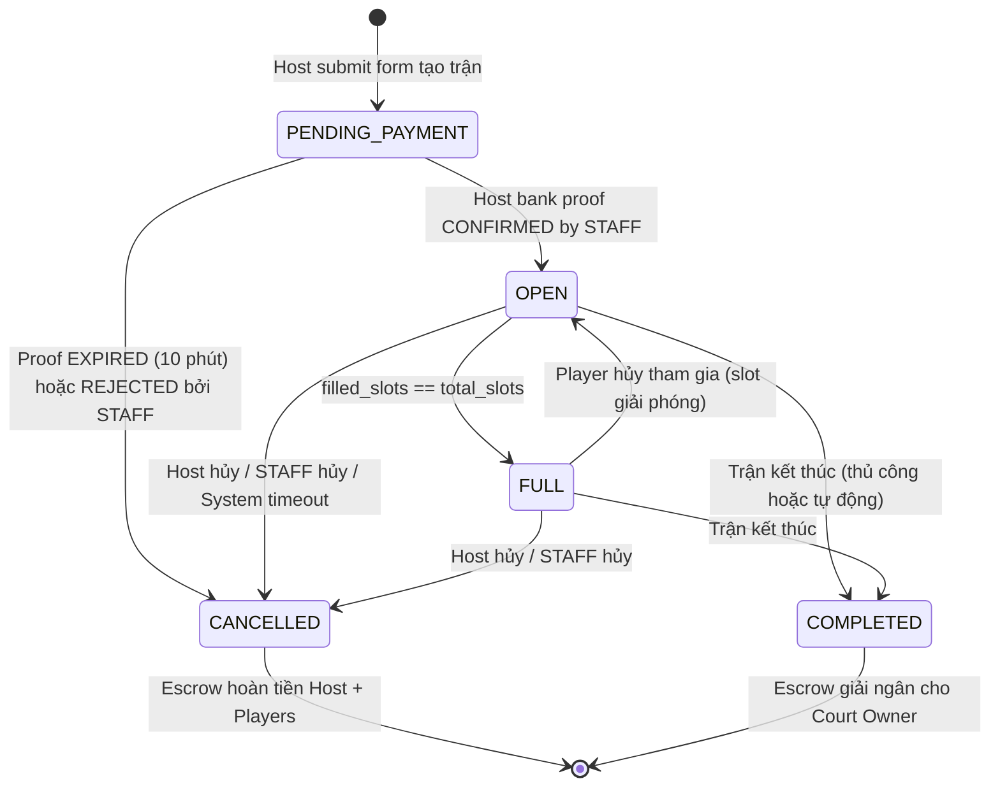
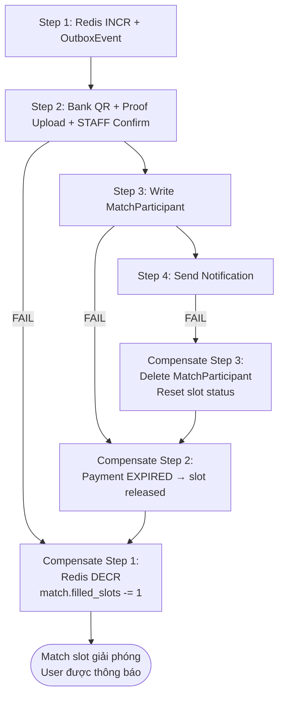
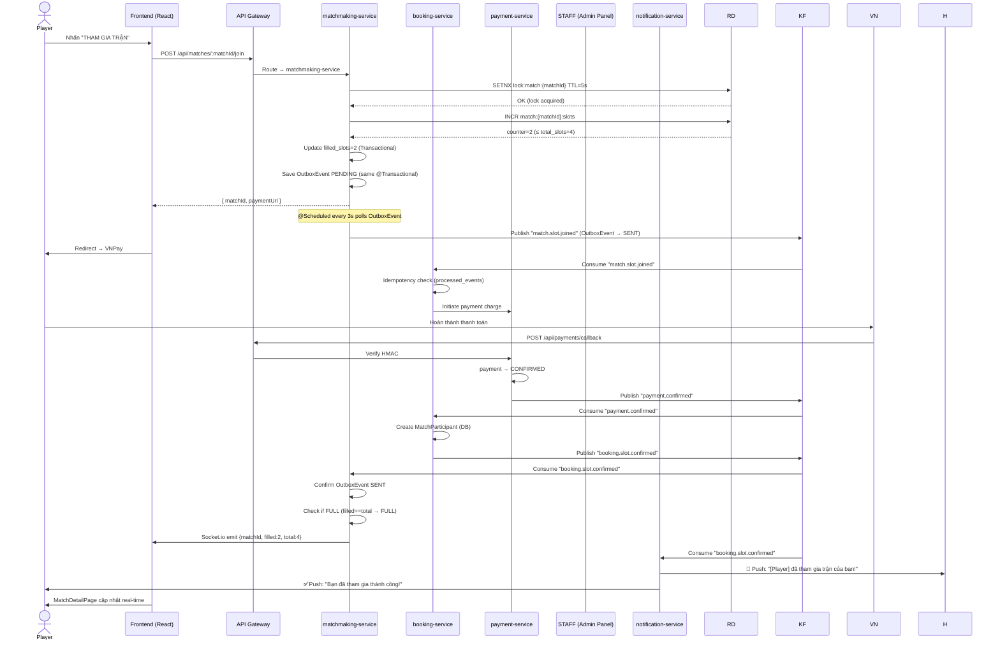
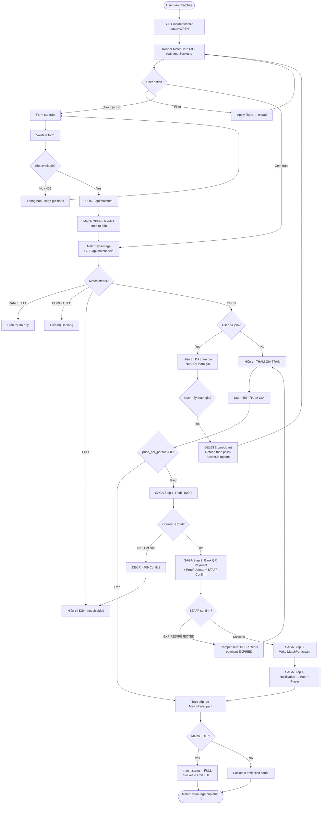

# 📋 Use Case: Matchmaking — Ghép Trận Đấu

---

## 1. Use Case Overview

| Field | Detail |
|---|---|
| **Use Case Group** | MATCHMAKING |
| **Module** | Matchmaking Service |
| **Priority** | High — Core Feature |
| **Related Services** | `matchmaking-service`, `booking-service`, `payment-service`, `escrow-service`, `notification-service`, `court-service` |
| **Pattern** | Saga Pattern + Outbox Pattern + Distributed Lock |

### Sub Use Cases

| ID | Tên | Mô tả |
|---|---|---|
| UC-MATCH-01 | Tạo Trận Đấu (Create Match) | User tạo trận mở để tìm đối thủ/đồng đội |
| UC-MATCH-02 | Duyệt Danh Sách Trận (Browse Matches) | User tìm kiếm và lọc trận phù hợp |
| UC-MATCH-03 | Tham Gia Trận Đấu (Join Match) | User đăng ký tham gia trận đang mở |
| UC-MATCH-04 | Hủy Trận Đấu (Cancel Match) | Host / STAFF / ADMIN hủy trận đã tạo |

---

## 2. Actors

| Actor | Role |
|---|---|
| **Host (User)** | Người tạo trận — đặt sân, **thanh toán toàn bộ tiền sân trước** khi match OPEN |
| **Player (User)** | Người tham gia trận — trả `price_per_person` để hoàn tiền cho Host |
| **Staff / Admin** | Quản lý và có quyền hủy bất kỳ trận nào |
| **System Scheduler** | Tự động hủy trận PENDING_PAYMENT quá **10 phút** (countdown hết hạn) |
| **payment-service** | Hiển thị QR ngân hàng · Nhận proof upload · STAFF xác nhận thủ công |
| **Escrow Service** | Giữ tiền trung gian — Host deposit → Player reimbursement → Settlement cho Court Owner |
| **Notification Service** | Gửi thông báo cho Host và Player |

---

## 3. State Machine — `matches.status`



> **💡 Prepay + Escrow Model:**
> Host phải **đặt cọc toàn bộ tiền sân** trước khi trận được OPEN.
> Tiền được giữ trong **Escrow** — Court Owner chỉ nhận tiền khi match COMPLETED.
> Khi Player join, tiền player vào Escrow và **hoàn lại dần cho Host**.

---

---

## UC-MATCH-01: Tạo Trận Đấu (Create Match)

### 1.1 Thông tin Use Case

| Field | Detail |
|---|---|
| **Use Case ID** | UC-MATCH-01 |
| **Actor chính** | Host (User đã đăng nhập) |
| **Trigger** | User nhấn "Tạo trận mới" trên MatchesPage |
| **Preconditions** | User đã đăng nhập · Đã chọn được court và time slot khả dụng |
| **Postconditions (Success)** | Match được tạo `status=OPEN` · Slot trên court được giữ · Xuất hiện trên MatchesPage |

### 1.2 Main Success Flow

```
Bước  Actor     Hành động
────────────────────────────────────────────────────────────────────
 1.   Host      Vào /matches → nhấn "Tạo trận mới"
 2.   System    Hiển thị form tạo trận:
                  • Chọn court (search/filter)
                  • Chọn ngày & khung giờ từ timeline grid
                    → Hiển thị NGAY: "Giá sân: 400,000 VND" (từ court-service)
                  • Môn thể thao (Badminton / Pickleball)
                  • Hình thức (Đơn / Đôi / Mix)
                  • Skill required (BEGINNER | INTERMEDIATE | ADVANCED | PRO)
                  • Số slot (total_slots): 2 / 4 / 6 / 8 người
                  • Giá/người (price_per_person): tự nhập (VND)
                    → System auto-suggest: court_price ÷ total_slots
                    → WARN nếu price_per_person × total_slots < court_price:
                       "⚠️ Tổng thu (X VND) thấp hơn giá sân (Y VND).
                        Bạn sẽ bù thêm phần còn lại."
                  • Mô tả thêm (optional)
                  ┌──────────────────────────────────────────────────┐
                  │  💰 TÓM TẮT CHI PHÍ:                            │
                  │  Bạn cần đặt cọc ngay: 400,000 VND              │
                  │  Bạn sẽ được hoàn lại: 100,000 VND/người join   │
                  │  (tối đa 300,000 VND khi đủ 4 người)            │
                  └──────────────────────────────────────────────────┘
 3.   Host      Điền đầy đủ thông tin → nhấn "TẠO TRẬN"
 4.   System    Validate:
                  • Court tồn tại và slot AVAILABLE
                  • date >= hôm nay
                  • total_slots hợp lệ (2–16)
                  • price_per_person >= 0
                  • Cảnh báo (không chặn) nếu price_per_person × total_slots < court_price

──── PHASE 1: TẠO MATCH + ĐẶT CỌC ────────────────────────────────

 5.   System    Gọi POST /api/matches
                  • Acquire Redis lock: lock:slot:{slotId} TTL 5s
                  • Tạo match: status=PENDING_PAYMENT, filled_slots=0
                  • Lưu court_price snapshot vào match record
                  • Publish OutboxEvent: "match.created" (PENDING)
                  • Tạo payments record: status=PENDING, expires_at=NOW()+10min
                  • Acquire Redis: lock:slot:{slotId}:match_create TTL 10min
                  → Trả về { matchId, paymentInfo }

──── PHASE 1: HIỂN THỊ MÀN HÌNH THANH TOÁN QR ─────────────────────

 6.   System    Hiển thị màn hình thanh toán:
                  ┌──────────────────────────────────────────────────────┐
                  │ 1. Tài khoản ngân hàng:                              │
                  │    Tên TK:    [account_name từ bank_accounts]        │
                  │    Số TK:     [account_number]                       │
                  │    Ngân hàng: [bank_name]                            │
                  │    [QR Code image]                                   │
                  │ 2. ⚠️ Chuyển khoản [court_price] VND                │
                  │    Nội dung: [orderCode e.g. #184]                   │
                  │ 3. ⏱ Đơn còn được giữ trong: 09:59 (countdown)     │
                  │ 4. [Upload zone: tải hình chuyển khoản (*)]         │
                  │ 5. [XÁC NHẬN] button                                │
                  └──────────────────────────────────────────────────────┘

 7.   Host      Chuyển khoản ngân hàng với nội dung = orderCode (#184)
                  → Chụp màn hình xác nhận giao dịch
                  → Upload ảnh proof → POST /api/payments/{id}/proof
                  → payment.status = PROOF_SUBMITTED

 8.   STAFF     Nhận notification "New proof #184 awaiting review"
                  → Vào Admin Panel (/admin/payments)
                  → Kiểm tra sao kê ngân hàng
                  → Click CONFIRM
                  → payment.status = CONFIRMED
                  → matchmaking-service:
                      • match.status → OPEN
                      • Tạo match_participant (host tự join)
                      • filled_slots = 1
                      • time_slot → RESERVED (qua court-service)
                      • Giải phóng Redis lock
                      • Confirm OutboxEvent → SENT

──── PHASE 1 HOÀN TẤT ─────────────────────────────────────────────

 9.   System    Redirect → /matches/:matchId
                  • Hiển thị trang chi tiết trận vừa tạo
                  • Badge "OPEN" · "1/4 slots filled"
                  • Hiển thị: "💰 Bạn đã đặt cọc 400,000 VND
                               Đã được hoàn: 0 VND | Còn lại: 400,000 VND"
10.   Notification  Gửi push notification cho các user có
      Service    skill phù hợp trong khu vực (optional recommendation)
```

### 1.3 Alternative Flows

**Alt-A: Slot bị chiếm khi đang tạo trận**
```
5a.1  Redis lock thất bại (slot đã bị giữ)
5a.2  System trả về 409 CONFLICT
5a.3  Hiển thị: "Sân này đã được đặt. Vui lòng chọn giờ khác."
5a.4  Quay lại form bước 2, ô giờ đó chuyển sang màu RESERVED
```

**Alt-B: Host đặt giá miễn phí (price_per_person = 0)**
```
3b.1  Host nhập price_per_person = 0
3b.2  Host vẫn PHẢI thanh toán toàn bộ court_price (Host bao sân)
3b.3  Không có bước payment khi player join (player join free)
3b.4  Escrow giải ngân court_price → Court Owner khi COMPLETED
```

**Alt-C: Host chưa upload proof trong 10 phút**
```
8c.1  Scheduler phát hiện payment quá expires_at
8c.2  payment.status → EXPIRED
8c.3  match.status → CANCELLED
8c.4  Redis lock:slot:{slotId}:match_create giải phóng
8c.5  Hiển thị: "Đã hết thời gian giữ chỗ. Trận chưa được tạo. Vui lòng thử lại."
8c.6  time_slot vẫn AVAILABLE (chưa bị RESERVED)
```

**Alt-D: STAFF reject proof (thông tin sai/không khớp)**
```
8d.1  STAFF kiểm tra sao kê → không tìm thấy giao dịch tương ứng
8d.2  STAFF click REJECT + ghi reject_reason
8d.3  payment.status → EXPIRED
8d.4  match.status → CANCELLED, slot giải phóng
8d.5  Gửi notification Host: "Ảnh xác nhận bị từ chối: [reject_reason]. Vui lòng tạo trận lại."
```

### 1.4 Exception Flows

| Exception | Mô tả | Xử lý |
|---|---|---|
| Exc-1 | Court không tồn tại hoặc inactive | 404 Not Found → thông báo lỗi |
| Exc-2 | Slot đã RESERVED / BLOCKED | 409 Conflict → chọn giờ khác |
| Exc-3 | date < today | 400 Bad Request → "Không thể tạo trận trong quá khứ" |
| Exc-4 | Host đã có trận OPEN chưa bắt đầu | 400 → "Bạn đang có 1 trận chưa hoàn thành" |
| Exc-5 | Proof upload timeout 10 phút (không upload kịp) | payment → EXPIRED, match hủy tự động, slot không bị RESERVED |
| Exc-6 | Escrow service unavailable | Rollback match tạo, thông báo lỗi hệ thống |

---

---

## UC-MATCH-02: Duyệt Danh Sách Trận (Browse Matches)

### 2.1 Thông tin Use Case

| Field | Detail |
|---|---|
| **Use Case ID** | UC-MATCH-02 |
| **Actor chính** | User (guest hoặc đã đăng nhập) |
| **Trigger** | User vào route `/matches` |
| **Preconditions** | Không yêu cầu đăng nhập để xem danh sách |

### 2.2 Main Success Flow

```
Bước  Actor     Hành động
────────────────────────────────────────────────────────────────────
 1.   User      Vào /matches
 2.   System    Gọi GET /api/matches?status=OPEN&page=0&size=20
                  → Sort: date ASC, filled_slots DESC
                  → Trả về MatchCard[]
 3.   System    Render danh sách MatchCard:
                  • Tên court + địa chỉ
                  • Ngày & giờ thi đấu
                  • Skill required (badge màu)
                  • Hình thức (Đơn/Đôi/Mix)
                  • Giá/người
                  • Real-time slot badge: "2/4 slots filled"
                    (Socket.io — cập nhật live)
                  • Avatar host + tên host
 4.   User      (Optional) Dùng filter bar:
                  • Skill level (dropdown)
                  • Ngày (DatePicker)
                  • Quận/huyện
                  • Môn thể thao
                  • Giá tối đa
 5.   System    Reload GET /api/matches với query params mới
 6.   User      Nhấn vào MatchCard muốn xem chi tiết
 7.   System    Navigate → /matches/:matchId (→ UC-MATCH-03)
```

### 2.3 Real-time Slot Counter (Socket.io)

```
Khi Player A join/leave match:
  matchmaking-service → emit Socket.io event:
    { matchId, filledSlots, totalSlots, status }
  
  Frontend listener:
    useMatchSocket(matchId) → cập nhật badge tức thì
    "2/4" → "3/4" → badge đổi màu:
      green  < 50%   filled
      yellow 50–80%  filled
      red    > 80%   filled
      grey   FULL    (disabled)
```

---

---

## UC-MATCH-03: Tham Gia Trận Đấu (Join Match) ⭐ Core Saga

### 3.1 Thông tin Use Case

| Field | Detail |
|---|---|
| **Use Case ID** | UC-MATCH-03 |
| **Actor chính** | Player (User đã đăng nhập) |
| **Trigger** | Player nhấn "THAM GIA TRẬN" trên MatchDetailPage |
| **Preconditions** | User đã đăng nhập · Match status = OPEN · filled_slots < total_slots · User chưa tham gia trận này |
| **Postconditions (Success)** | `match_participants` có record mới · `filled_slots` tăng 1 · Payment confirmed · Notification gửi đến Host và Player |
| **Pattern** | **4-step Saga** với compensating transactions |

### 3.2 Saga Steps Overview

```
Step 1 — matchmaking-service : Redis INCR slot counter (atomic check)
Step 2 — payment-service     : Tạo PENDING payment → Hiển thị QR ngân hàng → Player upload proof → STAFF confirm
Step 2b— escrow-service      : Ghi nhận Player deposit → Hoàn tiền cho Host
Step 3 — booking-service     : Write MatchParticipant + update slot
Step 4 — notification-service: Push alert đến Host và Player

Nếu bất kỳ step nào fail → Compensating transactions chạy ngược lại

💡 Escrow Flow khi Player join:
   Player trả price_per_person → vào Escrow
   Escrow giải ngân price_per_person → hoàn lại Host wallet
   (Host dần lấy lại tiền đã đặt cọc sân theo từng người join)
```

### 3.3 Main Success Flow

```
Bước  Actor           Hành động
────────────────────────────────────────────────────────────────────────
 1.   Player          Vào /matches → nhấn vào MatchCard
 2.   System          Gọi GET /api/matches/:matchId
                        • Hiển thị chi tiết: info card, skill badge,
                          price/person, host info, avatar participants,
                          real-time slot counter (Socket.io)
                        • Nút "THAM GIA TRẬN" nếu slot còn trống
                          và user chưa join
 3.   Player          Nhấn "THAM GIA TRẬN"
 4.   System          Hiển thị modal xác nhận:
                        • Chi tiết trận (court, ngày, giờ, giá/người)
                        • Tổng phải trả: price_per_person
                        • Nút "XÁC NHẬN THAM GIA"

──── SAGA BẮT ĐẦU ────────────────────────────────────────────────────

[STEP 1 — matchmaking-service]
 5.   System          Gọi POST /api/matches/:matchId/join
                        → Acquire Redis lock: lock:match:{matchId} TTL 5s
                        → Redis INCR match:{matchId}:slots
                        → Kiểm tra counter <= total_slots
                        → Lưu OutboxEvent: "match.slot.joined" (PENDING)
                          trong cùng @Transactional với match update
                        → Cập nhật match.filled_slots += 1 (optimistic)
                        → Socket.io emit: slot counter update → tất cả client

[STEP 2 — payment-service + escrow-service]
 6.   System          booking-service nhận Kafka: "match.slot.joined"
                        → Gọi payment-service: tạo PENDING payment cho price_per_person
                        → Trả về { paymentId, orderCode, bankName, accountNumber,
                                   qrImageUrl, amount, expiresAt }

 7.   System          Hiển thị màn hình thanh toán QR cho Player:
                        • Bank info + QR code
                        • ⏱ Countdown timer (10 phút)
                        • Nội dung chuyển khoản = orderCode
                        • Upload zone ảnh chứng minh

 8.   Player          Chuyển khoản + upload ảnh proof
                        → POST /api/payments/{id}/proof
                        → payment.status = PROOF_SUBMITTED
                        → STAFF nhận notification

 9.   STAFF           Kiểm tra sao kê → click CONFIRM trong admin panel
                        → payment.status = CONFIRMED
                        → Kafka: "payment.player.confirmed"
                        → escrow-service:
                            • Ghi nhận player deposit: +price_per_person vào Escrow
                            • Giải ngân ngay cho Host: +price_per_person → Host wallet
                              (Host lấy lại dần tiền đặt cọc sân)
                            • Ghi log: escrow_transactions (player → host reimbursement)

                        💰 Ví dụ tích lũy (court_price=400k, 4 slots):
                          Sau Player 2 join: Host nhận lại 100,000 VND
                          Sau Player 3 join: Host nhận lại 200,000 VND (tổng)
                          Sau Player 4 join: Host nhận lại 300,000 VND (tổng)
                          → Host đã chi 400k, thu về 300k → net: 100k (1 slot của mình)

[STEP 3 — booking-service]
 9.   System          booking-service nhận Kafka: "payment.confirmed"
                        → Idempotency check: processed_events table
                        → Tạo MatchParticipant record trong DB
                        → Publish Kafka: "booking.slot.confirmed"

[STEP 4 — notification-service]
10.   System          notification-service nhận "booking.slot.confirmed"
                        → Gửi push notification đến HOST:
                          "🏸 [Tên player] đã tham gia trận của bạn!
                           Còn 1 slot trống. Đã hoàn: 100,000 VND vào ví."
                        → Gửi push notification đến PLAYER:
                          "✅ Bạn đã tham gia trận thành công!
                           [Court name] - [Ngày giờ]"

──── SAGA HOÀN TẤT ───────────────────────────────────────────────────

11.   System          matchmaking-service nhận "booking.slot.confirmed"
                        → Confirm OutboxEvent → SENT
                        → Kiểm tra filled_slots == total_slots
                          → Nếu đủ: match.status → FULL
                        → Socket.io emit: updated slot count + status
12.   System          MatchDetailPage cập nhật real-time:
                        • Slot counter: "3/4" → "4/4 (FULL)"
                        • Player's avatar xuất hiện trong danh sách
                        • Nút "THAM GIA" disabled (nếu FULL)
```

### 3.4 Alternative Flows

**Alt-A: Match miễn phí (price_per_person = 0)**
```
5a.1  System bỏ qua bước payment (Step 2)
5a.2  Trực tiếp sang Step 3: tạo MatchParticipant
5a.3  Flow nhanh hơn — không cần màn hình QR
```

**Alt-B: Player đã join rồi (trở lại xem)**
```
2b.1  GET /api/matches/:matchId trả về user đã là participant
2b.2  Nút "THAM GIA" thay bằng "✅ Đã tham gia"
2b.3  Hiển thị nút "Hủy tham gia" (→ UC-MATCH-04b)
```

**Alt-C: Match FULL khi Player đang xem**
```
3c.1  Socket.io emit đến client: match FULL
3c.2  Nút "THAM GIA" tự disable real-time (không cần reload)
3c.3  Hiển thị badge "ĐẦY" màu đỏ
```

### 3.5 Compensating Transactions (Saga Rollback)



| Bước thất bại | Forward | Compensate |
|---|---|---|
| Step 1 | Redis INCR, OutboxEvent | Redis DECR, xóa OutboxEvent |
| Step 2 | Bank QR → Player upload proof → STAFF confirm → Escrow hoàn Host | Payment → EXPIRED; Debit lại Escrow; Hoàn lại Host wallet |
| Step 3 | Write MatchParticipant | Delete MatchParticipant, reset slot |
| Step 4 | Send notification | Gửi notification lỗi (never silently drop) |

### 3.6 Exception Flows

**Exc-1: Redis lock thất bại (Race Condition)**
```
5e.1  lock:match:{matchId} đã bị lock bởi user khác
5e.2  System trả về 409 CONFLICT
5e.3  Hiển thị: "Trận đấu vừa đầy người. Vui lòng thử lại sau."
5e.4  Socket.io emit cập nhật slot count real-time
```

**Exc-2: Slot counter vượt quá total_slots (Race Condition)**
```
5e.1  Redis INCR trả về counter > total_slots
5e.2  System Redis DECR ngay lập tức
5e.3  Trả về 409: "Trận đã đầy người"
5e.4  match.status → FULL
```

**Exc-3: Thanh toán thất bại (EXPIRED hoặc REJECTED bởi STAFF)**
```
8e.1  payment → EXPIRED (timeout) hoặc STAFF click REJECT
8e.2  payment.status = EXPIRED
8e.3  Compensate Step 1:
        → Redis DECR match:{matchId}:slots
        → match.filled_slots -= 1
8e.4  Hiển thị: "Thanh toán không được xác nhận. Slot đã được trả lại."
8e.5  Socket.io emit: slot count giảm
```

**Exc-4: Zombie Event — Match đã CANCELLED khi event đến**
```
Event "booking.slot.confirmed" đến nhưng match đã CANCELLED:
  matchmaking-service @KafkaListener:
    → Kiểm tra match.status == CANCELLED
    → ZOMBIE DETECTED
    → Publish "match.compensate.slot" (không process tiếp)
    → booking-service nhận → delete MatchParticipant, refund
```

**Exc-5: Trận CANCELLED bởi Host trong lúc Player đang upload proof**
```
5e.1  Player đang ở step 2 (đã upload proof, chờ STAFF confirm)
5e.2  Host cancel match → match.status = CANCELLED
5e.3  STAFF confirm payment → payment CONFIRMED
5e.4  booking-service nhận "payment.player.confirmed" →
        kiểm tra match.status = CANCELLED → Zombie!
5e.5  Tự động queue refund: escrow ghi PLAYER_REFUND → STAFF hoàn tiền thủ công
5e.6  Gửi notification cho Player:
       "Trận đã bị hủy bởi host. Tiền sẽ được hoàn lại trong vòng 1-3 ngày."
```

**Exc-6: Notification service thất bại (Kafka retry)**
```
Notification fail sau 3 lần retry (2s, 4s, 8s exponential backoff):
  → DefaultErrorHandler Recoverer:
    compensationService.publishNotificationFailed(...)
  → Không bao giờ silently drop notification
  → Lưu vào notification_history với status=FAILED
  → Admin có thể retry thủ công
```

---

---

## UC-MATCH-04: Hủy Trận Đấu (Cancel Match)

### 4.1 Thông tin Use Case

| Field | Detail |
|---|---|
| **Use Case ID** | UC-MATCH-04 |
| **Actor chính** | Host (own match) · STAFF (any) · ADMIN (any) · System Scheduler |
| **Trigger** | Nhấn "Hủy trận" hoặc scheduler cron job |
| **Preconditions** | Match status = OPEN hoặc FULL |

### 4.2 Sub-flows

#### 4.2a — Host tự hủy trận

```
Bước  Actor     Hành động
────────────────────────────────────────────────────────────────
 1.   Host      Vào /matches/:matchId → nhấn "Hủy trận"
 2.   System    Hiển thị modal xác nhận:
                  "Hủy trận sẽ hoàn tiền cho tất cả
                   người tham gia. Bạn chắc chắn?"
 3.   Host      Nhấn "Xác nhận hủy" + nhập lý do (optional)
 4.   System    PATCH /api/matches/:matchId/cancel
                  • Kiểm tra host_id == current user
                  • match.status → CANCELLED
                  • Escrow Settlement (Hoàn tiền):
                    ┌─────────────────────────────────────────────┐
                    │ Với mỗi Player đã join:                     │
                    │   → Hoàn player_payment → Player VNPay      │
                    │   → Debit lại escrow (hoàn tiền đã trả Host)│
                    │                                             │
                    │ Với Host:                                   │
                    │   → Hoàn court_price deposit → Host VNPay  │
                    │   → (trừ phần đã nhận reimbursement từ      │
                    │      players trước đó)                      │
                    │   → Net hoàn = court_price - Σ(reimburse)  │
                    └─────────────────────────────────────────────┘
                  • tim    MS-->FE: { matchId, paymentInfo }

    Note over MS: @Scheduled every 3s polls OutboxEvent
    MS->>KF: Publish "match.slot.joined" (OutboxEvent → SENT)

    KF->>BS: Consume "match.slot.joined"
    BS->>BS: Idempotency check (processed_events)
    BS->>PS: Tạo PENDING payment { price_per_person }
    PS-->>BS: { paymentId, orderCode, qrImageUrl, expiresAt }
    BS-->>FE: { paymentId, orderCode, bankName, accountNumber, qrImageUrl, expiresAt }

    FE->>P: Hiển thị màn hình QR + countdown timer

    P->>P: Chuyển khoản ngân hàng + chụp ảnh proof
    P->>GW: POST /api/payments/{id}/proof (multipart)
    GW->>PS: Upload proof image → Cloudinary
    PS->>PS: payment → PROOF_SUBMITTED
    PS->>KF: Publish "payment.proof.submitted"
    KF->>NS: Notify STAFF: "New proof awaiting review"

    ST->>GW: POST /api/payments/{id}/confirm
    GW->>PS: payment → CONFIRMED
    PS->>KF: Publish "payment.player.confirmed"

    KF->>BS: Consume "payment.player.confirmed"
    BS->>BS: Create MatchParticipant (DB)
    BS->>KF: Publish "booking.slot.confirmed"

    KF->>MS: Consume "booking.slot.confirmed"
    MS->>MS: Confirm OutboxEvent SENT
    MS->>MS: Check if FULL (filled==total → FULL)
    MS->>FE: Socket.io emit {matchId, filled:2, total:4}

    KF->>NS: Consume "booking.slot.confirmed"
    NS->>H: 🔔 Push: "[Player] đã tham gia trận của bạn!"
    NS->>P: ✅ Push: "Bạn đã tham gia thành công!"

    FE->>P: MatchDetailPage cập nhật real-time match.status == FULL → OPEN
                  • Refund theo policy
                  • Socket.io emit: slot count update
 4.   Notification  Gửi thông báo HOST:
      Service     "ℹ️ [Player name] đã rời trận của bạn.
                   Còn 2 slot trống."
```

#### 4.2c — System Scheduler tự động hủy (Timeout)

```java
// @Scheduled(cron = "0 */5 * * * *") — mỗi 5 phút
public void cancelExpiredMatches() {
    LocalDateTime cutoff = LocalDateTime.now().minusMinutes(10);
    // Tìm PENDING_PAYMENT payments quá expires_at → EXPIRED
    // Tìm OPEN matches tạo > 10 phút trước mà filled_slots == 0
    // → CANCELLED + publish MatchCancelledEvent
    // → Giải phóng slot lock, không charge tiền
}
```

```
 1.   Scheduler  Chạy mỗi 1 phút: tìm PENDING payments quá expires_at
 2.   System    payment.status → EXPIRED
                  • Kafka: payment.host.expired → matchmaking-service
                  • match.status → CANCELLED
                  • time_slot → AVAILABLE
                  • Giải phóng Redis lock:slot:{slotId}:match_create
                  • Publish "match.cancelled"
 3.   Notification  Gửi notification cho Host:
      Service     "⏱ Đơn của bạn đã hết thời gian giữ chỗ.
                   Vui lòng tạo trận lại và thanh toán đúng hạn."
```

### 4.3 Business Rules Hủy Trận

| Thời điểm hủy | Người hủy | Hoàn tiền Player | Hoàn tiền Host (court deposit) |
|---|---|---|---|
| > 24h trước giờ thi đấu | Player tự hủy | 100% price_per_person | Không đổi (Host vẫn giữ reimbursement đã nhận) |
| 2h – 24h trước giờ thi đấu | Player tự hủy | 50% price_per_person | Hoàn 50% ngược lại Host → trừ vào host wallet |
| < 2h trước giờ thi đấu | Player tự hủy | 0% | Host giữ toàn bộ |
| Host chủ động hủy | Host | 100% price_per_person cho tất cả Player | Hoàn 100% court_price → Host |
| System timeout (0 người join) | Scheduler | Không có Player → không áp dụng | Hoàn 100% court_price → Host |
| Match COMPLETED | System | Không hoàn | Escrow giải ngân court_price → Court Owner |

---

---

## 5. Sequence Diagram — Join Match (UC-MATCH-03)



---

## 6. Activity Diagram — Full Matchmaking Flow



---

## 7. Business Rules Tổng hợp

| ID | Rule |
|---|---|
| BR-01 | Chỉ USER / COACH mới được tạo và join match |
| BR-02 | STAFF / ADMIN không được join match (chỉ quản lý) |
| BR-03 | Một user không thể join cùng một match 2 lần |
| BR-04 | Host tự động là participant đầu tiên (`filled_slots=1`) sau khi thanh toán |
| BR-05 | `total_slots` phải là số chẵn: 2, 4, 6, 8, 10, 12 người |
| BR-06 | `price_per_person` ≥ 0 (0 = Host bao sân, Player join miễn phí) |
| BR-07 | Không được join match đã FULL / CANCELLED / COMPLETED / PENDING_PAYMENT |
| BR-08 | Redis lock TTL = **5 giây** cho join operation |
| BR-09 | OutboxEvent được poll mỗi **3 giây** bởi scheduler |
| BR-10 | Kafka retry: tối đa 3 lần, exponential backoff 2s/4s/8s |
| BR-11 | Zombie event check: nếu match CANCELLED → compensate ngay |
| BR-12 | System auto-cancel match sau **10 phút** nếu payment PENDING_PAYMENT quá `expires_at` (Host chưa upload proof hoặc STAFF chưa confirm) |
| BR-13 | System **cảnh báo** (không chặn) nếu `price_per_person × total_slots < court_price` |
| BR-14 | Host PHẢI thanh toán `court_price` trước khi match chuyển sang OPEN (Prepay model) |
| BR-15 | Escrow giải ngân `court_price` cho Court Owner chỉ khi match = **COMPLETED** |
| BR-16 | Khi Player join thành công: `price_per_person` từ Escrow hoàn ngay vào **Host wallet** |
| BR-17 | Snapshot `court_price` tại thời điểm tạo match (không bị ảnh hưởng bởi thay đổi giá sân sau này) |

---

## 8. Frontend Components

| Component | Route | Mô tả |
|---|---|---|
| `MatchesPage.tsx` | `/matches` | Danh sách match + filter bar + real-time badges |
| `MatchCard.tsx` | *(dùng trong MatchesPage)* | Card hiển thị info trận, slot counter live |
| `MatchDetailPage.tsx` | `/matches/:id` | Chi tiết trận, participants, Join button |
| `CreateMatchModal.tsx` | *(overlay)* | Form tạo trận mới |
| `SlotCounter.tsx` | *(dùng trong MatchDetailPage)* | Progress bar real-time: green/yellow/red |
| `useMatchSocket.ts` | *(hook)* | Socket.io subscription theo matchId |

```tsx
// SlotCounter.tsx — Props
interface SlotCounterProps {
  matchId: string;
  initialFilled: number;   // từ API
  totalSlots: number;
  onFull?: () => void;     // callback khi match FULL
}

// Color logic
const color =
  filled / total < 0.5  ? "green"  :
  filled / total < 0.8  ? "yellow" : "red";
```

---

## 9. API Endpoints — matchmaking-service

| Method | Endpoint | Auth | Mô tả |
|---|---|---|---|
| `GET` | `/api/matches` | Public | Danh sách match (filter: skill, date, status) |
| `POST` | `/api/matches` | USER / COACH | Tạo match mới |
| `GET` | `/api/matches/:id` | Public | Chi tiết match |
| `POST` | `/api/matches/:id/join` | USER / COACH | Tham gia match (Saga) |
| `DELETE` | `/api/matches/:id/participants` | USER / COACH (own) | Tự rời match |
| `PATCH` | `/api/matches/:id/cancel` | USER own / STAFF any / ADMIN any | Hủy match |
| `GET` | `/api/matches/:id/participants` | STAFF / ADMIN | Danh sách người tham gia |

---

## 10. Kafka Topics — Matchmaking Flow

| Topic | Producer | Consumer | Mục đích |
|---|---|---|---|
| `payment.host.confirmed` | payment-service | matchmaking-service, escrow-service | STAFF confirm Host bank proof → Escrow ghi nhận, match → OPEN |
| `payment.host.expired` | payment-service (Scheduler) | matchmaking-service | Host proof hết hạn → match → CANCELLED, slot released |
| `match.slot.joined` | matchmaking-service (Outbox) | booking-service, payment-service | Kích hoạt Player payment screen (Bank QR) |
| `payment.player.confirmed` | payment-service | booking-service, escrow-service | STAFF confirm Player bank proof → ghi Escrow + hoàn Host |
| `payment.player.expired` | payment-service (Scheduler) | matchmaking-service, booking-service | Player proof hết hạn → release slot |
| `payment.proof.submitted` | payment-service | notification-service | Thông báo STAFF có proof mới chờ review |
| `match.cancelled` | matchmaking-service | notification-service, booking-service, escrow-service | Thông báo hủy + queue refund → STAFF hoàn tiền thủ công |
| `booking.slot.confirmed` | booking-service | matchmaking-service, notification-service, escrow-service | Xác nhận participant → Escrow hoàn tiền Host |
| `match.completed` | matchmaking-service | escrow-service, notification-service | Ghi COURT_OWNER_SETTLEMENT → STAFF hoàn tất chuyển khoản |
| `match.compensate.slot` | matchmaking-service | booking-service, escrow-service | Zombie event compensation |
| `escrow.host.reimbursed` | escrow-service | notification-service | Thông báo Host đã được hoàn tiền vào ví |
| `payment.refund.queued` | escrow-service | notification-service, payment-service | STAFF action cần: hoàn tiền thủ công qua ngân hàng |

---

## 11. Distributed Systems Patterns Sử Dụng

| Pattern | Áp dụng tại | Mục đích |
|---|---|---|
| **Saga (Choreography)** | Join Match flow | Đảm bảo consistency 4 service |
| **Transactional Outbox** | matchmaking-service | Tránh dual-write: DB + Kafka |
| **Idempotency Guard** | booking-service | Tránh duplicate Kafka event |
| **Distributed Lock (SETNX)** | Join Match | Tránh race condition slot |
| **Atomic Counter (INCR)** | Slot counting | Real-time slot count chính xác |
| **Zombie Event Check** | matchmaking-service | Xử lý stale event sau cancel |
| **Timeout Scheduler** | matchmaking-service | Auto-cancel stale matches |
| **Exponential Backoff** | notification-service | Retry an toàn cho Kafka consumer |
| **Socket.io Real-time** | Frontend | Cập nhật slot live không cần poll |
