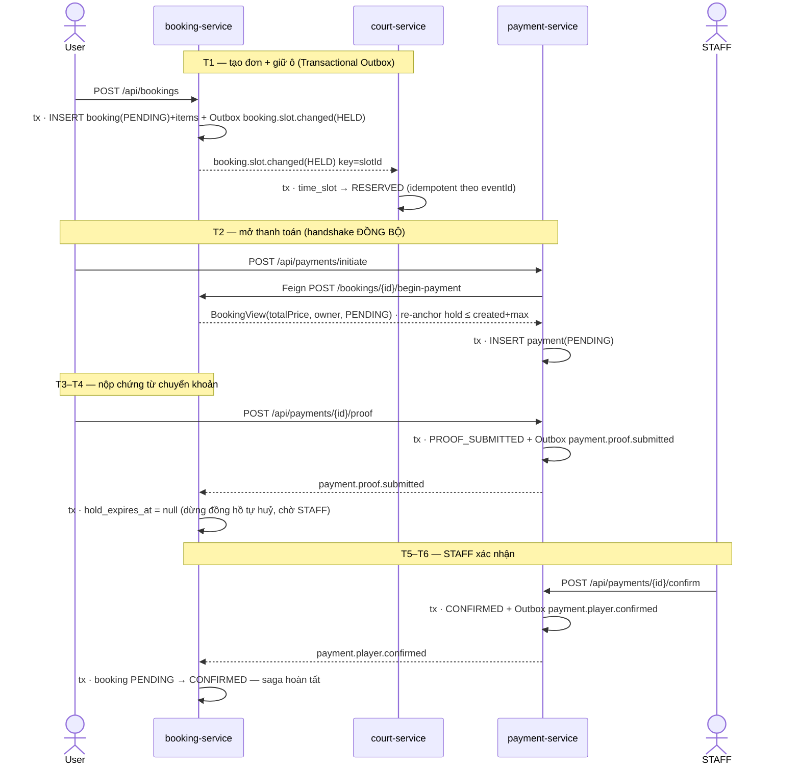
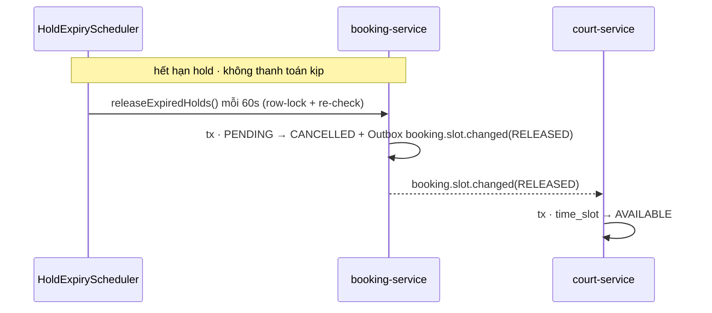
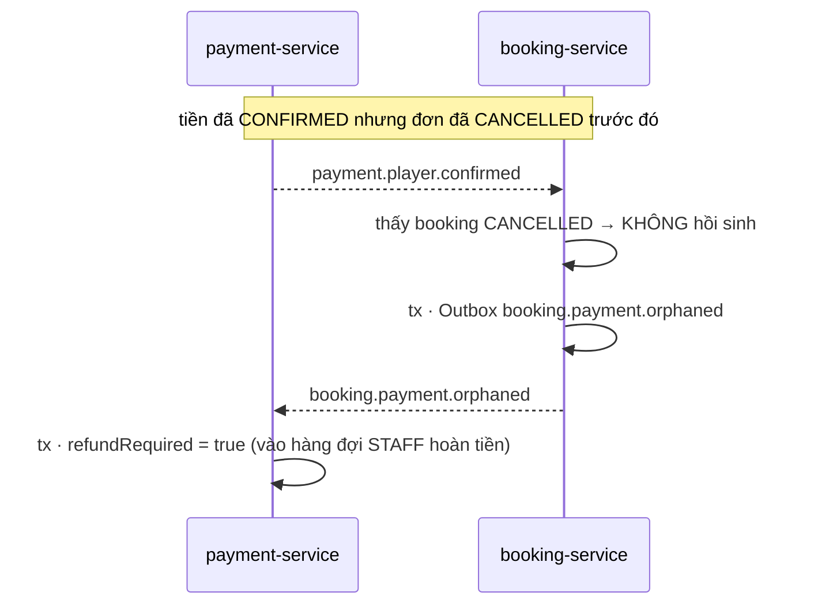
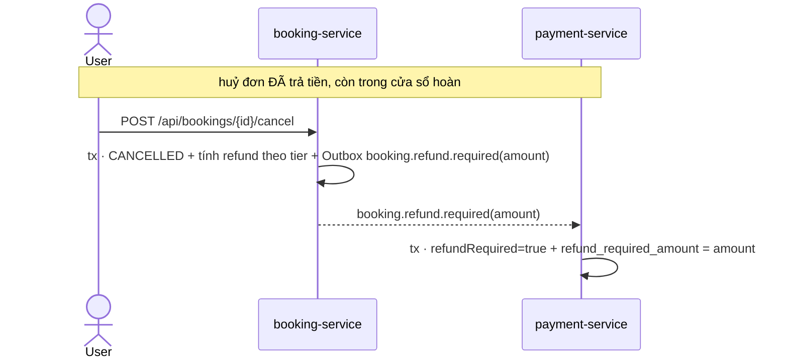

# UC — Saga Pattern của luồng Đặt sân (Booking Flow)

> Tài liệu này trả lời câu hỏi: *"Luồng đặt sân của tôi có dùng Saga Pattern không?"*
> **Có.** Luồng đặt sân là một **Choreography-based Saga** (không có orchestrator trung tâm) trải trên
> **3 service**, mỗi service sở hữu **một local transaction** trong DB riêng; tính nhất quán giữ bằng
> **Kafka + Transactional Outbox + sự kiện bù trừ (compensating events)**. Đây là tài liệu *đọc-hiểu* —
> gom toàn bộ saga (vốn nằm rải rác ở nhiều file/service) về một chỗ.

Building blocks tham chiếu: `architecture.md` rule **#1** (no cross-DB FK · consistency via Kafka+Saga),
**#4** (Outbox), **#5** (idempotency guard), **#6** (zombie/compensating event), **#7** (DLT).

---

## 1. Saga là gì ở đây — và tại sao luồng này đúng là Saga

Một Saga = chuỗi **local transaction**, mỗi cái commit độc lập trong DB của 1 service, **không có
distributed transaction / 2PC**. Khi một bước sau thất bại (hoặc đến trễ khi trạng thái đã đổi), ta
**không rollback** các bước trước — ta chạy **bước bù trừ (compensation)** để đảo ngược hệ quả của chúng.

Luồng đặt sân có đủ cả hai vế:
- **Forward path**: giữ ô → mở thanh toán → nộp chứng từ → STAFF xác nhận → đơn CONFIRMED.
- **Compensations**: hết hạn → nhả ô · tiền về đơn đã huỷ → cờ hoàn tiền · huỷ đơn đã trả → cờ hoàn tiền.

Vì các bước được nối bằng **sự kiện Kafka** (mỗi service tự phản ứng), đây là **choreography** chứ
không phải **orchestration** (không có "saga orchestrator" gọi tuần tự).

---

## 2. Các Saga participant & local state

| Service | Local transaction sở hữu | DB |
|---|---|---|
| **booking-service** | `bookings` (header) + `booking_items` (ô 30') | booking_db |
| **payment-service** | `payments` | payment_db |
| **court-service** | `time_slots` (`AVAILABLE` ↔ `RESERVED`) | court_db |

Không có `@ManyToOne` / FK nào bắc qua DB khác — 3 DB chỉ "đồng bộ" qua event (Never-Violate #1).

---

## 3. Topic registry — các "cạnh" của saga

| Topic (hoặc SYNC) | Producer | Consumer |
|---|---|---|
| `booking.slot.changed` (HELD/RELEASED, key=`slotId`) | booking · `OutboxWriter.writeSlotHeld` / `writeSlotReleased` | court · `BookingEventListener` → `BookingSlotEventHandler.handle` |
| `payment.proof.submitted` | payment · `PaymentOutboxWriter.writeProofSubmitted` | booking · `PaymentEventHandler.handleProofSubmitted` |
| `payment.player.confirmed` | payment · `writeConfirmed` | booking · `PaymentEventHandler.handleConfirmed` |
| `payment.player.expired` | payment · `writeExpired` | booking · `PaymentEventHandler.handleExpired` |
| `booking.payment.orphaned` *(bù trừ)* | booking · `OutboxWriter.writePaymentOrphaned` | payment · `BookingEventHandler` |
| `booking.refund.required` *(bù trừ)* | booking · `OutboxWriter.writeRefundRequired` | payment · `BookingEventHandler` |
| **SYNC** `POST /api/bookings/{id}/begin-payment` (Feign) | payment · `BookingServiceClient.beginPayment` | booking · `BookingServiceImpl.beginPayment` |

> **Cạnh đồng bộ duy nhất** là handshake `begin-payment` — nằm giữa luồng async để lấy **amount chuẩn**
> từ booking (không tin client) + tái-neo (re-anchor) hold. Mọi cạnh còn lại đều là Kafka async.

---

## 4. Sequence diagram — Happy path (T1 → T6)

---

## 5. Sequence diagrams — 3 nhánh bù trừ (compensations)

### 5.1 Hết hạn giữ ô → nhả ô (đảo ngược T1)

`HoldExpiryScheduler` (booking) hoặc `payment.player.expired` (STAFF reject / payment timeout) đều dẫn
tới: đơn `CANCELLED` + nhả ô. Đây là **compensation cho bước giữ ô** — đảm bảo ô không bao giờ "kẹt đỏ".

### 5.2 Zombie/orphan — tiền CONFIRMED rơi vào đơn đã CANCELLED

(`PaymentEventHandler.handleConfirmed`, dòng 98–104). Không hồi sinh đơn đã huỷ — phát sự kiện bù trừ
để payment-service gắn cờ hoàn tiền (Never-Violate #6).

### 5.3 Refund-required — huỷ đơn đã thanh toán trong cửa sổ hoàn tiền

(`BookingServiceImpl.cancel`, dòng 274–276). Bù trừ phần **tiền**: mang theo số tiền tính theo tier
(>24h=100% · 2–24h=50% · <2h=0%).

---

## 6. Ma trận bù trừ (compensation matrix)

| Forward step | Sự cố có thể xảy ra | Bước bù trừ | Topic |
|---|---|---|---|
| Giữ ô (`booking.slot.changed` HELD → RESERVED) | User không thanh toán kịp | Nhả ô về AVAILABLE | `booking.slot.changed` (RELEASED) |
| Thanh toán CONFIRMED | Đơn đã CANCELLED trước khi STAFF confirm | Gắn cờ hoàn tiền payment | `booking.payment.orphaned` |
| Đơn CONFIRMED (đã trả) | User huỷ trong cửa sổ hoàn tiền | Gắn cờ hoàn tiền + số tiền tier | `booking.refund.required` |

> Lưu ý: tier **0%** (huỷ <2h) **không** phát `booking.refund.required` — tiền được giữ hợp lệ (phạt huỷ
> trễ), không có gì để bù trừ.

---

## 7. Các cơ chế an toàn của Saga (đã có đủ trong code)

| Cơ chế | Vì sao cần cho Saga | Ở đâu |
|---|---|---|
| **Transactional Outbox** | State + event commit **cùng 1 tx** → at-least-once, không mất event | `OutboxWriter` + `OutboxPublisherScheduler` (booking) · `PaymentOutboxWriter` (payment) |
| **Idempotency guard** (`processed_events`) | At-least-once ⇒ event lặp lại phải no-op | `PaymentEventHandler.alreadyProcessed` · `BookingSlotEventHandler.alreadyProcessed` |
| **Manual ack** | Chỉ ack sau khi tx commit → crash giữa chừng thì replay an toàn | `PaymentEventListener` · `BookingEventListener` |
| **DLT monitor** | Bù trừ thất bại không được "rơi im lặng" (Never-Violate #7) | `PaymentDeadLetterMonitor` · `BookingDeadLetterMonitor` · `SlotDeadLetterMonitor` |
| **Row lock** (`SELECT … FOR UPDATE`) | Serialise các bước saga chạy đua trên cùng 1 record | `findByIdForUpdate` (booking + payment) |
| **Per-slot ordering** (Kafka key = `slotId`) | HELD phải tới trước RELEASED của cùng 1 ô, nếu không ô kẹt RESERVED | `OutboxWriter.persist(... slotId ...)` |

---

## 8. Tại sao "nhìn thấy hơi rối" — và đó là bản chất choreography, không phải bug

Cảm giác rối đến từ **bản chất phi tập trung của choreography**, không phải lỗi:

1. **Không có 1 file nào thấy được cả saga.** Luồng nằm rải ở: 1 method service (`create`/`cancel`) +
   1 scheduler (`HoldExpiryScheduler`) + 1 outbox writer + **3 consumer ở 3 service**. Phải tự ghép lại
   trong đầu (chính tài liệu này lấp khoảng đó).
2. **Topic dùng chung (overloading).** `payment.player.*` chở **cả** payment loại `BOOKING` lẫn
   `MATCH_PLAYER` → vì vậy mỗi handler có guard `if (bookingId == null) skip`
   (`PaymentEventHandler` dòng 55/83/119). Trông như nhiễu nhưng là cách phân loại event.
3. **Event record bị "nhân đôi" theo service.** `SlotChangedEvent` / `SlotAction` được khai báo riêng ở
   **booking** và ở **court** — bắt buộc vì database-per-service (không chia sẻ class), nhưng nhìn thừa.
4. **Hai đồng hồ timeout** phải giữ bằng nhau: `BOOKING_HOLD_MINUTES` (booking `HoldExpiryScheduler`)
   == `PAYMENT_EXPIRE_MINUTES` (payment `PaymentExpiryScheduler`).
5. **Trộn sync + async.** Chỉ duy nhất handshake `begin-payment` là đồng bộ (Feign) nằm giữa luồng
   event-driven — cần thiết để lấy amount chuẩn, nhưng phá nhịp "thuần async".

> **Kết luận:** Đây là choreographed Saga **đúng chuẩn và an toàn tiền** (đã qua 5 vòng audit
> money-safety). "Rối" là vấn đề **dễ đọc (legibility)**, không phải tính đúng đắn. Nếu sau này muốn
> giảm rối ở mức code, hướng khả dĩ là: tách topic riêng cho booking-payment (bỏ guard `bookingId==null`),
> gom event-contract dùng chung, hoặc chuyển sang **orchestration** (1 saga coordinator) — nhưng đó là
> refactor động vào luồng tiền đang chạy pilot, **không nằm trong tài liệu này**.
