# 📋 Use Case: Đặt Lịch Ngày Trực Quan (Visual Day Booking)

> **Luồng booking ĐẦY ĐỦ — đã chạy thật**: chọn ô → giữ chỗ (Saga Kafka/Outbox) → Bank QR → STAFF confirm → đơn `CONFIRMED`.
> Mô hình dữ liệu: `clubs` ──< `courts` (Sân) ──< `time_slots` (ô **30'**); giá từ `court_pricing_rules`;
> đơn = **header `bookings` + N `booking_items`** (mỗi item = 1 ô 30', giữ chỗ bằng `UNIQUE(slot_id)`).

| Field | Detail |
|---|---|
| **Use Case ID** | UC-BOOKING-01 |
| **Module** | Booking + Payment |
| **Actor chính** | User đã đăng nhập (email đã xác thực) · STAFF (duyệt thanh toán) |
| **Trigger** | Chọn "Đặt lịch ngày trực quan" trên trang CLB |

---

## 1. Tiền đề (Preconditions)
- User **đăng nhập**, JWT mang `email_verified=true` (gác rule #10 ngay từ token — không cần gọi user-service).
- Đang ở trang **1 CLB** (`clubId`); court-service đã sinh `time_slots` 30' cho ngày chọn.
- Có ≥ 1 ô `AVAILABLE`; có ≥ 1 `bank_account` active để hiển thị QR.

---

## 2. Kịch bản người dùng

### 2.1 Luồng chính (happy path → đơn `CONFIRMED`)

1. **Xem lưới** — User mở trang CLB. FE gọi `GET /api/clubs/{clubId}/slots?date=&sport=` → lưới **hàng = Sân, cột = ô 30'** (05:00–22:00), mỗi ô kèm `status` + `price` (= `price_per_hour ÷ 2`). User chọn vài ô trống; bottom bar cộng **Tổng giờ / Tổng tiền** trực tiếp.
2. **Đặt** — Bấm **XÁC NHẬN ĐẶT** → `POST /api/bookings {clubId, date, customerName, customerPhone, note, items:[{courtId,slotId}]}`. booking-service: **rate-limit** theo user (10 lượt/phút, fail-open) → **NGOÀI transaction/lock**: Feign verify ô còn `AVAILABLE` + chốt giá/tên sân/giờ (**snapshot**) + chặn ô đã qua giờ → khoá Redis tất cả ô (TTL 5s, all-or-nothing, **sau** Feign — không giữ lock qua mạng) → **transaction ngắn**: INSERT `bookings(PENDING)` + N `booking_items` (`UNIQUE slot_id`) + đặt `hold_expires_at = now+10'` + ghi `outbox(booking.slot.changed·HELD)` (1 message/ô, key=slotId). Trả `201 {bookingId, totalPrice, holdExpiresAt}`. *(Feign + validate chạy ngoài tx để court-service chậm không giữ kết nối DB của booking → tránh cạn pool.)*
3. **Lưới đỏ** — Outbox (3s) phát `booking.slot.changed (HELD)` → court-service flip ô `AVAILABLE→RESERVED` (idempotent). Người khác thấy ô đỏ ở lần fetch kế tiếp.
4. **Mở Bank QR** — FE gọi `POST /api/payments/initiate {bookingId, BOOKING, amount}`. payment-service handshake `POST /api/bookings/{id}/begin-payment` (Feign, forward token): booking gác cổng — đúng chủ + còn `PENDING` → gia hạn `hold=+10'` + trả `totalPrice` làm **amount chuẩn** → tạo `payment(PENDING)` + `order_code (#184)` + `expires_at=now+10'`. Trả **bank info + QR + countdown**.
5. **Chuyển khoản + nộp proof** — User chuyển khoản (nội dung `#184`) rồi `POST /api/payments/{id}/proof` (ảnh). payment-service **LUÔN lưu proof** (Cloudinary + `payment_proofs`) → `PROOF_SUBMITTED`; booking nghe `payment.proof.submitted` → `hold_expires_at=null` (dừng đồng hồ tự huỷ). FE hiện "chờ STAFF duyệt".
6. **STAFF duyệt** — STAFF mở `GET /api/payments/pending-review` (hàng chờ FIFO) → `POST /api/payments/{id}/confirm` → `payment CONFIRMED` + phát `payment.player.confirmed` → booking `PENDING→CONFIRMED` (ô giữ `RESERVED`). ✅ **Đặt sân thành công.**

### 2.2 Các nhánh kết thúc khác

| # | Nhánh | Diễn biến | Kết cục |
|---|---|---|---|
| **1** | **Không initiate / initiate rồi bỏ mặc** | Hết 10' không trả tiền → `HoldExpiryScheduler` (+ `PaymentExpiryScheduler` nếu đã initiate) tự nổ | booking `CANCELLED` · payment `EXPIRED`/không tạo · ô nhả `AVAILABLE` |
| **2** | **STAFF reject proof** | Proof giả/không có tiền → `POST /{id}/reject` → `payment.player.expired` | booking `CANCELLED` · payment `EXPIRED` · ô nhả `AVAILABLE` |
| **3** | **Huỷ đơn đã trả** | Đơn `CONFIRMED` rồi huỷ → booking phát `booking.refund.required` (kèm amount tier) → payment vào hàng `/refund-required` → STAFF chuyển khoản tay → `POST /{id}/refund` | booking `CANCELLED` (refund theo tier) · payment `CONFIRMED`+`refundRequired` → `REFUNDED` |
| **4** | **Proof khi đơn đã huỷ** (lỡ chuyển khoản) | Đơn đã `CANCELLED` nhưng user vẫn nộp proof → giữ proof + `refundRequired=true` | payment `PROOF_SUBMITTED` + cờ → STAFF đối soát → `REFUNDED`/`reject` |
| **5** | **Confirm trúng đơn đã huỷ** (huỷ sau proof) | STAFF lỡ confirm đơn đã `CANCELLED` → booking phát `booking.payment.orphaned` | payment `CONFIRMED` + `refundRequired=true` → STAFF hoàn tiền tay |

**Diễn biến chi tiết — vì sao xảy ra**

> Hai gốc rễ sinh ra mọi nhánh dưới đây: **(a)** booking & payment là **2 service / 2 DB riêng**, đồng bộ qua Kafka (eventual consistency) → trạng thái 2 bên có thể **lệch nhau vài giây tới ~60s** (scheduler 2 JVM lệch pha · Kafka lag). **(b)** Thanh toán **thủ công, không có cổng tự xác thực** (rule #2) → hệ thống **không tự biết tiền đã vào hay chưa**; chỉ STAFF đối soát sao kê bank mới biết. Mọi nhánh "trúng đơn đã chết" đều sinh từ khe lệch (a), và mọi quyết định hoàn/từ chối đều dựa vào sự thật ở (b).

- **NHÁNH 1 — Timeout.** *Vì sao:* đặt sân (`POST /api/bookings`) và trả tiền (`initiate`) là 2 bước rời — user có thể dừng ở bất kỳ đâu, mà hệ thống không được giữ ô vô hạn. *Cơ chế:* 2 đồng hồ 10' độc lập (`HoldExpiryScheduler` ở booking theo `hold_expires_at` · `PaymentExpiryScheduler` ở payment theo `expires_at`), đều `@Scheduled(60s)` và **chỉ đụng record còn `PENDING`**. Chưa initiate → chỉ đồng hồ booking chạy; initiate rồi bỏ mặc → cả 2 cùng nổ, **cái nào tick trước thắng, cái sau no-op** nhờ idempotency. *Kết cục hội tụ:* booking `CANCELLED` · payment `EXPIRED`/không tạo · ô về `AVAILABLE`.

- **NHÁNH 2 — STAFF reject.** *Vì sao:* bằng chứng duy nhất là **ảnh chuyển khoản** → có thể giả/sai số tiền/sai nội dung/trùng giao dịch cũ; STAFF phải có quyền từ chối. *Cơ chế:* `reject` → payment `PROOF_SUBMITTED→EXPIRED` + `payment.player.expired` → booking `PENDING→CANCELLED` + nhả ô. Dùng **chung topic** với timeout vì từ phía booking "tiền không vào" do hết giờ hay do bị từ chối là **cùng một hệ quả**. *Lưu ý:* `reject` **xoá cờ `refundRequired`** — STAFF đã xác định KHÔNG có tiền nên **không có gì để hoàn**.

- **NHÁNH 3 — Huỷ đơn ĐÃ TRẢ.** *Vì sao:* đơn đã `CONFIRMED` (tiền đã vào, ô giữ chắc) nhưng đời thực user vẫn đổi ý → **tiền đang nằm ở tài khoản CLB**, phải trả lại. *Cơ chế:* `cancel` (đọc booking **row-locked** để không đua với `payment.player.confirmed`) thấy booking `CONFIRMED` → tính `refund = %tier × total_price` (tier theo `earliest_start_time`: >24h=100% · 2–24h=50% · <2h=0%) → `CANCELLED` + nhả ô + (chỉ khi `refund>0`) phát **`booking.refund.required`** (Outbox, kèm amount) → payment gắn `refundRequired=true` + lưu `refund_required_amount` → vào hàng `GET /api/payments/refund-required`; STAFF `refund` (chặn trần `amount ≤ đã trả`) → ghi `manual_refunds` + payment `REFUNDED`. *Điểm phân biệt:* khác huỷ-đơn-PENDING (refund=0) — **chỉ đơn từng `CONFIRMED` mới phát sinh nghĩa vụ hoàn**; hoàn **thủ công** (STAFF tự chuyển khoản, hệ thống chỉ ghi nhận). *Vì sao thiết kế thế:* trước đây `cancel` tính ra số tiền hoàn nhưng **không báo cho payment-service** → payment vẫn `CONFIRMED`, không vào hàng nào → **STAFF không có tín hiệu, tiền user mất trong im lặng**; event `booking.refund.required` nối lại đường này (dùng đúng machinery cờ `refundRequired` của orphaned).

- **NHÁNH 4 — Proof khi đơn ĐÃ HUỶ (lớp 1, money-safe).** *Vì sao:* race 2 đồng hồ lệch pha → `HoldExpiryScheduler` huỷ booking **trước** khi user kịp nộp proof, trong khi payment còn `PENDING`; user vốn **chuyển khoản TRƯỚC rồi mới upload** → proof tới khi đơn đã chết. *Cơ chế:* `submitProof` **LUÔN lưu proof trước** (Cloudinary + `payment_proofs` + `PROOF_SUBMITTED`) rồi mới đối soát booking; thấy `CANCELLED` → **giữ proof + `refundRequired=true`**, KHÔNG vứt, KHÔNG confirm. *Vì sao thiết kế thế:* bản fail-closed cũ "409, vứt ảnh" làm **mất tiền không dấu vết** khi user đã chuyển khoản → nguyên tắc **proof = bằng chứng tiền CÓ THỂ đã chuyển → không bao giờ vứt**. STAFF đối soát bank: có tiền → `refund` (full), proof giả → `reject` (xoá cờ).

- **NHÁNH 5 — Confirm trúng đơn ĐÃ HUỶ (lớp 2, orphaned).** *Vì sao:* ngược NHÁNH 4 — user nộp proof **hợp lệ** (lúc đó đơn còn `PENDING`) **rồi mới tự huỷ đơn** trước khi STAFF confirm; khi STAFF bấm confirm, booking đã `CANCELLED`. *Cơ chế (zombie-event, rule #6):* confirm vẫn cho payment `→CONFIRMED` (tiền đã thật) + `payment.player.confirmed` → booking thấy đã `CANCELLED` → **KHÔNG hồi sinh** (ô đã nhả cho người khác, hồi sinh là sai), phát `booking.payment.orphaned` → payment gắn `refundRequired=true`. *Vì sao thiết kế thế:* trước đây nhánh này **no-op im lặng** → user trả tiền mà không có sân, không tín hiệu hoàn; pattern bù trừ biến "event muộn về đơn đã chết" thành **tín hiệu hoàn tường minh**. Hoàn **FULL** (đơn huỷ lúc còn `PENDING` là huỷ-miễn-phí; tiền vào sau là khoản dư cho đơn đã chết).

> **NHÁNH 3 vs 5** khác nhau đúng ở **thứ tự `confirm`/`cancel`**: **3** = confirm TRƯỚC rồi huỷ → hoàn **theo tier** (qua `booking.refund.required`) · **5** = huỷ TRƯỚC rồi confirm → hoàn **full** (qua `booking.payment.orphaned`). NHÁNH **3 + 4 + 5** đều đổ về hàng `GET /api/payments/refund-required` (cờ `refundRequired`) → **không đường nào làm mất tiền user trong im lặng**. Mọi chuyển trạng thái booking/payment đều **row-locked** (`SELECT … FOR UPDATE`) nên `cancel` và `confirm` đua nhau luôn hội tụ về một trong hai đường này, không bao giờ ra "tiền vào mà không cờ hoàn".

### 2.3 Quy tắc & nhánh lỗi cốt lõi

| Quy tắc | Chi tiết |
|---|---|
| Email-verified | Chỉ user đăng nhập + `email_verified=true` mới đặt (authority `EMAIL_VERIFIED` từ JWT) |
| Không đặt quá khứ | `date ≥ hôm nay` **và** từng ô phải còn ở tương lai (chặn ô cùng-ngày đã qua giờ → `409 SLOT_IN_PAST`); đơn vị tối thiểu = 1 ô 30' = 1 `booking_item` |
| Chống spam đặt | Rate-limit `rate_limit:booking:{userId}` = 10 lượt tạo/phút (Redis, **fail-open**) + tối đa **20 ô**/đơn (`@Size`) → chống 1 user squat lưới ô |
| Atomic all-or-nothing | 1 ô khoá hỏng / vi phạm `UNIQUE(slot_id)` → **409**, huỷ nguyên đơn; FE báo "ô vừa bị đặt, chọn lại" |
| Snapshot giá | `booking_items.price` chốt lúc đặt — không đọc live về sau |
| Refund tier | Theo `earliest_start_time`: >24h=100% · 2–24h=50% · <2h=0% (× tiền đã trả) |
| Hold = payment window | Cả 2 đồng hồ = **10 phút** (`BOOKING_HOLD_MINUTES` = `PAYMENT_EXPIRE_MINUTES`) |
| Trần giữ chỗ tuyệt đối | `begin-payment` được gia hạn hold (người trả chậm) nhưng KHÔNG quá `createdAt + 30'` (`BOOKING_MAX_HOLD_MINUTES`); hết trần → `409 BOOKING_HOLD_EXHAUSTED` → không tạo payment, ô được nhả → chống spam `begin-payment` giữ ô vĩnh viễn |
| Double-initiate idempotent | Gọi `initiate` 2 lần / 1 booking → trả lại payment đang active, KHÔNG tạo trùng (partial unique index chốt chặn DB) |
| Fail-closed | court/booking-service lỗi khi verify/handshake → từ chối (không đoán giá / không tạo payment cho đơn không xác thực được) |
| 3 lớp giữ chỗ | `lock:slot:{id}` Redis 5s (lúc tạo) · `booking_items.slot_id` UNIQUE (suốt đời đơn) · `time_slots.status=RESERVED` (làm lưới đỏ) |

---

## 3. Sequence — luồng đầy đủ (booking + payment)

> Sơ đồ **một mảnh** phủ đủ **5 nhánh kết cục** — tag `NHÁNH 1..5` ngay trên mỗi `alt/else/opt` để khớp bảng **2.2**. Đọc cặp `booking=… · payment=…` trong mỗi `Note` để biết trạng thái 2 thực thể ở từng mốc: `bookings.status` (booking-service) · `payments.status` (payment-service).
> Phân biệt **NHÁNH 3 vs 5** = thứ tự `confirm`/`cancel`: **3** = confirm TRƯỚC rồi mới huỷ (đơn từng thành công → hoàn **theo tier**) · **5** = huỷ TRƯỚC khi STAFF confirm, confirm trúng đơn đã chết (orphaned bù trừ → hoàn **full**).
> Mọi event payment phát qua **Outbox** (3s); consume **idempotent** (`processed_events`) + manual-ack + DLT. Xem **bảng 4** + **state machine 5** bên dưới.
> `create()` **KHÔNG `@Transactional`** — Feign + validate chạy ngoài tx, chỉ INSERT ngắn trong `TransactionTemplate` (chi tiết §6). Đọc sequence kèm **§7 + bảng §7.8 "sequence → pattern"** để thấy kỹ thuật senior ở mỗi bước.

```mermaid
sequenceDiagram
    actor U as User
    actor S as STAFF
    participant FE as Frontend
    participant GW as Gateway
    participant CS as court-service
    participant BS as booking-service
    participant PS as payment-service
    participant K as Kafka

    %% ===== Tạo đơn + giữ ô (§2.1 bước 1–3) =====
    U->>FE: chọn ô → "XÁC NHẬN ĐẶT"
    FE->>GW: POST /api/bookings {items:[{courtId,slotId}...]}
    GW->>BS: route (verify JWT + EMAIL_VERIFIED)
    BS->>BS: rate-limit (fail-open) + dedup ô + pre-check existsBySlotIdIn — NGOÀI tx
    BS->>CS: Feign GET lưới (verify AVAILABLE + chốt giá snapshot) — NGOÀI tx/lock
    BS->>BS: Redis lock tất-cả-ô (SAU Feign) → TransactionTemplate{INSERT header+items · UNIQUE(slot_id) chốt cuối · outbox HELD} → release (finally) · booking PENDING (hold=+10')
    BS-->>FE: 201 {bookingId, totalPrice, holdExpiresAt}
    BS->>K: (Outbox 3s) booking.slot.changed (HELD·key=slotId)
    K->>CS: consume → ô AVAILABLE→RESERVED (lưới đỏ)
    Note over BS,PS: booking=PENDING · payment=(chưa tạo)

    alt User KHÔNG initiate — bỏ ngay sau khi giữ ô (NHÁNH 1)
        Note over BS: HoldExpiryScheduler (60s): booking PENDING quá hold_expires_at (10')
        BS->>BS: booking PENDING→CANCELLED (PAYMENT_TIMEOUT) + xoá items + outbox(slot.changed·RELEASED)
        BS->>K: booking.slot.changed (RELEASED·key=slotId)
        K->>CS: ô RESERVED→AVAILABLE (lưới xanh)
        Note over BS,PS: ❌ booking=CANCELLED · payment=(chưa tạo)
    else User initiate — mở màn Bank QR
        FE->>GW: POST /api/payments/initiate {bookingId, BOOKING, amount}
        GW->>PS: route (verify JWT + EMAIL_VERIFIED)
        PS->>BS: (Feign + forward token) POST /api/bookings/{id}/begin-payment
        BS->>BS: gác cổng — đơn PENDING? đúng chủ? · reset hold_expires_at=+10'
        BS-->>PS: BookingResponse (totalPrice = amount CHUẨN)
        Note over PS,BS: đơn đã huỷ/hết hạn/không thuộc bạn → 409 → PS KHÔNG tạo payment (fail-closed)
        PS->>PS: INSERT payment + order_code + expires_at=+10' · amount=booking.totalPrice · PENDING
        PS-->>FE: 201 {orderCode #184, bank+QR, amount, expiresAt}
        Note over BS,PS: booking=PENDING (hold gia hạn) · payment=PENDING (chờ chuyển khoản)

        alt User chuyển khoản + upload proof trong 10'
            U->>FE: chuyển khoản (nội dung #184) → upload ảnh
            FE->>GW: POST /api/payments/{id}/proof (multipart)
            GW->>PS: route (owner / STAFF)
            PS->>PS: LƯU proof (Cloudinary + payment_proofs) · payment PROOF_SUBMITTED — LUÔN nhận (money-safe)
            PS->>BS: (Feign + token) begin-payment — đơn còn PENDING?
            PS-->>FE: 200 PROOF_SUBMITTED (FE hiện "chờ STAFF duyệt")

            alt booking còn PENDING khi nộp proof (đường thường)
                BS-->>PS: OK · reset hold_expires_at=+10'
                PS->>K: (Outbox) payment.proof.submitted
                K->>BS: consume → booking.hold_expires_at=null (vẫn PENDING · DỪNG auto-huỷ)
                Note over BS,PS: booking=PENDING (hold=null) · payment=PROOF_SUBMITTED → chờ STAFF

                opt User đổi ý → huỷ đơn KHI ĐANG CHỜ DUYỆT (booking PENDING) — tạo tiền đề NHÁNH 5
                    U->>BS: POST /api/bookings/{id}/cancel
                    BS->>BS: booking PENDING→CANCELLED (refund=0 · chưa confirm) + outbox(slot.changed·RELEASED)
                    BS->>K: booking.slot.changed (RELEASED·key=slotId)
                    K->>CS: ô RESERVED→AVAILABLE
                    Note over BS,PS: booking=CANCELLED · payment=PROOF_SUBMITTED (tiền chờ STAFF đối soát)
                end

                S->>GW: GET /api/payments/pending-review (hàng chờ duyệt, FIFO)
                GW->>PS: route (STAFF/ADMIN)
                PS-->>S: danh sách payment PROOF_SUBMITTED (kèm cờ refundRequired)
                Note over S,PS: STAFF tìm proof qua pending-review · notification push/email = CHƯA build

                alt STAFF confirm — đối soát bank thấy CÓ tiền
                    S->>GW: POST /api/payments/{id}/confirm
                    GW->>PS: route (STAFF/ADMIN)
                    PS->>PS: set confirmed_by/at · payment PROOF_SUBMITTED→CONFIRMED (tiền đã vào)
                    PS->>K: (Outbox) payment.player.confirmed
                    alt booking vẫn PENDING → THÀNH CÔNG
                        K->>BS: consume (idempotent) · booking PENDING→CONFIRMED (ô GIỮ RESERVED)
                        Note over BS,PS: ✅ booking=CONFIRMED · payment=CONFIRMED
                        opt Sau này huỷ đơn ĐÃ TRẢ → vào hàng refund-required (NHÁNH 3)
                            U->>BS: POST /api/bookings/{id}/cancel (hoặc STAFF · row-locked)
                            BS->>BS: booking CONFIRMED→CANCELLED · refund=%tier×total + outbox(slot.changed·RELEASED)
                            BS->>K: booking.slot.changed (RELEASED·key=slotId)
                            K->>CS: ô RESERVED→AVAILABLE
                            BS->>K: (Outbox) booking.refund.required {refundAmount=%tier×total} (chỉ khi refund>0)
                            K->>PS: consume (idempotent) · payment CONFIRMED + refundRequired=true + refund_required_amount
                            Note over BS,PS: ⚠️ booking=CANCELLED · payment=CONFIRMED + refundRequired (amount gợi ý)
                            S->>PS: GET /api/payments/refund-required → POST /{id}/refund {amount≤đã trả, bank đích}
                            PS->>PS: INSERT manual_refunds · payment CONFIRMED→REFUNDED (đóng cờ)
                            PS->>K: (Outbox) payment.refund.processed
                            Note over BS,PS: booking=CANCELLED · payment=REFUNDED (hoàn theo tier %)
                        end
                    else booking ĐÃ HUỶ trước confirm — orphaned bù trừ (NHÁNH 5)
                        K->>BS: consume · booking đã CANCELLED → KHÔNG hồi sinh
                        BS->>K: (Outbox) booking.payment.orphaned (zombie-event)
                        K->>PS: consume (idempotent) · payment vẫn CONFIRMED + refundRequired=true
                        Note over BS,PS: ⚠️ booking=CANCELLED · payment=CONFIRMED + refundRequired
                        S->>PS: POST /api/payments/{id}/refund {amount đầy đủ, bank đích}
                        PS->>PS: INSERT manual_refunds · payment CONFIRMED→REFUNDED (đóng cờ)
                        Note over BS,PS: payment=REFUNDED (STAFF hoàn FULL — đơn huỷ lúc chưa confirm)
                    end
                else STAFF reject — bank KHÔNG có tiền / proof giả (NHÁNH 2)
                    S->>GW: POST /api/payments/{id}/reject {reason}
                    GW->>PS: route (STAFF/ADMIN)
                    PS->>PS: set reject_reason · payment PROOF_SUBMITTED→EXPIRED (xoá cờ refundRequired)
                    PS->>K: (Outbox) payment.player.expired
                    K->>BS: consume · booking PENDING→CANCELLED + outbox(slot.changed·RELEASED) · đã CANCELLED → no-op
                    BS->>K: booking.slot.changed (RELEASED·key=slotId)
                    K->>CS: ô RESERVED→AVAILABLE (lưới xanh)
                    Note over BS,PS: ❌ booking=CANCELLED · payment=EXPIRED
                end
            else booking ĐÃ HUỶ trước khi nộp proof — user lỡ chuyển khoản (NHÁNH 4, lớp 1)
                BS-->>PS: 409 BOOKING_NOT_PAYABLE
                PS->>PS: refundRequired=true (BOOKING_CANCELLED) — GIỮ proof, KHÔNG confirm
                Note over BS,PS: ⚠️ booking=CANCELLED · payment=PROOF_SUBMITTED + refundRequired
                S->>PS: GET /api/payments/refund-required → đối soát bank
                Note over S,PS: có tiền → POST /{id}/refund → REFUNDED (hoàn full) · proof giả → reject → EXPIRED
            end
        else User initiate XONG rồi BỎ MẶC — không upload proof, hai đồng hồ 10' tự nổ (NHÁNH 1)
            Note over PS: PaymentExpiryScheduler (60s): payment PENDING quá expires_at → EXPIRED (chỉ PENDING · bỏ qua PROOF_SUBMITTED)
            PS->>K: (Outbox) payment.player.expired
            K->>BS: consume → booking còn PENDING → CANCELLED + outbox(slot.changed·RELEASED) · đã CANCELLED → no-op (idempotent)
            Note over BS: (độc lập) HoldExpiryScheduler cũng huỷ booking nếu chưa bị huỷ — cái nào nổ trước thắng
            BS->>K: booking.slot.changed (RELEASED·key=slotId)
            K->>CS: ô RESERVED→AVAILABLE (lưới xanh)
            Note over BS,PS: ❌ booking=CANCELLED · payment=EXPIRED · ô AVAILABLE
        end
    end
```



---

## 4. Bảng trạng thái theo từng mốc

| Mốc | Hành động | `bookings.status` | `payments.status` | ô `time_slots` |
|---|---|---|---|---|
| Tạo đơn | `POST /api/bookings` | **PENDING** (hold=+10') | *(chưa tạo)* | AVAILABLE → **RESERVED** (sau held) |
| Initiate | `POST /api/payments/initiate` (→ begin-payment) | PENDING (**hold gia hạn +10'**) | **PENDING** (expires=+10' · amount=booking.totalPrice) | RESERVED |
| Upload proof | `POST /{id}/proof` | PENDING (hold=null · dừng đồng hồ) | **PROOF_SUBMITTED** | RESERVED |
| STAFF confirm | `POST /{id}/confirm` | **CONFIRMED** | **CONFIRMED** | RESERVED (giữ) |
| STAFF reject | `POST /{id}/reject` | **CANCELLED** | **EXPIRED** | RESERVED → **AVAILABLE** (nhả) |
| Chưa initiate, hết 10' | `HoldExpiryScheduler` | **CANCELLED** (PAYMENT_TIMEOUT) | *(chưa tạo)* | RESERVED → **AVAILABLE** (nhả) |
| **Initiate rồi bỏ mặc** (không proof), hết 10' | `PaymentExpiryScheduler` + `HoldExpiryScheduler` (độc lập) | **CANCELLED** | **EXPIRED** | RESERVED → **AVAILABLE** (nhả) |
| **Proof khi đơn đã huỷ** (user lỡ chuyển khoản) | `POST /{id}/proof` | **CANCELLED** (đã huỷ trước) | **PROOF_SUBMITTED** + `refundRequired` | giữ AVAILABLE (ô đã nhả) |
| Huỷ đơn đã trả / proof-đơn-huỷ + hoàn tiền | `cancel` + `POST /{id}/refund` | **CANCELLED** | **REFUNDED** | (đã AVAILABLE) |

---

## 5. State machine — 2 thực thể đồng bộ qua Kafka

```
payments.status (payment_db):
   PENDING ──► PROOF_SUBMITTED ──► CONFIRMED ──► REFUNDED
      │              ├──────────────────────────► REFUNDED   (proof cho đơn đã huỷ + refundRequired → STAFF hoàn)
      └──────────────┴──────────► EXPIRED         (hết 10' timeout / STAFF reject)

bookings.status (booking_db):
   PENDING ──► CONFIRMED ──► COMPLETED
      └────────────┴──────► CANCELLED             (timeout / reject / huỷ tay)
```

- **Cặp khớp nhau:** payment `CONFIRMED` ⇄ booking `CONFIRMED` · payment `EXPIRED` ⇄ booking `CANCELLED` · payment `REFUNDED` ⇒ booking đã `CANCELLED` trước đó (huỷ đơn đã trả **NHÁNH 3** — hoàn theo tier · hoặc orphaned **NHÁNH 5** — hoàn full · hoặc proof-đơn-huỷ **NHÁNH 4**).
- 2 status sống ở **2 DB riêng**, không bao giờ ghi chung 1 transaction — đồng bộ qua event `payment.player.confirmed/expired` (eventual consistency, idempotent).

---

## 6. Ghi chú kỹ thuật (khớp code)

- **Handshake `initiate` (fail-closed)**: payment-service gọi booking-service `POST /api/bookings/{id}/begin-payment` (Feign `lb://`, **forward token user**) TRƯỚC khi tạo payment. booking là **người gác cổng**: đơn phải `PENDING` + đúng chủ → reset `hold_expires_at=now+10'` (gia hạn nhưng **không quá `createdAt + 30'`**) + trả `totalPrice` làm **amount chuẩn** (bỏ amount client gửi). Đơn đã `CANCELLED`/hết hạn/không thuộc bạn → **409 `BOOKING_NOT_PAYABLE`**, payment KHÔNG được tạo → hết cảnh "trả tiền cho đơn đã chết". Giữ quá lâu chưa trả (vượt trần) → **409 `BOOKING_HOLD_EXHAUSTED`** (payment map thành `BOOKING_NOT_PAYABLE`). booking-service lỗi/không tới → **409 `BOOKING_SERVICE_UNAVAILABLE`** (fail-closed, mirror cách booking fail-closed khi court lỗi).
- **Trần giữ chỗ tuyệt đối (chống squat `begin-payment`)**: `begin-payment` re-anchor hold mỗi lần gọi → nếu không chặn, chủ đơn có thể spam endpoint (public, owner-check) để giữ ô **vĩnh viễn mà không trả tiền**. `beginPayment` kẹp hold ≤ `createdAt + BOOKING_MAX_HOLD_MINUTES` (mặc định 30' = 3× cửa sổ); hết trần → `409 BOOKING_HOLD_EXHAUSTED` → không tạo payment, ô nhả ở lần `HoldExpiryScheduler` kế. Luồng hợp lệ (tạo → initiate → trả → proof) luôn nằm trong trần. Rate-limit tạo đơn (NEW-D) chỉ gác `POST /api/bookings`, KHÔNG gác `begin-payment` — nên trần này là chốt cho đường re-anchor.
- **`create()` chạy Feign NGOÀI transaction**: court-service Feign (lấy grid + chốt giá) và toàn bộ validate (kể cả chặn ô quá giờ) chạy **trước** mọi tx/lock; chỉ INSERT header+items+outbox nằm trong **transaction ngắn** (`TransactionTemplate`). Redis lock khoá ô **sau** Feign (không giữ lock qua mạng). Lý do: court-service chậm không được giữ kết nối DB của booking (cạn pool sẽ kéo sập cả `cancel`/`refund`).
- **`initiate` idempotent (chống double-initiate)**: gọi `initiate` 2 lần cho cùng `bookingId` → KHÔNG tạo 2 payment. Trước khi tạo, payment-service tra payment **đang active** (`PENDING`/`PROOF_SUBMITTED`) của booking đó → có thì **trả lại chính nó** (giữ nguyên countdown, KHÔNG gọi lại begin-payment để đồng hồ payment vẫn khớp hold booking; check chủ sở hữu — người khác đụng vào → 403). Chốt chặn DB: **partial unique index** `uk_payments_active_booking ON payments(booking_id) WHERE booking_id IS NOT NULL AND status IN ('PENDING','PROOF_SUBMITTED')` (đơn được phép tích nhiều payment `EXPIRED` cũ nên unique phải là **partial**, KHÔNG full-column) → race đồng thời thật mà query bỏ lọt thì kẻ thua nhận **409 `PAYMENT_ALREADY_INITIATED`** thay vì tạo trùng.
- **Hai đồng hồ 10'**: booking `HoldExpiryScheduler` (theo `hold_expires_at`) và payment `PaymentExpiryScheduler` (theo `expires_at`) đều dài 10', chạy mỗi 60s, **độc lập ở 2 service**. **Initiate rồi BỎ MẶC (không upload proof)**: `PaymentExpiryScheduler` đưa payment `PENDING→EXPIRED` + phát `payment.player.expired`; `HoldExpiryScheduler` đưa booking `PENDING→CANCELLED` + nhả ô. Cái nào nổ trước thắng, cái sau **no-op** (record không còn `PENDING`) + idempotency — kết cục **booking=CANCELLED · payment=EXPIRED · ô AVAILABLE** (booking bị huỷ do `HoldExpiryScheduler` trực tiếp HOẶC do consume `payment.player.expired`, tuỳ cái nào trước). ⚠️ `PaymentExpiryScheduler` **chỉ** đụng `PENDING` — KHÔNG đụng `PROOF_SUBMITTED` (đã nộp tiền, chờ STAFF). **Khi user upload proof** → booking nghe `payment.proof.submitted` set `hold_expires_at=null` (dừng đồng hồ booking) ⇒ **sau proof cả 2 phía chờ STAFF** quyết định (`confirm`→CONFIRMED / `reject`→huỷ + nhả ô). Đặt `PAYMENT_EXPIRE_MINUTES`=`BOOKING_HOLD_MINUTES`.
- **Nộp proof cho đơn ĐÃ HUỶ → KHÔNG bao giờ vứt proof (money-safe, lớp 1)**: user thường **chuyển khoản TRƯỚC rồi mới upload** → proof = bằng chứng tiền *có thể* đã chuyển ⇒ tuyệt đối không reject/đánh rơi. `submitProof` **LUÔN lưu proof** (Cloudinary + `payment_proofs` + `PROOF_SUBMITTED`) rồi mới gọi `begin-payment` đối soát booking: (a) còn `PENDING` → re-anchor `hold=+10'` + phát `payment.proof.submitted` (booking dừng auto-huỷ); (b) đã `CANCELLED` (user lỡ chuyển khoản trước khi đơn chết, vd `HoldExpiryScheduler` nổ trước) → **giữ proof + set `refundRequired=true`** (reason `BOOKING_CANCELLED`), **KHÔNG confirm**; (c) booking lỗi/không tới → giữ proof + vẫn phát `payment.proof.submitted` (booking xử lý nếu sống; lớp 2 chặn lúc confirm nếu chết). STAFF xem qua `pending-review`/`refund-required` (cờ hiện trong response) → **đối soát bank**: có tiền → `POST /{id}/refund` (cho phép refund từ `PROOF_SUBMITTED` khi đã gắn cờ → `REFUNDED`); proof giả/không có tiền → `reject` (→ `EXPIRED`, xoá cờ). **Không còn cảnh user trả tiền mà hệ thống vứt bằng chứng.**
- **Confirm trúng đơn ĐÃ HUỶ → bù trừ hoàn tiền** (lớp 2): nếu vẫn lọt (user nộp proof hợp lệ **rồi tự huỷ đơn** trước khi STAFF confirm) → `handleConfirmed` thấy booking `CANCELLED` → KHÔNG hồi sinh, phát `booking.payment.orphaned` (Outbox, zombie-event pattern) → payment-service (consumer đầu tiên + `processed_events`) gắn cờ **`refundRequired=true`** trên payment đã `CONFIRMED` (tiền đã vào). STAFF thấy qua `GET /api/payments/refund-required` rồi hoàn tiền tay (`/{id}/refund` → đóng cờ). **Tiền không bị nuốt im lặng nữa.**
- **Huỷ đơn ĐÃ TRẢ → nối lại đường hoàn (NHÁNH 3)**: `cancel` một đơn `CONFIRMED` (refund tier > 0) phát **`booking.refund.required`** (Outbox, kèm `refundAmount`) → payment-service consume → gắn `refundRequired=true` + lưu `refund_required_amount` (số gợi ý hiện trong hàng `/refund-required`). Trước đây `cancel` tính refund nhưng **không báo payment** → tiền user mất trong im lặng; event này dùng đúng machinery cờ của orphaned. refund=0 (huỷ <2h) thì CLB giữ tiền hợp lệ → KHÔNG phát.
- **Chống mất tiền do đua (row-lock + cap)**: mọi chuyển trạng thái booking (`cancel`/`beginPayment`/handler `payment.player.*`/hold-expiry) và payment (`confirm`/`reject`/`refund`) đọc record bằng **`SELECT … FOR UPDATE`** → `cancel` ‖ `payment.player.confirmed` không lose-update nhau (luôn hội tụ về NHÁNH 3 hoặc 5, không ra "tiền vào mà không cờ hoàn"); 2 STAFF bấm `refund`/`confirm` đồng thời → kẻ thua block rồi 409. `refund` chặn trần **`amount ≤ payments.amount`** (409 `REFUND_EXCEEDS_PAID`) — không bao giờ hoàn quá số đã trả.
- **`submitProof` cũng row-lock (chống hồi sinh đơn đã reject)**: upload Cloudinary **TRƯỚC** (ngoài lock, không giữ row-lock qua network) → `SELECT … FOR UPDATE` re-check status. Nếu giữa lúc đó STAFF vừa `reject`/`confirm` (đơn `EXPIRED`/`CONFIRMED`) → **409, KHÔNG ghi đè** (không đẩy đơn đã từ chối trở lại hàng chờ duyệt).
- **Chống tạo payment thứ 2 (idempotent initiate)**: đã có payment `CONFIRMED` cho booking → `initiate` lần 2 **trả lại chính nó**, không mở payment mới (đóng khe lag "booking còn PENDING nhưng payment đã CONFIRMED" → tránh user chuyển khoản 2 lần). `booking.refund.required` ưu tiên gắn cờ payment `CONFIRMED` (đúng cái đang giữ tiền).
- **Topic theo `payment_type`**: BOOKING/MATCH_PLAYER → `payment.player.*`; MATCH_HOST → `payment.host.*`. booking **chỉ** nghe `payment.player.confirmed/expired`; nếu payload `bookingId=null` (vd event MATCH_PLAYER) → booking **ack bỏ qua**.
- **`order_code`** = Postgres `bigserial` (`@Generated` đọc lại sau INSERT), hiển thị `"#"+value` (vd `#184`) — user ghi vào nội dung chuyển khoản.
- **Cloudinary degrade**: thiếu key → `image_url = local-fallback://proof/{uuid}` (luồng vẫn chạy để test); điền key thật để upload thật.
- **API payment**: `POST /api/payments/initiate` (USER/COACH + email-verified) · `/{id}/proof` (owner/STAFF, multipart) · `/{id}/confirm` · `/{id}/reject` · `/{id}/refund` · `GET /api/payments/pending-review` (STAFF/ADMIN — hàng chờ duyệt, FIFO) · `GET /api/payments/refund-required` (STAFF/ADMIN) · `GET /{id}` · `GET /` (của mình) · `GET /api/bank-accounts/active`. Refund (`/{id}/refund`) = STAFF chuyển khoản tay → `manual_refunds` → `payment.refund.processed`.
- **STAFF tìm proof để duyệt** (lấp gap): chưa có notification-service → STAFF chủ động gọi **`GET /api/payments/pending-review`** (liệt kê payment `PROOF_SUBMITTED`, cũ nhất trước) rồi `confirm`/`reject`. Khi notification-service lên, `payment.proof.submitted` (đã phát) sẽ push/email cho STAFF — endpoint vẫn là nguồn tra cứu chính.
- **Kafka & Routing**: topic `booking.slot.changed` (booking → court · 1 message/ô, key=`slotId` để HELD/RELEASED của 1 ô đúng thứ tự, chống ô kẹt RESERVED · idempotency theo `eventId` trong payload) + `payment.player.confirmed/expired` / `payment.proof.submitted` / `payment.refund.processed` (payment → …) + `booking.payment.orphaned` / `booking.refund.required` (booking → payment). Routing: `/api/clubs/**`,`/api/courts/**` → `lb://court-service`; `/api/bookings/**` → `lb://booking-service`; `/api/payments/**`,`/api/bank-accounts/**` → `lb://payment-service`.

---

## 7. Kỹ thuật & Patterns của Senior Engineer — Catalog để học hỏi

> Mọi pattern dưới đây **đã áp dụng thật** trong booking flow này. Khung mỗi mục: **Vấn đề → Áp dụng (`file:method`) → Trade-off/lưu ý → Tái dùng dự án sau**. Đọc kèm §3 (sequence) + bảng ánh xạ §7.8.
> Triết lý xuyên suốt: **(a)** mỗi service 1 DB, không cross-DB transaction → đồng bộ bằng event (eventual consistency); **(b)** tiền là tài sản → *thà thừa một tín hiệu hoàn tiền còn hơn nuốt tiền im lặng*; **(c)** mọi bất biến quan trọng phải có **chốt ở tầng DB** (UNIQUE / index / row-lock), không chỉ tin tầng app.

### 7.1 Nhất quán dữ liệu phân tán (không 2PC)

- **Transactional Outbox**
  - *Vấn đề:* "ghi DB rồi publish Kafka" = 2 hệ thống → crash giữa chừng làm lệch (ghi DB nhưng mất event, hoặc ngược lại). Không thể bọc DB + Kafka trong 1 transaction.
  - *Áp dụng:* `OutboxWriter.writeSlotHeld/Released/RefundRequired/PaymentOrphaned` ghi row `outbox_events` **cùng `@Transactional`/`TransactionTemplate`** với thay đổi nghiệp vụ; `OutboxPublisherScheduler` (`@Scheduled` 3s) đọc `PENDING` → gửi Kafka → mark `SENT`. payment: `PaymentOutboxWriter.writeConfirmed/Expired/ProofSubmitted`.
  - *Trade-off:* at-least-once (event có thể gửi lặp) → **bắt buộc consumer idempotent**; trễ tối đa = chu kỳ scheduler (3s); cần cleanup row `SENT` cũ.
  - *Tái dùng:* mọi chỗ "đổi state + báo hệ khác". Đừng `kafkaTemplate.send()` thẳng trong service method.

- **Choreographed Saga (không orchestrator trung tâm)**
  - *Vấn đề:* 1 hành động (đặt ô) cần thay đổi nhiều service (booking giữ đơn, court đổi màu ô, payment thu tiền) mà không có transaction phân tán.
  - *Áp dụng:* chuỗi event tự lan: `booking.slot.changed(HELD)` → court RESERVED; `payment.player.confirmed` → booking CONFIRMED; mỗi service tự quyết bước kế + phát compensation khi hỏng. Không service nào "điều khiển" service khác.
  - *Trade-off:* khó nhìn toàn cảnh (logic rải rác) → phải có UC/sequence như tài liệu này; bù lại loosely-coupled, mỗi service tự trị.
  - *Tái dùng:* workflow đa-service đơn giản. Khi flow phức tạp/nhiều nhánh điều phối → cân nhắc orchestration (saga state machine).

- **Idempotent consumer (`processed_events`)**
  - *Vấn đề:* at-least-once → cùng 1 event xử lý 2 lần (cộng tiền 2 lần, nhả ô nhầm).
  - *Áp dụng:* `PaymentEventHandler` / `BookingEventHandler` / escrow `EscrowEventHandler`: check `processedEventRepository.existsById(eventId)` đầu hàm → đã xử lý thì bỏ; cuối hàm `save(ProcessedEvent)` **cùng transaction** với mutation; **manual ack** chỉ sau khi commit. `eventId` = Kafka key (riêng `slot.changed` đọc từ payload vì key đã dùng cho ordering). Null key → `log.warn`, KHÔNG dedupe mù.
  - *Trade-off:* thêm 1 bảng + 1 lần đọc/ghi mỗi event; cần cleanup row cũ (`ProcessedEventCleanup`).
  - *Tái dùng:* **bắt buộc** cho mọi Kafka consumer xử lý tiền/inventory. "Exactly-once" thực chất = at-least-once + idempotency.

- **Zombie / Compensating event (xử lý event muộn cho record đã chết)**
  - *Vấn đề:* event tới khi record đích đã `CANCELLED` (do race scheduler/lag) → xử lý naïve sẽ "hồi sinh" sai, hoặc nuốt tiền im lặng.
  - *Áp dụng:* `PaymentEventHandler.handleConfirmed` thấy booking đã `CANCELLED` → **KHÔNG hồi sinh** → phát `booking.payment.orphaned` (Never-Violate #6); `BookingServiceImpl.cancel` 1 đơn đã `CONFIRMED` → phát `booking.refund.required` kèm amount. `BookingEventHandler.handleOrphaned/handleRefundRequired` gắn `refundRequired=true` cho payment.
  - *Trade-off:* phải nghĩ trước mọi cặp "event ↔ trạng thái đích bất ngờ"; bù lại không bao giờ mất tiền âm thầm.
  - *Tái dùng:* bất cứ khi nào event và record đích sống ở 2 nơi và có thể đua nhau.

- **Ordering bằng Kafka partition key**
  - *Vấn đề:* `HELD` và `RELEASED` của cùng 1 ô đi 2 message độc lập → nếu `RELEASED` xử lý trước `HELD`, ô **kẹt RESERVED** trên đơn đã huỷ.
  - *Áp dụng:* gộp 1 topic `booking.slot.changed`, **key = `slotId`** → mọi thay đổi của 1 ô vào cùng partition → tuần tự tuyệt đối. `action` (HELD/RELEASED) nằm trong payload.
  - *Trade-off:* mất idempotency-theo-key (key giờ là slotId) → phải dedupe theo `eventId` trong payload thay vì record.key.
  - *Tái dùng:* khi thứ tự event **cho cùng một thực thể** là bắt buộc → key theo id thực thể đó.

- **DLT + exponential backoff + DLT monitor**
  - *Vấn đề:* event lỗi (payload hỏng / DB sự cố) không được nuốt im lặng (Never-Violate #7), cũng không retry vô hạn (poison message).
  - *Áp dụng:* `DefaultErrorHandler` retry 2s/4s/8s ×3 → `DeadLetterPublishingRecoverer` route `{topic}.DLT`. `PaymentDeadLetterMonitor`/`BookingDeadLetterMonitor`/`SlotDeadLetterMonitor` consume DLT → `log.error [DLT]` + Micrometer counter, **KHÔNG auto-reprocess** (replay tay).
  - *Trade-off:* DLT cần người/giám sát (alert trên log/counter) — tự nó không tự lành.
  - *Tái dùng:* mọi consumer. Luôn có đường thoát cho message độc.

### 7.2 Concurrency & tính đúng

- **Pessimistic row-lock (`SELECT … FOR UPDATE`)**
  - *Vấn đề:* `cancel` ‖ `payment.player.confirmed` chạy đồng thời → lost-update: confirm ghi `CONFIRMED` đè mất việc cancel set cờ hoàn → **tiền vào mà không có cờ hoàn**.
  - *Áp dụng:* `findByIdForUpdate` ở `BookingServiceImpl.cancel/beginPayment`, cả 3 handler trong `PaymentEventHandler`, `HoldExpiryScheduler` (re-check dưới lock), và payment `confirm/reject/refund/submitProof`. Hai luồng đua → tuần tự hoá → luôn hội tụ NHÁNH 3 hoặc 5.
  - *Trade-off:* lock giữ tới hết transaction → giữ transaction NGẮN; có thể deadlock nếu khoá nhiều row sai thứ tự.
  - *Tái dùng:* khi nhiều đường ghi cùng 1 row tiền/inventory, tần suất đua thấp. (Đua cao + chỉ cần phát hiện → optimistic.)

- **Optimistic lock (`@Version`)**
  - *Vấn đề:* 2 consumer async cùng flip 1 `TimeSlot` (HELD vs RELEASED) → ghi đè nhau.
  - *Áp dụng:* `@Version` trên `TimeSlot` (court-service) → version lệch ném `OptimisticLockException` → retry idiomatic cho consumer async.
  - *Trade-off:* phải xử lý retry; không phù hợp khi tranh chấp rất cao (retry bão hoà).
  - *Tái dùng:* update đồng thời tần suất thấp, async, retry rẻ.

- **Distributed lock (Redis SETNX) — all-or-nothing**
  - *Vấn đề:* nhiều user bấm cùng lúc → 2 đơn cùng giữ 1 ô trong cửa sổ trước khi DB chốt.
  - *Áp dụng:* `slotLockService.acquireAll(slotIds)` khoá **tất cả ô** (tất cả hoặc không), **acquire SAU Feign** (không giữ lock qua network), release trong `finally`. **Fail-open** nếu Redis chết.
  - *Trade-off:* lock phân tán = best-effort (TTL, clock) → **không** được là chốt cuối → phải có UNIQUE ở DB.
  - *Tái dùng:* giảm tranh chấp/short-circuit sớm; luôn cặp với chốt DB.

- **DB UNIQUE constraint = chốt cuối tuyệt đối**
  - *Vấn đề:* lock app/Redis vẫn có khe đua → cần "không thể sai" ở tầng thấp nhất.
  - *Áp dụng:* `booking_items.slot_id` UNIQUE; `saveAllAndFlush` để INSERT **ngay** → bắt `DataIntegrityViolationException` → 409 thân thiện (thay vì 500 lúc commit).
  - *Trade-off:* lỗi DB phải map sang lỗi nghiệp vụ; flush sớm = mất gộp batch.
  - *Tái dùng:* mọi bất biến "không trùng" (1 ô = 1 đơn, 1 review = 1 booking...). Đừng chỉ tin check ở app.

- **Partial / filtered unique index**
  - *Vấn đề:* "1 booking chỉ 1 payment **đang active**" nhưng được phép nhiều payment `EXPIRED` cũ → UNIQUE full-column trên `booking_id` là sai.
  - *Áp dụng:* `PaymentIndexInitializer` (CommandLineRunner, `@Order(0)`) tạo `CREATE UNIQUE INDEX IF NOT EXISTS uk_payments_active_booking ON payments(booking_id) WHERE booking_id IS NOT NULL AND status IN ('PENDING','PROOF_SUBMITTED')`. Race lọt qua query → kẻ thua nhận 409 `PAYMENT_ALREADY_INITIATED`.
  - *Trade-off:* Hibernate ddl-auto không tạo được filtered index → phải DDL tay (ở đây CommandLineRunner; production nên Flyway).
  - *Tái dùng:* "duy nhất theo điều kiện" (1 active subscription/user, 1 default address...).

### 7.3 Tư duy money-safe

- **Không bao giờ vứt bằng chứng (proof-first)**
  - *Vấn đề:* user thường **chuyển khoản TRƯỚC rồi mới upload** → nếu đơn vừa hết hạn mà ta trả 409 + bỏ ảnh → **mất tiền không dấu vết**.
  - *Áp dụng:* `PaymentServiceImpl.submitProof` upload Cloudinary + lưu `payment_proofs` **TRƯỚC** (ngoài row-lock, không giữ lock qua network), rồi mới đối soát; đơn đã chết → giữ proof + `refundRequired=true`, KHÔNG confirm.
  - *Trade-off:* lưu cả proof "rác" → cần STAFF đối soát + dọn.
  - *Tái dùng:* mọi nơi user nộp bằng chứng đã-làm-gì-đó ở đời thực (tiền, giấy tờ) → ghi nhận trước, phán xử sau.

- **Discriminator field (phân biệt 2 nghĩa cùng 1 status)**
  - *Vấn đề:* `EXPIRED` gộp 2 ca: hết giờ (timeout) vs STAFF reject → proof tới sau xử lý khác nhau (salvage vs từ chối).
  - *Áp dụng:* `reject()` **luôn** set `rejectReason` non-null; `isTimedOut(p) = EXPIRED && rejectReason == null`. Proof cho timeout → salvage (`refundRequired`, reason `PAYMENT_EXPIRED_PAID_LATE`); proof cho reject → 409.
  - *Trade-off:* tránh thêm status mới (đỡ vỡ consumer) nhưng "ý nghĩa" giấu trong 1 field phụ → phải document.
  - *Tái dùng:* khi cần tách case mà không muốn nở enum trạng thái (blast-radius nhỏ nhất).

- **Compensation 2 lớp + 1 hàng đợi hoàn tiền duy nhất**
  - *Vấn đề:* tiền có thể "mồ côi" theo nhiều đường (huỷ-sau-confirm, confirm-trúng-đơn-huỷ, proof-đơn-huỷ).
  - *Áp dụng:* NHÁNH 3 (`booking.refund.required`, hoàn theo tier) + NHÁNH 4 (proof giữ + cờ) + NHÁNH 5 (`booking.payment.orphaned`, hoàn full) — **tất cả** gắn cờ `refundRequired` → đổ về **1 hàng** `GET /api/payments/refund-required`.
  - *Trade-off:* hoàn tiền là **thủ công** (rule #2) → cần STAFF; nhưng mọi đường mất tiền đều thành tín hiệu hữu hình.
  - *Tái dùng:* gom mọi "nghĩa vụ cần con người xử lý" về một queue quan sát được.

- **Refund cap (chặn trần đầu ra)**
  - *Vấn đề:* fat-finger / abuse → hoàn nhiều hơn số đã thu.
  - *Áp dụng:* `refund()` chặn `req.amount() ≤ p.getAmount()` → 409 `REFUND_EXCEEDS_PAID`.
  - *Trade-off:* không cho hoàn vượt kể cả khi nghiệp vụ thật sự cần (hiếm) → khi đó xử riêng.
  - *Tái dùng:* mọi thao tác xuất tiền → luôn bound bằng số đã nhận.

- **Snapshot / immutability (đóng băng giá lúc giao dịch)**
  - *Vấn đề:* giá ở court-service đổi sau khi user đã đặt → tính tiền sai/tranh chấp.
  - *Áp dụng:* `booking_items.price/court_name/start/end` chốt từ grid lúc `create()` (Never-Violate #9), không bao giờ đọc live lại.
  - *Trade-off:* dữ liệu trùng lặp (denormalize) → nhưng đó là **bản ghi lịch sử đúng**.
  - *Tái dùng:* hoá đơn, đơn hàng, hợp đồng — luôn snapshot giá/điều khoản tại thời điểm chốt.

- **Idempotent initiate (chống tạo trùng cổng tiền)**
  - *Vấn đề:* double-click / reload / khe lag (booking PENDING nhưng payment đã CONFIRMED) → mở 2 payment → user chuyển khoản 2 lần.
  - *Áp dụng:* `findActiveBookingPayment` trả lại payment đang active; `ACTIVE_STATUSES` **gồm cả `CONFIRMED`** để đóng khe lag; backstop = partial unique index.
  - *Trade-off:* phải định nghĩa rõ "active" gồm trạng thái nào.
  - *Tái dùng:* tạo tài nguyên tốn tiền/khó undo → idempotent theo khoá nghiệp vụ (bookingId), không theo request.

### 7.4 Tài nguyên & resilience

- **Network call NGOÀI transaction (đừng pin DB connection qua mạng)**
  - *Vấn đề:* Feign court-service nằm trong `@Transactional` → court chậm (timeout 2s+5s) **giữ connection DB của booking** → cạn pool → kéo sập cả `cancel`/`refund`.
  - *Áp dụng:* `BookingServiceImpl.create()` **không** `@Transactional`; Feign + validate chạy trước, chỉ INSERT ngắn trong `new TransactionTemplate(txManager).executeWithoutResult(...)`.
  - *Trade-off:* mất "tất cả trong 1 tx" → pre-check ngoài tx chỉ là fast-fail, chốt thật vẫn ở UNIQUE trong tx. **Caveat:** tách method `@Transactional` riêng cùng class **không** chạy (Spring AOP không proxy self-invocation) → phải `TransactionTemplate`.
  - *Tái dùng:* bất cứ khi nào có I/O mạng/chậm cạnh DB write → đẩy I/O ra ngoài tx.

- **Hai scheduler độc lập, idempotent — "cái nào nổ trước thắng"**
  - *Vấn đề:* timeout cần xử lý ở cả 2 phía (booking nhả ô, payment EXPIRED) nhưng 2 service/2 JVM không share clock.
  - *Áp dụng:* `HoldExpiryScheduler` (theo `hold_expires_at`, **re-check dưới row-lock** để không huỷ nhầm đơn vừa CONFIRMED) + `PaymentExpiryScheduler` (theo `expires_at`, **chỉ đụng `PENDING`**). Cái nào chạy trước thắng, cái sau no-op nhờ idempotency.
  - *Trade-off:* logic timeout 2 nơi → phải giữ 2 cửa sổ bằng nhau (bất biến §7.7).
  - *Tái dùng:* TTL/expiry trên dữ liệu sống ở nhiều service → mỗi service tự dọn phần mình + hội tụ qua event.

- **Fail-open vs fail-closed — chọn CÓ CHỦ ĐÍCH theo rủi ro**
  - *Vấn đề:* khi dependency (Redis/court/booking) chết, "cho qua" hay "chặn"? Sai hướng = mất tiền hoặc chặn oan.
  - *Áp dụng:* **fail-open** cái không-đụng-tiền (rate-limit, Redis slot-lock, blacklist JWT — vì còn chốt khác: UNIQUE, gateway limiter); **fail-closed** cái đụng-tiền/định-danh (verify court → `COURT_SERVICE_UNAVAILABLE`, begin-payment → `BOOKING_NOT_PAYABLE`/`BOOKING_SERVICE_UNAVAILABLE`, reset-password khi Redis chết).
  - *Trade-off:* fail-open chấp nhận rủi ro nhỏ để giữ uptime; fail-closed chấp nhận chặn oan để an toàn tiền.
  - *Tái dùng:* với mỗi fallback hãy hỏi "hướng nào thì hậu quả nhẹ hơn?" — đừng để default ngẫu nhiên.

- **Trần tuyệt đối vs cửa sổ trượt (chống squat tài nguyên)**
  - *Vấn đề:* `begin-payment` re-anchor hold mỗi lần gọi → owner spam endpoint giữ ô vĩnh viễn mà không trả tiền.
  - *Áp dụng:* `reAnchoredHold` kẹp hold ≤ `createdAt + maxHoldMinutes` (30' = 3× cửa sổ); hết trần → 409 `BOOKING_HOLD_EXHAUSTED`.
  - *Trade-off:* trần cứng có thể cắt 1 ca chậm hợp lệ hiếm hoi (đã chọn 3× để dư).
  - *Tái dùng:* mọi cơ chế "gia hạn được" cần trần tuyệt đối từ mốc khởi tạo, không chỉ rate-limit.

- **Graceful degradation + prod guard**
  - *Vấn đề:* thiếu key Cloudinary lúc dev không nên chặn flow; nhưng lên prod mà degrade = STAFF confirm tiền mù.
  - *Áp dụng:* dev/test → `local-fallback://proof/{uuid}`; `CloudinaryProdGuard` (`@Profile("prod")`) **ném ở constructor** nếu thiếu key → prod KHÔNG boot với proof giả.
  - *Trade-off:* 2 hành vi theo môi trường → phải test cả hai.
  - *Tái dùng:* tích hợp ngoài (email/upload/SMS) → degrade ở dev, guard cứng ở prod.

### 7.5 Bảo mật & ranh giới service

- **Defense-in-depth (gateway + mỗi service tự re-validate JWT)** — gateway verify trước, nhưng mỗi service vẫn `JwtAuthFilter` re-validate (`common-security` `JwtUtil`). Token = **nguồn danh tính duy nhất**; KHÔNG trust header `X-User-Id` (spoof được). *Tái dùng:* không tin "đã qua gateway"; mỗi service tự bảo vệ.
- **Gatekeeper handshake (`begin-payment`)** — payment KHÔNG tự quyết đơn có trả được không; gọi booking (`forward token`) xác thực `PENDING` + đúng chủ. *Tái dùng:* service A cần sự thật của service B → hỏi B (owner của dữ liệu), đừng đoán.
- **Amount từ server, KHÔNG tin client** — `initiate` bỏ `amount` client gửi, dùng `booking.totalPrice` từ begin-payment. *Tái dùng:* mọi con số tiền/quyền phải do server (owner dữ liệu) quyết.
- **Authorization từ JWT claim** — `EMAIL_VERIFIED` là authority trong token (gác `POST /api/bookings`) → không cần gọi user-service mỗi request. *Tái dùng:* nhét claim ổn-định-trong-phiên vào token để cắt chặng mạng (đổi → revoke/short TTL).

### 7.6 API & observability

- **STAFF pull-queue thay vì phụ thuộc notification** — `GET /pending-review` (FIFO) + `/refund-required` cho phép vận hành **trước khi** có notification-service. *Tái dùng:* đừng để tính năng cốt lõi phụ thuộc kênh phụ; luôn có đường "kéo".
- **Structured error codes** — `{code,message,timestamp}` (`SLOT_TAKEN`, `BOOKING_NOT_PAYABLE`, `REFUND_EXCEEDS_PAID`...) → FE map hành vi theo `code`, không parse message. *Tái dùng:* code máy-đọc + message người-đọc, tách bạch.
- **Observability cho trạng thái "treo"** — `LimboMonitorScheduler` (Micrometer gauge Outbox kẹt / proof treo quá SLA) + DLT counter. *Tái dùng:* đo cái "đáng lẽ không xảy ra" (queue ứ, event chết) → alert sớm.
- **Audit fields** — `confirmedBy/At`, `cancelledBy/At`, `manual_refunds` (ai/khi nào/bao nhiêu). *Tái dùng:* hành động tiền/đặc quyền phải truy vết được.

### 7.7 Kỹ năng quy trình (meta — CÁCH đạt được flow này)

- **Audit nhiều vòng, đọc code gốc — lọc bỏ kết luận lạc quan của agent/tool**: 5 vòng money-safety, mỗi vòng tự đọc code thật, loại "gap suy diễn" (vd "upload OOM" sai vì Spring chặn 1MB). *Bài học:* tin code, không tin tóm tắt.
- **Plan Mode + AskUserQuestion TRƯỚC khi đụng tiền**: chốt phạm vi + cách khoá với người trước khi code (pessimistic vs optimistic, window 10 vs 15, scope pilot).
- **Backend-first, commit tách mối-quan-tâm**: build + verify backend chạy thật trước, FE/test follow-up; mỗi lỗ hổng = 1 commit riêng (dễ review/revert).
- **Test-first cho đường tiền**: unit (refund cap, salvage, idempotent) + IT Testcontainers chứng minh **partial unique index thật** (mock repo không kiểm được).
- **Bất biến (invariant) được ghi rõ**: `BOOKING_HOLD_MINUTES == PAYMENT_EXPIRE_MINUTES` (lệch → ô nhả trước khi payment hết hạn). *Bài học:* phụ thuộc giữa 2 hằng số phải document + giữ cùng nhau.
- **Ghi WHY, không chỉ WHAT**: Javadoc + UC giải thích *vì sao* (vd "upload ngoài lock để không giữ row-lock qua network"). *Bài học:* code nói WHAT, comment/UC nói WHY — người sau (và chính mình) cần WHY.

### 7.8 Bảng ánh xạ: bước trong §3 Sequence → pattern → vì sao

| Bước/nhánh trong §3 | Pattern áp dụng | Vì sao ở đây |
|---|---|---|
| `rate-limit + dedup + pre-check` (tạo đơn) | Rate-limit fail-open · dedup-up-front | Chặn squat + fail nhanh trước I/O, nhưng Redis chết không được chặn đặt sân |
| `Feign GET lưới — NGOÀI tx/lock` | Network-call-ngoài-transaction · Snapshot giá | Court chậm không cạn pool DB booking; chốt giá bất biến |
| `Redis lock → TransactionTemplate{INSERT + UNIQUE} → outbox HELD` | Distributed lock + DB UNIQUE chốt cuối + Transactional Outbox | 3 lớp giữ chỗ; outbox đảm bảo court chắc chắn được báo |
| `booking.slot.changed (key=slotId)` | Ordering bằng partition key · Choreographed Saga | HELD/RELEASED 1 ô tuần tự → không kẹt RESERVED |
| consume → court flip ô (idempotent) | Idempotent consumer (`processed_events`) | Event lặp không đổi màu ô 2 lần |
| `begin-payment` handshake | Gatekeeper · Amount-từ-server · Fail-closed | Không thu tiền đơn đã chết; amount do owner-dữ-liệu quyết |
| 2 đồng hồ 10' (`HoldExpiry`/`PaymentExpiry`) | 2 scheduler độc lập idempotent + row-lock re-check | Timeout hội tụ dù 2 service không share clock |
| `submitProof` lưu proof trước | Proof-first money-safe · row-lock re-check | User chuyển tiền trước khi upload → không vứt bằng chứng |
| NHÁNH 4 (proof đơn đã huỷ) + salvage EXPIRED | Compensation lớp 1 · Discriminator `rejectReason` | Tiền lỡ chuyển vẫn vào hàng hoàn, phân biệt timeout/reject |
| NHÁNH 5 (confirm trúng đơn huỷ) | Zombie/compensation event (`booking.payment.orphaned`) | Không hồi sinh đơn chết; tiền thành tín hiệu hoàn |
| NHÁNH 3 (huỷ đơn đã trả) | Compensation (`booking.refund.required`) + refund tier | Nối lại đường hoàn theo % để không nuốt tiền |
| `cancel`/`confirm`/`refund` (mọi chuyển trạng thái tiền) | Pessimistic row-lock + Refund cap | Chống lost-update cancel⟷confirm; không hoàn quá số đã thu |
| event lỗi 3 lần | DLT + backoff + DLT monitor | Không nuốt lỗi, không retry vô hạn, có tín hiệu cho người |
