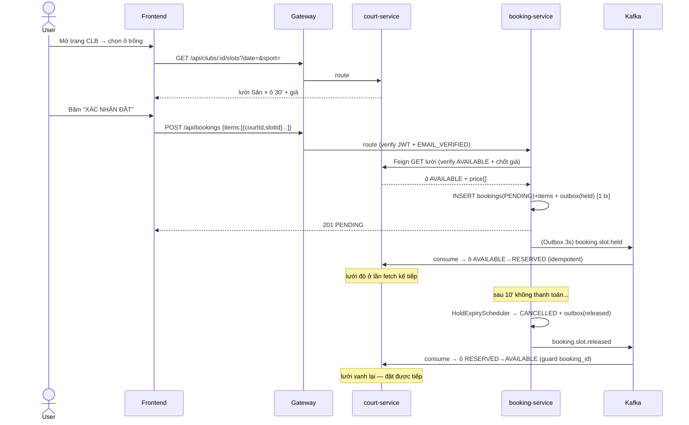
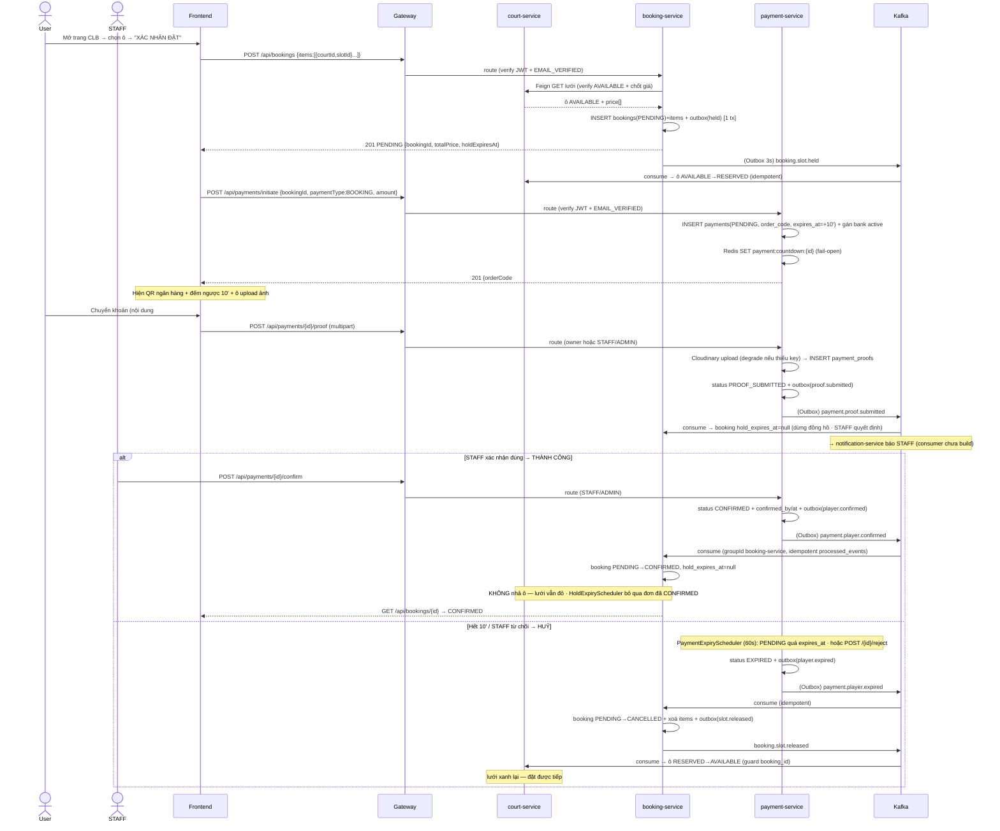

# 📋 Use Case: Đặt Lịch Ngày Trực Quan (Visual Day Booking)

> **Bản này mô tả luồng ĐANG CHẠY THẬT** (booking-service Day 7 + Saga giữ chỗ qua Kafka/Outbox).
> Mắt xích **thanh toán** (Bank QR → STAFF confirm → CONFIRMED) **chưa build** — đánh dấu ⏳ *Day 8* ở mục 8.
> Mô hình dữ liệu: `clubs` ──< `courts` (Sân) ──< `time_slots` (ô **30'**); giá từ `court_pricing_rules`;
> đơn = **header `bookings` + N `booking_items`** (mỗi item = 1 ô 30').

---

## 1. Tóm tắt nhanh

Người dùng mở trang CLB → xem **lưới Sân × ô 30'** → chọn vài ô trống → bấm Đặt. booking-service tạo **1 đơn
`PENDING`** (giữ ô bằng `UNIQUE(slot_id)`) và phát sự kiện để court-service **tô đỏ (RESERVED)** các ô đó. Vì
**chưa có thanh toán**, sau **10 phút** đơn tự **huỷ** và các ô **xanh trở lại**. Người dùng cũng có thể **huỷ tay**.

| Field | Detail |
|---|---|
| **Use Case ID** | UC-BOOKING-01 |
| **Module** | Booking |
| **Actor chính** | User đã đăng nhập (email đã xác thực) |
| **Trigger** | Chọn "Đặt lịch ngày trực quan" trên trang CLB |

## 2. Trạng thái hiện tại — ✅ đã có vs ⏳ chưa có

| Khâu | Trạng thái |
|---|---|
| Xem lưới Sân × ô 30' + giá (court-service) | ✅ đã có |
| Tạo đơn `PENDING` + `booking_items` + khoá Redis + snapshot giá | ✅ đã có |
| Giữ ô: court-service flip ô → `RESERVED` (qua Kafka Outbox) | ✅ đã có |
| Hết 10' không trả tiền → tự huỷ đơn + nhả ô → `AVAILABLE` | ✅ đã có |
| Huỷ tay (owner/STAFF) → nhả ô | ✅ đã có |
| **Thanh toán Bank QR → STAFF confirm → đơn `CONFIRMED`** | ⏳ **chưa có (Day 8)** |
| Email/Push xác nhận, escrow, hoàn tiền thật | ⏳ chưa có |

> ⚠️ Vì payment chưa có nên đơn **không bao giờ tới `CONFIRMED`** lúc này; kết cục thực tế là `CANCELLED`
> (do hết giờ hoặc huỷ tay). Bảng giá/refund tier vẫn được code sẵn, sẽ "sống dậy" ở Day 8.

## 3. Actor & Service

| Actor/Service | Vai trò trong luồng hiện tại |
|---|---|
| **User** | Khách đã đăng nhập (`is_email_verified=true` — rule #10), chọn ô + đặt |
| **api-gateway** | Verify JWT, route `lb://` |
| **court-service** | Chủ `clubs/courts/time_slots/pricing`; trả lưới + giá; **consumer Kafka** flip ô RESERVED/AVAILABLE |
| **booking-service** | Tạo `bookings`+`booking_items`; **Outbox producer**; scheduler hết-hạn-giữ-chỗ |
| ⏳ payment-service | (Day 8) Bank QR + STAFF confirm |

## 4. Tiền đề (Preconditions)
- User **đăng nhập**, JWT mang `email_verified=true` (token tự đủ để gác rule #10 — không cần gọi user-service).
- Đang ở trang **1 CLB** (`clubId`); court-service đã có `time_slots` 30' cho ngày chọn.
- Có ≥ 1 ô `AVAILABLE`.

## 5. Luồng chính — HIỆN TẠI

```
① BROWSE (sync, court-service)
   FE ─GET /api/clubs/{clubId}/slots?date=&sport=─▶ court-service
      → lưới: hàng = Sân, cột = ô 30' (05:00–22:00), mỗi ô { status, price=price_per_hour÷2 }
   FE render: chọn ô trống → bottom bar cộng "Tổng giờ / Tổng tiền" live → nút TIẾP THEO

② CREATE (sync, booking-service — 1 @Transactional)
   FE ─POST /api/bookings { clubId, date, customerName, customerPhone, note, items:[{courtId,slotId}] }─▶
      gateway verify JWT → booking-service:
      @PreAuthorize hasAnyRole(USER/COACH/STAFF/ADMIN) AND hasAuthority(EMAIL_VERIFIED)
      1. chống chọn trùng trong đơn
      2. Redis lock:slot:{id} cho TẤT CẢ ô (TTL 5s, all-or-nothing; Redis chết → fail-open)
      3. pre-check existsBySlotIdIn → 409 nếu ô đã thuộc đơn khác
      4. Feign GET lưới court-service → verify ô còn AVAILABLE + chốt giá/tên sân/giờ (snapshot)
      5. INSERT bookings(PENDING) + N booking_items (UNIQUE slot_id; flush → 409 nếu vừa bị chiếm)
      6. set hold_expires_at = now + 10 phút
      7. INSERT outbox_events(booking.slot.held)   ← cùng transaction (Outbox)
      8. nhả Redis lock → trả 201 (PENDING)
   ⇒ Lúc này ô ở court_db VẪN AVAILABLE; chỗ đang giữ bằng booking_items.slot_id UNIQUE.

③ HOLD (async, Outbox → Kafka → court)
   booking OutboxPublisher (3s) → publish booking.slot.held → court BookingEventListener:
      idempotency (processed_events) → holdSlots: ô AVAILABLE→RESERVED, set booking_id → ack
   ⇒ Sau ~vài giây, lưới hiện ĐỎ (RESERVED) ở lần fetch kế tiếp.

④ TIMEOUT (async, booking-service scheduler) — vì chưa có thanh toán
   HoldExpiryScheduler (60s): bookings PENDING quá hold_expires_at
      → CANCELLED (PAYMENT_TIMEOUT), xoá booking_items, refund=0
      → INSERT outbox_events(booking.slot.released)
   → court releaseSlots: ô RESERVED→AVAILABLE (chỉ nhả ô có booking_id khớp) → xanh lại, đặt được tiếp.
```

## 6. Saga giữ chỗ (choreography qua Outbox)

```
CREATE ──held(outbox)──▶ Kafka ──▶ court: AVAILABLE→RESERVED        (lưới đỏ)
TIMEOUT/CANCEL ──released(outbox)──▶ Kafka ──▶ court: RESERVED→AVAILABLE (lưới xanh, guard theo booking_id)
```
- **Outbox**: event ghi cùng transaction với đơn → không mất, không phát nhầm đơn rollback.
- **Idempotency**: court `processed_events` (key = eventId) → event lặp = no-op.
- **Ownership guard**: release chỉ nhả ô `booking_id` đúng đơn → không cướp ô của đơn khác.
- **Retry + DLT**: court lỗi → 2s/4s/8s ×3 → `{topic}.DLT`.

## 7. Huỷ tay (CANCEL)

```
FE ─POST /api/bookings/{id}/cancel {reason?}─▶ booking-service  (owner HOẶC STAFF/ADMIN)
   → state guard (CANCELLED/COMPLETED → 409)
   → đọc slotIds TRƯỚC khi xoá
   → refund = (status==CONFIRMED) ? total_price × %tier(earliest_start_time) : 0   (hiện luôn 0)
        %tier: >24h=100% · 2–24h=50% · <2h=0%
   → CANCELLED + xoá items + outbox(booking.slot.released)  (cùng 1 transaction)
   → court nhả ô (giống ④)
```
Đọc đơn: `GET /api/bookings/{id}` (chủ đơn/STAFF) · `GET /api/bookings` (của mình; STAFF/ADMIN xem tất cả).

## 8. ⏳ Phần CHƯA CÓ — thanh toán → CONFIRMED (Day 8)

Mục tiêu khi có **payment-service**: sau CREATE, FE gọi `POST /api/payments/initiate` → Bank QR + countdown 10';
user chuyển khoản + upload proof → STAFF confirm → Kafka `payment.player.confirmed` → booking `PENDING→CONFIRMED`
(đơn không còn bị scheduler huỷ; ô giữ luôn RESERVED). Khi đó:
- `computeRefund` nhánh CONFIRMED mới chạy (refund > 0 khi huỷ đơn đã trả).
- Hoàn tiền thật = STAFF chuyển khoản tay (`manual_refunds`).
- Có email/push xác nhận.

## 9. 3 lớp giữ chỗ (đã đủ cả 3)

| Lớp | Phạm vi | Vai trò |
|---|---|---|
| `lock:slot:{id}` Redis 5s | khoảnh khắc tạo đơn | chống 2 request đồng thời |
| `booking_items.slot_id` UNIQUE | suốt đời đơn | chống double-book ở DB (409) |
| `time_slots.status=RESERVED` | từ held đến released | làm lưới đỏ cho người khác |

## 10. Nhánh lỗi (Exceptions)
- **Race khi tạo**: 1 ô khoá thất bại / vi phạm UNIQUE → **409**, huỷ nguyên đơn (atomic), FE báo "ô vừa bị đặt, chọn lại".
- **Ô không AVAILABLE** lúc verify (đã RESERVED/BLOCKED/EVENT) → 409, không tạo đơn.
- **Validate form** (tên rỗng / SĐT sai `^\+?[0-9]{8,15}$`) → 400, không gọi tạo đơn.
- **court-service không tới được** (Feign lỗi) → fail-closed, không đoán giá → báo lỗi, không tạo đơn.
- **Huỷ 2 lần / huỷ đơn COMPLETED** → 409 INVALID_STATE.

## 11. Business Rules (hiện hành)
| ID | Rule |
|---|---|
| BR-01 | Chỉ user đăng nhập + email đã xác thực mới đặt được (gác bằng authority `EMAIL_VERIFIED` từ JWT) |
| BR-02 | Không đặt ô quá khứ (date ≥ hôm nay) |
| BR-03 | Đơn vị tối thiểu = 1 ô 30' = 1 `booking_item` |
| BR-04 | 1 đơn gồm nhiều ô/nhiều sân của **cùng 1 CLB** |
| BR-06 | Redis lock TTL 5s, khoá tất cả ô trong 1 transaction |
| BR-07 | Giá mỗi ô = `court_pricing_rules.price_per_hour ÷ 2` (WALK_IN) |
| BR-08 | `customer_type` mặc định = WALK_IN |
| BR-09 | Giá **snapshot** vào `booking_items.price` lúc đặt — không đọc live về sau |
| BR-10 | Refund tier theo `earliest_start_time`: >24h=100% · 2–24h=50% · <2h=0% (× tiền đã trả; hiện =0 vì chưa có payment) |
| BR-12 | Hết **10 phút** chưa thanh toán → đơn tự `CANCELLED` + nhả ô (hold window = payment window) |

## 12. API thật hiện có

| Method | Endpoint | Mô tả | Auth |
|---|---|---|---|
| GET | `/api/clubs/:clubId/slots?date=&sport=` | Lưới ô 30' + giá | public |
| GET | `/api/clubs/:clubId` | Thông tin CLB | public |
| GET | `/api/clubs/:clubId/pricing?sport=` | Bảng giá | public |
| POST | `/api/bookings` | Tạo header+items (PENDING), phát held | USER+ email-verified |
| GET | `/api/bookings/:id` | Xem 1 đơn | chủ đơn / STAFF / ADMIN |
| GET | `/api/bookings` | Danh sách (của mình; STAFF/ADMIN: tất cả) | đã đăng nhập |
| POST | `/api/bookings/:id/cancel` | Huỷ đơn → nhả ô | chủ đơn / STAFF / ADMIN |
| ⏳ | `/api/payments/**` | Bank QR + confirm | (Day 8) |

**Kafka (hiện có):** `booking.slot.held`, `booking.slot.released` (booking → court).
**Routing:** `/api/clubs/**`,`/api/courts/**` → `lb://court-service`; `/api/bookings/**` → `lb://booking-service`.

## 13. Sequence (luồng hiện tại)



## 14. Sequence — luồng FULL có thanh toán (Day 8 đã build)

> Nối tiếp mục 13: sau khi đơn `PENDING` + ô `RESERVED`, FE mở màn **Bank QR**. Hai kết cục:
> **thành công** = STAFF confirm → `payment.player.confirmed` → booking `CONFIRMED` (ô **giữ** RESERVED);
> **hết hạn/từ chối** = `payment.player.expired` → booking `CANCELLED` + **nhả ô**.
> Mọi event payment phát qua **Outbox** (3s); booking consume **idempotent** (`processed_events`) + manual-ack + DLT.



**Ghi chú khớp code Day 8:**
- **Hai đồng hồ 10'**: booking `HoldExpiryScheduler` (theo `hold_expires_at`) và payment `PaymentExpiryScheduler` (theo `expires_at`) đều dài 10'. **Trước khi có proof**: cái nào chạy trước huỷ đơn; cái sau **no-op** (đơn không còn `PENDING`) + idempotency. **Khi user upload proof** → booking nghe `payment.proof.submitted` set `hold_expires_at=null` (dừng đồng hồ booking; payment cũng bỏ qua `PROOF_SUBMITTED`) ⇒ **sau proof cả 2 phía chờ STAFF** quyết định (`confirm`→CONFIRMED / `reject`→huỷ + nhả ô). Đặt `PAYMENT_EXPIRE_MINUTES`=`BOOKING_HOLD_MINUTES`.
- **Topic theo `payment_type`**: BOOKING/MATCH_PLAYER → `payment.player.*`; MATCH_HOST → `payment.host.*`. booking **chỉ** nghe `payment.player.confirmed/expired`; nếu payload `bookingId=null` (vd event MATCH_PLAYER) → booking **ack bỏ qua**.
- **`order_code`** = Postgres `bigserial` (`@Generated` đọc lại sau INSERT), hiển thị `"#"+value` (vd `#184`) — user ghi vào nội dung chuyển khoản.
- **Cloudinary degrade**: thiếu key → `image_url = local-fallback://proof/{uuid}` (luồng vẫn chạy để test); điền key thật để upload thật.
- **API payment mới**: `POST /api/payments/initiate` (USER/COACH + email-verified) · `/{id}/proof` (owner/STAFF, multipart) · `/{id}/confirm` · `/{id}/reject` · `/{id}/refund` (STAFF/ADMIN) · `GET /{id}` · `GET /` (của mình) · `GET /api/bank-accounts/active`. Refund (`/{id}/refund`) = STAFF chuyển khoản tay → `manual_refunds` → `payment.refund.processed`.
