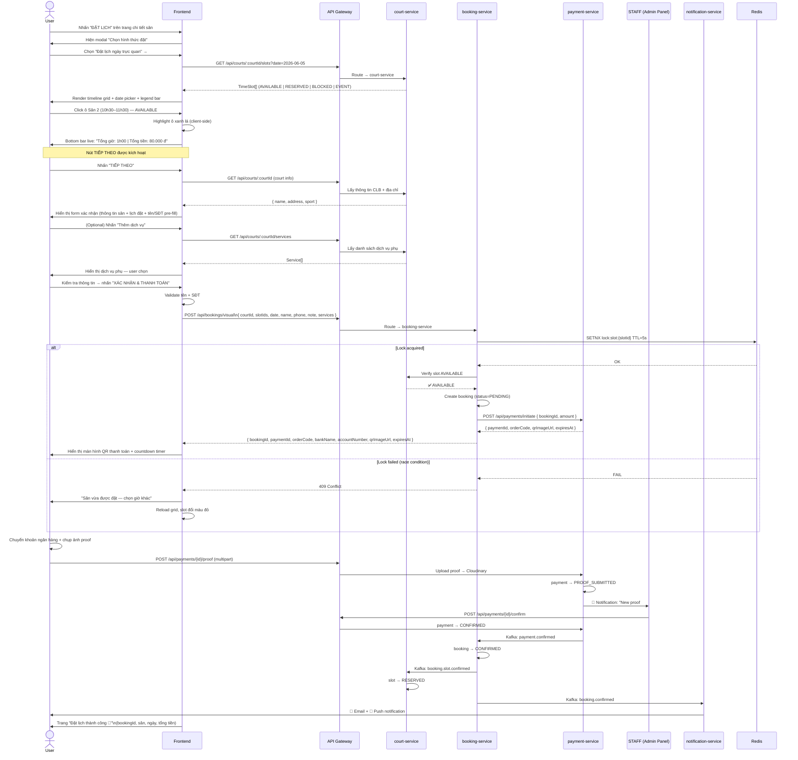
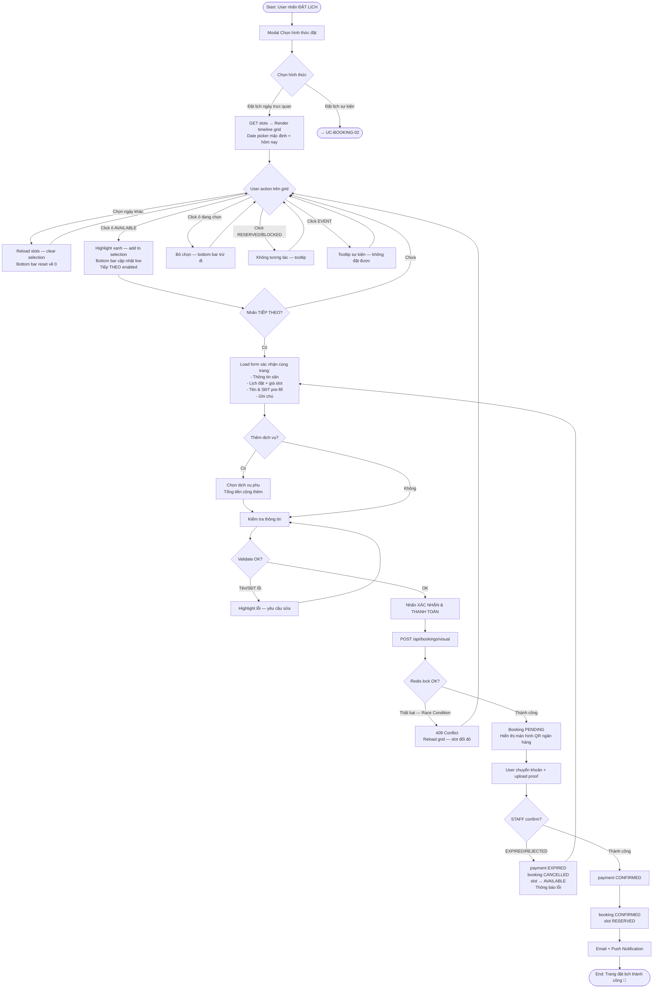

# 📋 Use Case: Đặt Lịch Ngày Trực Quan (Visual Day Booking)

---

## 1. Use Case Overview

| Field | Detail |
|---|---|
| **Use Case ID** | UC-BOOKING-01 |
| **Use Case Name** | Đặt Lịch Ngày Trực Quan |
| **English Name** | Visual Day Booking |
| **Module** | Booking |
| **Priority** | High |
| **Actor(s)** | User (primary), Court System (secondary), payment-service (secondary — Bank QR + STAFF confirm) |
| **Trigger** | User chọn **"Đặt lịch ngày trực quan"** từ modal **"Chọn hình thức đặt"** |
| **URL** | `datlich.alobo.vn/userBooking` |

---

## 2. Actors

| Actor | Role |
|---|---|
| **User** | Khách hàng đã đăng nhập, muốn đặt sân theo khung giờ cụ thể |
| **Court System** | Cung cấp danh sách sân và trạng thái slot theo ngày |
| **payment-service** | Hiển thị QR ngân hàng, xử lý proof upload, STAFF xác nhận thủ công |
| **Notification Service** | Gửi email/push notification xác nhận đặt lịch |

---

## 3. Preconditions

- ✅ User đã **đăng nhập** (có JWT hợp lệ, tên & SĐT đã có trong profile)
- ✅ User đã **chọn court** cụ thể (`courtId` xác định)
- ✅ System đã load được danh sách **time slots** cho court đó
- ✅ Có ít nhất **1 slot AVAILABLE** trong ngày được chọn

---

## 4. Postconditions

### Success
- 📌 Booking được tạo với `status = CONFIRMED` trong `booking_db`
- 📌 Time slot tương ứng chuyển sang `status = RESERVED` trong `court_db`
- 📌 Payment được ghi nhận `status = CONFIRMED` trong `payment_db`
- 📌 User nhận **email + push notification** xác nhận
- 📌 Booking hiển thị trong **Dashboard** của user

### Failure / Rollback
- 🔁 Slot được trả về `status = AVAILABLE` (compensating transaction)
- 🔁 Redis distributed lock được release
- 🔁 Payment bị `status = EXPIRED` (timeout) hoặc `REJECTED` (STAFF từ chối)

---

## 5. Main Success Flow

```
Bước  Actor           Hành động
───────────────────────────────────────────────────────────────────────────────
 1.   User            Mở trang chi tiết sân → nhấn nút "ĐẶT LỊCH"

 2.   System          Hiển thị modal "Chọn hình thức đặt":
                        ┌────────────────────────────────────┐
                        │  Đặt lịch ngày trực quan      →   │  ← màu xanh lá
                        │  Đặt lịch ngày khi khách chơi     │
                        │  nhiều khung giờ, nhiều sân.       │
                        ├────────────────────────────────────┤
                        │  Đặt lịch sự kiện          🆕  →  │  ← màu hồng/tím
                        │  Sự kiện giúp bạn chơi chung...   │
                        └────────────────────────────────────┘

 3.   User            Chọn "Đặt lịch ngày trực quan" → nhấn "→"

 4.   System          Navigate đến trang timeline grid.
                      Gọi GET /api/courts/:courtId/slots?date=<today>
                      Render giao diện:
                        • Date picker (top-right): mặc định = hôm nay
                        • Legend bar: ■ Trống | ■ Đã đặt | ■ Khoá | ! Sự kiện
                                      + link "Xem sân & bảng giá"
                        • Banner vàng: "Lưu ý: Nếu bạn cần đặt lịch tháng
                          vui lòng liên hệ 0908 334 461 để được hỗ trợ"
                        • Timeline grid: hàng = Sân 1–N,
                                         cột = 5:00 → 22:00 (bước 30 phút)
                        • Bottom summary bar (ẩn/thu gọn ban đầu):
                          "Tổng giờ: 0h00"  |  "Tổng tiền: 0 đ"
                        • Nút "TIẾP THEO" (yellow) — bị disabled

 5.   User            (Tùy chọn) Chọn ngày khác từ date picker (top-right)

 6.   System          Reload slots cho ngày được chọn, clear mọi selection

 7.   User            Click vào ô AVAILABLE trên lưới (ví dụ: Sân 2, 10h30–11h30)
                        • Ô được chọn: highlight màu xanh lá nhạt
                          với viền xanh đậm
                        • Bottom summary bar tự động cập nhật live:
                            "Tổng giờ: 1h00"  |  "Tổng tiền: 80.000 đ"
                        • Nút "TIẾP THEO" (yellow) được kích hoạt

 8.   User            (Tùy chọn) Nhấn mũi tên "^" để mở rộng / thu gọn
                       bottom summary bar

 9.   User            Nhấn "TIẾP THEO"

10.   System          Cuộn / navigate đến form xác nhận (cùng trang hoặc
                      section phía dưới), hiển thị:

                      ┌─────────────────────────────────────────────────────┐
                      │  🏟 Thông tin sân                                   │
                      │  Tên CLB: An Bình Pickleball                        │
                      │  Địa chỉ: 12/15 Kha Vạn Cân, Kp.Bình Đường 2,     │
                      │           P.Dĩ An, Tp.HCM                           │
                      ├─────────────────────────────────────────────────────┤
                      │  📋 Thông tin lịch đặt                              │
                      │  Ngày: 05/06/2026                                   │
                      │  - Sân 2: 10h30 - 11h30  |  80.000 đ  ← (màu vàng)│
                      │  Đối tượng: Pickleball                              │
                      │  Tổng giờ: 1h00                                     │
                      │  Tổng tiền: 80.000 đ                                │
                      ├─────────────────────────────────────────────────────┤
                      │  [ Thêm dịch vụ ]  ← nút outline, optional         │
                      ├─────────────────────────────────────────────────────┤
                      │  TÊN CỦA BẠN                                        │
                      │  [Phúc                               ✕]             │
                      │  SỐ ĐIỆN THOẠI                                      │
                      │  [🇻🇳 +84  |  399158632              ✕]             │
                      │  GHI CHÚ CHO CHỦ SÂN                                │
                      │  [___________________________________]               │
                      └─────────────────────────────────────────────────────┘
                      • Tên và SĐT được pre-fill từ profile đã đăng nhập
                      • User có thể sửa trước khi xác nhận

11.   User            (Tùy chọn) Nhấn "Thêm dịch vụ" để thêm dịch vụ phụ
                       (bóng, vợt, nước uống, ...) — tính thêm vào tổng tiền

12.   User            Kiểm tra thông tin → nhấn "XÁC NHẬN & THANH TOÁN"

13.   System          Gọi POST /api/bookings/visual
                        Body: { courtId, slotIds[], date, name, phone, note }
                        • Acquire Redis lock: lock:slot:{slotId} TTL 5s
                        • Kiểm tra slot vẫn AVAILABLE
                        • Tạo booking: status = PENDING
                        • Gọi POST /api/payments/initiate
                        → Trả về { bookingId, paymentId, orderCode, bankName,
                                     accountNumber, accountName, qrImageUrl, expiresAt }

14.   System          Hiển thị màn hình thanh toán (giống datlich.alobo.vn/sportPaymentScreen):
                        ┌──────────────────────────────────────────────────────────────┐
                        │ 1. Tài khoản ngân hàng                                │
                        │    Tên TK:    [account_name]                         │
                        │    Số TK:     [account_number]     [ 📋 copy ]       │
                        │    Ngân hàng: [bank_name]                            │
                        │    [QR Code image]                                   │
                        │ 2. ⚠️ Chuyển khoản [total_price] đ                 │
                        │    và gửi ảnh vào ô bên dưới                       │
                        │ 3. Nội dung: [orderCode e.g. #184]                   │
                        │ 4. Đơn của bạn còn được giữ trong: ⏱ 09:59        │
                        │ 5. [Upload zone: Nhấn vào để tải hình thanh toán (*)]  │
                        │ 6. [XÁC NHẬN ĐẶT] button (enabled after upload)     │
                        └──────────────────────────────────────────────────────────────┘

15.   User            Chuyển khoản ngân hàng + chụp ảnh xác nhận
                        → Upload ảnh proof → POST /api/payments/{id}/proof
                        → payment.status = PROOF_SUBMITTED

16.   STAFF           Nhận notification • Vào Admin Panel
                        → Kiểm tra sao kê ngân hàng khớp với orderCode
                        → Click CONFIRM
                        → payment.status = CONFIRMED
                        → Kafka: payment.confirmed

17.   System          Xác nhận payment → publish Kafka events:
                        • payment-service: payment → CONFIRMED
                        • booking-service: booking → CONFIRMED
                        • court-service: slot → RESERVED
                        • notification-service: gửi email + push

18.   System          Redirect user về trang "Đặt lịch thành công"
                        • Hiển thị: booking ID, tên CLB, sân, ngày giờ, tổng tiền
```

---

## 6. Alternative Flows

### Alt-A: User thay đổi ngày (Bước 5)
```
5a.1  User nhấn vào date picker (top-right)
5a.2  Chọn ngày khác
5a.3  System xóa toàn bộ slot đang được chọn
5a.4  Bottom summary bar reset: "Tổng giờ: 0h00 | Tổng tiền: 0 đ"
5a.5  Nút "TIẾP THEO" trở lại disabled
5a.6  System gọi lại GET /api/courts/:courtId/slots?date=<newDate>
5a.7  Re-render timeline grid với dữ liệu mới
      → Quay lại bước 7
```

### Alt-B: User bỏ chọn slot (Bước 7)
```
7b.1  User click lại vào ô đang được chọn (highlight xanh)
7b.2  Ô trở về màu AVAILABLE (trắng/xanh nhạt)
7b.3  Bottom summary bar cập nhật live (trừ đi thời gian & tiền)
7b.4  Nếu không còn slot nào → "Tổng giờ: 0h00 | Tổng tiền: 0 đ"
      → nút "TIẾP THEO" disabled
      → Tiếp tục ở bước 7
```

### Alt-C: User quay lại từ form xác nhận (Bước 10)
```
10c.1 User nhấn nút "←" (back) trên trình duyệt hoặc header
10c.2 System quay về timeline grid
10c.3 Các slot đã chọn vẫn được giữ highlight (không mất selection)
10c.4 Bottom summary bar vẫn hiển thị đúng tổng giờ & tổng tiền
      → Quay lại bước 7
```

### Alt-D: User chỉnh sửa tên hoặc SĐT (Bước 10)
```
10d.1 Tên và SĐT được pre-fill từ profile
10d.2 User xóa và nhập lại thông tin khác (dùng cho người khác đặt hộ)
10d.3 Nhấn ✕ cuối ô để xóa nhanh nội dung
10d.4 Validate: tên không được rỗng, SĐT phải hợp lệ
      → Tiếp tục bước 12 sau khi hợp lệ
```

### Alt-E: User thêm dịch vụ phụ (Bước 11)
```
11e.1 User nhấn "Thêm dịch vụ"
11e.2 System hiển thị danh sách dịch vụ của court
        (bóng, vợt cho thuê, nước uống, khăn, ...)
11e.3 User chọn dịch vụ + số lượng
11e.4 Tổng tiền được cộng thêm phí dịch vụ
11e.5 Danh sách dịch vụ hiển thị dưới "Thông tin lịch đặt"
      → Tiếp tục bước 12
```

---

## 7. Exception Flows

### Exc-1: Slot bị chiếm khi đang xử lý (Race Condition)
```
13e.1 Redis SETNX lock:slot:{slotId} thất bại
      (slot đã bị lock bởi user khác trong khoảng thời gian user điền form)
13e.2 System trả về lỗi 409 CONFLICT
13e.3 Hiển thị thông báo:
       "Sân 2 khung giờ 10h30–11h30 vừa được đặt bởi người khác.
        Vui lòng chọn khung giờ khác."
13e.4 Reload lại timeline grid — slot đó đổi màu RESERVED (đỏ)
      → Quay lại bước 7
```

### Exc-2: Click vào slot không khả dụng (Bước 7)
```
7e.1  User click vào ô màu đỏ (Đã đặt) hoặc xám (Khoá)
7e.2  System không xử lý click — ô không tương tác
7e.3  Tooltip/hover hiển thị trạng thái: "Đã đặt" / "Đang khoá"
      (EVENT slot: tooltip hiển thị tên sự kiện)
```

### Exc-3: Click vào slot EVENT (Bước 7)
```
7e.1  User click vào ô màu tím (Sự kiện)
7e.2  System hiển thị tooltip/popup thông tin sự kiện đó
7e.3  Không thể chọn để đặt — chỉ xem thông tin
7e.4  Tooltip gợi ý: "Chuyển sang Đặt lịch sự kiện để mua vé"
```

### Exc-4: Validate form thất bại (Bước 12)
```
12e.1 User nhấn "XÁC NHẬN & THANH TOÁN" với:
        • Tên để trống
        • SĐT không đúng định dạng (+84 + 9 chữ số)
12e.2 System highlight ô bị lỗi màu đỏ
12e.3 Hiển thị error message ngay dưới ô:
        "Vui lòng nhập tên" / "Số điện thoại không hợp lệ"
12e.4 Không gọi API — yêu cầu sửa lại
      → Quay lại bước 12
```

### Exc-5: Thanh toán thất bại (EXPIRED hoặc REJECTED bởi STAFF)
```
16e.1 Proof không upload kịp (hết 10 phút) → payment EXPIRED
      hoặc STAFF kiểm tra không khớp → click REJECT
16e.2 payment-service: payment → EXPIRED
16e.3 booking-service compensate: booking → CANCELLED
16e.4 court-service compensate: slot → AVAILABLE
16e.5 Redis lock được release
16e.6 Hiển thị thông báo:
       "Thanh toán không được xác nhận. Slot đã được trả lại.
        Vui lòng thử lại."
      → Có nút "Thử lại" → quay lại form xác nhận (bước 10)
```

### Exc-6: Lỗi mạng / server timeout
```
*e.1  API call thất bại (network error hoặc 5xx)
*e.2  Frontend hiển thị toast: "Có lỗi xảy ra. Vui lòng thử lại."
*e.3  Nút "XÁC NHẬN & THANH TOÁN" có thể retry
```

---

## 8. Business Rules

| ID | Rule |
|---|---|
| BR-01 | Chỉ user đã **đăng nhập** mới được đặt lịch |
| BR-02 | Không thể đặt slot trong **quá khứ** (date < today hoặc giờ đã qua) |
| BR-03 | Tối thiểu đặt **30 phút** (1 ô trên grid) |
| BR-04 | Có thể chọn **nhiều sân khác nhau** trong cùng 1 lần đặt |
| BR-05 | Slot màu tím (**EVENT**) không thể chọn qua flow này |
| BR-06 | Redis distributed lock TTL = **5 giây** |
| BR-07 | **Tổng tiền** = Σ `(số giờ × đơn giá sân)` + phí dịch vụ phụ |
| BR-08 | Tên và SĐT **pre-fill** từ profile, user được phép sửa |
| BR-09 | Nếu cần đặt **lịch tháng** → liên hệ hotline **0908 334 461** |
| BR-10 | Bottom summary bar **cập nhật live** mỗi khi user chọn/bỏ chọn slot |

---

## 9. Sequence Diagram



---

## 10. Activity Diagram



---

## 11. UI Screens — Thực tế từ ảnh

### Screen 1 — Timeline Grid (datlich.alobo.vn/userBooking)

```
┌─────────────────────────────────────────────────────────────────────────────┐
│  ←    Đặt lịch ngày trực quan                        [05/06/2026  📅]       │
├─────────────────────────────────────────────────────────────────────────────┤
│  ■ Trống  ■ Đã đặt  ■ Khoá  ! Sự kiện    Xem sân & bảng giá               │
├─────────────────────────────────────────────────────────────────────────────┤
│  ⚠️ Lưu ý: Nếu bạn cần đặt lịch tháng vui lòng liên hệ 0908 334 461      │
├─────────────────────────────────────────────────────────────────────────────┤
│  Time →  5:00 5:30 6:00 ... 10:00 10:30 11:00 11:30 ... 21:30 22:00        │
│  Sân 1   [    trống    ] [                              trống              ]│
│  Sân 2   [    trống    ] [██SELECTED 10:30–11:30██] [   trống             ]│
│  Sân 3   [    trống    ] [                              trống              ]│
│  Sân 4   [    trống    ] [                              trống              ]│
│  Sân 5   [  ██Đà ĐẶT██ ] [                              trống              ]│
├─────────────────────────────────────────────────────────────────────────────┤
│                                              [● ──────────────────── ] scroll│
│                                    ^  (thu gọn/mở rộng bottom bar)          │
│  (dark green) Tổng giờ: 1h00                         Tổng tiền: 80.000 đ   │
│  ╔═══════════════════════════════════════════════════════════════════════╗  │
│  ║                          TIẾP THEO                                   ║  │
│  ╚═══════════════════════════════════════════════════════════════════════╝  │
└─────────────────────────────────────────────────────────────────────────────┘

Màu ô theo trạng thái:
  AVAILABLE  → Trắng (click được)
  SELECTED   → Xanh lá nhạt + viền xanh đậm (đã chọn)
  RESERVED   → Đỏ/hồng — "Đã đặt" (không click)
  BLOCKED    → Xám — "Khoá" (không click)
  EVENT      → Tím/hồng tím — "Sự kiện" (chỉ xem)
```

### Screen 2 — Form Xác Nhận (sau khi nhấn TIẾP THEO)

```
┌─────────────────────────────────────────────────────────────────────────────┐
│  ←    Đặt lịch ngày trực quan                                               │
├─────────────────────────────────────────────────────────────────────────────┤
│  🏟 Thông tin sân                                                            │
│  Tên CLB: An Bình Pickleball                                                 │
│  Địa chỉ: 12/15 Kha Vạn Cân, Kp.Bình Đường 2, P.Dĩ An, Tp.HCM             │
├─────────────────────────────────────────────────────────────────────────────┤
│  📋 Thông tin lịch đặt                                                       │
│  Ngày: 05/06/2026                                                            │
│  - Sân 2: 10h30 - 11h30  |  80.000 đ          ← giá slot màu vàng/cam      │
│  Đối tượng: Pickleball                                                       │
│  Tổng giờ: 1h00                                                              │
│  Tổng tiền: 80.000 đ                                                         │
├─────────────────────────────────────────────────────────────────────────────┤
│  [         Thêm dịch vụ         ]    ← nút outline (optional)               │
├─────────────────────────────────────────────────────────────────────────────┤
│  TÊN CỦA BẠN                                                                │
│  [Phúc                                                              ✕]      │
│  SỐ ĐIỆN THOẠI                                                               │
│  [🇻🇳 +84  ▼  |  399158632                                          ✕]      │
│  GHI CHÚ CHO CHỦ SÂN                                                        │
│  [                                                                      ]    │
├─────────────────────────────────────────────────────────────────────────────┤
│  ╔═══════════════════════════════════════════════════════════════════════╗  │
│  ║                    XÁC NHẬN & THANH TOÁN                             ║  │
│  ╚═══════════════════════════════════════════════════════════════════════╝  │
└─────────────────────────────────────────────────────────────────────────────┘
```

### Screen 3 — Modal Chọn Hình Thức Đặt

```
┌────────────────────────────────────────────────┐
│                Chọn hình thức đặt           ✕  │
├────────────────────────────────────────────────┤
│ ┌──────────────────────────────────────────┐   │
│ │  Đặt lịch ngày trực quan                │   │
│ │  Đặt lịch ngày khi khách chơi nhiều     │   │
│ │  khung giờ, nhiều sân.          [→]     │   │  ← nền xanh lá nhạt
│ └──────────────────────────────────────────┘   │
│ ┌──────────────────────────────────────────┐   │
│ │  Đặt lịch sự kiện              🆕        │   │
│ │  Sự kiện giúp bạn chơi chung với người  │   │
│ │  có cùng niềm đam mê, trình độ...  [→]  │   │  ← nền hồng/tím nhạt
│ └──────────────────────────────────────────┘   │
└────────────────────────────────────────────────┘
```

---

## 12. Backend Services Involved

| Service | Trách nhiệm |
|---|---|
| `court-service` | Cung cấp slots theo ngày, thông tin CLB, dịch vụ phụ, cập nhật slot status |
| `booking-service` | Tạo booking, orchestrate Saga, idempotency guard |
| `payment-service` | Tạo PENDING payment, trả về bank QR info, nhận proof upload, STAFF confirm, queue refund |
| `notification-service` | Gửi email + push sau khi booking confirmed |
| **Redis** | Distributed lock `lock:slot:{slotId}` TTL 5s |
| **Kafka** | `payment.confirmed` → `booking.slot.confirmed` → `booking.confirmed` · `payment.proof.submitted` → STAFF notify |

---

## 13. API Endpoints

| Method | Endpoint | Mô tả |
|---|---|---|
| `GET` | `/api/courts/:courtId/slots?date=` | Lấy toàn bộ slots theo ngày |
| `GET` | `/api/courts/:courtId` | Thông tin CLB: tên, địa chỉ, môn thể thao |
| `GET` | `/api/courts/:courtId/services` | Danh sách dịch vụ phụ (bóng, vợt...) |
| `POST` | `/api/bookings/visual` | Tạo booking + initiate payment (trả về bank QR info) |
| `POST` | `/api/payments/initiate` | Tạo payment record + trả về { orderCode, bank QR, expiresAt } |
| `POST` | `/api/payments/{id}/proof` | User upload ảnh proof chuyển khoản |
| `POST` | `/api/payments/{id}/confirm` | STAFF xác nhận payment sau kiểm tra sao kê |
| `GET` | `/api/payments/pending-proofs` | STAFF xem danh sách PROOF_SUBMITTED chờ review |
| `GET` | `/api/bank-accounts` | Lấy thông tin TK ngân hàng active để hiển thị QR |
