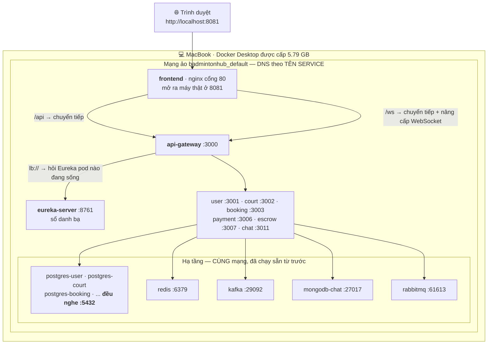
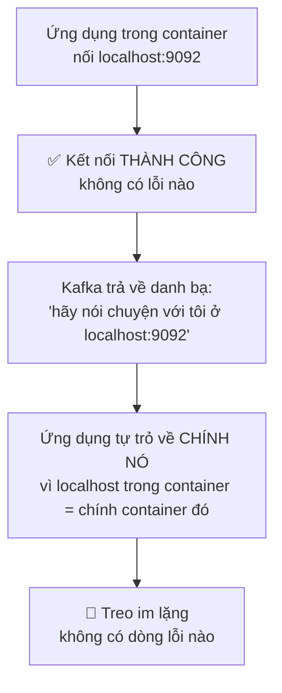
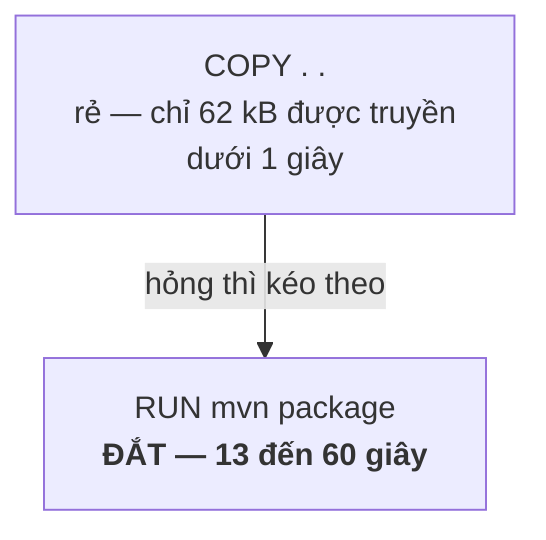
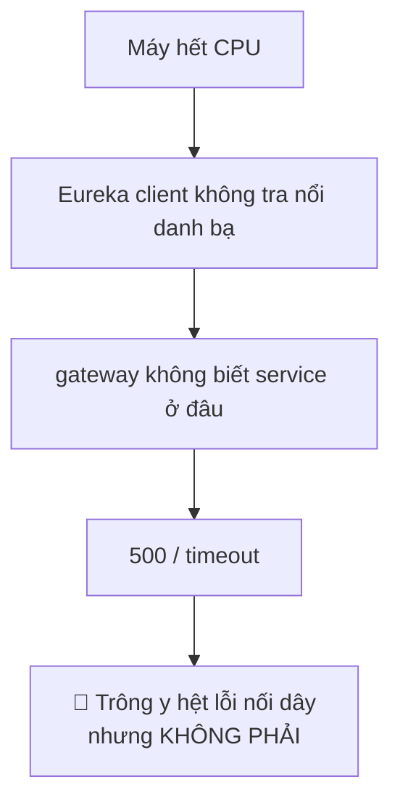
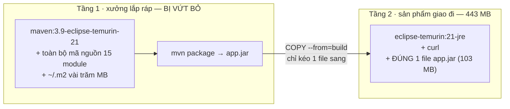
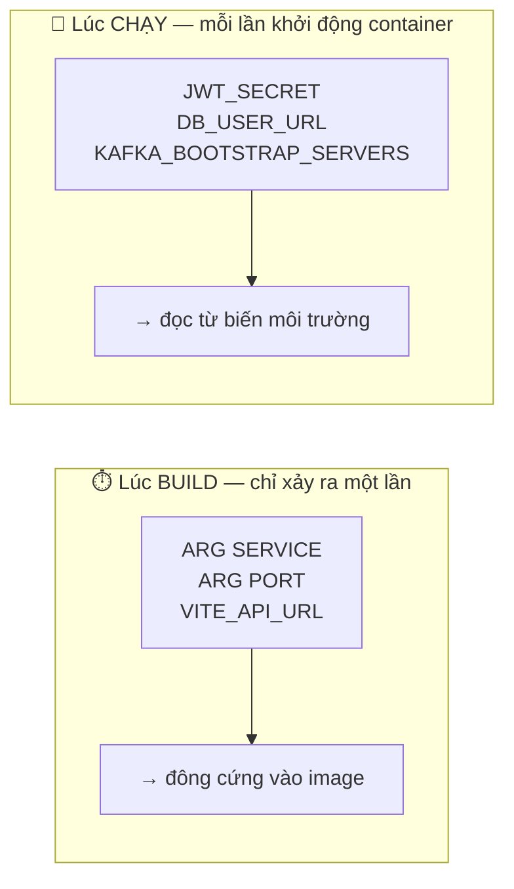

# Day 1 giải thích cho người mới

> Tài liệu này viết cho **người chưa từng dùng Docker**. Nó kể lại Day 1 đã làm gì, 15 chỗ bản thiết kế trên giấy sai khi chạy thật, và những khái niệm cần học — mỗi khái niệm gắn với đúng chỗ nó gây rắc rối.
>
> Khác với [`.claude/rules/`](../.claude/rules/): rule viết cho Claude đọc lúc đang code — súc tích, mệnh lệnh, giả định đã biết. File này giải thích **vì sao**.
>
> Day 2 (Helm + Kubernetes) có tài liệu tương ứng ở repo `badmintonHub-gitops`: `docs/DAY2-EXPLAINED.md`.

---

## 1. Day 1 giải quyết vấn đề gì?

Trước Day 1, để dựng cả hệ thống lên bạn phải làm chuỗi này:

```
cài JDK 21 đúng bản
  → mvn clean install toàn bộ 15 module
    → mở 7 cửa sổ terminal
      → nhớ thứ tự: eureka trước, rồi gateway, rồi 6 service
        → có sẵn file .env đúng (file này bị gitignore — không ai khác có)
          → và phải chạy từ đúng thư mục gốc, không thì .env không được nạp
```

Hệ thống không tồn tại như **một thứ**. Nó tồn tại như **một tập thói quen trong đầu bạn**. Không ai khác dựng lại được, kể cả chính bạn trên một máy mới.

Day 1 biến nó thành **9 hộp tự mô tả**: mỗi hộp chứa sẵn code, Java runtime, và một bản khai *"tôi cần biến môi trường gì, tôi nghe ở cổng nào"*. Máy nào có Docker cũng chạy ra kết quả y hệt.

### Vì sao phải làm trước Day 2?

Mọi ngày sau đều bắt đầu từ giả định **"đã có image chạy được"**:

| Day | Cần gì từ Day 1 |
|---|---|
| Day 2 — Helm | `image.repository` + `image.tag` + danh sách biến môi trường |
| Day 3 — Terraform | 9 kho chứa ECR, mỗi kho một image |
| Day 4 — Deploy EKS | Image phải là kiến trúc `amd64` |
| Day 5 — CI | Pipeline chỉ làm đúng một việc: build image rồi đẩy lên ECR |

Nếu Dockerfile sai, bạn sẽ phát hiện ở Day 4 — lúc pod báo `CrashLoopBackOff` trên một cụm EKS **đang tính tiền theo giờ**. Sửa ở đó đắt hơn sửa ở local khoảng 10 lần, vì mỗi vòng thử phải chờ build → push → pull → deploy.

Phiên này chứng minh quyết định đó đúng: **15 chỗ sai** đã bị bắt trên laptop, hoàn toàn miễn phí.

---

## 2. Đã dựng những gì

| Thành phần | Nội dung | Lý do tồn tại |
|---|---|---|
| [`Dockerfile`](../Dockerfile) | **Một khuôn** dùng chung cho cả 8 service Java, chọn service bằng `--build-arg SERVICE=` | 8 service khác nhau ở tên/cổng nhưng **giống hệt nhau ở cách đóng gói**. Viết 1 khuôn thay vì 8 bản sao |
| [`.dockerignore`](../.dockerignore) | Danh sách thứ **không** được gửi cho Docker | Repo nặng 1.4 GB nhưng source thật chỉ ~25 MB. Và `.env` chứa khoá thật |
| [`frontend/Dockerfile`](../frontend/Dockerfile) | Build React bằng Node → giao cho nginx phục vụ | Frontend không phải Java, cần khuôn riêng |
| [`frontend/nginx.conf`](../frontend/nginx.conf) | Phục vụ file tĩnh + chuyển tiếp `/api` và `/ws` sang gateway | Để trình duyệt chỉ nói chuyện với **một** địa chỉ duy nhất |
| [`docker-compose.app.yml`](../docker-compose.app.yml) | **Bản khai hệ thống**: 9 ứng dụng, ai gọi ai, biến môi trường nào | Dockerfile không biết gì về các container khác |
| 3 file frontend | Bỏ phụ thuộc `VITE_API_URL` cố định | Xem §A1 — đây là thay đổi có chủ ý, không phải sửa lặt vặt |

### Bản đồ — dựng xong thì trông thế này



**Mạng ảo** là thứ Docker tự tạo khi bạn chạy compose. Trong mạng đó, `postgres-user` là **một tên miền có thật** — không cần biết IP, không cần cấu hình gì thêm. Chính là các địa chỉ `172.18.0.x` bạn thấy khi tra sổ Eureka.

**Chỉ có `frontend` mở cổng ra máy thật** (8081) trong luồng chuẩn. Trình duyệt không bao giờ gọi thẳng gateway — mọi thứ đi qua nginx. Đó là điều khiến chỉ cần **một** image frontend cho mọi môi trường (xem §A1).

### Vì sao **một** Dockerfile cho cả 8 service?

Đây là quyết định quan trọng nhất về cấu trúc, và lý do nằm ở **Day 5**.

Day 5 sẽ dựng pipeline CI với "build matrix" — một cơ chế chạy cùng một công thức build cho 8 service khác nhau, chỉ đổi tham số. Cơ chế đó gọn nhất khi cả 8 dùng chung một khuôn.

Còn lý do trước mắt thì đơn giản hơn: 8 file riêng là 8 bản sao gần giống hệt nhau. Muốn đổi phiên bản Java, hay thêm một tham số JVM? Sửa 8 chỗ. Và lần thứ 7 bạn sẽ quên một chỗ — rồi ba tuần sau có đúng một service cư xử khác lạ mà không ai hiểu vì sao.

```bash
docker build --build-arg SERVICE=user-service  --build-arg PORT=3001 -t badmintonhub/user-service:dev  .
docker build --build-arg SERVICE=court-service --build-arg PORT=3002 -t badmintonhub/court-service:dev .
```

Cùng một file. Khác nhau đúng hai tham số.

---

## 3. Mười lăm phát hiện — nhóm theo *loại sai lầm*

Tôi nhóm theo loại thay vì theo thứ tự thời gian, vì như vậy bạn rút ra được **nguyên tắc** chứ không chỉ nhớ 15 sự kiện rời rạc.

### Nhóm A — Bản thiết kế trên giấy không sống sót khi chạy thật

#### A1. `nginx.conf` có phần chuyển tiếp, nhưng frontend **không thể** dùng nó

Kế hoạch Day 1 nói: viết `nginx.conf` chuyển tiếp `/api` và `/ws` sang gateway. Kế hoạch Day 4 nói: sửa frontend để dùng địa chỉ tương đối.

Hai việc đó **phụ thuộc nhau** — nhưng bị xếp cách nhau ba ngày.

Đọc code thật thì thấy frontend **bắt buộc** phải có biến `VITE_API_URL` là một địa chỉ tuyệt đối:

```ts
// frontend/src/lib/stompClient.ts — TRƯỚC khi sửa
const WS_URL = (import.meta.env.VITE_API_URL as string).replace(/^http/, 'ws') + '/ws'
//                                                      ↑
//              thiếu biến này → gọi .replace() trên undefined → TypeError
//              → chat chết ngay lúc trang vừa tải, chưa kịp làm gì
```

Nghĩa là nếu giữ nguyên thứ tự, phần chuyển tiếp trong `nginx.conf` **không bao giờ được gọi tới** — bạn viết một file trang trí.

Nhưng lý do thật sự để kéo việc Day 4 về Day 1 sâu hơn thế. `VITE_*` là biến **được nhét cứng vào file JavaScript lúc build** (xem §Tầng 3). Mà theo kế hoạch, cụm EKS bị xoá và dựng lại trước mỗi buổi demo — và **mỗi lần dựng lại thì địa chỉ của bộ cân bằng tải đổi**.

```
Nếu nhét cứng URL:
  mỗi buổi demo → build lại image frontend → đẩy lên ECR
                → sửa ConfigMap → chờ ArgoCD đồng bộ
                → khoảng 10 phút thao tác tay, ngay trước mặt khán giả
```

Cách sửa: cho frontend **tự đọc địa chỉ từ chính trang web đang mở**.

```ts
// SAU khi sửa
const sameOrigin = `${location.protocol === 'https:' ? 'wss' : 'ws'}://${location.host}/ws`
```

Kết quả: **một image frontend dùng cho mọi môi trường, vĩnh viễn**. Và Day 8 bật HTTPS thì `ws` tự thành `wss` — không build lại gì cả.

> **Nguyên tắc:** hai việc phụ thuộc nhau thì phải làm cùng nhau, dù kế hoạch xếp chúng cách xa. Kế hoạch là bản đồ, không phải hợp đồng.

#### A2. Hai biến **không có giá trị mặc định** — thiếu là ứng dụng không khởi động

Quét toàn bộ `application.yml` của 8 service, có đúng hai chỗ như thế này:

```yaml
jwt:
  secret: ${JWT_SECRET}                    # ← không có dấu : theo sau
sendgrid:
  api-key: ${SENDGRID_API_KEY}             # ← cũng không có
```

So với những biến khác:

```yaml
spring:
  data:
    redis:
      host: ${REDIS_HOST:localhost}        # ← có "localhost" làm mặc định
```

Dấu `:` chia đôi hai thế giới. Có mặc định → thiếu biến vẫn chạy được. Không có mặc định → Spring không điền được chỗ trống → **ứng dụng từ chối khởi động**.

Cái bẫy nằm ở `SENDGRID_API_KEY`: file `.env` trên máy đang để nó **rỗng**, và rỗng vẫn hợp lệ (chỗ trống được điền bằng chuỗi rỗng). Nhưng **không khai gì cả** thì khác hẳn. Nên trong compose phải viết:

```yaml
SENDGRID_API_KEY: ${SENDGRID_API_KEY:-}    # chuỗi rỗng CÓ CHỦ Ý, không phải bỏ trống
```

> **Nguyên tắc:** đây không phải sơ suất của dự án mà là quy ước có chủ đích — biến hạ tầng có mặc định để chạy được ngay, còn **bí mật thì cố tình không có mặc định để hỏng sớm và hỏng rõ**. Đừng "sửa cho dễ" bằng cách thêm mặc định cho bí mật.

#### A3. `pom.xml` gốc liệt kê 15 module ⇒ không thể copy lẻ vài module

Bản năng đầu tiên khi viết Dockerfile cho `user-service` là chỉ copy những gì nó cần:

```dockerfile
COPY pom.xml .
COPY common common
COPY common-security common-security
COPY user-service user-service
RUN mvn -pl user-service -am package
```

Chạy thì hỏng ngay dòng đầu:

```
Child module /app/matchmaking-service does not exist
```

Vì `pom.xml` gốc là **file tổng** liệt kê đủ 15 module, và Maven **đọc hết danh sách đó trước khi** biết bạn muốn build cái nào. Thiếu một thư mục là hỏng.

Nên phải `COPY . .` cả repo. Cái giá phải trả và cách bù lại nằm ở §C3–C4.

> **Nguyên tắc:** nguồn sự thật về "cần copy những gì" là **cấu trúc build thật**, không phải trực giác về "service này phụ thuộc gì".

---

### Nhóm B — Địa chỉ trong container khác địa chỉ trên máy

#### B1. Ba con số cổng sẽ lừa bạn

Đây là lỗi số một khi container hoá, và repo này có đủ cả ba biến thể:

| Thứ | Trong `.env` (nhìn từ máy thật) | Trong container |
|---|---|---|
| Postgres của user-service | `localhost:5441` | `postgres-user:`**`5432`** |
| Kafka | `localhost:9092` | `kafka:`**`29092`** |
| MongoDB của chat | `localhost:27018` | `mongodb-chat:`**`27017`** |

Lý do: `5441` không phải cổng của Postgres. Nó là **cổng mà Docker mở thêm ra ngoài** cho bạn cắm DataGrip vào. Bên trong, Postgres vẫn luôn nghe `5432` — chín container Postgres đều nghe `5432`, chúng không đụng nhau vì mỗi cái ở một địa chỉ riêng trong mạng ảo.

`27018` cũng vậy: nó chỉ để phân biệt với `mongodb` (của notification-service) trên máy thật.

#### B2. Kafka — lỗi im lặng nhất trong cả phiên

Hai cổng của Kafka **không phải** chuyện mở thêm ra ngoài. Chúng là hai cửa thật sự khác nhau:

```
KAFKA_ADVERTISED_LISTENERS:
  PLAINTEXT://localhost:9092             ← cửa dành cho client NGOÀI mạng Docker
  PLAINTEXT_INTERNAL://kafka:29092       ← cửa dành cho client TRONG mạng Docker
```

Nếu trong container mà nối vào `localhost:9092`, chuyện xảy ra như sau:



Không phải `connection refused`. Không phải một dòng đỏ nào. Chỉ là gửi tin đi rồi **không bao giờ có kết quả**.

> **Nguyên tắc:** khi một hệ thống trả về địa chỉ của chính nó cho client (Kafka, Eureka, và nhiều thứ khác đều làm vậy), thì địa chỉ đó **phải đúng dưới góc nhìn của client**, không phải dưới góc nhìn của server.

---

### Nhóm C — Hiểu nhầm cách Docker / JVM hoạt động

#### C1. `.env` lọt vào image — nó **không** ghi đè, nó **lấp chỗ trống**

Mọi module trong dự án đều kế thừa thư viện `spring-dotenv`, tức là **mọi service đều tự đọc file `.env`** khi khởi động. Nếu file đó lọt vào image thì sao?

Tôi dịch ngược thư viện ra để biết chính xác thay vì đoán:

```
DotenvPropertySource.addToEnvironment:
    MutablePropertySources.addAfter("systemEnvironment", dotenvSource)
                            ↑
              thêm vào SAU biến môi trường của hệ điều hành
              ⇒ ưu tiên THẤP HƠN ⇒ compose luôn thắng
```

Tin tốt: `.env` lọt vào **không ghi đè được** cấu hình bạn khai trong compose.

Tin xấu, và đây mới là chỗ đau: nó **lấp những chỗ bạn quên khai**. File `.env` trên máy đang có:

```
BOOKING_HOLD_MINUTES=1      ← giá trị test còn sót từ một phiên QA tháng trước
PAYMENT_EXPIRE_MINUTES=1
```

Quên khai biến đó trong compose → giữ chỗ sân **1 phút** thay vì 10 → và **không có một dòng log nào báo**. Đây là loại bug tốn nửa ngày để tìm, vì mọi thứ trông hoàn toàn bình thường.

Cách xử lý trong repo này gồm hai lớp:

1. `.env` nằm trong [`.dockerignore`](../.dockerignore) — không bao giờ vào build
2. Trong compose, **ghim cứng** các tham số vận hành, chỉ `${...}` cho bí mật thật:

```yaml
BOOKING_HOLD_MINUTES: "10"                                  # ghim cứng
JWT_SECRET: ${JWT_SECRET:?JWT_SECRET is required}           # bí mật → lấy từ .env, thiếu là báo lỗi ngay
```

> **Nguyên tắc:** cấu hình "hỏng lặng lẽ" nguy hiểm hơn cấu hình "hỏng ồn ào" rất nhiều. Hãy thiết kế sao cho thiếu cấu hình thì **hỏng ngay lúc khởi động**, đừng để nó chạy sai âm thầm.

#### C2. JVM mặc định chỉ lấy **25%** RAM của container

Một container Java có hai vùng bộ nhớ:

- **Heap** — nơi chứa object, JVM tự quản lý
- **Non-heap** — metaspace, stack của thread, code cache, buffer… Spring Boot cần khoảng **150–200 MB**

JVM khi chạy trong container mặc định lấy heap = **25% giới hạn bộ nhớ**. Container 1 GB thì heap chỉ 256 MB, còn 750 MB nằm không — và ứng dụng vẫn `OutOfMemoryError` dù máy còn thừa RAM.

Nên image đặt sẵn:

```dockerfile
ENV JAVA_TOOL_OPTIONS="-XX:MaxRAMPercentage=75"
```

Đo thật trên 8 container đang chạy:

| Service | RAM dùng |
|---|---|
| escrow-service | 568 MB |
| booking-service | 520 MB |
| court-service | 479 MB |
| payment-service | 469 MB |
| chat-service | 458 MB |
| user-service | 426 MB |
| api-gateway | 377 MB |
| eureka-server | 368 MB |
| **frontend (nginx)** | **8 MB** |

Con số cuối cùng đáng chú ý: nginx phục vụ file tĩnh tốn **8 MB**, ít hơn một JVM khoảng **50 lần**.

Tổng 8 JVM ≈ **4.4 GB**. Đây chính là bằng chứng thực nghiệm cho quyết định chọn máy `t3.xlarge` (32 GB) ở Day 3 — thay vì phỏng đoán "chắc 16 GB là đủ".

#### C3. Cache của Docker là **tuần tự** — sửa 1 file làm cả 8 image phải biên dịch lại

Mỗi dòng trong Dockerfile tạo ra một **lớp** (layer). Docker dùng lại lớp cũ nếu không có gì đổi. Nhưng luật thì cứng nhắc: **lớp N hỏng thì mọi lớp sau nó đều hỏng**, không có ngoại lệ.

Trong Dockerfile này, ngay sau `COPY . .` là dòng đắt nhất:



Tôi đã kiểm chứng bằng thực nghiệm chứ không khẳng định suông — tạo một file rác trong `user-service/` rồi build **`court-service`**:

```
Lần 1 (không đụng gì):
  #12 [build 3/5] COPY . .
  #12 CACHED                      ← dùng lại

Lần 2 (thêm user-service/cache-probe.txt):
  #15 [build 3/5] COPY . .        ← KHÔNG có chữ CACHED
  #16 [build 4/5] RUN ... mvn -pl "court-service" ...   ← phải biên dịch lại
```

Một file rác ở `user-service` làm **court-service biên dịch lại**, dù code của court không đổi một ký tự.

Vì sao 8 image dùng chung một mục cache? Vì "chìa khoá" của một lớp = **nội dung được copy + lớp cha**, mà dòng `COPY . .` không nhắc tới tham số `SERVICE`. Tám lần build sinh ra **cùng một dòng lệnh** ⇒ cùng một mục cache. Chỉ dòng `RUN ... mvn -pl "user-service"` và `RUN ... mvn -pl "court-service"` mới là hai dòng khác nhau ⇒ hai mục riêng.

#### C4. Có **hai** hệ thống cache độc lập — nhiều người tưởng chỉ có một

Nếu chỉ có cache theo lớp thì §C3 sẽ là thảm hoạ: mỗi lần sửa code là tải lại vài trăm MB thư viện. Nhưng không, vì dòng này:

```dockerfile
RUN --mount=type=cache,target=/root/.m2 \
    mvn -B -pl "$SERVICE" -am -DskipTests package
```

| | **Cache theo lớp** | **Cache mount** |
|---|---|---|
| Là gì | Kết quả đông cứng của mỗi dòng lệnh | Một thư mục **ghi được**, gắn tạm lúc chạy `RUN` |
| Chìa khoá | Nội dung + lớp cha | Chỉ đường dẫn |
| Source đổi thì sao | **Hỏng theo dây chuyền** | **Không hề hấn** |
| Có nằm trong image cuối không | Có | **Không bao giờ** |
| Ở đây giữ gì | Kết quả `COPY`, `RUN` | `~/.m2` — vài trăm MB thư viện |

Hai cái này **không liên quan nhau**. Cache mount không phải là một lớp — nó là một thư mục được gắn vào đúng lúc chạy `RUN` rồi tháo ra.

Nên `--mount=type=cache` **không cứu việc biên dịch** (Maven vẫn `javac` lại từ đầu), nó **cứu việc tải thư viện**. Ranh giới rất rõ: biên dịch là CPU (chục giây), tải thư viện là mạng (vài phút).

Số đo hôm đó:

```
eureka-server    62 giây   ← build đầu tiên, .m2 rỗng, phải tải
api-gateway      15 giây   ← .m2 đã ấm
user-service     20 giây
court-service    13 giây
booking-service  15 giây
```

Không có cache mount thì cả 8 lần đều ~60 giây và mỗi lần kéo lại toàn bộ Spring Boot.

> ⚠️ **Nợ để lại cho Day 5:** cache mount là **trạng thái cục bộ của máy build**. Mỗi lần GitHub Actions chạy là một máy **mới toanh**, không có gì. Cần chọn: bơm `~/.m2` ra/vào bằng cơ chế cache của Actions, hoặc chấp nhận chi phí tải mỗi lần, hoặc dùng máy build cố định.

---

### Nhóm D — nginx cư xử khác mong đợi

#### D1. Địa chỉ ghi thẳng trong `proxy_pass` bị nhớ **vĩnh viễn**

Cách viết trực giác:

```nginx
location /api {
  proxy_pass http://api-gateway:3000;    # ← trông rất hợp lý
}
```

Hai vấn đề, cả hai đều khó chịu:

1. nginx phân giải `api-gateway` **đúng một lần** lúc đọc file cấu hình, rồi **nhớ mãi**. Gateway khởi động lại và đổi IP → nginx trả 502 vĩnh viễn cho tới khi bạn tự khởi động lại nó.
2. Nếu lúc nginx khởi động mà `api-gateway` chưa tồn tại → **nginx từ chối khởi động luôn**. Thứ tự khởi động trở thành ràng buộc cứng.

Cách viết đúng — đưa địa chỉ vào **biến**:

```nginx
resolver     127.0.0.11 valid=10s ipv6=off;   # DNS nội bộ của Docker
set $gateway http://api-gateway:3000;         # biến ⇒ phân giải lại mỗi request

location /api {
  proxy_pass $gateway$request_uri;   # dùng biến thì phải tự nối đường dẫn
}
```

#### D2. `location /ws/` **không** khớp `/ws`

Chat-service đăng ký điểm kết nối ở đúng chuỗi `"/ws"`:

```java
// chat-service/.../WebSocketConfig.java:61
registry.addEndpoint("/ws").setAllowedOrigins(frontendUrl)
```

Và frontend nối tới `ws://localhost:8081/ws` — không có dấu gạch chéo cuối.

Viết `location /ws/` thì nginx **không khớp** `/ws` → trả 404 → chat không kết nối được, trong khi mọi thứ khác vẫn xanh.

#### D3. nginx mặc định chặn body lớn hơn **1 MB**

payment-service nhận ảnh biên lai tối đa **5 MB**. chat-service cũng vậy. Nhưng nginx mặc định từ chối mọi request có body quá 1 MB — và nó từ chối **trước khi** request kịp tới gateway.

Triệu chứng: người dùng tải ảnh 3 MB lên và nhận `413`, trong khi backend hoàn toàn không biết có ai vừa gửi gì.

```nginx
client_max_body_size 10m;
```

#### D4. Trong Alpine, `localhost` phân giải ra `::1` **trước**

Phần kiểm tra sức khoẻ của container frontend ban đầu viết:

```yaml
test: ["CMD", "wget", "-qO-", "http://localhost:80/"]
```

Kết quả: `wget: can't connect to remote host: Connection refused` — dù `curl` từ máy thật vào cổng 8081 vẫn trả 200 bình thường.

Nguyên nhân: image nginx dùng Alpine, mà thư viện mạng của Alpine phân giải `localhost` ra địa chỉ IPv6 `::1` **trước**. Còn nginx thì chỉ đang nghe trên IPv4 — vì đoạn script tự động thêm IPv6 của image bị bỏ qua khi nó thấy file cấu hình đã bị thay bằng bản của ta.

```yaml
test: ["CMD", "wget", "-qO-", "http://127.0.0.1:80/"]    # ← ghi thẳng IPv4
```

> **Nguyên tắc:** `localhost` không phải một địa chỉ, nó là một **cái tên cần phân giải** — và kết quả phân giải khác nhau giữa các hệ điều hành. Trong script kiểm tra sức khoẻ, hãy ghi thẳng `127.0.0.1`.

---

### Nhóm E — Máy thật có giới hạn

#### E1. Máy 8 GB **không gánh nổi** cả 9 ứng dụng cùng hạ tầng

Sau khi cả 9 container lên, các request bắt đầu timeout. Số đo:

```
Docker Desktop được cấp   5.79 GB
Container đang dùng       4.43 GB
CPU:  rabbitmq 129%  ·  eureka 71%  ·  escrow 70%  ·  payment 70%  ·  kafka 51%
```

Cách xử lý: **tắt `escrow-service`** — nó không nằm trên đường demo (đang chờ Day 11 mới có việc để làm). Về 4.0 GB, mọi thứ xanh lại.

Đây không phải thất bại của Day 1. Đây là **thông tin**: nó nói cho bạn biết cụm EKS ở Day 3 phải to cỡ nào, trước khi bạn trả tiền cho một cụm quá nhỏ.

#### E2. `start_period` 40 giây, trong khi ứng dụng cần **128 giây** để khởi động

Tôi đặt thời gian chờ khởi động là 40 giây — con số nghe hợp lý. Log nói khác:

```
Root WebApplicationContext: initialization completed in 128769 ms
```

**128 giây**, vì sáu JVM cùng khởi động và tranh nhau CPU. Docker gắn nhãn `unhealthy` cho những ứng dụng đang khởi động **hoàn toàn bình thường**.

Con số này sẽ theo bạn sang Day 2: Kubernetes có cơ chế tương tự, và đặt sai thì nó không chỉ gắn nhãn — nó **giết pod** rồi khởi động lại, làm máy càng nặng, làm pod khác cũng chậm theo.

> **Nguyên tắc:** đừng đặt thời gian chờ bằng trực giác. Chạy một lần, đọc log, lấy con số thật, rồi nhân đôi cho an toàn.

---

## 4. Bài học chẩn đoán — cái đắt nhất của phiên này

Giữa phiên, tôi chạy lại đúng bộ kiểm tra đã xanh **ba phút trước**:

```
GET /api/clubs           →  200  ✅  (ba phút trước)
GET /api/clubs           →  000  ❌  (bây giờ — timeout)
POST /api/auth/login     →  500  ❌
```

Phản xạ đầu tiên là nghi phần nối dây: "chắc tôi vừa sửa hỏng cái gì đó".

**Sai.** Không có gì hỏng. Log của gateway nói thẳng nguyên nhân:

```
TimedSupervisorTask : task supervisor timed out
java.util.concurrent.TimeoutException
```

Đây là bộ phận đi hỏi Eureka *"những service nào đang sống?"*. Nó **không có đủ CPU để chạy xong việc đó**. Không có danh bạ → gateway không biết chuyển request đi đâu → 500 và timeout.



Triệu chứng ở tầng ứng dụng, nguyên nhân ở tầng máy. Nếu đi sửa cấu hình gateway thì có sửa cả ngày cũng không hết.

### Cách phân biệt

| Dấu hiệu | Nghĩa | Nên làm gì |
|---|---|---|
| Vừa xanh xong giờ đỏ, **không sửa gì ở giữa** | Gần như chắc chắn là tài nguyên | Xem `docker stats` trước, đừng đọc lại cấu hình |
| Đỏ ngay từ đầu, chưa bao giờ xanh | Lỗi nối dây thật | Đọc cấu hình, đọc log khởi động |
| Chỉ **một** service đỏ, các service khác xanh | Lỗi của riêng service đó | Đọc log của nó |
| **Nhiều** service đỏ cùng lúc | Sự kiện ở tầng máy | `docker stats`, `free -m` |

> **Nguyên tắc:** khi một thứ đang chạy tốt bỗng hỏng mà bạn không đổi gì, **thủ phạm gần như luôn là tài nguyên hoặc thứ bên ngoài**, không phải code.

### Và một bài học khiêm tốn hơn: kiểm tra chính công cụ kiểm tra

Ba lần trong phiên này, **lệnh verify của tôi sai** và suýt làm tôi báo cáo sai:

| Tôi viết | Chuyện gì xảy ra | Bài học |
|---|---|---|
| `grep -c "healthy"` để đếm container khoẻ | Chuỗi `"unhealthy"` **cũng chứa** `"healthy"` → đếm ra 9/9 trong khi thực tế **1/9** | Khi đếm bằng chuỗi con, hãy nghĩ xem có chuỗi nào **chứa** nó không |
| `kill $PIDS` với `PIDS` là nhiều dòng | zsh **không tự tách** biến thành nhiều tham số → `illegal pid` → **không có tiến trình nào bị dừng**, nhưng tôi tưởng đã dừng | Đọc kỹ output của lệnh, đừng giả định nó thành công |
| `path=${t%:*}` trong vòng lặp | `path` là **biến đặc biệt** của zsh gắn với `$PATH` → gán vào là xoá sạch đường dẫn → `command not found: curl` | Tránh tên biến ngắn phổ thông trong shell |

Cả ba đều không phải lỗi của hệ thống — chúng là lỗi của **cái thước tôi dùng để đo hệ thống**. Một cái thước sai làm bạn "sửa" những thứ vốn không hỏng.

---

## 5. Khái niệm cần học

### Tầng 1 — Ba khái niệm hay bị lẫn

Bạn là người viết Java, nên có một phép so sánh gần như chính xác một-đối-một:

| Docker | Java tương đương | Tính chất |
|---|---|---|
| **Dockerfile** | file `.java` (mã nguồn) | Công thức. Đọc được, sửa được, vào Git |
| **Image** | file `.jar` đã build | **Bất biến**, có phiên bản, đẩy lên kho được |
| **Container** | tiến trình JVM đang chạy jar đó | Tạm thời. Chết là mất |

`docker build` ≈ `mvn package`. `docker run` ≈ `java -jar`.

Hệ quả quan trọng nhất: **một image → chạy được N container**. Muốn nhân bản `user-service` lên 3 bản ở Day 4? Không build lại gì cả — chạy thêm 2 container từ **đúng một image**. Và "staging" với "production" ở Day 4 dùng **cùng một image**, chỉ khác biến môi trường. Nếu chúng khác image thì bạn đâu có thử nghiệm ở staging — bạn thử một thứ khác.

| Khái niệm | Hiểu đơn giản | Gặp ở đâu trong phiên này |
|---|---|---|
| **Image** | Hộp đóng kín chứa app + runtime | 9 hộp, Java ~440 MB, nginx 50 MB |
| **Container** | Một lần chạy của hộp đó | `docker compose ps` liệt kê chúng |
| **Layer** | Kết quả của một dòng trong Dockerfile | 🔴 Hỏng dây chuyền — xem §C3 |
| **Registry** | Kho chứa image (như Nexus cho jar) | Day 3 sẽ dựng ECR trên AWS |
| **Volume** | Ổ đĩa gắn ngoài container | Dữ liệu Postgres nằm ở đây, nên `stop` không mất gì |
| **Mạng ảo** | Mạng riêng, DNS theo tên service | `postgres-user` là tên miền có thật |

### Tầng 2 — Multi-stage: vì sao image không chứa mã nguồn

Dockerfile này có **hai tầng**:



Tầng 1 bị **vứt bỏ hoàn toàn** sau khi build. Chỉ đúng một dòng kéo file jar sang tầng 2.

Nếu build một tầng, image cuối sẽ chứa **toàn bộ mã nguồn công ty** cộng Maven cộng `~/.m2` — vài GB, và bạn vừa gửi mã nguồn lên kho image chung.

Kiểm chứng bằng số thật:

```
image user-service   443 MB
  ├─ lớp chứa jar    103 MB
  └─ phần còn lại    340 MB  (chính là JRE)
Maven, mã nguồn, .m2, .env  →  KHÔNG CÓ MẶT
```

### Tầng 3 — Build-time và run-time: chỗ sâu nhất

Đây là thứ phân biệt người hiểu Docker với người sao chép Docker. Có **hai thời điểm** hoàn toàn khác nhau:



| | `ARG` — lúc **build** | biến môi trường — lúc **chạy** |
|---|---|---|
| Đông cứng vào image? | **Có** | Không |
| Muốn đổi giá trị? | **Build lại image** | Khởi động lại container |
| Một giá trị = một image? | **Đúng** | Sai — một image, nhiều môi trường |

Trong dự án này, ranh giới rơi vào đúng những chỗ sau:

| Cấu hình | Loại | Hệ quả |
|---|---|---|
| `SERVICE`, `PORT` | build-time | Đúng — mỗi service *phải* là một image riêng |
| `JWT_SECRET`, `DB_*_URL`, `KAFKA_BOOTSTRAP_SERVERS` | **run-time** | Cùng một image chạy được ở local / staging / production |
| `VITE_API_URL` | **build-time** | ⚠️ **Đây là cái bẫy của §A1** |

Vite nhét `VITE_*` **thẳng vào file JavaScript** lúc build — không có cách nào đổi sau đó ngoài build lại. Bằng cách cho frontend tự đọc `window.location`, ta đã **chuyển một quyết định từ build-time sang run-time**, và thế là một image dùng được ở mọi nơi.

> **Nguyên tắc lớn nhất của Day 1:** *càng ít thứ bị đông cứng vào image, image càng dùng được ở nhiều nơi.* Mỗi khi bạn định nhét gì đó vào lúc build, hãy hỏi: thứ này có khác nhau giữa các môi trường không?

### Tầng 4 — `docker-compose.app.yml`: cái Dockerfile không làm được

Dockerfile dừng lại ở **một container đơn độc**. Những câu hỏi này không Dockerfile nào trả lời được:

- `user-service` tìm Postgres ở địa chỉ nào?
- Ai được khởi động trước ai?
- Cổng nào mở ra cho máy thật?
- Mật khẩu lấy từ đâu?
- Container chết thì có bật lại không?

Compose trả lời tất cả. Mỗi service khai **sáu** nhóm:

```yaml
user-service:
  build: {context: ., args: {SERVICE: user-service, PORT: "3001"}}   # ① build thế nào
  image: badmintonhub/user-service:dev                               # ② tên sản phẩm
  ports: ["3001:3001"]                                               # ③ cổngMáyThật:cổngContainer
  environment:                                                       # ④ cấu hình lúc chạy
    DB_USER_URL: jdbc:postgresql://postgres-user:5432/user_db
    KAFKA_BOOTSTRAP_SERVERS: kafka:29092
    JWT_SECRET: ${JWT_SECRET:?JWT_SECRET is required}
  depends_on:                                                        # ⑤ thứ tự khởi động
    postgres-user: {condition: service_healthy}
  healthcheck: {test: [CMD, curl, -fsS, "..."], start_period: 300s}  # ⑥ sống thật chưa
```

**`depends_on` với `service_healthy`** đáng chú ý: nó nghĩa là *"đợi Postgres thực sự trả lời được"*, không phải *"đợi container Postgres tồn tại"*. Khác biệt lớn — container Postgres có mặt sau 1 giây, nhưng phải ~10 giây mới nhận kết nối. Thiếu điều kiện này thì `user-service` khởi động rồi chết vì database chưa sẵn sàng.

**⚠️ Không khai `networks:`** trong file này là có chủ ý. File hạ tầng cũng không khai → cả hai nằm chung mạng mặc định. Nếu chỉ một file khai mạng riêng, hai bên **không thấy nhau** — và triệu chứng là *"Eureka báo UP nhưng gateway trả 503"*, rất khó đoán ra nguyên nhân.

### Tầng 5 — Compose không làm được gì (và vì sao có Day 2–4)

Compose là công cụ **một máy, môi trường phát triển**. Nó không có:

| Thiếu | Ai lo | Day |
|---|---|---|
| Nhiều máy | Kubernetes | 3–4 |
| Cập nhật không gián đoạn, quay lui | Deployment | 2 |
| Máy chết → chuyển sang máy khác | Scheduler | 4 |
| Bí mật không nằm trong Git | External Secrets + AWS SSM | 6 |
| Tên miền, HTTPS | ALB Ingress + ACM | 8 |

Nhưng điều đẹp nhất: **cấu trúc khái niệm gần như giữ nguyên**, chỉ đổi tên và nghiêm ngặt hơn.

| docker-compose | Kubernetes / Helm |
|---|---|
| `image:` | `image.repository` + `image.tag` |
| `environment:` | ConfigMap + Secret |
| `ports:` | Service + Ingress |
| `depends_on` + `healthcheck` | `readinessProbe` / `livenessProbe` |
| tên service = DNS | **y hệt** — tên Service = DNS trong namespace |
| `deploy.replicas` | `replicas` trong Deployment |

Nên [`docker-compose.app.yml`](../docker-compose.app.yml) không phải file tạm dùng xong vứt. Nó là **bản nháp đầu tiên của cấu hình Helm**, đã được kiểm chứng bằng cách chạy thật. Day 2 chỉ là dịch nó sang cú pháp khác — và mỗi dòng dịch đều đã được chứng minh là đúng.

### Tầng 6 — Kỹ năng gỡ lỗi

Thứ tự đọc khi có sự cố:

```bash
docker compose ps                          # cột STATUS trước tiên
docker stats --no-stream                   # còn RAM/CPU không — HỎI CÂU NÀY SỚM
docker compose logs <service> --tail 50    # log ứng dụng
docker inspect <container> --format '{{json .State.Health}}'   # vì sao healthcheck fail
docker compose exec <service> sh           # vào trong container tự kiểm tra
```

Bảng đọc triệu chứng:

| Thấy | Nghĩa | Nghi gì |
|---|---|---|
| `connection refused` | **Không ai nghe** ở cổng đó | Ứng dụng chưa khởi động xong, hoặc sai số cổng |
| `timeout` / `HTTP 000` | Gói tin **không tới nơi**, hoặc tới mà không kịp trả lời | Sai địa chỉ, hoặc **hết CPU** |
| `exec format error` | Image sai kiến trúc CPU | Build trên ARM, chạy trên Intel (hoặc ngược lại) |
| `unhealthy` mà `curl` từ ngoài vẫn 200 | **Healthcheck sai**, không phải app sai | Xem §D4 — `localhost` vs `127.0.0.1` |
| Vừa xanh giờ đỏ, không sửa gì | Tài nguyên | `docker stats` |
| Build chậm bất thường | Cache hỏng | Có file nào trong repo vừa đổi không (§C3) |
| `Child module ... does not exist` | Copy thiếu module | §A3 |

---

## 6. Tự kiểm tra

<details>
<summary><b>1.</b> Dockerfile, image, container — khác nhau chỗ nào?</summary>

Như `.java` / `.jar` / tiến trình JVM đang chạy.

Dockerfile là công thức (vào Git). Image là sản phẩm đã build, **bất biến**, đẩy lên kho được. Container là **một lần chạy** của image đó — chết là mất.

Quan trọng: **một image → N container**. Đó là lý do nhân bản service lên 3 bản không cần build lại, và staging với production dùng **cùng một image**.
</details>

<details>
<summary><b>2.</b> Vì sao image cuối cùng không chứa Maven và mã nguồn?</summary>

Vì Dockerfile có **hai tầng**. Tầng 1 (`maven:...`) chứa mã nguồn + `~/.m2` và làm việc build, nhưng **bị vứt bỏ hoàn toàn**. Chỉ dòng `COPY --from=build` kéo đúng một file `app.jar` sang tầng 2 (`eclipse-temurin:21-jre`).

Kết quả: 443 MB thay vì vài GB, và mã nguồn không bị gửi lên kho image.
</details>

<details>
<summary><b>3.</b> Trong container, tại sao phải nối `kafka:29092` chứ không phải `localhost:9092`?</summary>

Vì `localhost` bên trong container là **chính container đó**. Kafka lại khai hai cửa: `localhost:9092` cho client ngoài mạng Docker, `kafka:29092` cho client trong mạng.

Nối sai thì tệ hơn là báo lỗi: kết nối **thành công**, rồi Kafka trả về "hãy nói chuyện với tôi ở `localhost:9092`", ứng dụng tự trỏ về chính nó và **treo im lặng** — không có dòng lỗi nào.
</details>

<details>
<summary><b>4.</b> `.env` lọt vào image thì nó có ghi đè cấu hình trong compose không?</summary>

**Không** — thư viện `spring-dotenv` chèn `.env` vào **sau** biến môi trường hệ điều hành nên ưu tiên thấp hơn, compose luôn thắng.

Nhưng nó **lấp những chỗ bạn quên khai**. File `.env` đang có `BOOKING_HOLD_MINUTES=1` sót từ phiên test → quên khai trong compose thì giữ chỗ sân **1 phút** thay vì 10, và **không có log nào báo**.

Cấu hình hỏng lặng lẽ nguy hiểm hơn hỏng ồn ào.
</details>

<details>
<summary><b>5.</b> Sửa một dòng trong `user-service`. Vì sao `court-service` cũng phải biên dịch lại?</summary>

Vì cache của Docker **tuần tự**: lớp `COPY . .` hỏng thì mọi lớp sau nó hỏng theo, mà ngay sau nó là `RUN mvn package`.

Và tám image **dùng chung một mục cache** cho `COPY . .`, vì dòng lệnh đó không nhắc tới tham số `SERVICE` → tám lần build sinh cùng một dòng lệnh → cùng một mục cache.

Bản thân `COPY . .` rất rẻ (62 kB). Cái đắt là thứ nó **kéo theo**.
</details>

<details>
<summary><b>6.</b> Vậy `--mount=type=cache,target=/root/.m2` cứu được gì?</summary>

**Không cứu việc biên dịch** — Maven vẫn `javac` lại từ đầu. Nó cứu **việc tải thư viện**.

Cache mount **không phải là một lớp**, nên nó không hỏng theo dây chuyền. Số đo: build đầu 62 giây (`.m2` rỗng), các build sau **13–20 giây**.

Nhớ rằng có **hai** hệ thống cache độc lập, không phải một.
</details>

<details>
<summary><b>7.</b> Bộ kiểm tra vừa xanh ba phút trước, giờ trả timeout, mà bạn không sửa gì. Nghi gì đầu tiên?</summary>

**Tài nguyên**, không phải cấu hình. Chạy `docker stats` trước khi đọc lại file cấu hình.

Trong phiên này log gateway nói thẳng: `TimedSupervisorTask: task supervisor timed out` — bộ phận hỏi Eureka không đủ CPU để chạy xong → gateway không biết chuyển request đi đâu → 500.

Triệu chứng ở tầng ứng dụng, nguyên nhân ở tầng máy.
</details>

<details>
<summary><b>8.</b> Container báo `unhealthy` nhưng `curl` từ máy thật vào vẫn trả 200. Chuyện gì?</summary>

**Healthcheck sai, không phải app sai.**

Cụ thể ở đây: healthcheck gọi `http://localhost:80` từ *bên trong* container Alpine, mà thư viện mạng của Alpine phân giải `localhost` ra IPv6 `::1` trước, còn nginx chỉ nghe IPv4 → `connection refused`.

Sửa bằng cách ghi thẳng `127.0.0.1`.
</details>

<details>
<summary><b>9.</b> Vì sao đổi frontend để tự đọc <code>window.location</code> lại quan trọng đến thế?</summary>

Vì `VITE_*` là biến **build-time** — Vite nhét thẳng vào file JavaScript, không đổi được sau khi build.

Mà cụm EKS bị xoá và dựng lại trước mỗi buổi demo, mỗi lần dựng lại thì địa chỉ bộ cân bằng tải đổi. Nhét cứng URL nghĩa là **mỗi buổi demo phải build lại + đẩy lại image frontend**, khoảng 10 phút thao tác tay.

Đây là ví dụ của nguyên tắc lớn nhất Day 1: **chuyển quyết định từ build-time sang run-time bất cứ khi nào có thể**.
</details>

<details>
<summary><b>10.</b> <code>stop</code>, <code>down</code>, <code>down -v</code> khác nhau ra sao?</summary>

| Lệnh | Container | Dữ liệu |
|---|---|---|
| `stop` | dừng, giữ nguyên | **giữ** |
| `down` | xoá container | **giữ** |
| `down -v` | xoá container | ⚠️ **XOÁ SẠCH** |

Dữ liệu không nằm trong container — nó nằm trong *volume*. Đó chính là lý do container được gọi là "tạm thời" mà hệ thống vẫn không mất gì khi tắt.

`down -v` sẽ xoá toàn bộ CLB, người dùng, đơn đặt sân, lịch sử chat.
</details>

---

## 7. Đọc tiếp

| Muốn hiểu | Đọc |
|---|---|
| Kế hoạch đầy đủ 8 ngày | [`Planning_CICD.md`](../Planning_CICD.md) |
| Day 2 — Helm và Kubernetes | `docs/DAY2-EXPLAINED.md` ở repo `badmintonHub-gitops` |
| Bản đồ service, cổng, luật kiến trúc | [`.claude/rules/architecture.md`](../.claude/rules/architecture.md) |
| Trạng thái hiện tại của cả dự án | [`CLAUDE.md`](../CLAUDE.md) |
| Chi tiết từng bẫy dưới dạng mệnh lệnh | [`.claude/rules/`](../.claude/rules/) |

**Tiếp theo là Day 2** — viết khuôn Helm và kiểm chứng trên `kind`. Làm ở repo `badmintonHub-gitops`, **không phải** repo này.
