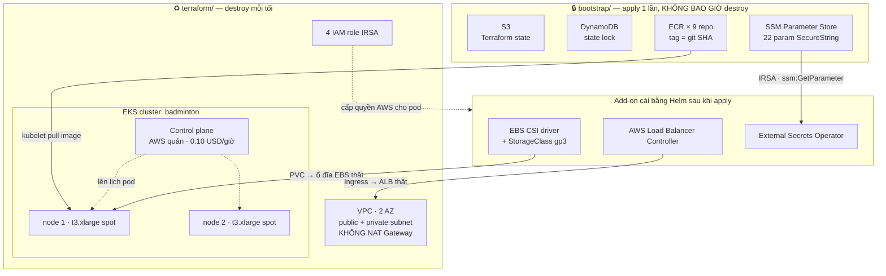

# Day 3 giải thích cho người mới

> Tài liệu này viết cho **người chưa từng dùng Terraform và chưa từng mở AWS Console**. Nó giải thích Day 3 sẽ dựng gì, mỗi khái niệm gắn với đúng chỗ nó sẽ gây rắc rối, và những cái bẫy đã biết trước.
>
> Khác với [`.claude/rules/`](../.claude/rules/) và `.claude/rules/` của repo gitops: rule viết cho Claude đọc lúc đang code — súc tích, mệnh lệnh, giả định đã biết. File này giải thích **vì sao**.
>
> ⚠️ **Khác với [`DAY1-EXPLAINED.md`](DAY1-EXPLAINED.md) ở một điểm quan trọng**: Day 1 viết **sau** khi làm xong, nên nó kể lại 15 chỗ sai đã thực sự xảy ra. Day 3 **chưa thực thi** — đây là tài liệu **học trước khi gõ lệnh đầu tiên**. Mọi con số dưới đây lấy từ tài liệu thiết kế và giá công bố của AWS, **chưa phải số đo thực nghiệm**. Sau khi làm xong, con số thật sẽ thay chỗ chúng.
>
> Day 2 (Helm + Kubernetes) có tài liệu tương ứng ở repo `badmintonHub-gitops`: `docs/DAY2-EXPLAINED.md`.

---

## 1. Day 3 giải quyết vấn đề gì?

Sau Day 1 bạn có **9 image tự mô tả**. Sau Day 2 bạn có **khuôn Helm** biết cách biến image thành pod. Nhưng cả hai vẫn chỉ chạy trên laptop:

```
Day 1 → docker compose up      → chạy trên máy tôi
Day 2 → helm install trên kind → chạy trên máy tôi, giả làm Kubernetes
Day 3 → ???                    → chạy trên máy THẬT ở Singapore, người khác vào được
```

Day 3 là ngày **thuê máy**. Nhưng không thuê bằng cách vào Console bấm chuột — vì thứ bấm bằng chuột thì **không tái lập được**, mà toàn bộ mô hình của dự án này là *"dựng → demo → xoá → mai dựng lại y hệt"*.

Nên Day 3 thực chất là: **viết ra bằng code toàn bộ hạ tầng AWS, để nó có thể bị xoá sạch rồi dựng lại mà không cần nhớ gì.**

### Vì sao Day 3 nằm ở repo app, không phải repo gitops

| Repo | Chứa gì | Ai đọc |
|---|---|---|
| `badmintonHub` (repo này) | Source · Dockerfile · **`terraform/`** · CI workflow | Terraform CLI · GitHub Actions |
| `badmintonHub-gitops` | Helm chart · values · ArgoCD app | ArgoCD (chạy *bên trong* cụm) |

Terraform tạo ra **chính cái cụm** mà ArgoCD sống trong đó. Nó phải đứng ngoài. Đây là ranh giới "ai tạo ra ai" — không phải chuyện gu cá nhân.

### Mọi Day sau đều đứng trên Day 3

| Day | Cần gì từ Day 3 | Thiếu thì |
|---|---|---|
| Day 4 — Deploy staging | 9 ECR repo · EKS chạy · **subnet có tag** · 3 add-on | Ingress treo vô hạn, PVC `Pending`, pod `CreateContainerConfigError` |
| Day 5 — CI | ECR repo để push · IAM role cho GitHub Actions | Pipeline không có chỗ đẩy image |
| Day 6 — ArgoCD | Cụm để cài · ESO đã Ready | ArgoCD sync ra pod thiếu Secret |
| Day 7 — Teardown | Hai stack tách bạch | `destroy` xoá luôn ECR → mai build lại 9 image |
| Day 8 — HTTPS | `bootstrap/` đã tồn tại để thêm Route53 + ACM vào | Phải dựng stack mới dưới áp lực T-2 |

---

## 2. Sẽ dựng những gì

### Hai stack Terraform — đây là quyết định kiến trúc quan trọng nhất của Day 3

```
terraform/bootstrap/     apply MỘT LẦN · KHÔNG BAO GIỜ destroy
                         Day 3: S3 (state) · DynamoDB (lock) · 9 ECR repo
                         Day 8: + Route53 hosted zone · ACM wildcard cert

terraform/               destroy SAU MỖI BUỔI DEMO
                         VPC · EKS · node group spot · 4 IAM role IRSA
```

**Tiêu chí phân loại, một câu**: *thứ gì phải sống sót qua `destroy` thì thuộc `bootstrap/`.*

Nếu gộp làm một stack:

| Bị xoá cùng | Hậu quả mỗi buổi demo |
|---|---|
| 9 ECR repo | Build + push lại 9 image ≈ 20–30 phút |
| S3 state | Terraform tự xoá bộ nhớ của chính nó → không apply lại được |
| SSM parameter | Nạp lại 22 secret bằng tay |
| *(Day 8)* Route53 zone | Zone mới = **NS record mới** → sửa ở nhà đăng ký domain → chờ **1–48 giờ** propagation. Hỏng demo. |

Bốn dòng đó chính là **4 việc tay bị cấm** trong tiêu chí vàng *"rebuild = 0 thao tác tay"* (xem `.claude/rules/ephemeral-cost.md` ở repo gitops).

### Bản đồ — dựng xong thì trông thế này



*(Sơ đồ là **thiết kế đích**. Hôm nay repo chưa có thư mục `terraform/` nào.)*

### Kết quả nghiệm thu Day 3

`kubectl get nodes` in ra **2 dòng `Ready`**. Hết. **Chưa có app nào chạy** — app là Day 4.

Nghe có vẻ ít cho một ngày làm việc. Nhưng cái bạn thực sự tạo ra là **khả năng dựng lại 2 dòng đó trong 15 phút, bao nhiêu lần cũng được, không cần nhớ gì.**

---

## 3. Terraform — 8 khái niệm lõi

### 3.1 Khai báo, không ra lệnh

Bạn **không** viết "hãy tạo VPC". Bạn viết *"tôi muốn tồn tại một VPC như thế này"*. Terraform tự so sánh mong muốn ↔ thực tế rồi quyết định tạo / sửa / xoá.

Giống hệt `docker-compose.yml` của Day 1: bạn tả trạng thái mong muốn, không tả từng bước.

Hệ quả: chạy `apply` lần thứ hai mà không đổi gì → `No changes`. Đây là **idempotent** — cùng khái niệm với `ChatIndexInitializer` (`ensureIndex` gọi bao nhiêu lần cũng ra một kết quả) hay `generate-slots` (bỏ qua `(sân, ngày)` đã có) trong chính codebase của bạn.

### 3.2 Provider — "driver" nói chuyện với AWS

```hcl
provider "aws" {
  region = "ap-southeast-1"   # Singapore
}
```

Terraform lõi không biết gì về AWS. Provider là plugin dịch code HCL → lời gọi AWS API. `terraform init` chính là bước tải plugin đó về thư mục `.terraform/` (giống `mvn` tải dependency về `~/.m2`).

### 3.3 `resource` và `data`

```hcl
resource "aws_ecr_repository" "user_service" {   # TÔI tạo và sở hữu — destroy sẽ xoá
  name = "user-service"
}

data "aws_caller_identity" "current" {}          # chỉ ĐỌC thứ đã có — destroy không đụng
```

Phân biệt này quan trọng ở Day 8: stack ephemeral đọc ACM cert bằng `data "aws_acm_certificate"` — **không** `resource`, vì cert thuộc `bootstrap/` và không được xoá theo cụm.

### 3.4 State — khái niệm quan trọng nhất, và nguy hiểm nhất

Terraform ghi một file `terraform.tfstate` (JSON) nói: *"resource `aws_ecr_repository.user_service` trong code của tôi ↔ ARN thật `arn:aws:ecr:ap-southeast-1:…` trên AWS"*.

Mất state = Terraform **mất trí nhớ**:
- `apply` lần sau tưởng chưa có gì → tạo trùng lặp
- `destroy` không xoá được gì (không biết xoá cái nào) → **tài nguyên mồ côi vẫn tính tiền**

Ba hệ quả phải nhớ:

| Sự thật | Việc phải làm |
|---|---|
| State chứa **secret ở dạng plain text** (password DB, token…) | 🔴 **KHÔNG BAO GIỜ commit `*.tfstate`.** Thêm vào `.gitignore` ngay dòng đầu tiên |
| State quý như vậy thì không nên nằm trên laptop | Để trên **S3** (bền + bật versioning) |
| Hai người `apply` cùng lúc → hai bản state đè nhau → hỏng | Cần **khoá**: đó là việc của **DynamoDB** |

Đây gọi là **backend**:

```hcl
terraform {
  backend "s3" {
    bucket         = "badminton-tfstate-<hậu-tố-ngẫu-nhiên>"  # tên S3 unique TOÀN CẦU
    key            = "eks/terraform.tfstate"
    region         = "ap-southeast-1"
    dynamodb_table = "badminton-tflock"
  }
}
```

> 💡 Terraform ≥ 1.10 có `use_lockfile = true` khoá thẳng bằng S3, bỏ được DynamoDB. Kế hoạch dự án viết DynamoDB — cứ theo kế hoạch cho khớp `MANUAL-SETUP.md`, nhưng biết là có cách mới hơn.

### 3.5 🥚 Bẫy con-gà-quả-trứng của `bootstrap/`

`terraform/bootstrap/` là nơi **tạo ra** cái S3 bucket ở trên. Nhưng nó không thể lưu state của chính nó vào một bucket chưa tồn tại.

⇒ **`bootstrap/` dùng local state** (file `terraform.tfstate` nằm ngay cạnh, trên máy bạn). Chỉ `terraform/` mới dùng backend S3.

Vì file đó nằm local và **không được commit**:

- **Backup nó** (copy ra Drive / USB) sau lần `apply` đầu tiên.
- Mất file này ≠ mất tài nguyên (9 ECR repo vẫn sống), nhưng **mất quyền quản lý chúng bằng Terraform** → phải `terraform import` lại từng cái bằng tay.

### 3.6 `plan` / `apply` / `destroy`

```bash
terraform init      # tải provider + module, kết nối backend (chạy lại khi thêm module / đổi backend)
terraform plan      # DIFF: sẽ tạo gì, sửa gì, xoá gì. KHÔNG đụng AWS. Luôn đọc trước khi apply
terraform apply     # thực thi cái diff đó (hỏi yes/no)
terraform destroy   # xoá mọi resource trong state NÀY
```

Đọc ký hiệu trong `plan`:

| Ký hiệu | Nghĩa | Mức nguy hiểm |
|---|---|---|
| `+` | tạo mới | an toàn |
| `~` | sửa tại chỗ | thường an toàn |
| `-/+` | **xoá rồi tạo lại** | 🔴 mất dữ liệu — đọc kỹ xem là resource gì |
| `-` | xoá | tuỳ resource |

Thói quen bắt buộc: **`plan` rồi thực sự đọc output**, đừng gõ `apply -auto-approve` cho nhanh. `plan` là chỗ duy nhất AWS chưa tính tiền.

### 3.7 Module — "hàm dùng lại" của hạ tầng

Một VPC "đúng chuẩn" cần ~25 resource (subnet, route table, IGW, EIP, association…). Bạn không viết tay. Bạn gọi module cộng đồng:

```hcl
module "vpc" {
  source  = "terraform-aws-modules/vpc/aws"
  version = "~> 5.0"        # 🔴 PIN version — module đổi major là hỏng cả stack
  ...
}
```

Đúng tinh thần `spring-boot-starter-*`: người khác đã đóng gói best-practice, bạn truyền tham số.

⚠️ Module `terraform-aws-modules/eks` **v20 đổi lớn** so với v19: bỏ `aws-auth` ConfigMap, chuyển sang *access entries* để phân quyền "ai được `kubectl`". Đọc example đúng version bạn pin — **đừng copy blog cũ**, đây là nguồn lỗi phổ biến nhất khi học EKS bằng Terraform.

### 3.8 `variable` và `output`

```hcl
variable "cluster_name" { default = "badminton" }

output "cluster_endpoint" { value = module.eks.cluster_endpoint }
```

`output` của `bootstrap/` (ví dụ URL ECR) được stack kia đọc qua `data "terraform_remote_state"` — hoặc đơn giản hơn: tra thẳng bằng `data "aws_ecr_repository"`. Hai stack **không** chia sẻ state.

---

## 4. AWS — những viên gạch bạn sắp xếp

### 4.1 Region và AZ

- **Region** = một thành phố. Dự án dùng `ap-southeast-1` (Singapore). Chọn một, dùng suốt.
- **AZ (Availability Zone)** = một toà datacenter trong thành phố đó: `ap-southeast-1a`, `-1b`… Hỏng độc lập nhau.
- 🔴 **EKS bắt buộc subnet ở ≥ 2 AZ.** Đó là lý do kế hoạch viết "2 AZ" — ràng buộc kỹ thuật, không phải cho đẹp.

### 4.2 VPC = mạng LAN riêng của bạn trên AWS

Nhớ Day 1: `docker compose` tạo một network ảo, container gọi nhau bằng tên, và bạn đã học bài học *"khai `networks:` ở một file sẽ tách mạng"*. VPC là bản AWS của khái niệm đó — chỉ khác là bạn phải **tự vẽ đường đi**.

```
VPC  10.0.0.0/16
├── public  subnet 10.0.101.0/24 (AZ-a) ─┐ route 0.0.0.0/0 → Internet Gateway
├── public  subnet 10.0.102.0/24 (AZ-b) ─┘ → ALB đứng đây · và (dự án này) CẢ NODE
├── private subnet 10.0.1.0/24   (AZ-a) ─┐ không có route ra Internet
└── private subnet 10.0.2.0/24   (AZ-b) ─┘
```

| Thành phần | Việc của nó |
|---|---|
| **Internet Gateway (IGW)** | Cổng **2 chiều** cho public subnet |
| **NAT Gateway** | Cổng **1 chiều**: private subnet gọi RA ngoài được, Internet **không** gọi vào được |
| **Route table** | Bảng chỉ đường. Chính nó định nghĩa thế nào là "public" / "private" — không phải cái tên |
| **Security Group** | Firewall mức instance (stateful, chỉ có luật allow) |

**Điều dễ hiểu sai nhất**: "public subnet" không có nghĩa là mọi thứ trong đó bị phơi ra Internet. Nó chỉ có nghĩa *subnet này có đường ra IGW*. Ai vào được vẫn do **Security Group** quyết định.

### 4.3 🔴 Quyết định của dự án: **KHÔNG có NAT Gateway**

Đây là chỗ Day 3 **lệch khỏi kiến trúc "chuẩn sách giáo khoa"**, và bạn cần hiểu vì sao trước khi gõ.

Kiến trúc chuẩn: node nằm **private subnet**, ra Internet qua **NAT Gateway**. An toàn hơn. Nhưng NAT tính tiền **theo giờ *và* theo GB**, ≈ **$45/tháng nếu quên tắt** — với một cụm chỉ sống 30 phút mỗi buổi thì đây là món đắt nhất, vô lý nhất.

⇒ Dự án **né NAT**. Hai cách né, phải chọn một:

| Cách | Làm gì | Đánh đổi |
|---|---|---|
| **A. Node ở public subnet** *(kế hoạch chọn cách này)* | `map_public_ip_on_launch = true`, node group đặt vào public subnet | Node có IP công khai. Chấp nhận được vì SG chỉ mở cổng cần thiết, và cụm sống 30 phút |
| B. VPC endpoints | Thêm endpoint `ecr.api` · `ecr.dkr` · `s3` · `sts` · `logs` | Đúng chuẩn hơn, nhưng interface endpoint cũng tính tiền theo giờ |

🔴 **Thiếu cả hai** → node không ra được Internet → **không pull nổi image từ ECR** → mọi pod kẹt `ImagePullBackOff`. Triệu chứng này xuất hiện ở **Day 4**, và trông y hệt "sai tên image" — bạn sẽ đi tìm sai chỗ.

> Vẫn tạo **private subnet có tag** dù chưa dùng: để Day sau muốn đổi sang mô hình chuẩn thì chỉ đổi tham số, không phải vẽ lại VPC.

### 4.4 ECR = Docker Hub riêng tư của bạn

Image đẩy lên `<account-id>.dkr.ecr.ap-southeast-1.amazonaws.com/user-service:<git-SHA>`. Node pull được nhờ IAM role của node — **không cần password**.

Chín repo, đúng 9 deployable của Day 1:

```
eureka-server · api-gateway · user-service · court-service · booking-service
payment-service · escrow-service · chat-service · frontend
```

Hai điều mang từ Day 1 sang:

- ⚠️ **Máy bạn là Apple Silicon → build ra `arm64`. Node EKS là `amd64`.** Mọi lệnh push phải `docker buildx build --platform linux/amd64 --push`. Sai kiến trúc → pod `CrashLoopBackOff` với `exec format error` — một thông báo không hề gợi ý gì về kiến trúc CPU.
- Tag = **git SHA**, không bao giờ `latest`. Vì `latest` làm ArgoCD không biết có gì đổi, và làm rollback trở thành đoán mò.

Nên bật `lifecycle_policy` giữ ~10 image gần nhất, kẻo storage phình theo mỗi commit.

### 4.5 IAM — mô hình quyền của AWS

Ba danh từ, đừng lẫn:

| Từ | Là gì | Có secret không |
|---|---|---|
| **Policy** | Tờ giấy phép: *"được `ssm:GetParameter` trên `/badminton/*`"* | không |
| **Role** | Một **vai** có gắn policy. Ai đó phải "đóng vai" (`AssumeRole`) và nhận **credential tạm** (~1 giờ) | **không** |
| **User + Access Key** | Danh tính lâu dài | **có** — rò rỉ là hỏng |

**Nguyên tắc: luôn ưu tiên Role, tránh Access Key.** Toàn bộ mục 6 (IRSA) chính là cách áp nguyên tắc đó cho pod, và Day 5 sẽ áp lại cho GitHub Actions.

Riêng bạn (con người) vẫn cần 1 IAM user + access key để `aws configure` ở Day 3. Đây là access key **duy nhất** trong cả dự án.

---

## 5. EKS = Kubernetes có AWS trông hộ nửa trên

```
┌─ CONTROL PLANE ──── AWS quản lý · bạn không SSH vào được ────────────┐
│  kube-apiserver · etcd · scheduler · controller-manager              │
│  $0.10/giờ — TÍNH TIỀN NGAY CẢ KHI KHÔNG CÓ POD NÀO CHẠY            │
└──────────────────────────────────────────────────────────────────────┘
                          ▲ kubelet đăng ký
┌─ DATA PLANE ──── EC2 của BẠN ────────────────────────────────────────┐
│  node 1 (t3.xlarge spot)      node 2 (t3.xlarge spot)                │
│  pod chạy ở đây                                                       │
└──────────────────────────────────────────────────────────────────────┘
```

**Managed node group**: bạn khai *"tôi muốn 2 máy t3.xlarge"*, AWS lo Auto Scaling Group + AMI có sẵn kubelet + đăng ký vào cụm. Tự làm tay phải viết bootstrap script — không đáng.

**Spot instance**: mua công suất thừa của AWS, rẻ ~70%, đổi lại AWS có thể **thu hồi máy sau 2 phút báo trước**. Với demo ephemeral thì chấp nhận được (pod bị đuổi sẽ được lên lịch lại ở node còn lại). Với production thật thì không.

**`aws eks update-kubeconfig --name badminton`**: ghi thông tin cụm vào `~/.kube/config`, để `kubectl` và `helm` (đã có sẵn trên máy bạn) biết trỏ đi đâu. Xác thực bằng chính AWS credential của bạn — không có password riêng.

### Sizing — vì sao **không** dùng `t3.large`

| | vCPU/node | RAM/node | × 2 node |
|---|---|---|---|
| t3.large | 2 | 8 GiB | 4 vCPU / **16 GiB** |
| **t3.xlarge** | 4 | 16 GiB | 8 vCPU / **32 GiB** |

Day 1 bạn **đo được số thật**: 8 JVM × 420–570 MiB ≈ **4.4 GiB** cho *một* môi trường — và Docker VM 5.79 GiB đã không gánh nổi, phải tắt `escrow-service`.

Trên EKS bạn chạy **nhiều hơn thế**: 2 namespace (`staging` + `prod`) × 9 app + 5 datastore × 2 + ArgoCD + kube-prometheus + Loki + 3 add-on ⇒ ước **20–24 GiB**. 16 GiB sẽ `Pending` / `OOMKilled` **giữa buổi demo**.

🔴 **Đừng tin `requests: 128Mi`**: `requests` chỉ là lời hứa với scheduler để nó xếp chỗ. **JVM vẫn ăn thật 400–600 MB** vì Day 1 đã đặt `-XX:MaxRAMPercentage=75`. Scheduler xếp được 40 pod vào 16 GiB, rồi kernel OOM-kill chúng. Đây chính là giá trị lớn nhất Day 1 để lại: **bạn có số đo thay vì trực giác**.

> 💡 Phụ: mỗi loại instance còn có **trần số pod theo số ENI** — t3.large ≈ 35 pod, t3.xlarge ≈ 58. Với ~35–40 pod, t3.large chạm trần ngay cả khi đủ RAM.

Và số Day 1 còn dùng cho một chỗ nữa: **boot 128 giây/service** khi các JVM đua CPU ⇒ `initialDelaySeconds` của readiness probe (Day 2) **không được đặt 40s**. Bạn đã trả giá cho bài học đó bằng một healthcheck báo `unhealthy` oan.

---

## 6. OIDC + IRSA — phần khó nhất, đọc kỹ

### Vấn đề

Pod `external-secrets` cần gọi AWS API (`ssm:GetParameter`). Làm sao nó chứng minh nó là ai?

### Cách sai (rất phổ biến)

Nhét `AWS_ACCESS_KEY_ID` + `AWS_SECRET_ACCESS_KEY` vào một Secret rồi mount vào pod.

→ Key **vĩnh viễn**, nằm trong etcd, ai đọc được Secret là chiếm được quyền AWS, và xoay vòng key phải sửa mọi nơi. Đây đúng là loại lỗi bạn **vừa tự bắt được** ở phiên LangSmith (key thật bị dán vào `.env.example` — một file được commit, trong một repo sắp public).

### Cách đúng: IRSA — *IAM Roles for Service Accounts*

Ý tưởng một câu: **Kubernetes tự phát hành hộ chiếu, và AWS đồng ý công nhận hộ chiếu đó.**

```
1. ServiceAccount "external-secrets" được annotate:
       eks.amazonaws.com/role-arn: arn:aws:iam::<acct>:role/badminton-eso

2. Pod dùng SA đó → kubelet tiêm vào pod một file token JWT,
   do OIDC provider CỦA CỤM ký, mang claim
       sub = system:serviceaccount:external-secrets:external-secrets

3. AWS SDK trong pod tự gọi STS AssumeRoleWithWebIdentity, nộp token đó

4. AWS kiểm 2 điều:
       – chữ ký có khớp OIDC provider tôi đã đăng ký không?
       – claim `sub` có khớp điều kiện trong trust policy của role không?
   → OK → trả credential TẠM THỜI (~1 giờ, tự gia hạn)
```

Ba mảnh ghép, thiếu một là hỏng:

| Mảnh | Tạo ở đâu | Ý nghĩa |
|---|---|---|
| **OIDC provider** | IAM — module EKS bật `enable_irsa = true` | AWS ghi nhận: *"tôi tin chữ ký của cụm này"* |
| **IAM role + trust policy** | IAM (Terraform) | *"chỉ ServiceAccount `<ns>:<name>` của cụm đó mới được đóng vai này"* |
| **Annotation trên ServiceAccount** | Kubernetes (Helm values) | Nói cho pod biết đóng vai nào |

🔴 Sai **một ký tự** trong namespace hoặc tên SA ở trust policy → pod báo `AccessDenied` / `WebIdentityErr`, và thông báo đó **không nói cho bạn biết sai ở đâu**. Nhớ chỗ này khi debug — nó là nguyên nhân số 1 của mọi lỗi ESO.

### Bốn IRSA role — thiếu cái nào hỏng cái đó

| Role cho | ServiceAccount / namespace | Quyền chính | Thiếu thì |
|---|---|---|---|
| **AWS Load Balancer Controller** | `kube-system` | `elasticloadbalancing:*`, `ec2:Describe*` | Ingress **không có ADDRESS** → không có ALB → không ai vào được hệ thống |
| **EBS CSI driver** | `kube-system` | `ec2:CreateVolume`, `AttachVolume`… | PVC kẹt `Pending` → 5 datastore không boot → app không có DB |
| **External Secrets** | `external-secrets` / `external-secrets` | `ssm:GetParameter*` + `ssm:DescribeParameters` trên `arn:aws:ssm:<region>:<acct>:parameter/badminton/*` **+** `kms:Decrypt` trên `alias/aws/ssm`. 🔴 **Không** cấp `ssm:*` toàn account | `SecretSyncedError` → pod `CreateContainerConfigError` |
| **ExternalDNS** *(cài ở Day 8)* | `kube-system` | `route53:ChangeResourceRecordSets`, `ListHostedZones`, `ListResourceRecordSets` | Record DNS không tự tạo → sửa DNS tay mỗi buổi = **vi phạm tiêu chí 0 thao tác tay** |

> 💡 **Tạo cả 4 role ngay hôm nay** dù ExternalDNS mãi Day 8 mới cài. **IAM role không tính tiền khi không dùng.** Còn để T-2 trước demo mới sờ tới thì bạn phải `terraform apply` stack ephemeral dưới áp lực thời gian — đúng lúc không nên có bất ngờ.

> 📎 *Biết thêm*: AWS có **EKS Pod Identity** — cách mới hơn, không cần OIDC provider, gán qua API của EKS. Dự án dùng IRSA vì mọi chart và tài liệu hiện có đều viết theo nó.

---

## 7. Ba add-on — mỗi cái lấp một lỗ hổng của Kubernetes trần

Kubernetes **cố tình** không biết gì về AWS. Nó chỉ biết khái niệm trừu tượng: *"tôi cần 20Gi ổ đĩa bền"*, *"tôi cần một đường vào từ ngoài"*. Add-on là kẻ phiên dịch từ trừu tượng sang AWS thật.

### 7.1 EBS CSI Driver + StorageClass `gp3`

- **PersistentVolumeClaim (PVC)** = pod nói *"cho tôi 20Gi ổ bền"*. Postgres / Kafka / MongoDB / RabbitMQ (5 chart Bitnami của Day 2) đều tạo PVC.
- Không có CSI driver → PVC đứng `Pending` **vĩnh viễn**. StatefulSet không bao giờ khởi động, và log **không nói rõ tại sao**.
- **StorageClass** = "loại ổ": `gp3` (SSD thế hệ mới, rẻ và nhanh hơn `gp2`). EKS đời mới **không ship StorageClass mặc định nào** → phải tự tạo và đánh dấu default.

⚠️ **EBS volume gắn chặt với một AZ.** Pod bị lên lịch ở AZ-b mà volume nằm AZ-a → treo mãi. Cách chữa chuẩn: `volumeBindingMode: WaitForFirstConsumer` — chờ biết pod nằm ở đâu rồi mới tạo volume.

### 7.2 AWS Load Balancer Controller

Bạn tạo một `Ingress` (Day 4) → controller nhìn thấy → **gọi AWS API tạo ALB thật**, tự cấu hình target group trỏ vào IP của pod. Xoá Ingress → nó xoá ALB.

Day 2 đã chốt 2 annotation quan trọng, hiểu luôn để không ngạc nhiên ở Day 4:

| Annotation | Vì sao |
|---|---|
| `group.name: badminton` | Gộp `staging` + `prod` vào **một** ALB thay vì hai — tiết kiệm $0.0225/giờ và ~2 phút provisioning mỗi lần apply |
| `idle_timeout.timeout_seconds=300` | Mặc định ALB là **60s**, đủ để **ngắt WebSocket chat** khi người dùng ngồi im giữa buổi demo. Rất khó quy trách nhiệm lúc đang demo |

🔴 **Subnet tag — việc của Day 3, hậu quả ở Day 4.** Controller **tự dò** subnet nào để đặt ALB, bằng cách tìm tag. Không có tag → Ingress **treo vô hạn**, và `kubectl describe ingress` chỉ nói cụt lủn `couldn't auto-discover subnets`.

```hcl
public_subnet_tags = {
  "kubernetes.io/role/elb"                    = "1"        # ALB hướng Internet
  "kubernetes.io/cluster/${var.cluster_name}" = "shared"
}
private_subnet_tags = {
  "kubernetes.io/role/internal-elb"           = "1"
  "kubernetes.io/cluster/${var.cluster_name}" = "shared"
}
```

Đây là dạng lỗi tệ nhất: **im lặng ở nơi gây ra, ồn ào ở nơi khác.** Cùng họ với `start_period: 40s` của Day 1 — nguyên nhân nằm ở file bạn viết hôm trước, triệu chứng nổ ra hôm sau.

### 7.3 External Secrets Operator (ESO) + SSM Parameter Store

- **SSM Parameter Store** = kho key-value của AWS. Kiểu `SecureString` mã hoá bằng KMS. Standard tier **miễn phí**.
- **ESO** = một pod đọc SSM rồi **tự tạo Kubernetes Secret**.

Trong Git bạn chỉ commit một `ExternalSecret` ghi **tên** tham số, không phải giá trị:

```yaml
kind: ExternalSecret
spec:
  dataFrom:
    - find: { path: /badminton/staging/ }   # chỉ là con trỏ — không có giá trị nào
```

⇒ **repo public vẫn an toàn**.

Dự án cần **22 param** = 11 tên × 2 env (`staging`, `prod`):
`JWT_SECRET` · `POSTGRES_USERNAME` · `POSTGRES_PASSWORD` · `MONGODB_CHAT_URI` · `RABBITMQ_PASS` · `SENDGRID_API_KEY` · `CLOUDINARY_CLOUD_NAME` / `_API_KEY` / `_API_SECRET` · `GOOGLE_CLIENT_ID` / `_SECRET`.

*(Nạp bằng tay một lần — xem `docs/MANUAL-SETUP.md` §3 ở repo gitops. Non-secret như `RABBITMQ_USER`, `*_HOST`, `CHAT_BROKER_RELAY` thì để ConfigMap, đừng nhét vào SSM.)*

**Vì sao đảo bỏ SealedSecrets** (quyết định đã chốt): SealedSecrets controller **sinh keypair mới mỗi lần cài**. Mô hình `destroy` mỗi tối ⇒ cụm mới = khoá mới ⇒ **mọi `SealedSecret` đã commit thành rác không giải mã được** ⇒ sáng hôm sau toàn bộ pod `CreateContainerConfigError`. Nó đánh thẳng vào tiêu chí vàng. SSM sống **ngoài** cụm nên `destroy` không đụng tới.

### 7.4 Thứ tự cài add-on **có ràng buộc**

```
EBS CSI + StorageClass gp3
  → AWS Load Balancer Controller
    → ESO + ClusterSecretStore     ← phải Ready TRƯỚC bước sau
      → (Day 6) ArgoCD + root app
```

🔴 **ESO + ClusterSecretStore phải xong TRƯỚC khi ArgoCD sync app.** Không thì pod khởi động lúc `Secret` chưa tồn tại → `CreateContainerConfigError`. Nó **tự khỏi** sau khi ESO sync xong, nhưng giữa buổi demo thì trông y hệt như hệ thống hỏng.

---

## 8. Ba cái bẫy đã biết trước

### 8.1 🔴 TUYỆT ĐỐI không cài cert-manager

Đây là quyết định dễ làm sai nhất, vì **mọi tutorial Kubernetes đều bảo dùng cert-manager**.

Cơ chế thật:

- **cert-manager** xin cert Let's Encrypt rồi cất vào một **Kubernetes Secret**.
- **ALB terminate TLS ở tầng AWS** — nó là dịch vụ của AWS, đứng **ngoài** cụm, và **chỉ đọc cert từ ACM hoặc IAM**. Nó **không có khả năng đọc Kubernetes Secret**.

Ghép hai thứ này lại: cert-manager báo thành công, Secret có thật, `kubectl get certificate` xanh… nhưng ALB **lờ đi**, và **không có dòng lỗi nào ở đâu cả**. Bạn sẽ debug mù ở đúng ngày T-2 trước demo.

Phụ: Let's Encrypt giới hạn **5 cert/tuần cho cùng bộ hostname** — mà cụm này rebuild mỗi buổi.

⇒ HTTPS đi bằng **ACM** (miễn phí, tự gia hạn, sống ở `bootstrap/`, gắn vào ALB bằng đúng 1 annotation `certificate-arn`). Đó là Day 8.

### 8.2 Subnet tag — xem §7.2

### 8.3 `terraform destroy` sẽ **FAIL** nếu không dọn trước

Cái bẫy này chưa ai cảnh báo bạn ở Day 3, nhưng nó sẽ cắn ngay buổi demo đầu tiên.

**ALB và EBS volume do controller *bên trong cụm* tạo ra** — chúng **không nằm trong Terraform state**. Terraform không biết chúng tồn tại. Khi destroy VPC:

- AWS từ chối vì subnet vẫn còn ENI của ALB đang bám → treo ~20 phút rồi lỗi `DependencyViolation`
- EBS volume mồ côi thì **im lặng tính tiền mãi mãi** (~40 GB ≈ $3.2/tháng, không ai nhìn thấy)

Thứ tự dọn đúng (đầy đủ ở `.claude/rules/ephemeral-cost.md` repo gitops):

```bash
# 1. Xoá ROOT app — KHÔNG phải child. ApplicationSet controller sinh lại child ngay lập tức
argocd app delete badmintonhub-root --cascade

# 2. Xoá PVC KHI CỤM CÒN SỐNG — reclaim policy Delete chỉ chạy lúc PVC bị xoá.
#    Destroy thẳng cụm thì không ai gọi nó → EBS mồ côi VẪN TÍNH TIỀN.
kubectl delete pvc --all -n data-staging
kubectl delete pvc --all -n data-prod

# 3. Xoá Ingress để LB Controller tự gỡ ALB (PHẢI trước khi gỡ controller)
kubectl delete ingress --all -A

# 4. Gỡ add-on tạo AWS resource bên ngoài
helm uninstall aws-lb-controller -n kube-system

# 5. Giờ mới huỷ hạ tầng
cd terraform && terraform destroy
```

Kiểm chứng **bằng lệnh, đừng tin cảm giác**:

```bash
aws ec2 describe-volumes --filters Name=status,Values=available --query 'Volumes[].VolumeId'   # phải RỖNG
aws elbv2 describe-load-balancers --query 'LoadBalancers[].LoadBalancerName'                   # phải RỖNG
```

---

## 9. Tiền — phần người mới đau nhất

🔴 **EKS không nằm trong Free Tier.** Đừng nghĩ "tài khoản mới 12 tháng miễn phí" sẽ che được.

| Món | Tính tiền kiểu gì | Sống sót `destroy`? |
|---|---|---|
| **EKS control plane** | ~**$0.10/giờ/cụm** — tính **kể cả khi 0 pod chạy** | ❌ xoá |
| 2× t3.xlarge **spot** | ~**$0.13/giờ** (dao động theo thị trường) | ❌ xoá |
| ALB | ~**$0.0225/giờ** + LCU | ❌ *(nếu xoá Ingress trước)* |
| ~~NAT Gateway~~ | ~~$0.045/giờ + GB~~ | **né hẳn — xem §4.3** |
| EBS volume | theo GB-tháng · **vẫn tính tiền dù pod đã chết** | ❌ *(nếu xoá PVC trước)* |
| S3 · DynamoDB · SSM standard | ~$0 | ✅ giữ |
| ECR × 9 | ≈ **$0.30/tháng** | ✅ giữ — chính là lý do rebuild không phải build lại image |
| *(Day 8)* Route53 zone | $0.50/tháng · ACM cert **$0** | ✅ giữ |

| Kịch bản | Tiền |
|---|---|
| 1 buổi trọn gói (apply → demo → destroy) | ≈ **$0.15** |
| Quên tắt 1 ngày | vài $ |
| **Quên tắt 1 tháng** | ≈ **$150–200** |

### Ba việc làm **ngay hôm nay, trước khi gõ `apply` lần đầu**

1. **Bật AWS Budget + email alert** ở mức ~$5. Console → Billing → Budgets. Mất 2 phút, cứu bạn khỏi hoá đơn $150.
2. **Hẹn giờ điện thoại "DESTROY"** ngay sau khung giờ demo. Kỷ luật `destroy` **chính là** toàn bộ chiến lược chi phí của dự án — không có mẹo kỹ thuật nào thay được.
3. Hiểu rằng `destroy` phải **chạy xong**, không phải "chạy rồi Ctrl-C". Ctrl-C giữa chừng để lại state nửa vời — tệ hơn không chạy.

---

## 10. Chuẩn bị trước khi gõ lệnh đầu tiên

### Máy bạn đang có gì

| Công cụ | Trạng thái |
|---|---|
| `kubectl` v1.33.2 | ✅ đã có |
| `helm` v3.18.4 | ✅ đã có |
| `docker` | ✅ đã có (Day 1) |
| **`terraform`** | ❌ **chưa cài** |
| **`aws`** CLI | ❌ **chưa cài** |

```bash
brew install terraform awscli
aws configure                  # Access Key + Secret + region ap-southeast-1 + output json
aws sts get-caller-identity    # phải in ra Account + ARN của bạn → xong bước xác thực
```

*(Cần một IAM user có quyền tạo VPC/EKS/IAM/ECR/S3. Đây là access key duy nhất của cả dự án — Day 5 GitHub Actions sẽ dùng OIDC, không dùng key.)*

### Thứ tự thực thi

```bash
# 1. BOOTSTRAP — một lần duy nhất trong đời dự án (local state, nhớ backup)
cd terraform/bootstrap && terraform init && terraform apply

# 2. EPHEMERAL — chạy lại mỗi buổi demo (~15 phút, phần lớn là EKS control plane)
cd ../ && terraform init && terraform apply

# 3. Nối kubectl vào cụm
aws eks update-kubeconfig --name badminton --region ap-southeast-1

# 4. Add-on — ĐÚNG THỨ TỰ (§7.4)
helm upgrade --install aws-ebs-csi-driver  ... -n kube-system        # + StorageClass gp3
helm upgrade --install aws-lb-controller   ... -n kube-system
helm upgrade --install external-secrets    ... -n external-secrets --create-namespace
#    KHÔNG cert-manager (§8.1) · ExternalDNS để Day 8
```

> 💡 Bước 3–4 nên gói thành `scripts/bootstrap.sh` ngay từ đầu. Mỗi buổi demo bạn chạy lại chúng — thứ chạy lại mỗi ngày mà còn gõ tay thì sớm muộn cũng gõ thiếu một dòng.

### Nghiệm thu Day 3

```bash
kubectl get nodes                                     # 2 dòng · t3.xlarge · Ready
aws ecr describe-repositories \
  --query 'repositories[].repositoryName'             # đúng 9 repo
kubectl get storageclass                              # có gp3, (default)
kubectl get clustersecretstore                        # Valid
aws ec2 describe-subnets --query 'Subnets[].Tags'     # có kubernetes.io/role/elb
aws ec2 describe-nat-gateways                         # phải RỖNG — thấy 1 cái là đang chảy $45/tháng
```

Bảng đối chiếu bằng **AWS Console** (để cross-check độc lập khi CLI báo xanh mà hệ thống vẫn không chạy): `docs/MANUAL-SETUP.md` §4 ở repo gitops.

---

## 11. Tự kiểm tra

<details>
<summary><b>1.</b> Vì sao <code>bootstrap/</code> không thể dùng backend S3 như stack kia?</summary>

Vì chính nó là thứ **tạo ra** cái S3 bucket đó. Không thể lưu state vào một bucket chưa tồn tại. ⇒ `bootstrap/` dùng **local state**, và bạn phải tự backup file đó. Mất nó không mất tài nguyên, nhưng mất quyền quản lý chúng bằng Terraform.
</details>

<details>
<summary><b>2.</b> Tôi <code>terraform destroy</code> mà quên xoá PVC. Chuyện gì xảy ra?</summary>

Reclaim policy `Delete` **chỉ chạy lúc PVC bị xoá**. Destroy thẳng cụm thì không ai gọi nó → **EBS volume mồ côi**, ~40 GB ≈ $3.2/tháng chảy âm thầm, và không có dashboard nào tự nói cho bạn biết. Kiểm bằng `aws ec2 describe-volumes --filters Name=status,Values=available` — phải rỗng.
</details>

<details>
<summary><b>3.</b> Vì sao <code>requests: 128Mi</code> không cứu được node 16 GiB?</summary>

`requests` chỉ là lời hứa với **scheduler** để nó xếp chỗ. Nó không giới hạn thứ JVM thực sự cấp phát. Với `-XX:MaxRAMPercentage=75` (đặt ở Day 1), mỗi pod ăn thật 400–600 MB. Scheduler vui vẻ xếp 40 pod vào 16 GiB, rồi kernel OOM-kill chúng giữa buổi demo.
</details>

<details>
<summary><b>4.</b> Ingress đã tạo nhưng cột ADDRESS rỗng mãi. Nghi gì trước?</summary>

**Subnet tag** (§7.2). ALB Controller tự dò subnet qua tag `kubernetes.io/role/elb`. Thiếu tag thì nó không tìm được chỗ đặt ALB và chỉ nói `couldn't auto-discover subnets`. Nguyên nhân nằm ở Day 3, triệu chứng nổ ở Day 4.

Nghi thứ hai: IRSA role của LB Controller thiếu quyền `elasticloadbalancing:*`.
</details>

<details>
<summary><b>5.</b> Pod báo <code>ImagePullBackOff</code>. Hai nguyên nhân đặc thù của dự án này là gì?</summary>

1. **Node không ra được Internet** — đã né NAT Gateway mà quên `map_public_ip_on_launch = true` và cũng không có VPC endpoint (§4.3).
2. **Sai kiến trúc CPU** — máy Apple Silicon build ra `arm64`, node là `amd64`. Cái này thường hiện `exec format error` khi container chạy, nhưng nếu manifest multi-arch thiếu thì pull cũng fail. Luôn `docker buildx build --platform linux/amd64`.
</details>

<details>
<summary><b>6.</b> Vì sao không dùng cert-manager, trong khi mọi tutorial đều bảo dùng?</summary>

ALB terminate TLS ở **tầng AWS** và **chỉ đọc cert từ ACM/IAM**. cert-manager cất cert trong **Kubernetes Secret** — ALB không đọc được. Kết quả: mọi thứ báo xanh, nhưng **không có HTTPS và không có lỗi nào để lần ra**. HTTPS đi bằng ACM ở Day 8.
</details>

<details>
<summary><b>7.</b> ESO báo <code>SecretSyncedError / AccessDenied</code>. Nghi gì?</summary>

IRSA của ServiceAccount `external-secrets`. Kiểm theo thứ tự: trust policy có đúng `sub = system:serviceaccount:external-secrets:external-secrets` không (sai 1 ký tự là đủ) → policy có `ssm:GetParameter*` **và** `kms:Decrypt` trên `alias/aws/ssm` không → param có thật ở đúng path không.

Khi debug: **in KEY, đừng in VALUE.** Đừng `base64 -d` secret rồi để giá trị nằm lại trong transcript.
</details>

<details>
<summary><b>8.</b> Vì sao tạo IRSA role cho ExternalDNS ngay hôm nay dù Day 8 mới cài chart?</summary>

**IAM role không tính tiền khi không dùng.** Còn để T-2 trước demo mới tạo thì bạn phải `terraform apply` stack ephemeral dưới áp lực thời gian — đúng lúc không nên có bất ngờ nào. Cùng logic với việc mua domain sớm (Day 3) nhưng gắn muộn (Day 8): NS propagation 1–48h là đường găng duy nhất của cả kế hoạch.
</details>

---

## 12. Đọc tiếp

| Muốn hiểu | Đọc |
|---|---|
| Kế hoạch đầy đủ 8 ngày · §Day 3 · §8 chi phí · §9 rủi ro né NAT | [`Planning_CICD.md`](../Planning_CICD.md) |
| Day 1 — Docker và image | [`DAY1-EXPLAINED.md`](DAY1-EXPLAINED.md) |
| Day 2 — Helm và Kubernetes | `docs/DAY2-EXPLAINED.md` ở repo `badmintonHub-gitops` |
| Sơ đồ vật lý AWS · cái gì sống sót destroy | `docs/ARCHITECTURE.md` §1 ở repo gitops |
| Thao tác tay · 22 SSM param · bản đồ verify Console theo Day | `docs/MANUAL-SETUP.md` ở repo gitops |
| Kỷ luật chi phí · runbook teardown đúng thứ tự | `.claude/rules/ephemeral-cost.md` ở repo gitops |
| Vì sao ESO chứ không SealedSecrets | `.claude/rules/secrets-eso.md` ở repo gitops |
| Ingress ALB · 2 công tắc Day 8 · vì sao không cert-manager | `.claude/rules/ingress-alb.md` ở repo gitops |
| Trạng thái hiện tại của cả dự án | [`CLAUDE.md`](../CLAUDE.md) |

**Sau Day 3 là Day 4** — deploy staging + Ingress ALB. Làm ở repo `badmintonHub-gitops`, **không phải** repo này.
